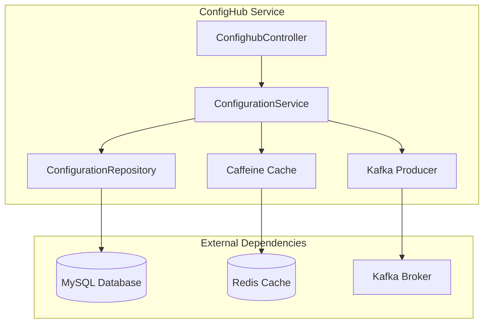
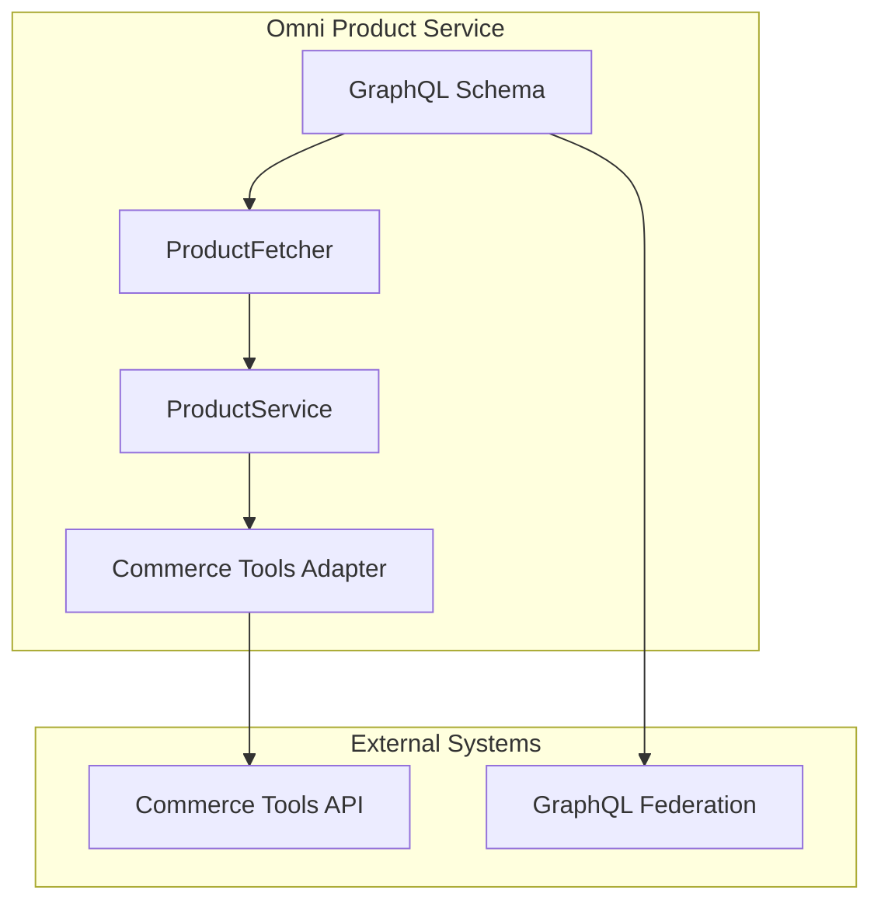
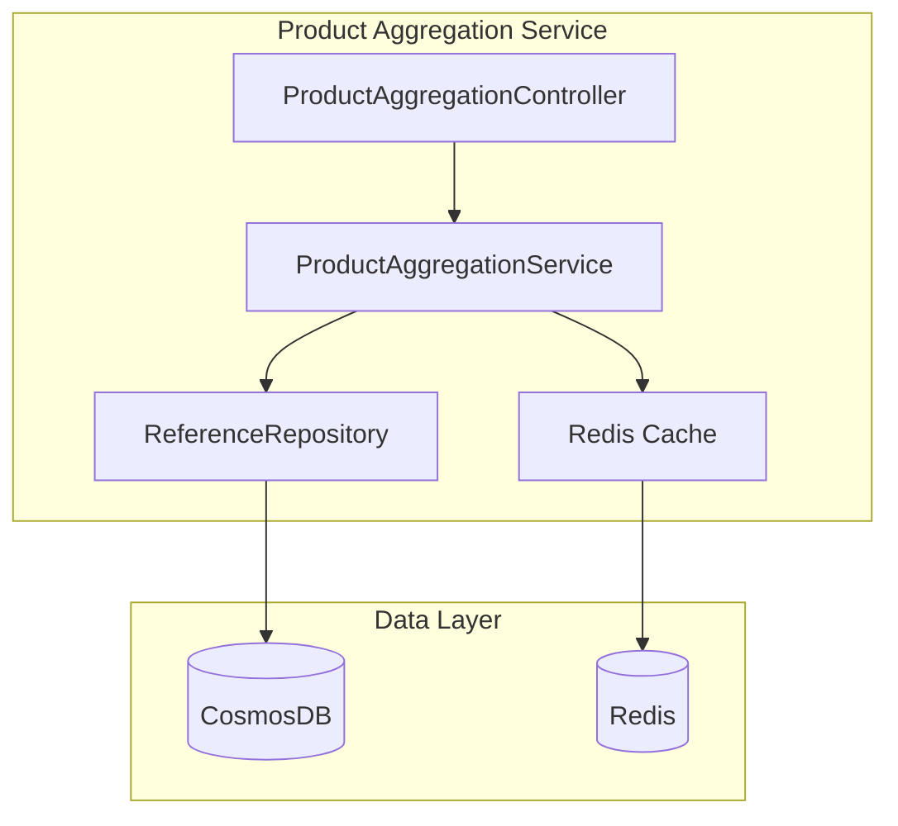
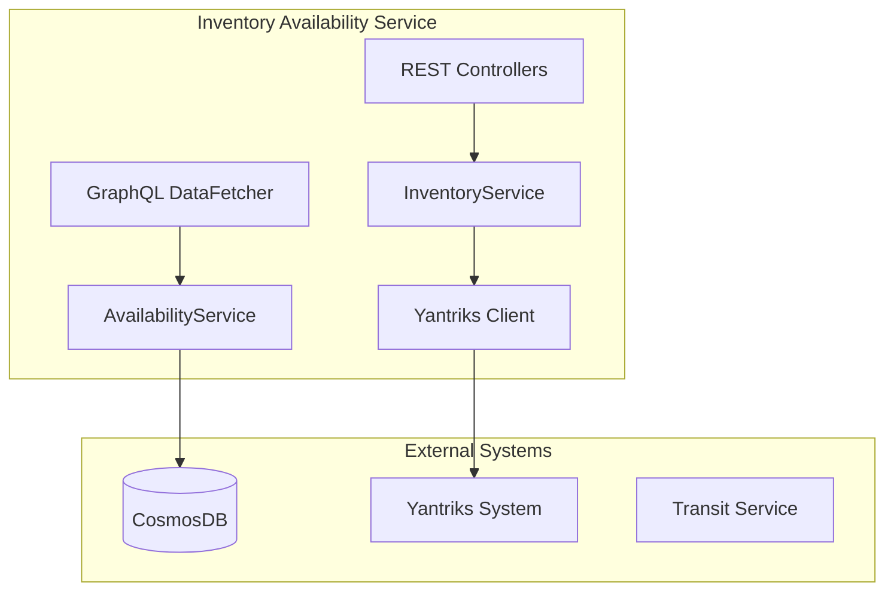
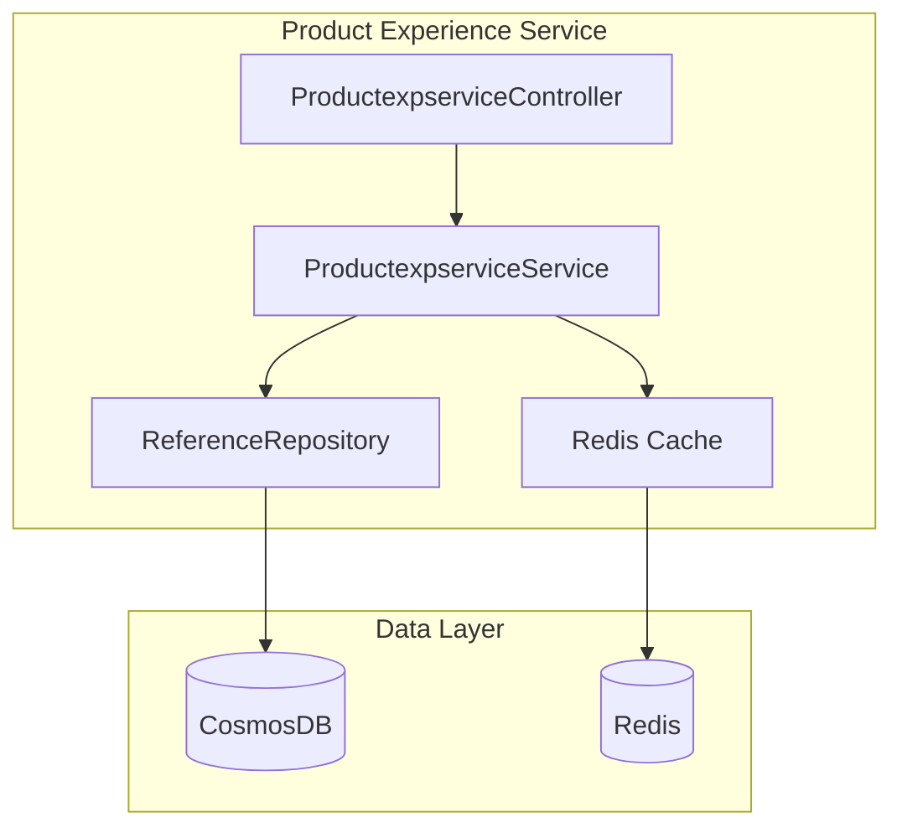
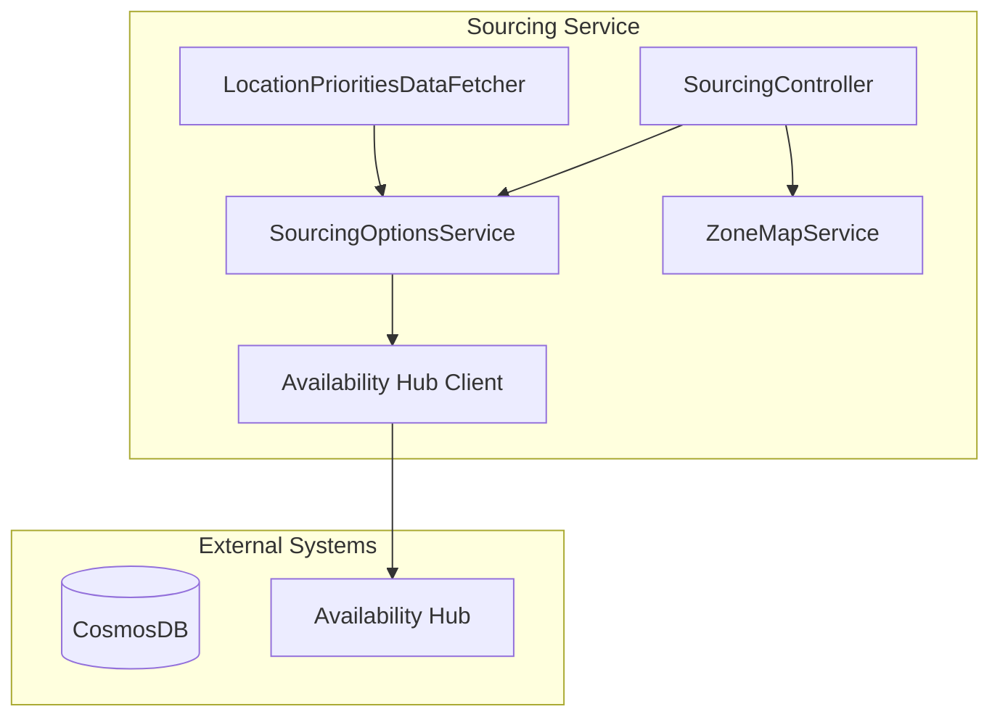
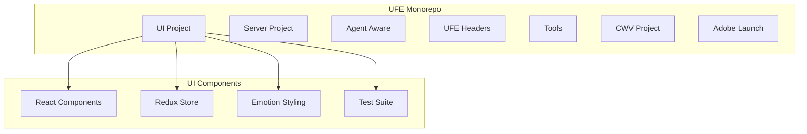
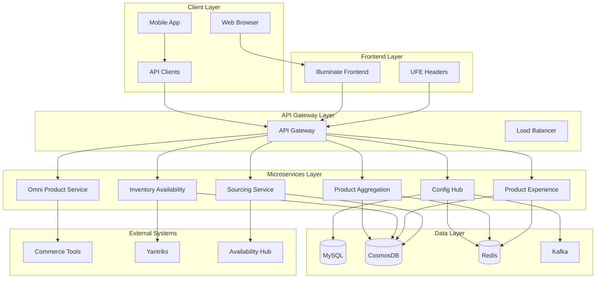

# Sephora SST-Phase-2 Project Analysis Report

**Generated:** December 2024  
**Project Version:** Phase 2  
**Analysis Scope:** Complete workspace analysis

## Executive Summary

This analysis covers the Sephora SST-Phase-2 workspace, which contains a comprehensive e-commerce platform with multiple microservices, frontend applications, and supporting infrastructure. The platform follows a modern microservices architecture with both REST and GraphQL APIs, cloud-native deployment patterns, and a sophisticated frontend monorepo.

### Key Findings
- **8 Major Projects** with distinct responsibilities
- **Microservices Architecture** with Spring Boot backend services
- **GraphQL Federation** for product and inventory services
- **React-based Frontend** with modern tooling
- **Cloud-Native** deployment with Kubernetes and Azure services
- **Multi-Database Strategy** (MySQL, CosmosDB, Redis)
- **Event-Driven Architecture** with Kafka messaging

### Architecture Assessment
The platform demonstrates enterprise-grade architecture with:
- Clear separation of concerns
- API-first design principles
- Comprehensive observability
- Resilience patterns implementation
- Security-first approach

## Project Structure Analysis

### 1. Backend Services (Microservices)

#### 1.1 Configuration Hub Service
**Location:** `dotcom-services-confighub-app/`
**Purpose:** Centralized configuration management and distribution

**Architecture:**
- **Framework:** Spring Boot with Spring Cloud Config
- **Database:** MySQL with JPA/Hibernate
- **Caching:** Caffeine cache with Redis
- **Messaging:** Kafka for configuration updates
- **API:** REST endpoints with OpenAPI documentation

**Key Components:**

**API Endpoints:**
- `POST /v1/configuration` - Create configuration
- `GET /v1/configuration` - Fetch all configurations
- `GET /v1/configuration/{id}` - Get configuration by ID
- `PUT /v1/configuration/{id}` - Update configuration
- `DELETE /v1/configuration/{id}` - Delete configuration
- `GET /v1/util/configuration` - Utility endpoints
- `GET /v1/configuration/migrate/config` - Migration endpoints

#### 1.2 Omni Product Service
**Location:** `dotcom-services-omni-product-service-app/`
**Purpose:** Product catalog and information management

**Architecture:**
- **Framework:** Spring Boot with Netflix DGS (GraphQL)
- **External Integration:** Commerce Tools adapter
- **API:** GraphQL with federation support
- **Resilience:** Circuit breakers and retry mechanisms

**Key Components:**

**GraphQL Schema:**
- `products(productIds: [ID], locale: StandardLocale)` - Get products
- `skus(skuIds: [ID], locale: StandardLocale)` - Get SKUs
- Federation support for `Product` and `Sku` types

#### 1.3 Product Aggregation Service
**Location:** `dotcom-services-product-aggregation-service-app/`
**Purpose:** Product aggregation and reference management

**Architecture:**
- **Framework:** Spring Boot
- **Database:** Azure CosmosDB
- **Caching:** Redis with multiple cache configurations
- **API:** REST endpoints

**Key Components:**

**API Endpoints:**
- `POST /v1/items` - Create reference items
- `PUT /v1/items` - Update reference items
- `GET /v1/items/{id}` - Get reference item
- `GET /v1/items/item/{id}` - Get reference item by ID

#### 1.4 Inventory Availability Service
**Location:** `illuminate-services-inventory-availability-app/`
**Purpose:** Real-time inventory and availability management

**Architecture:**
- **Framework:** Spring Boot with GraphQL
- **Database:** Azure CosmosDB with change feed
- **External Integration:** Yantriks inventory system
- **API:** Both REST and GraphQL endpoints

**Key Components:**

**API Endpoints:**
- `GET /v1/availability/items/{itemId}` - Get item availability
- `POST /v1/availability` - Get inventory availability
- `PUT /v1/items` - Update inventory
- `GET /v1/nodes` - Get ship nodes
- GraphQL: `availableInventory`, `availabilityForSite`

#### 1.5 Product Experience Service
**Location:** `illuminate-services-productexpservice-app/`
**Purpose:** Product experience and reference management

**Architecture:**
- **Framework:** Spring Boot
- **Database:** Azure CosmosDB
- **Caching:** Redis
- **API:** REST endpoints

**Key Components:**

**API Endpoints:**
- `POST /v1/items` - Create reference items
- `PUT /v1/items` - Update reference items
- `GET /v1/items/{id}` - Get reference item
- `GET /v1/items/item/{id}` - Get reference item by ID

#### 1.6 Sourcing Service
**Location:** `illuminate-services-sourcing-service-app/`
**Purpose:** Sourcing options and zone mapping

**Architecture:**
- **Framework:** Spring Boot with GraphQL
- **Database:** Azure CosmosDB
- **External Integration:** Availability Hub
- **API:** Both REST and GraphQL endpoints

**Key Components:**

**API Endpoints:**
- `GET /v1/sourcing/zone_maps` - Get zone mappings
- `POST /v1/sourcing/sourceItems` - Get sourcing options
- `POST /v1/sourcing/shipNodeDelay` - Publish ship node delay
- GraphQL: `locationsByPriority`

### 2. Frontend Applications

#### 2.1 Illuminate Frontend (UFE)
**Location:** `illuminate-frontend-ufe/`
**Purpose:** Main e-commerce frontend application

**Architecture:**
- **Framework:** React 16.14.0 with modern tooling
- **Build System:** Webpack with custom configuration
- **State Management:** Redux with Redux Thunk
- **Styling:** Emotion CSS-in-JS
- **Testing:** Jest and Karma
- **Monorepo:** Multiple projects with workspaces

**Project Structure:**

**Key Features:**
- **Responsive Design:** Mobile-first approach
- **Internationalization:** Multi-language support
- **Performance Optimization:** Code splitting and lazy loading
- **Accessibility:** WCAG compliance
- **SEO:** Server-side rendering capabilities
- **Analytics:** Adobe Launch integration

**Build Scripts:**
- `build:ui` - Production build
- `build:ui:dev` - Development build
- `test:ui` - Run tests
- `eslint:ui` - Code linting

## Architecture Analysis

### System Architecture Overview

### Design Patterns Identified

1. **Microservices Pattern**
   - Each service has a single responsibility
   - Independent deployment and scaling
   - Service-specific databases

2. **API Gateway Pattern**
   - Centralized routing and load balancing
   - Authentication and authorization
   - Rate limiting and monitoring

3. **Event-Driven Architecture**
   - Kafka for asynchronous communication
   - Configuration change notifications
   - Inventory updates propagation

4. **CQRS Pattern** (Command Query Responsibility Segregation)
   - Separate read and write models
   - Optimized for different use cases

5. **Circuit Breaker Pattern**
   - Resilience4j implementation
   - Graceful degradation
   - Fallback mechanisms

6. **Repository Pattern**
   - Data access abstraction
   - Database agnostic design
   - Testability improvements

### Technology Stack Analysis

#### Backend Technologies
- **Spring Boot 3.x** - Main framework
- **Spring Cloud** - Microservices support
- **Netflix DGS** - GraphQL framework
- **JPA/Hibernate** - ORM for MySQL
- **Azure CosmosDB** - NoSQL database
- **Redis** - Caching layer
- **Kafka** - Message streaming
- **Resilience4j** - Circuit breakers
- **Micrometer** - Metrics collection
- **OpenAPI/Swagger** - API documentation

#### Frontend Technologies
- **React 16.14.0** - UI framework
- **Redux** - State management
- **Emotion** - CSS-in-JS styling
- **Webpack** - Module bundler
- **Jest/Karma** - Testing frameworks
- **ESLint** - Code quality
- **Storybook** - Component development

#### Infrastructure
- **Kubernetes** - Container orchestration
- **Azure** - Cloud platform
- **Docker** - Containerization
- **Jenkins** - CI/CD pipeline
- **SonarQube** - Code quality analysis

## API Analysis

### REST API Patterns

**Common Patterns:**
- **Versioning:** `/v1/` prefix for all APIs
- **HTTP Methods:** Proper use of GET, POST, PUT, DELETE
- **Response Codes:** Standard HTTP status codes
- **Error Handling:** Consistent error response format
- **Validation:** Bean validation with custom error messages
- **Documentation:** OpenAPI/Swagger integration

**Authentication/Authorization:**
- Platform commons authentication
- Role-based access control
- API key management
- CORS configuration

### GraphQL API Patterns

**Federation Support:**
- Product service federation
- Inventory service federation
- Cross-service data resolution

**Schema Design:**
- Strong typing with custom scalars
- Input validation
- Error handling with GraphQL errors
- Performance optimization with field selection

## Data Architecture

### Database Strategy

**Multi-Database Approach:**
1. **MySQL** - Configuration and transactional data
2. **CosmosDB** - Product and inventory data
3. **Redis** - Caching and session data
4. **Kafka** - Event streaming and messaging

**Data Consistency:**
- Eventual consistency for distributed data
- Saga pattern for complex transactions
- Change data capture for data synchronization

### Caching Strategy

**Multi-Level Caching:**
1. **Application Cache** - Caffeine for local caching
2. **Distributed Cache** - Redis for shared caching
3. **CDN Cache** - Static asset caching
4. **Browser Cache** - Client-side caching

## Security Analysis

### Security Patterns

1. **Authentication**
   - Platform commons authentication
   - JWT token management
   - Session management

2. **Authorization**
   - Role-based access control
   - API-level permissions
   - Resource-level security

3. **Data Protection**
   - Encryption at rest and in transit
   - Sensitive data masking
   - Audit logging

4. **API Security**
   - Rate limiting
   - Input validation
   - SQL injection prevention
   - XSS protection

## Performance Analysis

### Performance Patterns

1. **Caching Strategy**
   - Multi-level caching implementation
   - Cache invalidation strategies
   - Performance monitoring

2. **Database Optimization**
   - Connection pooling
   - Query optimization
   - Indexing strategies

3. **API Performance**
   - Response time optimization
   - Pagination implementation
   - Compression strategies

4. **Frontend Performance**
   - Code splitting
   - Lazy loading
   - Bundle optimization
   - Image optimization

## Observability

### Monitoring and Logging

**Metrics Collection:**
- Micrometer for application metrics
- Prometheus for metrics storage
- Custom business metrics

**Logging Strategy:**
- Structured logging with Log4j2
- Correlation IDs for request tracing
- Log aggregation and analysis

**Tracing:**
- Distributed tracing support
- Performance bottleneck identification
- Request flow visualization

## Recommendations

### Architectural Improvements

1. **Service Mesh Implementation**
   - Consider Istio for service-to-service communication
   - Enhanced security and observability
   - Traffic management capabilities

2. **API Versioning Strategy**
   - Implement backward compatibility
   - Gradual migration strategy
   - API lifecycle management

3. **Event Sourcing**
   - Consider event sourcing for audit trails
   - Temporal data analysis capabilities
   - Better data consistency

### Code Quality Improvements

1. **Test Coverage**
   - Increase unit test coverage to 90%+
   - Implement integration tests
   - Add performance tests

2. **Documentation**
   - Enhance API documentation
   - Add architecture decision records
   - Improve code comments

3. **Code Standards**
   - Implement consistent naming conventions
   - Add code quality gates
   - Regular code reviews

### Performance Optimizations

1. **Database Optimization**
   - Implement read replicas
   - Optimize query patterns
   - Consider database sharding

2. **Caching Strategy**
   - Implement cache warming
   - Add cache hit ratio monitoring
   - Optimize cache invalidation

3. **Frontend Optimization**
   - Implement service workers
   - Add progressive web app features
   - Optimize bundle sizes

### Security Enhancements

1. **Security Scanning**
   - Implement automated security scanning
   - Regular dependency updates
   - Vulnerability assessment

2. **Access Control**
   - Implement fine-grained permissions
   - Add multi-factor authentication
   - Enhance audit logging

3. **Data Protection**
   - Implement data encryption
   - Add data masking
   - Enhance privacy controls

### Operational Improvements

1. **Deployment Strategy**
   - Implement blue-green deployments
   - Add canary releases
   - Enhance rollback capabilities

2. **Monitoring and Alerting**
   - Implement proactive monitoring
   - Add business metrics
   - Enhance alerting rules

3. **Disaster Recovery**
   - Implement backup strategies
   - Add failover procedures
   - Test recovery procedures

## Conclusion

The Sephora SST-Phase-2 platform demonstrates a well-architected, enterprise-grade e-commerce solution with modern microservices patterns, comprehensive API design, and robust infrastructure. The platform shows good separation of concerns, proper use of design patterns, and consideration for scalability and maintainability.

Key strengths include:
- Clear microservices architecture
- Comprehensive API design
- Modern frontend technology stack
- Robust data architecture
- Good security practices
- Comprehensive observability

Areas for improvement focus on:
- Enhanced testing coverage
- Performance optimization
- Security hardening
- Operational excellence
- Documentation completeness

The platform is well-positioned for future growth and can serve as a solid foundation for continued development and enhancement.
