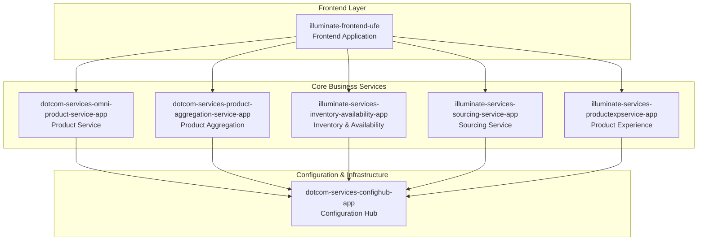
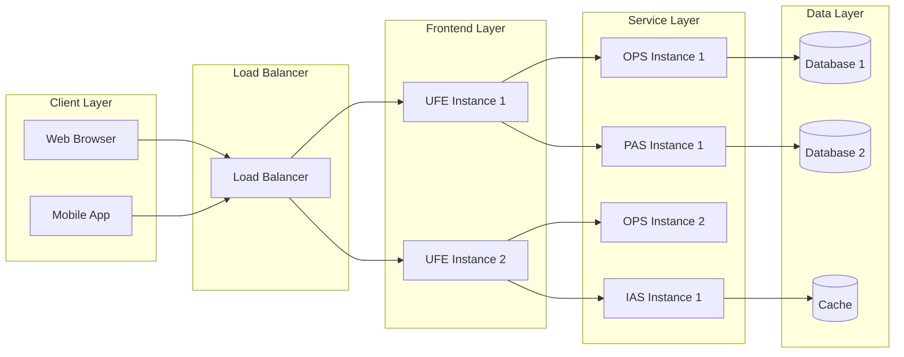

# High-Level Software Architecture

## Overview
This document provides a comprehensive analysis of the high-level software architecture for the Sephora Vibe SST-Phase-2 system, based on the actual codebase implementation.

## System Architecture

### Core Services Architecture
The system follows a microservices architecture pattern with the following main components:

### Service Categories

#### 1. Frontend Services
- **illuminate-frontend-ufe**: Main frontend application with React-based UI components

#### 2. Product Management Services
- **dotcom-services-omni-product-service-app**: Core product service with Commerce Tools integration
- **dotcom-services-product-aggregation-service-app**: Product aggregation and GraphQL API
- **illuminate-services-productexpservice-app**: Product experience service

#### 3. Operational Services
- **illuminate-services-inventory-availability-app**: Inventory and availability management
- **illuminate-services-sourcing-service-app**: Sourcing and procurement services

#### 4. Infrastructure Services
- **dotcom-services-confighub-app**: Centralized configuration management

## Technology Stack

### Backend Technologies
- **Java**: Primary backend language for microservices
- **Spring Boot**: Framework for microservices
- **Maven**: Build and dependency management
- **Docker**: Containerization

### Frontend Technologies
- **React**: Main UI framework
- **Node.js**: Server-side rendering and build tools
- **Webpack**: Module bundling
- **ES6+**: Modern JavaScript features

### Data & APIs
- **GraphQL**: Product aggregation service API
- **REST APIs**: Traditional service endpoints
- **Commerce Tools**: External e-commerce platform integration

### Infrastructure
- **Docker**: Container orchestration
- **Jenkins**: CI/CD pipeline
- **SonarQube**: Code quality analysis

## Architecture Patterns

### Microservices Pattern
- Each service is independently deployable
- Services communicate via well-defined APIs
- Independent scaling and deployment

### API Gateway Pattern
- Frontend communicates with backend services through defined interfaces
- Service discovery and routing

### Configuration Management
- Centralized configuration through confighub service
- Environment-specific configurations

### Event-Driven Architecture
- Services can communicate asynchronously
- Loose coupling between services

## Deployment Architecture

## Security Architecture

### Authentication & Authorization
- Service-to-service authentication
- API security through proper authentication mechanisms
- Role-based access control

### Data Security
- Encrypted data transmission
- Secure configuration management
- Audit logging

## Scalability Considerations

### Horizontal Scaling
- Multiple instances of each service
- Load balancing across instances
- Stateless service design

### Performance Optimization
- Caching strategies
- Database optimization
- CDN for static assets

## Monitoring & Observability

### Health Checks
- Service health monitoring
- Dependency health checks
- Performance metrics

### Logging
- Centralized logging
- Structured logging format
- Log aggregation and analysis

## Integration Points

### External Systems
- Commerce Tools platform
- Payment gateways
- Inventory systems

### Internal Services
- Service-to-service communication
- Event-driven messaging
- Shared data models
