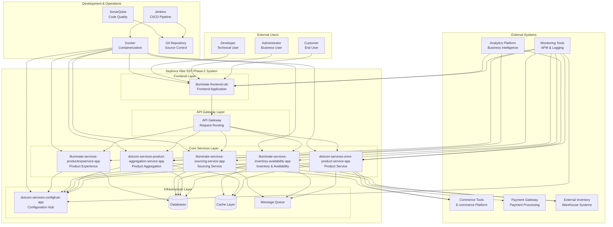
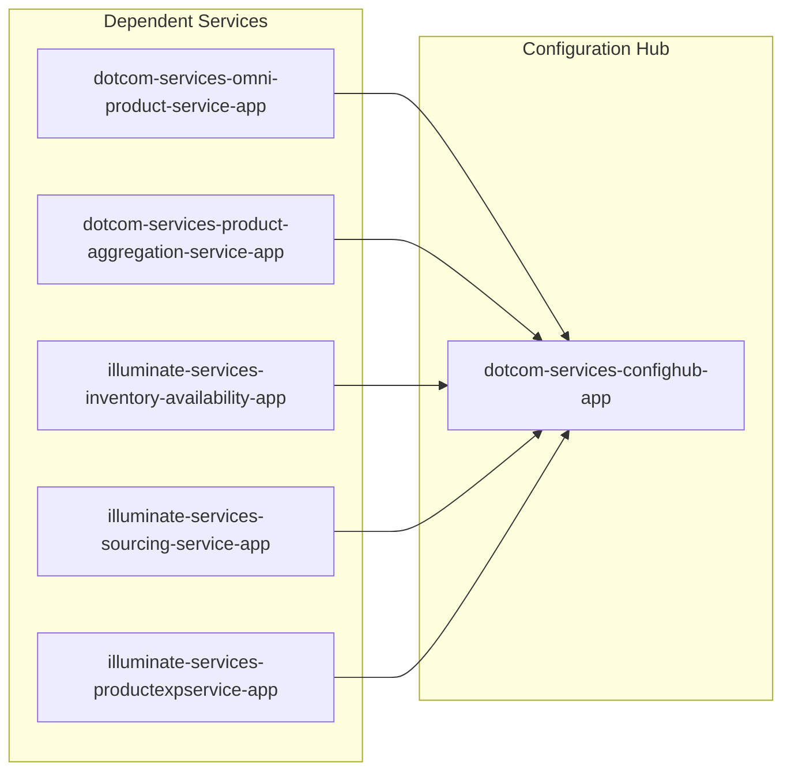
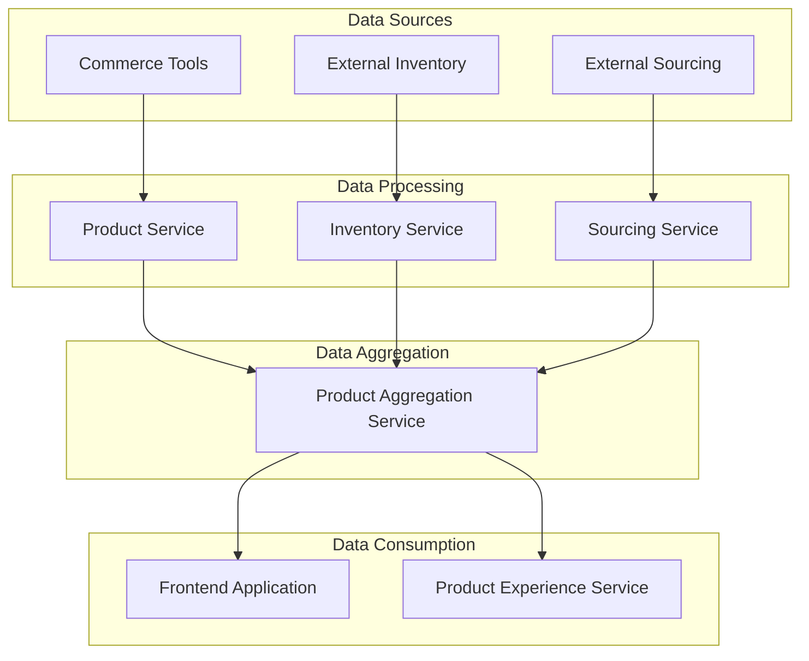
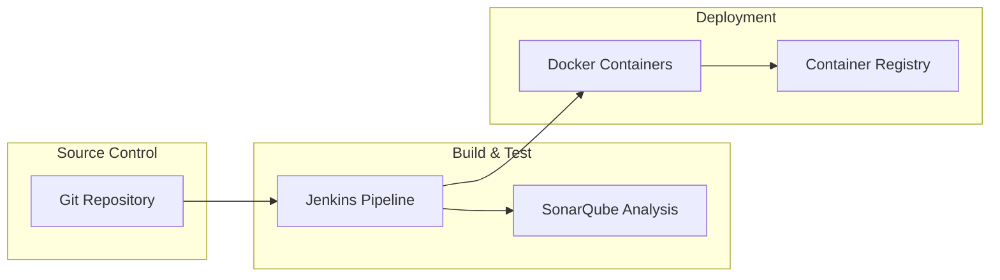

# Comprehensive Context Diagram with Dependencies

## System Context Overview
This document provides a comprehensive context diagram showing the Sephora Vibe SST-Phase-2 system in relation to its external dependencies, users, and other systems.

## High-Level Context Diagram

## Detailed Dependency Analysis

### 1. External System Dependencies

#### Commerce Tools Integration
- **Service**: `dotcom-services-omni-product-service-app`
- **Purpose**: Product catalog management, pricing, and inventory
- **Integration Type**: REST API integration
- **Dependency Level**: High - Core business functionality

#### Payment Gateway
- **Service**: `dotcom-services-omni-product-service-app`
- **Purpose**: Payment processing and transaction management
- **Integration Type**: Secure API integration
- **Dependency Level**: High - Revenue critical

#### External Inventory Systems
- **Services**: 
  - `illuminate-services-inventory-availability-app`
  - `illuminate-services-sourcing-service-app`
- **Purpose**: Real-time inventory data and sourcing information
- **Integration Type**: API integration
- **Dependency Level**: High - Operational critical

### 2. Internal Service Dependencies

#### Configuration Hub Dependencies

#### Data Flow Dependencies

### 3. Infrastructure Dependencies

#### Database Dependencies
- **Primary Database**: Each service maintains its own database
- **Shared Database**: Configuration and common data
- **Cache Layer**: Redis or similar for performance optimization

#### Message Queue Dependencies
- **Purpose**: Asynchronous communication between services
- **Technology**: Apache Kafka or RabbitMQ
- **Usage**: Event-driven architecture for loose coupling

### 4. Development & Operations Dependencies

#### CI/CD Pipeline

### 5. Monitoring & Observability Dependencies

#### Health Check Dependencies
- **Service Health**: Each service exposes health endpoints
- **Dependency Health**: Services monitor their external dependencies
- **Infrastructure Health**: Database, cache, and message queue health

#### Logging Dependencies
- **Centralized Logging**: All services send logs to central system
- **Structured Logging**: Consistent log format across services
- **Log Aggregation**: ELK stack or similar for log analysis

## Dependency Risk Assessment

### High Risk Dependencies
1. **Commerce Tools**: Core business functionality
2. **Payment Gateway**: Revenue critical
3. **External Inventory**: Operational critical
4. **Configuration Hub**: All services depend on it

### Medium Risk Dependencies
1. **Database Systems**: Data persistence
2. **Message Queue**: Service communication
3. **Cache Layer**: Performance optimization

### Low Risk Dependencies
1. **Monitoring Tools**: Non-functional requirement
2. **Analytics Platform**: Business intelligence
3. **Development Tools**: Build and deployment

## Dependency Management Strategy

### External Dependencies
- **Circuit Breaker Pattern**: Implement for external service calls
- **Fallback Mechanisms**: Graceful degradation when external services fail
- **Monitoring**: Real-time monitoring of external service health

### Internal Dependencies
- **Service Discovery**: Dynamic service location
- **Load Balancing**: Distribute load across service instances
- **Health Checks**: Proactive dependency monitoring

### Infrastructure Dependencies
- **Redundancy**: Multiple instances of critical infrastructure
- **Backup Strategies**: Data backup and recovery procedures
- **Disaster Recovery**: Business continuity planning
