# Detailed Software Diagrams with Dependencies

## Overview
This document provides detailed software diagrams for each service in the Sephora Vibe SST-Phase-2 system, showing internal architecture, components, and dependencies.

## 1. Frontend Application Architecture

### illuminate-frontend-ufe Structure

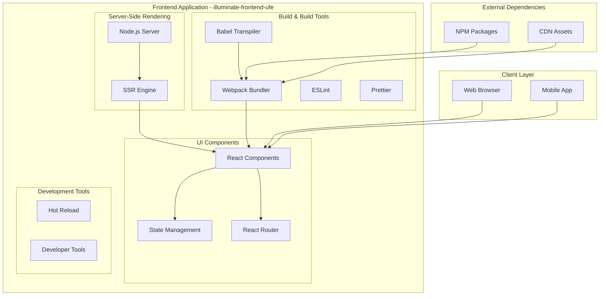

### Frontend Component Dependencies

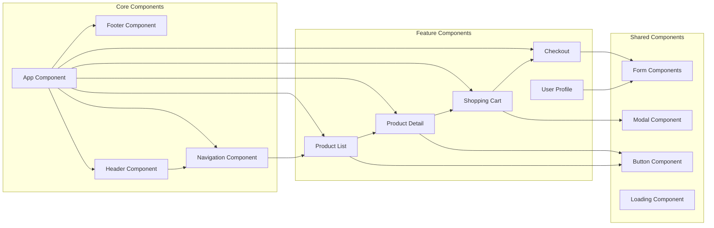

## 2. Product Service Architecture

### dotcom-services-omni-product-service-app Structure

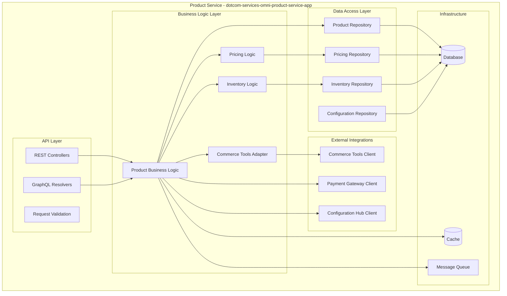

### Commerce Tools Adapter Dependencies

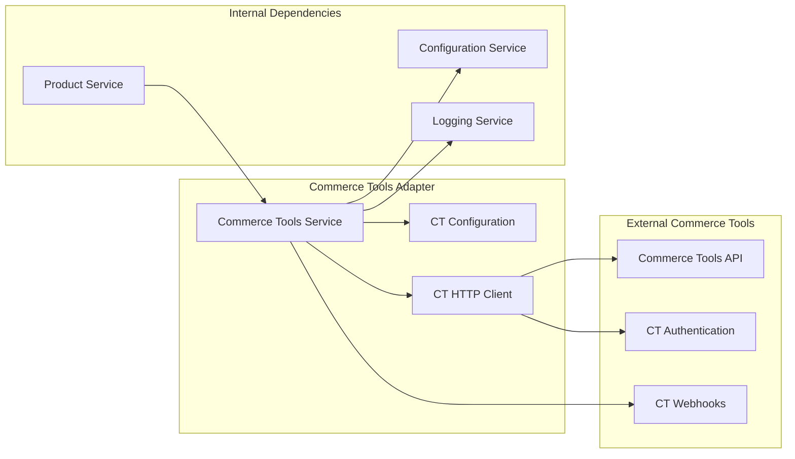

## 3. Product Aggregation Service Architecture

### dotcom-services-product-aggregation-service-app Structure

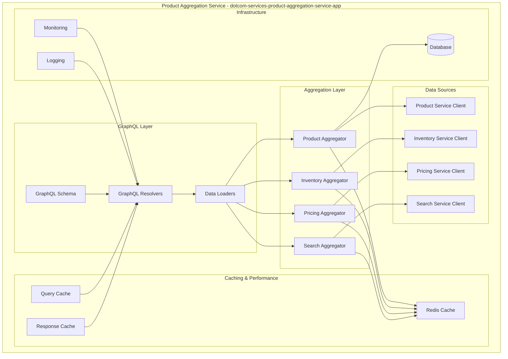

## 4. Inventory & Availability Service Architecture

### illuminate-services-inventory-availability-app Structure

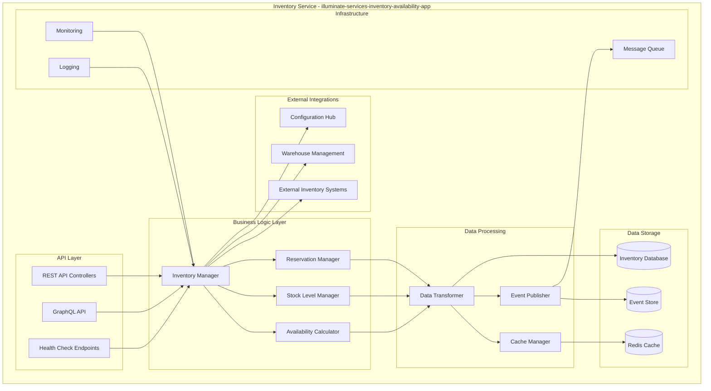

## 5. Sourcing Service Architecture

### illuminate-services-sourcing-service-app Structure

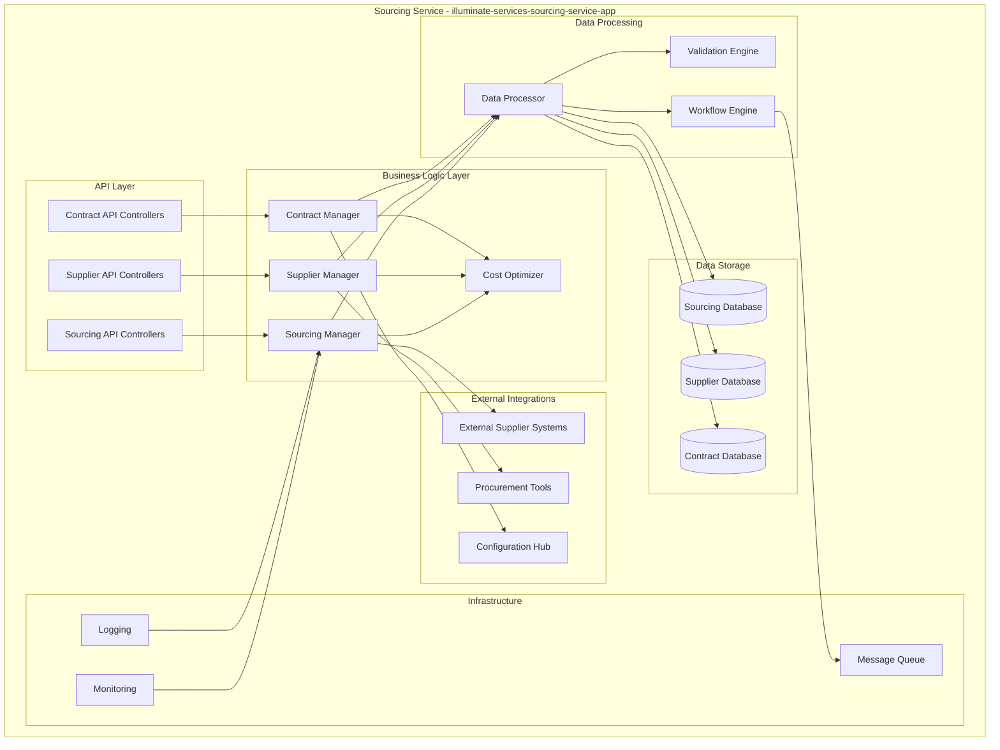

## 6. Product Experience Service Architecture

### illuminate-services-productexpservice-app Structure

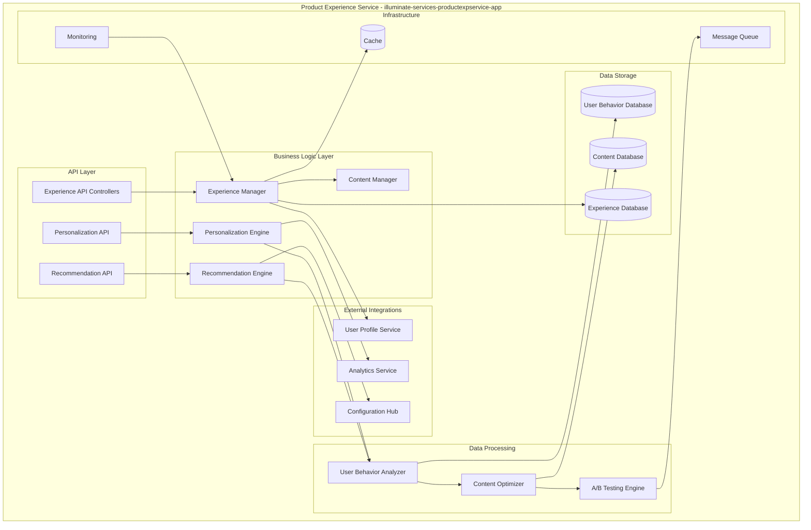

## 7. Configuration Hub Architecture

### dotcom-services-confighub-app Structure

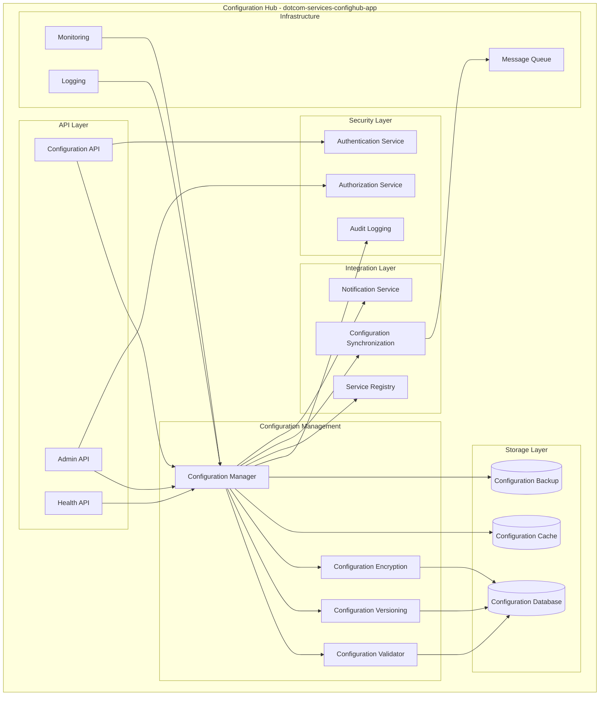

## 8. Cross-Service Dependencies Summary

### Service Communication Patterns

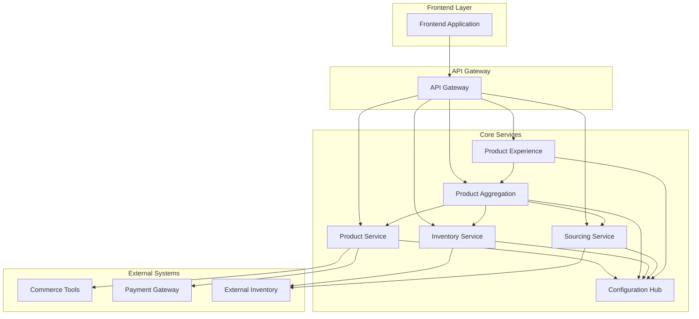

### Data Flow Between Services

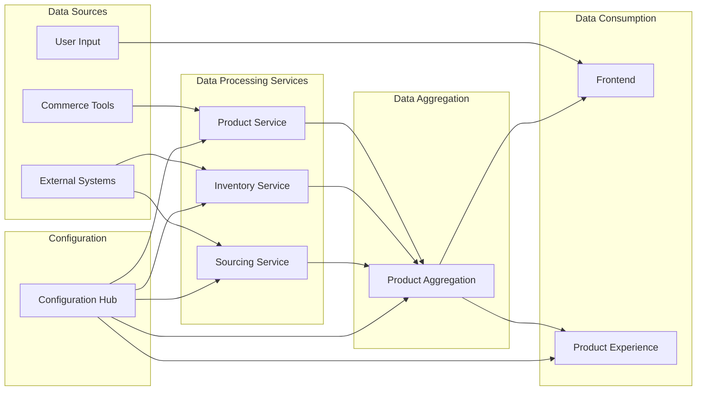

## 9. Component Dependencies Analysis

### High Coupling Components
1. **Configuration Hub**: All services depend on it
2. **Product Aggregation Service**: Depends on multiple other services
3. **Frontend Application**: Depends on all backend services

### Medium Coupling Components
1. **Product Service**: Depends on Commerce Tools and Configuration Hub
2. **Inventory Service**: Depends on external systems and Configuration Hub
3. **Sourcing Service**: Depends on external systems and Configuration Hub

### Low Coupling Components
1. **Product Experience Service**: Minimal dependencies on other services
2. **Configuration Hub**: Self-contained with minimal external dependencies

## 10. Dependency Management Strategies

### Service Discovery
- **Dynamic Service Location**: Services can discover each other at runtime
- **Load Balancing**: Distribute requests across multiple service instances
- **Health Checks**: Monitor service health and availability

### Circuit Breaker Pattern
- **Fault Tolerance**: Prevent cascading failures
- **Fallback Mechanisms**: Graceful degradation when services are unavailable
- **Monitoring**: Track service health and performance

### Caching Strategy
- **Distributed Caching**: Share cache across service instances
- **Cache Invalidation**: Maintain data consistency
- **Performance Optimization**: Reduce response times and load
