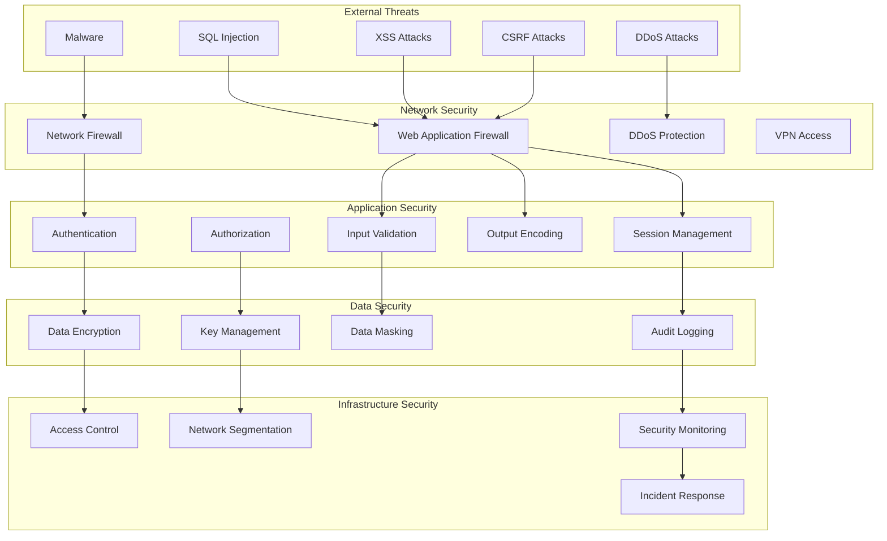
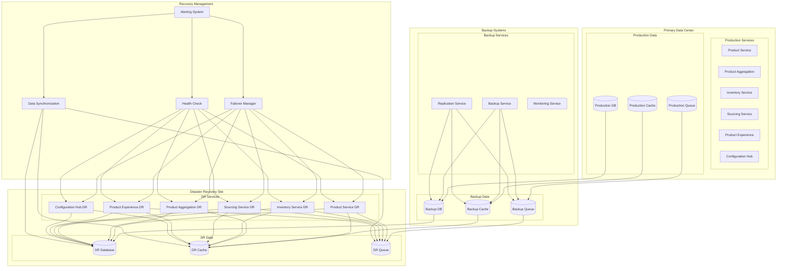
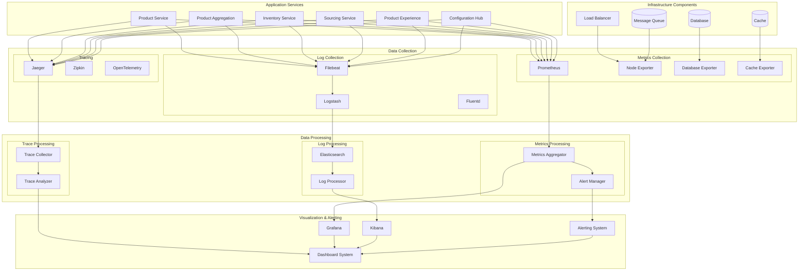
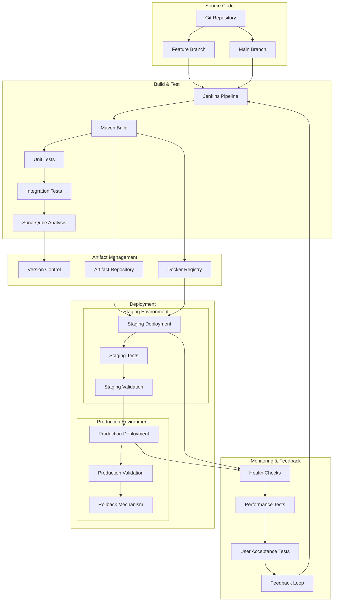

# Detailed Systems Diagrams with Dependencies

## Overview
This document provides comprehensive systems diagrams for the Sephora Vibe SST-Phase-2 system, showing system-level architecture, infrastructure components, and operational dependencies.

## 1. Overall System Architecture

### Complete System Overview

```mermaid
graph TB
    subgraph "Client Layer"
        Web[Web Browser]
        Mobile[Mobile App]
        Admin[Admin Portal]
    end
    
    subgraph "Network Layer"
        CDN[CDN]
        LoadBalancer[Load Balancer]
        WAF[Web Application Firewall]
    end
    
    subgraph "Frontend Layer"
        UFE_Instance1[UFE Instance 1]
        UFE_Instance2[UFE Instance 2]
        UFE_Instance3[UFE Instance 3]
    end
    
    subgraph "API Gateway Layer"
        API_GW_1[API Gateway 1]
        API_GW_2[API Gateway 2]
    end
    
    subgraph "Service Layer"
        subgraph "Product Services"
            OPS_1[Product Service 1]
            OPS_2[Product Service 2]
            PAS_1[Product Aggregation 1]
            PAS_2[Product Aggregation 2]
        end
        
        subgraph "Operational Services"
            IAS_1[Inventory Service 1]
            IAS_2[Inventory Service 2]
            SS_1[Sourcing Service 1]
            SS_2[Sourcing Service 2]
            PES_1[Product Experience 1]
            PES_2[Product Experience 2]
        end
        
        subgraph "Infrastructure Services"
            CH_1[Configuration Hub 1]
            CH_2[Configuration Hub 2]
        end
    end
    
    subgraph "Data Layer"
        subgraph "Primary Databases"
            ProductDB[(Product DB)]
            InventoryDB[(Inventory DB)]
            SourcingDB[(Sourcing DB)]
            ConfigDB[(Config DB)]
        end
        
        subgraph "Cache Layer"
            Redis_Master[(Redis Master)]
            Redis_Slave1[(Redis Slave 1)]
            Redis_Slave2[(Redis Slave 2)]
        end
        
        subgraph "Message Queue"
            Kafka_Cluster[Kafka Cluster]
            RabbitMQ[RabbitMQ]
        end
    end
    
    subgraph "External Systems"
        CT[Commerce Tools]
        Payment[Payment Gateway]
        Inventory[External Inventory]
        Analytics[Analytics Platform]
    end
    
    subgraph "Monitoring & Operations"
        Prometheus[Prometheus]
        Grafana[Grafana]
        ELK[ELK Stack]
        Jenkins[Jenkins]
        SonarQube[SonarQube]
    end
    
    %% Client to Network Layer
    Web --> CDN
    Mobile --> CDN
    Admin --> CDN
    
    %% Network Layer to Frontend
    CDN --> LoadBalancer
    LoadBalancer --> WAF
    WAF --> UFE_Instance1
    WAF --> UFE_Instance2
    WAF --> UFE_Instance3
    
    %% Frontend to API Gateway
    UFE_Instance1 --> API_GW_1
    UFE_Instance2 --> API_GW_2
    UFE_Instance3 --> API_GW_1
    
    %% API Gateway to Services
    API_GW_1 --> OPS_1
    API_GW_1 --> PAS_1
    API_GW_1 --> IAS_1
    API_GW_1 --> SS_1
    API_GW_1 --> PES_1
    API_GW_1 --> CH_1
    
    API_GW_2 --> OPS_2
    API_GW_2 --> PAS_2
    API_GW_2 --> IAS_2
    API_GW_2 --> SS_2
    API_GW_2 --> PES_2
    API_GW_2 --> CH_2
    
    %% Service to Data Layer
    OPS_1 --> ProductDB
    OPS_2 --> ProductDB
    PAS_1 --> ProductDB
    PAS_2 --> ProductDB
    
    IAS_1 --> InventoryDB
    IAS_2 --> InventoryDB
    SS_1 --> SourcingDB
    SS_2 --> SourcingDB
    
    CH_1 --> ConfigDB
    CH_2 --> ConfigDB
    
    %% Service to Cache
    OPS_1 --> Redis_Master
    PAS_1 --> Redis_Master
    IAS_1 --> Redis_Master
    SS_1 --> Redis_Master
    PES_1 --> Redis_Master
    
    Redis_Master --> Redis_Slave1
    Redis_Master --> Redis_Slave2
    
    %% Service to Message Queue
    OPS_1 --> Kafka_Cluster
    IAS_1 --> Kafka_Cluster
    SS_1 --> Kafka_Cluster
    PES_1 --> RabbitMQ
    
    %% Service to External Systems
    OPS_1 --> CT
    PAS_1 --> CT
    OPS_1 --> Payment
    IAS_1 --> Inventory
    SS_1 --> Inventory
    
    %% Monitoring
    Prometheus --> OPS_1
    Prometheus --> PAS_1
    Prometheus --> IAS_1
    Prometheus --> SS_1
    Prometheus --> PES_1
    Prometheus --> CH_1
    
    Grafana --> Prometheus
    ELK --> OPS_1
    ELK --> PAS_1
    ELK --> IAS_1
    ELK --> SS_1
    ELK --> PES_1
    ELK --> CH_1
    
    Jenkins --> OPS_1
    Jenkins --> PAS_1
    Jenkins --> IAS_1
    Jenkins --> SS_1
    Jenkins --> PES_1
    Jenkins --> CH_1
```



## 2. Network Infrastructure Architecture

### Network Topology

```mermaid
graph TB
    subgraph "Internet"
        Internet[Internet]
    end
    
    subgraph "DMZ"
        WAF[Web Application Firewall]
        LoadBalancer[Load Balancer]
        CDN[CDN Edge]
    end
    
    subgraph "Application Network"
        subgraph "Frontend Subnet"
            UFE_1[UFE Instance 1]
            UFE_2[UFE Instance 2]
            UFE_3[UFE Instance 3]
        end
        
        subgraph "API Gateway Subnet"
            API_GW_1[API Gateway 1]
            API_GW_2[API Gateway 2]
        end
        
        subgraph "Service Subnet"
            OPS_1[Product Service 1]
            OPS_2[Product Service 2]
            PAS_1[Product Aggregation 1]
            PAS_2[Product Aggregation 2]
            IAS_1[Inventory Service 1]
            IAS_2[Inventory Service 2]
            SS_1[Sourcing Service 1]
            SS_2[Sourcing Service 2]
            PES_1[Product Experience 1]
            PES_2[Product Experience 2]
            CH_1[Configuration Hub 1]
            CH_2[Configuration Hub 2]
        end
    end
    
    subgraph "Data Network"
        subgraph "Database Subnet"
            ProductDB[(Product DB)]
            InventoryDB[(Inventory DB)]
            SourcingDB[(Sourcing DB)]
            ConfigDB[(Config DB)]
        end
        
        subgraph "Cache Subnet"
            Redis_Master[(Redis Master)]
            Redis_Slave1[(Redis Slave 1)]
            Redis_Slave2[(Redis Slave 2)]
        end
        
        subgraph "Message Queue Subnet"
            Kafka_Cluster[Kafka Cluster]
            RabbitMQ[RabbitMQ]
        end
    end
    
    subgraph "Management Network"
        Jenkins[Jenkins]
        SonarQube[SonarQube]
        Prometheus[Prometheus]
        Grafana[Grafana]
        ELK[ELK Stack]
    end
    
    subgraph "External Systems"
        CT[Commerce Tools]
        Payment[Payment Gateway]
        Inventory[External Inventory]
    end
    
    %% Internet to DMZ
    Internet --> CDN
    Internet --> WAF
    
    %% DMZ to Application Network
    WAF --> LoadBalancer
    LoadBalancer --> UFE_1
    LoadBalancer --> UFE_2
    LoadBalancer --> UFE_3
    
    %% Frontend to API Gateway
    UFE_1 --> API_GW_1
    UFE_2 --> API_GW_2
    UFE_3 --> API_GW_1
    
    %% API Gateway to Services
    API_GW_1 --> OPS_1
    API_GW_1 --> PAS_1
    API_GW_1 --> IAS_1
    API_GW_1 --> SS_1
    API_GW_1 --> PES_1
    API_GW_1 --> CH_1
    
    API_GW_2 --> OPS_2
    API_GW_2 --> PAS_2
    API_GW_2 --> IAS_2
    API_GW_2 --> SS_2
    API_GW_2 --> PES_2
    API_GW_2 --> CH_2
    
    %% Services to Data Network
    OPS_1 --> ProductDB
    PAS_1 --> ProductDB
    IAS_1 --> InventoryDB
    SS_1 --> SourcingDB
    CH_1 --> ConfigDB
    
    OPS_1 --> Redis_Master
    PAS_1 --> Redis_Master
    IAS_1 --> Redis_Master
    SS_1 --> Redis_Master
    PES_1 --> Redis_Master
    
    OPS_1 --> Kafka_Cluster
    IAS_1 --> Kafka_Cluster
    SS_1 --> Kafka_Cluster
    PES_1 --> RabbitMQ
    
    %% Services to External Systems
    OPS_1 --> CT
    PAS_1 --> CT
    OPS_1 --> Payment
    IAS_1 --> Inventory
    SS_1 --> Inventory
    
    %% Management Network Access
    Jenkins --> OPS_1
    Jenkins --> PAS_1
    Jenkins --> IAS_1
    Jenkins --> SS_1
    Jenkins --> PES_1
    Jenkins --> CH_1
    
    Prometheus --> OPS_1
    Prometheus --> PAS_1
    Prometheus --> IAS_1
    Prometheus --> SS_1
    Prometheus --> PES_1
    Prometheus --> CH_1
```

## 3. Data Flow Architecture

### End-to-End Data Flow

```mermaid
graph TB
    subgraph "User Interaction"
        User[User]
        Browser[Web Browser]
        Mobile[Mobile App]
    end
    
    subgraph "Frontend Processing"
        UFE[Frontend Application]
        StateManagement[State Management]
        LocalCache[Local Cache]
    end
    
    subgraph "API Gateway"
        Gateway[API Gateway]
        RateLimiter[Rate Limiter]
        Authentication[Authentication]
        Authorization[Authorization]
    end
    
    subgraph "Service Layer"
        subgraph "Product Services"
            OPS[Product Service]
            PAS[Product Aggregation]
        end
        
        subgraph "Operational Services"
            IAS[Inventory Service]
            SS[Sourcing Service]
            PES[Product Experience]
        end
        
        subgraph "Infrastructure"
            CH[Configuration Hub]
        end
    end
    
    subgraph "Data Sources"
        subgraph "Internal Data"
            ProductDB[(Product DB)]
            InventoryDB[(Inventory DB)]
            SourcingDB[(Sourcing DB)]
            ConfigDB[(Config DB)]
        end
        
        subgraph "External Data"
            CT[Commerce Tools]
            Payment[Payment Gateway]
            Inventory[External Inventory]
        end
        
        subgraph "Cache Layer"
            Redis[(Redis Cache)]
            CDN[CDN Cache]
        end
    end
    
    subgraph "Message Processing"
        Kafka[Kafka]
        RabbitMQ[RabbitMQ]
        EventStore[(Event Store)]
    end
    
    %% User to Frontend
    User --> Browser
    User --> Mobile
    Browser --> UFE
    Mobile --> UFE
    
    %% Frontend Processing
    UFE --> StateManagement
    UFE --> LocalCache
    
    %% Frontend to API Gateway
    UFE --> Gateway
    Gateway --> RateLimiter
    Gateway --> Authentication
    Gateway --> Authorization
    
    %% API Gateway to Services
    Gateway --> OPS
    Gateway --> PAS
    Gateway --> IAS
    Gateway --> SS
    Gateway --> PES
    Gateway --> CH
    
    %% Service to Data Sources
    OPS --> ProductDB
    OPS --> CT
    OPS --> Payment
    OPS --> Redis
    
    PAS --> ProductDB
    PAS --> InventoryDB
    PAS --> SourcingDB
    PAS --> Redis
    
    IAS --> InventoryDB
    IAS --> Inventory
    IAS --> Redis
    
    SS --> SourcingDB
    SS --> Inventory
    SS --> Redis
    
    PES --> ProductDB
    PES --> Redis
    
    CH --> ConfigDB
    CH --> Redis
    
    %% Service to Message Processing
    OPS --> Kafka
    IAS --> Kafka
    SS --> Kafka
    PES --> RabbitMQ
    
    Kafka --> EventStore
    RabbitMQ --> EventStore
    
    %% Cache to Frontend
    Redis --> UFE
    CDN --> UFE
```



## 4. Security Architecture

### Security Layers and Controls



## 5. Scalability Architecture

### Horizontal and Vertical Scaling

```mermaid
graph TB
    subgraph "Load Balancer Layer"
        LB[Load Balancer]
        HealthCheck[Health Check]
        AutoScaling[Auto Scaling]
    end
    
    subgraph "Service Instances"
        subgraph "Product Service Cluster"
            OPS_1[Product Service 1]
            OPS_2[Product Service 2]
            OPS_3[Product Service 3]
            OPS_N[Product Service N]
        end
        
        subgraph "Product Aggregation Cluster"
            PAS_1[Product Aggregation 1]
            PAS_2[Product Aggregation 2]
            PAS_3[Product Aggregation 3]
            PAS_N[Product Aggregation N]
        end
        
        subgraph "Inventory Service Cluster"
            IAS_1[Inventory Service 1]
            IAS_2[Inventory Service 2]
            IAS_3[Inventory Service 3]
            IAS_N[Inventory Service N]
        end
    end
    
    subgraph "Data Layer"
        subgraph "Database Clusters"
            MasterDB[(Master DB)]
            SlaveDB1[(Slave DB 1)]
            SlaveDB2[(Slave DB 2)]
            SlaveDB_N[(Slave DB N)]
        end
        
        subgraph "Cache Clusters"
            Redis_Master[(Redis Master)]
            Redis_Slave1[(Redis Slave 1)]
            Redis_Slave2[(Redis Slave 2)]
            Redis_Slave_N[(Redis Slave N)]
        end
        
        subgraph "Message Queue Clusters"
            Kafka_Broker1[Kafka Broker 1]
            Kafka_Broker2[Kafka Broker 2]
            Kafka_Broker3[Kafka Broker 3]
            Kafka_Broker_N[Kafka Broker N]
        end
    end
    
    subgraph "Monitoring & Scaling"
        Prometheus[Prometheus]
        Grafana[Grafana]
        AutoScaler[Auto Scaler]
        ResourceMonitor[Resource Monitor]
    end
    
    %% Load Balancer to Services
    LB --> OPS_1
    LB --> OPS_2
    LB --> OPS_3
    LB --> OPS_N
    
    LB --> PAS_1
    LB --> PAS_2
    LB --> PAS_3
    LB --> PAS_N
    
    LB --> IAS_1
    LB --> IAS_2
    LB --> IAS_3
    LB --> IAS_N
    
    %% Health Check
    HealthCheck --> OPS_1
    HealthCheck --> OPS_2
    HealthCheck --> OPS_3
    HealthCheck --> OPS_N
    
    HealthCheck --> PAS_1
    HealthCheck --> PAS_2
    HealthCheck --> PAS_3
    HealthCheck --> PAS_N
    
    HealthCheck --> IAS_1
    HealthCheck --> IAS_2
    HealthCheck --> IAS_3
    HealthCheck --> IAS_N
    
    %% Services to Data Layer
    OPS_1 --> MasterDB
    OPS_2 --> MasterDB
    OPS_3 --> MasterDB
    OPS_N --> MasterDB
    
    PAS_1 --> SlaveDB1
    PAS_2 --> SlaveDB2
    PAS_3 --> SlaveDB1
    PAS_N --> SlaveDB2
    
    IAS_1 --> Redis_Master
    IAS_2 --> Redis_Slave1
    IAS_3 --> Redis_Slave2
    IAS_N --> Redis_Slave_N
    
    OPS_1 --> Kafka_Broker1
    OPS_2 --> Kafka_Broker2
    OPS_3 --> Kafka_Broker3
    OPS_N --> Kafka_Broker_N
    
    %% Monitoring
    Prometheus --> OPS_1
    Prometheus --> PAS_1
    Prometheus --> IAS_1
    
    Grafana --> Prometheus
    
    AutoScaler --> Prometheus
    AutoScaler --> ResourceMonitor
    AutoScaler --> LB
```



## 6. Disaster Recovery Architecture

### Backup and Recovery Strategy



## 7. Performance Architecture

### Performance Optimization Layers

```mermaid
graph TB
    subgraph "Client Side"
        BrowserCache[Browser Cache]
        LocalStorage[Local Storage]
        ServiceWorker[Service Worker]
    end
    
    subgraph "CDN Layer"
        CDN_Edge[CDN Edge Servers]
        StaticAssets[Static Assets]
        MediaFiles[Media Files]
    end
    
    subgraph "Application Layer"
        subgraph "Frontend Optimization"
            CodeSplitting[Code Splitting]
            LazyLoading[Lazy Loading]
            BundleOptimization[Bundle Optimization]
        end
        
        subgraph "Backend Optimization"
            ConnectionPooling[Connection Pooling]
            QueryOptimization[Query Optimization]
            CachingStrategy[Caching Strategy]
        end
    end
    
    subgraph "Data Layer"
        subgraph "Database Optimization"
            Indexing[Database Indexing]
            QueryCache[Query Cache]
            ConnectionPool[Connection Pool]
        end
        
        subgraph "Cache Optimization"
            Redis[Redis Cache]
            InMemoryCache[In-Memory Cache]
            DistributedCache[Distributed Cache]
        end
    end
    
    subgraph "Infrastructure"
        LoadBalancing[Load Balancing]
        AutoScaling[Auto Scaling]
        ResourceOptimization[Resource Optimization]
    end
    
    %% Client Side to CDN
    BrowserCache --> CDN_Edge
    LocalStorage --> CDN_Edge
    ServiceWorker --> CDN_Edge
    
    %% CDN to Application
    CDN_Edge --> StaticAssets
    CDN_Edge --> MediaFiles
    CDN_Edge --> CodeSplitting
    
    %% Frontend Optimization
    CodeSplitting --> LazyLoading
    LazyLoading --> BundleOptimization
    BundleOptimization --> Application Layer
    
    %% Backend Optimization
    ConnectionPooling --> QueryOptimization
    QueryOptimization --> CachingStrategy
    CachingStrategy --> Data Layer
    
    %% Database Optimization
    Indexing --> QueryCache
    QueryCache --> ConnectionPool
    ConnectionPool --> Database
    
    %% Cache Optimization
    Redis --> InMemoryCache
    InMemoryCache --> DistributedCache
    DistributedCache --> Application Layer
    
    %% Infrastructure
    LoadBalancing --> AutoScaling
    AutoScaling --> ResourceOptimization
    ResourceOptimization --> Application Layer
```

## 8. Monitoring and Observability Architecture

### Monitoring Stack



## 9. Deployment Architecture

### CI/CD Pipeline



## 10. System Dependencies Summary

### Critical Dependencies

1. **Configuration Hub**: All services depend on it for configuration
2. **Database Systems**: Critical for data persistence
3. **Cache Layer**: Essential for performance
4. **Message Queue**: Required for asynchronous communication
5. **External Systems**: Commerce Tools, Payment Gateway, Inventory Systems

### Dependency Risk Levels

- **High Risk**: Configuration Hub, Database Systems, External Payment Systems
- **Medium Risk**: Cache Layer, Message Queue, External Inventory Systems
- **Low Risk**: Monitoring Tools, Development Tools, Analytics Systems

### Dependency Management Strategies

1. **Circuit Breaker Pattern**: For external service dependencies
2. **Fallback Mechanisms**: For critical service failures
3. **Health Monitoring**: Proactive dependency health checks
4. **Redundancy**: Multiple instances of critical dependencies
5. **Caching**: Reduce dependency on external systems
