# Detailed Data Flow Diagrams with Dependencies

## Overview
This document provides comprehensive data flow diagrams for the Sephora Vibe SST-Phase-2 system, showing how data moves through the system, between services, and with external systems.

## 1. Overall Data Flow Architecture

### System-Wide Data Flow

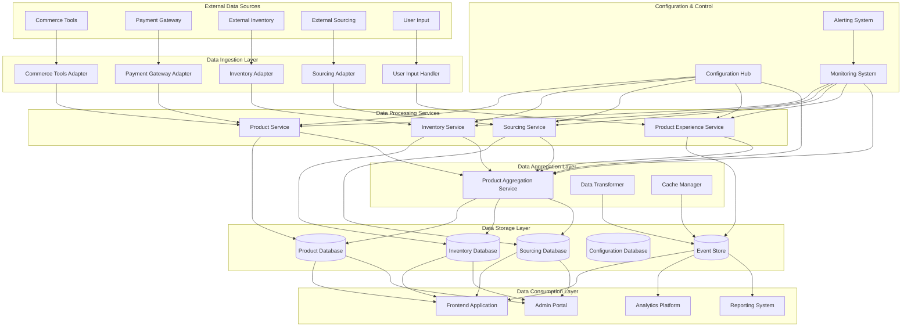

## 2. Product Data Flow

### Product Information Flow

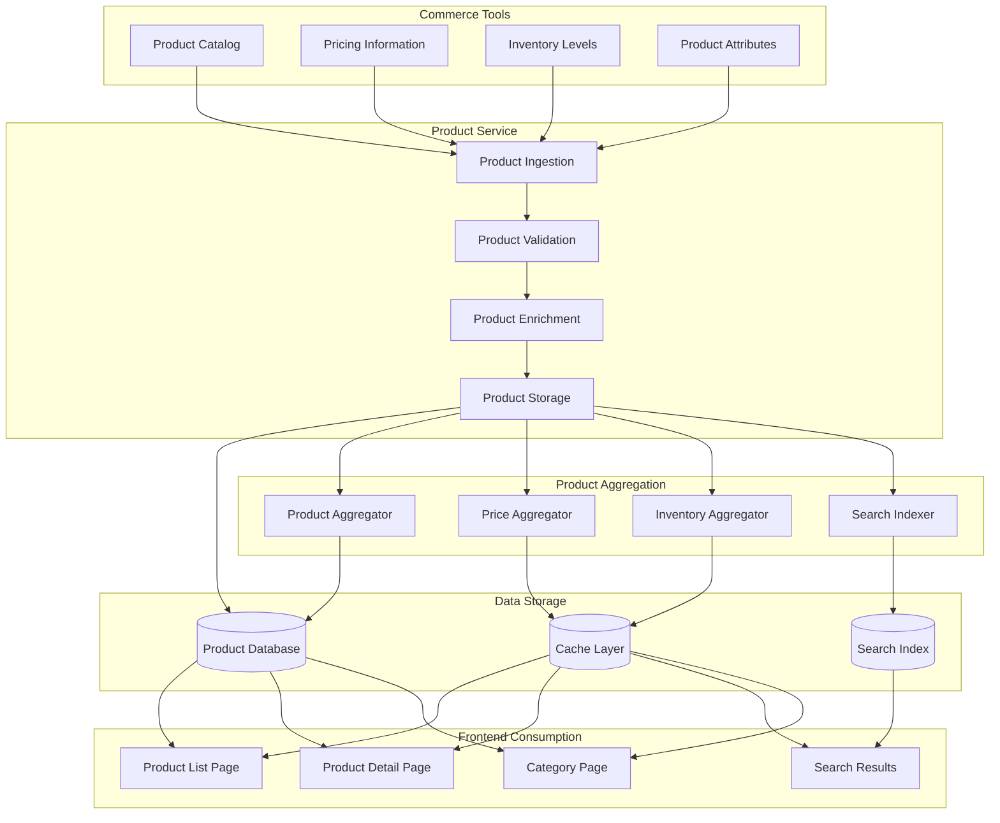

### Product Update Flow

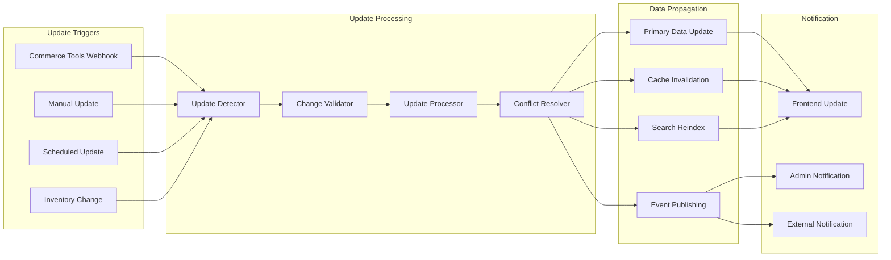

## 3. Inventory Data Flow

### Inventory Management Flow

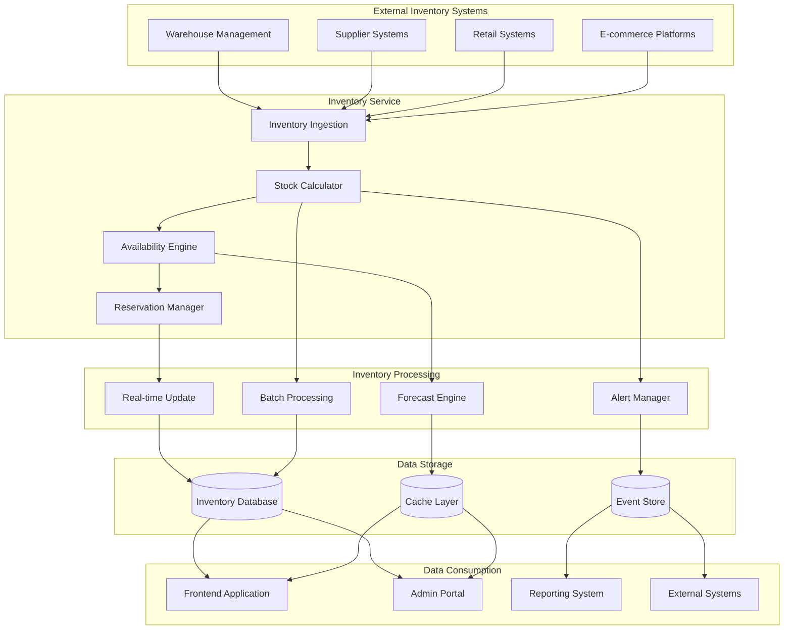

### Inventory Synchronization Flow

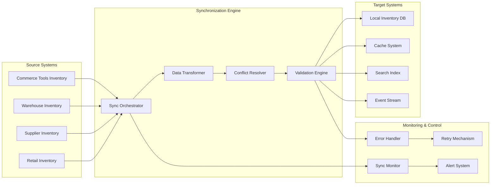

## 4. User Interaction Data Flow

### User Journey Data Flow

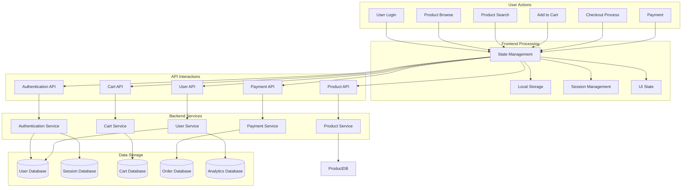

### User Behavior Analytics Flow

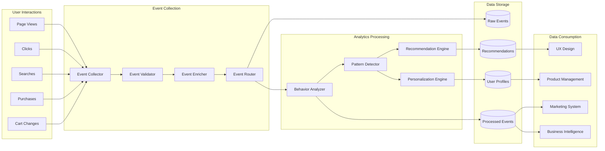

## 5. Configuration Data Flow

### Configuration Management Flow

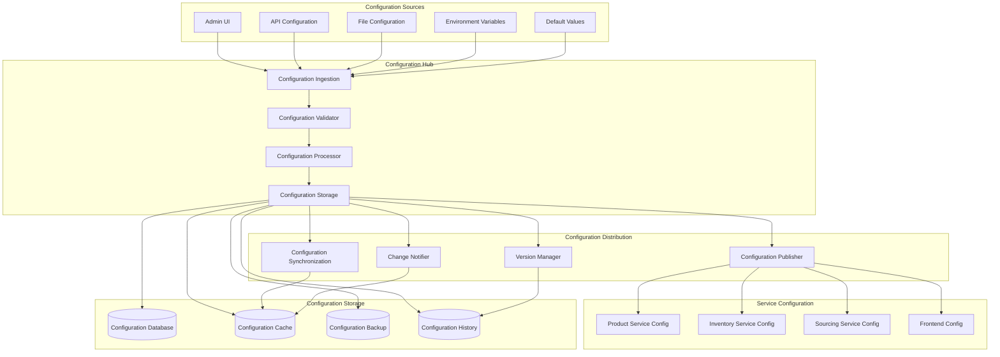

## 6. Payment Data Flow

### Payment Processing Flow

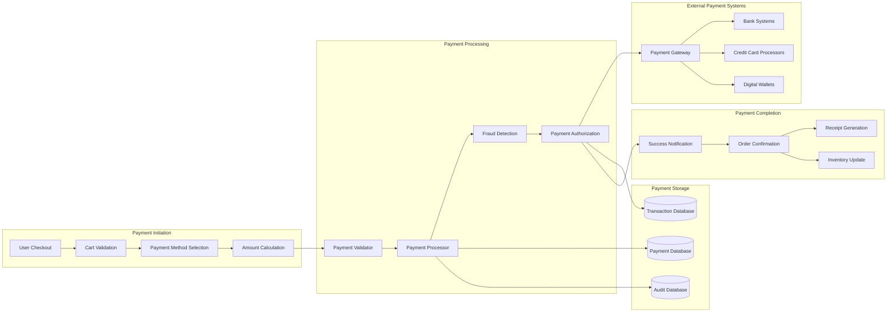

## 7. Search and Discovery Data Flow

### Search Processing Flow

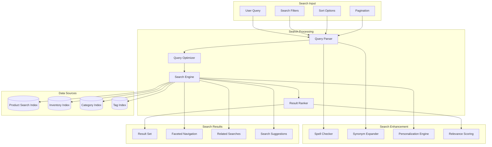

## 8. Data Synchronization Flow

### Cross-Service Data Sync

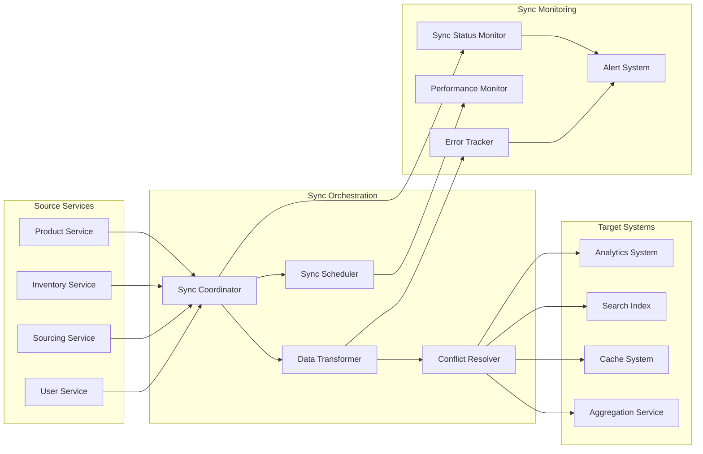

## 9. Error Handling and Recovery Data Flow

### Error Processing Flow

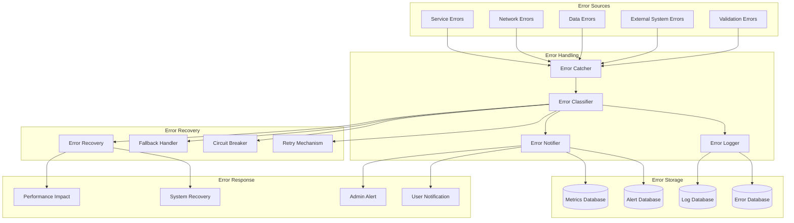

## 10. Data Flow Dependencies Summary

### Critical Data Flow Dependencies

1. **Configuration Hub**: All services depend on it for configuration data
2. **Product Service**: Primary source for product data
3. **Inventory Service**: Critical for availability and stock information
4. **Cache Layer**: Essential for performance and data access
5. **Message Queue**: Required for asynchronous data processing

### Data Flow Risk Assessment

- **High Risk**: Configuration data flow, payment data flow, inventory data flow
- **Medium Risk**: User interaction data flow, search data flow, analytics data flow
- **Low Risk**: Logging data flow, monitoring data flow, development data flow

### Data Flow Optimization Strategies

1. **Caching**: Reduce redundant data fetches
2. **Batch Processing**: Optimize bulk data operations
3. **Async Processing**: Improve response times
4. **Data Compression**: Reduce network bandwidth
5. **Intelligent Routing**: Direct data to optimal destinations
