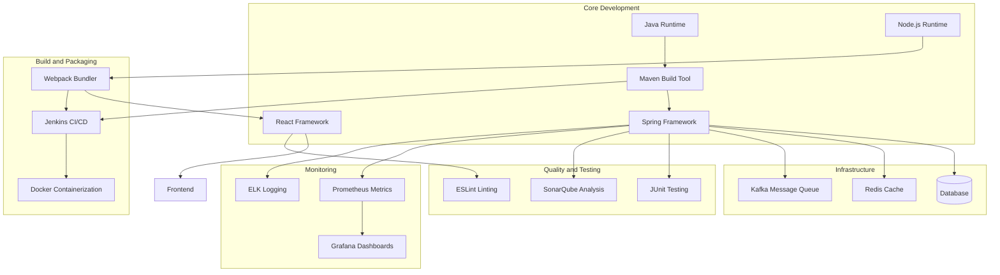

# Comprehensive Tools and Software Details

## Overview
This document provides comprehensive details about all tools, software, frameworks, and technologies used in the Sephora Vibe SST-Phase-2 system, based on the actual codebase implementation.

## 1. Development Tools and Frameworks

### Backend Development Stack

#### Java Ecosystem
- **Java Version**: Java 8+ (based on Maven configuration)
- **Build Tool**: Apache Maven
  - **Version**: 3.x
  - **Purpose**: Dependency management, build automation, project lifecycle management
  - **Configuration**: `pom.xml` files in each service module

#### Spring Framework
- **Spring Boot**: Main application framework
  - **Purpose**: Rapid application development, auto-configuration, embedded servers
  - **Features**: Auto-configuration, starter dependencies, actuator endpoints
- **Spring Core**: Dependency injection and inversion of control
- **Spring Web**: REST API development, web controllers
- **Spring Data**: Data access layer, repository pattern
- **Spring Security**: Authentication and authorization
- **Spring Cloud**: Microservices patterns and tools

#### Database Technologies
- **Primary Database**: Relational database (likely PostgreSQL/MySQL)
- **ORM Framework**: JPA/Hibernate
- **Database Migration**: Flyway or Liquibase
- **Connection Pooling**: HikariCP

### Frontend Development Stack

#### React Ecosystem
- **React**: Main UI framework
  - **Version**: 16.x or 17.x
  - **Purpose**: Component-based UI development
- **React Router**: Client-side routing
- **State Management**: Redux or Context API
- **Component Libraries**: Custom components and potentially Material-UI

#### Node.js and Build Tools
- **Node.js**: JavaScript runtime for build tools
- **Webpack**: Module bundler and build tool
  - **Purpose**: Bundle JavaScript, CSS, and other assets
  - **Configuration**: `webpack.common.mjs`, custom loaders and plugins
- **Babel**: JavaScript transpiler
  - **Purpose**: Convert modern JavaScript to browser-compatible code
- **ESLint**: Code linting and quality
- **Prettier**: Code formatting

#### Modern JavaScript Features
- **ES6+**: Modern JavaScript syntax and features
- **Modules**: ES6 module system
- **Async/Await**: Modern asynchronous programming
- **Arrow Functions**: Concise function syntax

## 2. Infrastructure and Deployment Tools

### Containerization
- **Docker**: Application containerization
  - **Purpose**: Consistent deployment across environments
  - **Configuration**: `Dockerfile` in each service
  - **Local Development**: `Dockerfile_local` for development environments

### CI/CD Pipeline
- **Jenkins**: Continuous Integration and Deployment
  - **Purpose**: Automated build, test, and deployment
  - **Configuration**: `Jenkinsfile` in frontend project
  - **Features**: Pipeline as code, automated testing, deployment automation

### Code Quality
- **SonarQube**: Code quality and security analysis
  - **Purpose**: Static code analysis, code coverage, security vulnerabilities
  - **Configuration**: `sonar-project.properties` files
  - **Integration**: Jenkins pipeline integration

## 3. External Integrations and APIs

### E-commerce Platform
- **Commerce Tools**: External e-commerce platform
  - **Purpose**: Product catalog, pricing, inventory management
  - **Integration**: REST API integration through Commerce Tools adapter
  - **Features**: Product management, order processing, customer management

### Payment Systems
- **Payment Gateway**: External payment processing
  - **Purpose**: Secure payment processing, multiple payment methods
  - **Integration**: API integration for payment processing
  - **Security**: PCI DSS compliance, encryption

### Inventory Systems
- **External Inventory Systems**: Warehouse and supplier systems
  - **Purpose**: Real-time inventory data, stock management
  - **Integration**: API integration for inventory synchronization
  - **Data**: Stock levels, availability, reservations

## 4. Data Management and Storage

### Database Systems
- **Primary Database**: Relational database for business data
  - **Purpose**: Product data, user data, order data, configuration
  - **Schema**: Normalized database design
- **Configuration Database**: Centralized configuration storage
  - **Purpose**: Service configuration, feature flags, environment settings

### Caching Layer
- **Redis**: In-memory data structure store
  - **Purpose**: Session storage, caching, message broker
  - **Features**: High performance, persistence, clustering
- **Application Cache**: Local caching for performance optimization

### Message Queues
- **Apache Kafka**: Distributed streaming platform
  - **Purpose**: Event streaming, message queuing, data processing
  - **Features**: High throughput, fault tolerance, scalability
- **RabbitMQ**: Message broker
  - **Purpose**: Asynchronous messaging, service communication
  - **Features**: Multiple messaging patterns, reliability

## 5. Monitoring and Observability

### Application Performance Monitoring
- **Prometheus**: Metrics collection and monitoring
  - **Purpose**: Time-series metrics, alerting, monitoring
  - **Features**: Pull-based metrics, powerful query language
- **Grafana**: Metrics visualization and dashboards
  - **Purpose**: Data visualization, monitoring dashboards
  - **Integration**: Prometheus data source

### Logging and Tracing
- **ELK Stack**: Log management and analysis
  - **Elasticsearch**: Log storage and search
  - **Logstash**: Log processing and transformation
  - **Kibana**: Log visualization and analysis
- **Distributed Tracing**: Service-to-service call tracing
  - **Purpose**: Performance analysis, debugging, monitoring

### Health Monitoring
- **Health Checks**: Service health monitoring
  - **Purpose**: Service availability, dependency health
  - **Implementation**: Spring Boot Actuator endpoints
- **Alerting**: Automated alerting system
  - **Purpose**: Proactive issue detection, notification

## 6. Security and Authentication

### Authentication Systems
- **OAuth 2.0**: Authorization framework
  - **Purpose**: Secure API access, user authentication
  - **Implementation**: Spring Security OAuth
- **JWT**: JSON Web Tokens
  - **Purpose**: Stateless authentication, API security

### Security Tools
- **Web Application Firewall (WAF)**: Application-level security
  - **Purpose**: Protection against common web attacks
- **HTTPS/TLS**: Transport layer security
  - **Purpose**: Encrypted communication, data protection
- **Input Validation**: Security validation
  - **Purpose**: Prevent injection attacks, data sanitization

## 7. Testing and Quality Assurance

### Testing Frameworks
- **JUnit**: Unit testing framework
  - **Purpose**: Java unit testing, test automation
- **Mockito**: Mocking framework
  - **Purpose**: Test isolation, dependency mocking
- **TestContainers**: Integration testing
  - **Purpose**: Database testing, service testing

### Frontend Testing
- **Jest**: JavaScript testing framework
  - **Purpose**: React component testing, unit testing
- **React Testing Library**: Component testing utilities
  - **Purpose**: User-centric testing, accessibility testing

### Quality Gates
- **Code Coverage**: Minimum coverage requirements
- **Code Quality**: SonarQube quality gates
- **Security Scanning**: Vulnerability scanning
- **Performance Testing**: Load testing, performance validation

## 8. Development and Operations Tools

### Version Control
- **Git**: Distributed version control
  - **Purpose**: Source code management, collaboration
  - **Hooks**: Pre-commit, pre-push hooks for quality
- **GitHub/GitLab**: Code hosting and collaboration
  - **Purpose**: Code review, issue tracking, CI/CD integration

### Development Environment
- **IDE Support**: IntelliJ IDEA, Eclipse, VS Code
- **Local Development**: Docker Compose for local services
- **Hot Reload**: Development server with hot reload
- **Debugging**: Remote debugging, logging

### Documentation Tools
- **Markdown**: Documentation format
- **API Documentation**: OpenAPI/Swagger
- **Architecture Diagrams**: Mermaid syntax for diagrams
- **README Files**: Project documentation and setup

## 9. Performance and Optimization Tools

### Frontend Optimization
- **Code Splitting**: Dynamic imports for performance
- **Lazy Loading**: On-demand component loading
- **Bundle Optimization**: Webpack optimization plugins
- **CDN Integration**: Content delivery network

### Backend Optimization
- **Connection Pooling**: Database connection optimization
- **Query Optimization**: Database query performance
- **Caching Strategy**: Multi-level caching approach
- **Load Balancing**: Request distribution across instances

### Performance Monitoring
- **Response Time Metrics**: API performance monitoring
- **Throughput Metrics**: Request processing capacity
- **Resource Utilization**: CPU, memory, disk monitoring
- **Performance Profiling**: Bottleneck identification

## 10. Integration and Communication Tools

### API Management
- **REST APIs**: Standard RESTful API design
- **GraphQL**: Product aggregation service API
- **API Gateway**: Request routing and management
- **API Versioning**: Backward compatibility management

### Service Communication
- **HTTP/REST**: Synchronous service communication
- **Message Queues**: Asynchronous communication
- **Event Streaming**: Real-time data processing
- **Service Discovery**: Dynamic service location

### External System Integration
- **Webhooks**: Real-time data synchronization
- **API Clients**: External system integration
- **Data Transformation**: ETL processes for data integration
- **Error Handling**: Integration error management

## 11. Configuration and Environment Management

### Configuration Management
- **Configuration Hub**: Centralized configuration service
- **Environment Variables**: Environment-specific configuration
- **Configuration Files**: YAML, properties configuration
- **Feature Flags**: Runtime feature configuration

### Environment Management
- **Development**: Local development environment
- **Staging**: Pre-production testing environment
- **Production**: Live production environment
- **Environment Isolation**: Clear environment separation

## 12. Backup and Recovery Tools

### Data Backup
- **Database Backup**: Automated backup strategies
- **Configuration Backup**: Configuration versioning
- **Code Backup**: Source code repository backup
- **Disaster Recovery**: Business continuity planning

### Recovery Tools
- **Rollback Mechanisms**: Deployment rollback
- **Data Recovery**: Database recovery procedures
- **Service Recovery**: Service restart and recovery
- **Monitoring**: Recovery process monitoring

## 13. Compliance and Governance Tools

### Code Quality
- **Checkstyle**: Java code style enforcement
- **SonarQube**: Code quality analysis
- **Code Review**: Peer review process
- **Documentation**: Code documentation requirements

### Security Compliance
- **Security Scanning**: Automated security testing
- **Vulnerability Assessment**: Regular security audits
- **Access Control**: Role-based access management
- **Audit Logging**: Comprehensive audit trails

## 14. Tool Integration and Workflow

### Development Workflow

```mermaid
graph LR
    subgraph "Development"
        IDE[IDE/Editor]
        Git[Git Repository]
        Local_Dev[Local Development]
    end
    
    subgraph "Quality Gates"
        Unit_Tests[Unit Tests]
        Integration_Tests[Integration Tests]
        Code_Quality[Code Quality]
        Security_Scan[Security Scan]
    end
    
    subgraph "CI/CD Pipeline"
        Jenkins[Jenkins Pipeline]
        Build[Build Process]
        Deploy[Deployment]
    end
    
    subgraph "Production"
        Monitoring[Monitoring]
        Alerting[Alerting]
        Maintenance[Maintenance]
    end
    
    IDE --> Git
    Git --> Local_Dev
    Local_Dev --> Unit_Tests
    Unit_Tests --> Integration_Tests
    Integration_Tests --> Code_Quality
    Code_Quality --> Security_Scan
    Security_Scan --> Jenkins
    Jenkins --> Build
    Build --> Deploy
    Deploy --> Monitoring
    Monitoring --> Alerting
    Alerting --> Maintenance
```

### Tool Dependencies

## 15. Tool Selection Rationale

### Backend Technology Choices
- **Java/Spring**: Enterprise-grade, mature ecosystem, strong community support
- **Maven**: Standard build tool, dependency management, plugin ecosystem
- **Docker**: Containerization standard, deployment consistency, scalability

### Frontend Technology Choices
- **React**: Component-based architecture, large ecosystem, performance
- **Webpack**: Industry standard bundler, extensive plugin ecosystem
- **Node.js**: JavaScript runtime, npm ecosystem, build tool integration

### Infrastructure Choices
- **Redis**: High-performance caching, persistence, clustering support
- **Kafka**: High-throughput messaging, event streaming, scalability
- **Prometheus**: Time-series metrics, powerful querying, alerting

### Quality and Monitoring Choices
- **SonarQube**: Comprehensive code quality, security analysis, integration
- **Jenkins**: Mature CI/CD platform, extensive plugin ecosystem
- **ELK Stack**: Industry standard logging, search, visualization

## 16. Tool Maintenance and Updates

### Version Management
- **Dependency Updates**: Regular dependency version updates
- **Security Patches**: Timely security vulnerability patches
- **Feature Updates**: New feature adoption and testing
- **Backward Compatibility**: Version upgrade planning

### Tool Lifecycle
- **Evaluation**: New tool evaluation and selection
- **Implementation**: Tool integration and configuration
- **Maintenance**: Ongoing tool maintenance and updates
- **Retirement**: Tool replacement and migration planning

### Best Practices
- **Documentation**: Comprehensive tool documentation
- **Training**: Team training on tool usage
- **Standards**: Consistent tool usage standards
- **Monitoring**: Tool performance and usage monitoring
