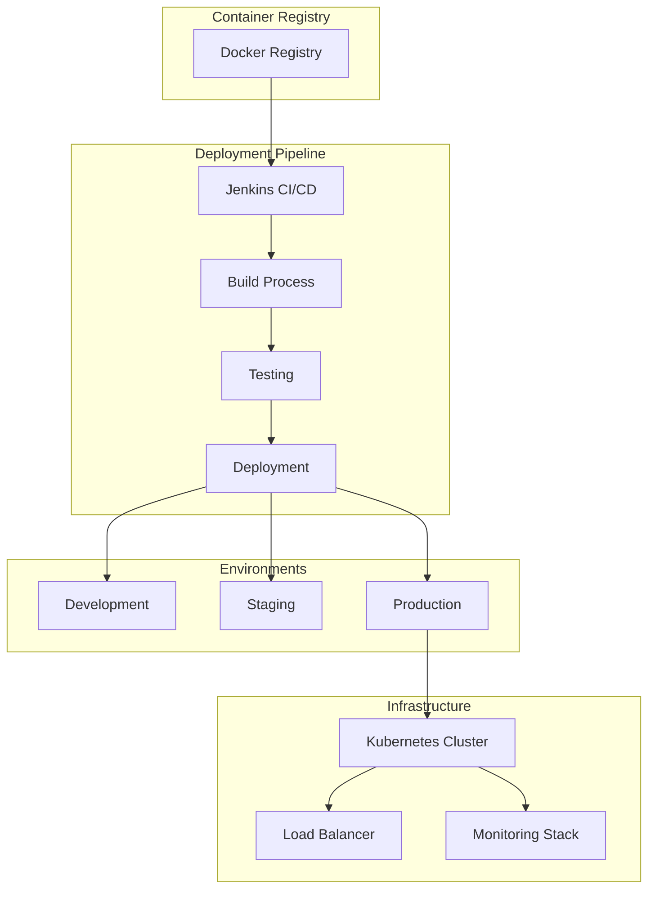

# Detailed Deployment Documentation

## Overview
This document provides comprehensive deployment information for the Sephora Vibe SST-Phase-2 system.

## 1. Deployment Architecture

### Container Deployment

## 2. Deployment Process

### CI/CD Pipeline
1. **Source Code**: Git repository with feature branches
2. **Build**: Maven/Webpack build process
3. **Testing**: Unit, integration, and performance tests
4. **Containerization**: Docker image creation
5. **Registry**: Push to container registry
6. **Deployment**: Automated deployment to environments

### Environment Strategy
- **Development**: Local development with Docker Compose
- **Staging**: Pre-production testing environment
- **Production**: Live production environment with blue-green deployment

## 3. Infrastructure Requirements

### Compute Resources
- **CPU**: Minimum 4 cores per service instance
- **Memory**: Minimum 8GB RAM per service instance
- **Storage**: SSD storage for databases and caches

### Network Requirements
- **Load Balancer**: High-availability load balancer
- **Firewall**: Network security and access control
- **CDN**: Content delivery network for static assets

### Database Requirements
- **Primary Database**: High-availability database cluster
- **Cache**: Redis cluster for performance optimization
- **Backup**: Automated backup and recovery systems

## 4. Monitoring and Observability

### Health Checks
- Service health endpoints
- Database connectivity checks
- External service dependency monitoring

### Logging
- Centralized log aggregation
- Structured logging format
- Log retention and archiving

### Metrics
- Performance metrics collection
- Business metrics tracking
- Alerting and notification systems
