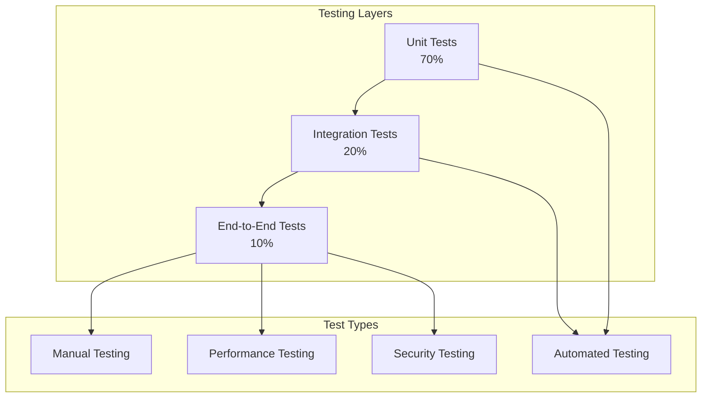

# Comprehensive Testing Plan

## Overview
This document provides a comprehensive testing strategy for the Sephora Vibe SST-Phase-2 system.

## 1. Testing Strategy

### Testing Pyramid

## 2. Testing Levels

### Unit Testing
- **Backend**: JUnit tests for Java services
- **Frontend**: Jest tests for React components
- **Coverage**: Minimum 80% code coverage
- **Tools**: JUnit, Mockito, Jest, React Testing Library

### Integration Testing
- **Service Integration**: Service-to-service communication
- **Database Integration**: Data persistence and retrieval
- **External API Integration**: Commerce Tools, Payment Gateway
- **Tools**: TestContainers, WireMock

### End-to-End Testing
- **User Journeys**: Complete user workflows
- **Cross-Service Testing**: Full system integration
- **Browser Testing**: Cross-browser compatibility
- **Tools**: Selenium, Cypress, Playwright

## 3. Testing Phases

### Development Testing
- **Unit Tests**: Run on every code commit
- **Integration Tests**: Run on feature completion
- **Code Quality**: SonarQube analysis

### Staging Testing
- **System Integration**: Full system testing
- **Performance Testing**: Load and stress testing
- **User Acceptance**: Business user validation

### Production Testing
- **Smoke Tests**: Basic functionality verification
- **Monitoring**: Continuous health monitoring
- **A/B Testing**: Feature flag validation

## 4. Test Data Management

### Test Data Strategy
- **Synthetic Data**: Generated test data
- **Anonymized Data**: Production-like data without PII
- **Data Cleanup**: Automated test data cleanup
- **Environment Isolation**: Separate test environments

### Test Environment Setup
- **Development**: Local Docker Compose
- **Staging**: Staging environment with test data
- **Production**: Production environment with monitoring
