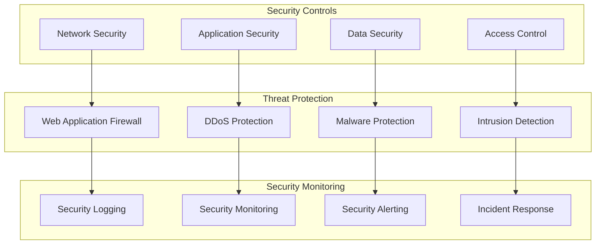

# Comprehensive Security Documentation

## Overview
This document provides comprehensive security information for the Sephora Vibe SST-Phase-2 system.

## 1. Security Architecture

### Security Layers

## 2. Authentication & Authorization

### Authentication Methods
- **OAuth 2.0**: Industry-standard authorization framework
- **JWT**: JSON Web Tokens for stateless authentication
- **Multi-Factor Authentication**: Additional security layer
- **Single Sign-On**: Centralized authentication

### Authorization Model
- **Role-Based Access Control**: User role management
- **Permission-Based Access**: Granular permission control
- **Resource-Level Security**: Object-level access control
- **Session Management**: Secure session handling

## 3. Data Security

### Data Protection
- **Encryption at Rest**: Database and file encryption
- **Encryption in Transit**: TLS/SSL for data transmission
- **Data Masking**: Sensitive data protection
- **Audit Logging**: Comprehensive audit trails

### Compliance Requirements
- **PCI DSS**: Payment card industry compliance
- **GDPR**: Data protection and privacy
- **SOX**: Financial reporting compliance
- **Industry Standards**: Security best practices

## 4. Security Testing

### Security Assessment
- **Vulnerability Scanning**: Automated security testing
- **Penetration Testing**: Manual security assessment
- **Code Security Analysis**: Static and dynamic analysis
- **Security Code Review**: Peer review process

### Security Monitoring
- **Real-time Monitoring**: Continuous security monitoring
- **Threat Detection**: Automated threat identification
- **Incident Response**: Security incident handling
- **Forensic Analysis**: Security incident investigation
