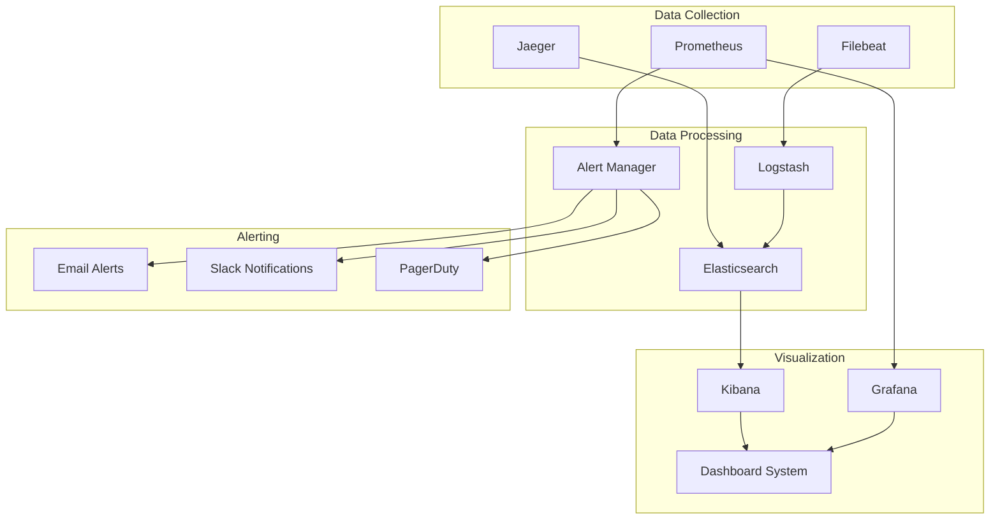

# Comprehensive Monitoring Documentation

## Overview
This document provides comprehensive monitoring and observability information for the Sephora Vibe SST-Phase-2 system.

## 1. Monitoring Architecture

### Monitoring Stack

## 2. Metrics Collection

### Application Metrics
- **Response Time**: API response time monitoring
- **Throughput**: Request processing capacity
- **Error Rates**: Error percentage tracking
- **Business Metrics**: User activity and transactions

### Infrastructure Metrics
- **CPU Usage**: Processor utilization
- **Memory Usage**: Memory consumption
- **Disk I/O**: Storage performance
- **Network**: Network traffic and latency

### Custom Metrics
- **Business KPIs**: Key performance indicators
- **User Experience**: User interaction metrics
- **Service Health**: Service availability metrics
- **External Dependencies**: Third-party service health

## 3. Logging Strategy

### Log Levels
- **ERROR**: Error conditions requiring attention
- **WARN**: Warning conditions
- **INFO**: General information
- **DEBUG**: Detailed debugging information

### Log Structure
- **Structured Logging**: JSON format for easy parsing
- **Correlation IDs**: Request tracing across services
- **Context Information**: Relevant metadata
- **Timestamp**: Precise timing information

### Log Aggregation
- **Centralized Collection**: All logs in one place
- **Search and Analysis**: Full-text search capabilities
- **Retention Policy**: Automated log management
- **Backup and Archive**: Long-term log storage

## 4. Alerting and Notification

### Alert Rules
- **Threshold-Based**: Static threshold alerts
- **Trend-Based**: Dynamic threshold alerts
- **Anomaly Detection**: Machine learning-based alerts
- **Business Logic**: Custom business rule alerts

### Notification Channels
- **Email**: Email notifications
- **Slack**: Team chat notifications
- **PagerDuty**: Incident management
- **SMS**: Critical alert notifications

### Escalation Policies
- **Alert Escalation**: Progressive alert escalation
- **On-Call Rotation**: 24/7 coverage
- **Incident Management**: Structured incident handling
- **Post-Incident Review**: Lessons learned process
