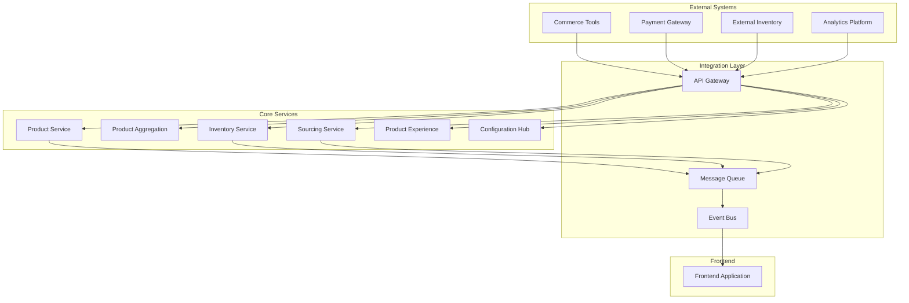

# Integration Plan with Diagrams

## Overview
This document provides comprehensive integration planning for the Sephora Vibe SST-Phase-2 system.

## 1. Integration Architecture

### System Integration Overview

## 2. Integration Patterns

### API-First Integration
- **REST APIs**: Standard HTTP-based integration
- **GraphQL**: Flexible data querying
- **Webhooks**: Real-time event notifications
- **API Versioning**: Backward compatibility management

### Event-Driven Integration
- **Asynchronous Processing**: Non-blocking operations
- **Event Sourcing**: Complete event history
- **CQRS**: Command and query separation
- **Event Streaming**: Real-time data processing

### Message Queue Integration
- **Reliable Delivery**: Guaranteed message delivery
- **Load Balancing**: Distributed message processing
- **Fault Tolerance**: Error handling and retry
- **Scalability**: Horizontal scaling support

## 3. External System Integration

### Commerce Tools Integration
- **Product Synchronization**: Bidirectional data sync
- **Inventory Updates**: Real-time stock updates
- **Order Processing**: Order lifecycle management
- **Customer Management**: Customer data integration

### Payment Gateway Integration
- **Payment Processing**: Secure payment handling
- **Transaction Management**: Payment transaction tracking
- **Refund Processing**: Automated refund handling
- **Fraud Detection**: Security and fraud prevention

### Inventory System Integration
- **Stock Synchronization**: Real-time inventory updates
- **Warehouse Management**: Multi-warehouse support
- **Supplier Integration**: Supplier data integration
- **Demand Forecasting**: Predictive inventory management

## 4. Data Integration Strategy

### Data Synchronization
- **Real-time Sync**: Immediate data updates
- **Batch Processing**: Scheduled bulk updates
- **Change Data Capture**: Incremental updates
- **Conflict Resolution**: Data conflict handling

### Data Transformation
- **ETL Processes**: Extract, transform, load
- **Data Mapping**: Field-level mapping
- **Data Validation**: Quality assurance
- **Data Enrichment**: Additional data enhancement

### Data Quality Management
- **Data Validation**: Input validation rules
- **Data Cleansing**: Data quality improvement
- **Data Monitoring**: Continuous quality monitoring
- **Data Governance**: Data management policies
