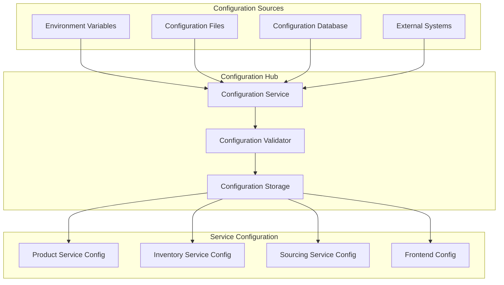

# Comprehensive Configuration Details

## Overview
This document provides comprehensive configuration information for the Sephora Vibe SST-Phase-2 system.

## 1. Configuration Architecture

### Configuration Management

## 2. Environment Configuration

### Development Environment
- **Database**: Local PostgreSQL/MySQL
- **Cache**: Local Redis instance
- **Message Queue**: Local Kafka/RabbitMQ
- **External APIs**: Mock services

### Staging Environment
- **Database**: Staging database cluster
- **Cache**: Staging Redis cluster
- **Message Queue**: Staging message queue
- **External APIs**: Staging external services

### Production Environment
- **Database**: Production database cluster
- **Cache**: Production Redis cluster
- **Message Queue**: Production message queue
- **External APIs**: Production external services

## 3. Service Configuration

### Product Service Configuration
- **Database Connection**: Connection pool settings
- **Commerce Tools**: API credentials and endpoints
- **Payment Gateway**: Payment service configuration
- **Caching**: Redis cache configuration

### Inventory Service Configuration
- **Database Connection**: Inventory database settings
- **External Systems**: Warehouse system integration
- **Sync Settings**: Synchronization configuration
- **Alert Thresholds**: Stock level alerts

### Frontend Configuration
- **API Endpoints**: Backend service URLs
- **Feature Flags**: Feature toggle configuration
- **UI Settings**: Theme and language settings
- **Analytics**: Tracking and monitoring configuration

## 4. Security Configuration

### Authentication Configuration
- **OAuth 2.0**: Authorization server settings
- **JWT**: Token configuration and expiration
- **Session Management**: Session timeout and security
- **Password Policy**: Password requirements

### Network Security
- **Firewall Rules**: Network access control
- **SSL/TLS**: Certificate configuration
- **Rate Limiting**: API rate limit settings
- **CORS**: Cross-origin resource sharing

### Data Security
- **Encryption**: Data encryption settings
- **Key Management**: Encryption key configuration
- **Audit Logging**: Security audit configuration
- **Data Masking**: Sensitive data protection
