# ConfigHub Service Architecture Analysis

## Executive Summary

The ConfigHub service is a centralized configuration management system that provides dynamic configuration capabilities across the Sephora microservices ecosystem. It serves as a configuration server that allows services to retrieve and update configuration properties in real-time without requiring application restarts.

### Key Technical Findings
- **Spring Cloud Config Server**: Implements centralized configuration management
- **MySQL Database**: Persistent storage for configuration properties
- **Kafka Integration**: Event-driven configuration updates via Spring Cloud Bus
- **JPA/Hibernate**: Object-relational mapping for database operations
- **Swagger Documentation**: API documentation and testing interface

### Critical Concerns and Risks
- **Single Point of Failure**: Centralized configuration creates dependency risk
- **Database Performance**: Configuration queries may become bottleneck with scale
- **Security**: Configuration data contains sensitive information requiring proper access controls
- **Data Consistency**: Multi-service configuration updates require careful synchronization

### High-level Recommendations
- Implement configuration caching strategies to reduce database load
- Add configuration encryption for sensitive properties
- Consider configuration versioning and rollback capabilities
- Implement configuration validation and schema enforcement

## Architecture Analysis

### System Architecture and Component Relationships

The ConfigHub service follows a layered architecture pattern with clear separation of concerns:

- **Presentation Layer**: REST controllers handling HTTP requests
- **Business Logic Layer**: Service implementations managing configuration operations
- **Data Access Layer**: Repository interfaces and JPA entities
- **Infrastructure Layer**: Database connections, caching, and external integrations

### Design Patterns and Architectural Decisions

- **Repository Pattern**: Abstracts data access logic from business services
- **Service Layer Pattern**: Encapsulates business logic and transaction management
- **DTO Pattern**: Separates internal entities from external API contracts
- **Audit Pattern**: Tracks configuration changes for compliance and debugging

### Integration Patterns and External Dependencies

- **Spring Cloud Config Server**: Provides configuration server capabilities
- **Spring Cloud Bus**: Enables configuration change propagation via Kafka
- **MySQL Database**: Primary data store for configuration properties
- **Kafka**: Message broker for configuration change events

### Data Flow and Messaging Architecture

Configuration requests flow through the following path:
1. Client services make HTTP requests to ConfigHub
2. Controllers validate and route requests to appropriate services
3. Services execute business logic and interact with repositories
4. Repositories perform database operations via JPA
5. Configuration changes trigger Kafka events for service notification

## Security Analysis

### Authentication and Authorization Mechanisms

- **Spring Security**: Framework for authentication and authorization
- **Service-to-Service Authentication**: Mutual TLS or API key authentication
- **Role-Based Access Control**: Different access levels for configuration management
- **Audit Logging**: Comprehensive logging of configuration changes

### Security Vulnerabilities and Risks

- **Sensitive Data Exposure**: Configuration properties may contain secrets
- **Insufficient Input Validation**: Malicious configuration values could impact services
- **Privilege Escalation**: Unauthorized configuration modifications
- **Data Breach**: Unauthorized access to configuration database

### Data Protection and Encryption

- **Configuration Encryption**: Sensitive properties should be encrypted at rest
- **Transport Security**: HTTPS/TLS for all API communications
- **Database Encryption**: Encrypted storage for configuration data
- **Key Management**: Secure storage and rotation of encryption keys

### Compliance and Regulatory Considerations

- **Data Retention**: Configuration audit logs must be retained for compliance
- **Access Controls**: Strict controls on who can modify configurations
- **Change Management**: Formal process for configuration changes
- **Audit Trail**: Complete audit trail of all configuration modifications

## Performance Analysis

### Database Performance and Optimization Opportunities

- **Query Optimization**: Index configuration properties for faster lookups
- **Connection Pooling**: Optimize database connection management
- **Caching Strategy**: Implement multi-level caching for frequently accessed configurations
- **Database Partitioning**: Consider partitioning for large configuration datasets

### Application Performance Bottlenecks

- **Configuration Retrieval**: Optimize configuration lookup performance
- **Event Processing**: Efficient handling of configuration change events
- **Memory Usage**: Monitor memory consumption with large configuration sets
- **Response Times**: Ensure sub-second response times for configuration requests

### Caching Strategies and Effectiveness

- **Application-Level Caching**: Cache frequently accessed configurations
- **Database Query Caching**: Cache database query results
- **Distributed Caching**: Consider Redis for shared configuration cache
- **Cache Invalidation**: Proper cache invalidation on configuration changes

### Infrastructure Performance Considerations

- **Database Scaling**: Vertical and horizontal scaling strategies
- **Load Balancing**: Distribute configuration requests across instances
- **Resource Allocation**: Optimize CPU and memory allocation
- **Network Performance**: Minimize network latency for configuration requests

## Code Quality Assessment

### Code Complexity and Maintainability

- **Cyclomatic Complexity**: Monitor complexity in business logic methods
- **Code Duplication**: Identify and eliminate duplicate configuration handling code
- **Modularity**: Ensure proper separation of concerns across layers
- **Documentation**: Comprehensive API and code documentation

### Technical Debt Identification

- **Legacy Code**: Identify and refactor outdated configuration patterns
- **Hardcoded Values**: Replace hardcoded configuration with externalized values
- **Error Handling**: Improve error handling and recovery mechanisms
- **Testing Coverage**: Increase unit and integration test coverage

### Design Pattern Usage and Effectiveness

- **Repository Pattern**: Effective abstraction of data access
- **Service Layer**: Proper business logic encapsulation
- **DTO Pattern**: Clean separation of internal and external models
- **Factory Pattern**: Consider for complex configuration object creation

### Error Handling and Resilience Patterns

- **Circuit Breaker**: Implement for external service dependencies
- **Retry Mechanisms**: Automatic retry for transient failures
- **Fallback Strategies**: Graceful degradation when services are unavailable
- **Error Logging**: Comprehensive error logging and monitoring

## Testing Analysis

### Test Coverage and Quality Assessment

- **Unit Test Coverage**: Target 80%+ coverage for business logic
- **Integration Test Coverage**: Test database and external service integrations
- **API Test Coverage**: Comprehensive testing of REST endpoints
- **Performance Test Coverage**: Load and stress testing scenarios

### Testing Strategy and Implementation

- **Test-Driven Development**: Write tests before implementing features
- **Mock Testing**: Use mocks for external dependencies
- **Database Testing**: Use test containers for database integration tests
- **Contract Testing**: Ensure API contracts are properly tested

### Integration and End-to-End Testing

- **Service Integration**: Test interactions with other microservices
- **Database Integration**: Test database operations and transactions
- **External Service Integration**: Test Kafka and other external dependencies
- **End-to-End Scenarios**: Test complete configuration management workflows

### Test Automation and CI/CD Integration

- **Automated Testing**: Integrate tests into CI/CD pipeline
- **Test Environment**: Dedicated test environment for configuration testing
- **Test Data Management**: Proper test data setup and cleanup
- **Performance Testing**: Automated performance regression testing

## Deployment & DevOps Analysis

### CI/CD Pipeline and Automation

- **Build Automation**: Automated build and packaging process
- **Deployment Automation**: Automated deployment to different environments
- **Configuration Management**: Environment-specific configuration management
- **Rollback Capabilities**: Automated rollback for failed deployments

### Containerization and Orchestration

- **Docker Containerization**: Containerized application deployment
- **Kubernetes Orchestration**: Container orchestration and scaling
- **Service Discovery**: Integration with service discovery mechanisms
- **Health Checks**: Proper health check implementation

### Infrastructure and Environment Management

- **Environment Separation**: Clear separation of dev, test, and production environments
- **Configuration Management**: Externalized configuration for different environments
- **Resource Management**: Proper resource allocation and monitoring
- **Security Hardening**: Security configurations for production deployment

### Monitoring and Observability Setup

- **Application Monitoring**: Comprehensive application metrics and monitoring
- **Database Monitoring**: Database performance and health monitoring
- **Log Aggregation**: Centralized logging and log analysis
- **Alerting**: Proactive alerting for issues and performance degradation

## Business Domain Analysis

### Domain Model and Business Entities

The ConfigHub service manages the following core business entities:

- **Configuration**: Central configuration entity with properties and values
- **ConfigurationGroup**: Logical grouping of related configurations
- **AuditConfiguration**: Audit trail for configuration changes
- **PropertyValues**: Configuration property values and metadata

### Business Processes and Workflows

- **Configuration Creation**: Process for creating new configuration properties
- **Configuration Updates**: Workflow for updating existing configurations
- **Configuration Retrieval**: Process for retrieving configuration values
- **Configuration Validation**: Validation of configuration values and constraints

### Business Rules and Validation Logic

- **Configuration Naming**: Enforce consistent configuration naming conventions
- **Value Validation**: Validate configuration values against defined schemas
- **Access Control**: Enforce role-based access to configuration management
- **Change Approval**: Require approval for critical configuration changes

### Integration Points and External Services

- **Service Discovery**: Integration with service discovery mechanisms
- **Configuration Clients**: Services that consume configuration data
- **Event Bus**: Kafka integration for configuration change notifications
- **Monitoring Systems**: Integration with monitoring and alerting systems

## Risk Assessment

### Technical Risks and Vulnerabilities

- **Single Point of Failure**: Centralized configuration creates system dependency
- **Data Loss**: Risk of configuration data loss or corruption
- **Performance Degradation**: Slow configuration retrieval impacts all services
- **Security Breaches**: Unauthorized access to sensitive configuration data

### Business Continuity Risks

- **Service Outage**: ConfigHub failure impacts all dependent services
- **Configuration Corruption**: Invalid configurations can cause service failures
- **Data Inconsistency**: Inconsistent configuration across service instances
- **Recovery Time**: Time required to restore configuration service

### Performance and Scalability Concerns

- **Database Bottlenecks**: Database performance limits configuration throughput
- **Memory Constraints**: Large configuration sets consume significant memory
- **Network Latency**: Configuration requests add latency to service startup
- **Concurrent Access**: High concurrent access may cause performance issues

### Security Threats and Mitigation Strategies

- **Unauthorized Access**: Implement strong authentication and authorization
- **Data Breaches**: Encrypt sensitive configuration data
- **Configuration Tampering**: Implement configuration integrity checks
- **Privilege Escalation**: Strict access controls and audit logging

## Detailed Recommendations

### Immediate Actions (High Priority)

1. **Implement Configuration Encryption**: Encrypt sensitive configuration properties
2. **Add Configuration Validation**: Implement schema validation for configuration values
3. **Improve Error Handling**: Enhance error handling and recovery mechanisms
4. **Increase Test Coverage**: Achieve 80%+ test coverage for critical components

### Short-term Improvements (Medium Priority)

1. **Implement Caching Strategy**: Add multi-level caching for configuration retrieval
2. **Add Configuration Versioning**: Implement version control for configuration changes
3. **Enhance Monitoring**: Improve monitoring and alerting for configuration service
4. **Optimize Database Queries**: Optimize database queries and add proper indexing

### Long-term Strategic Enhancements (Low Priority)

1. **Implement Configuration Federation**: Support multiple configuration sources
2. **Add Configuration Templates**: Predefined configuration templates for common scenarios
3. **Implement Configuration Analytics**: Analytics and insights for configuration usage
4. **Add Configuration Migration Tools**: Tools for migrating configurations between environments

## Action Plan

### Phase 1: Critical Fixes (1-2 weeks)

- Implement configuration encryption for sensitive properties
- Add comprehensive input validation for configuration values
- Improve error handling and recovery mechanisms
- Add configuration integrity checks

### Phase 2: Quality Improvements (1-2 months)

- Implement multi-level caching strategy
- Add configuration versioning and rollback capabilities
- Enhance monitoring and alerting systems
- Optimize database performance and queries

### Phase 3: Strategic Enhancements (3-6 months)

- Implement configuration federation and multi-source support
- Add configuration analytics and insights
- Develop configuration migration and management tools
- Implement advanced configuration validation and schema enforcement

## System Architecture Diagram

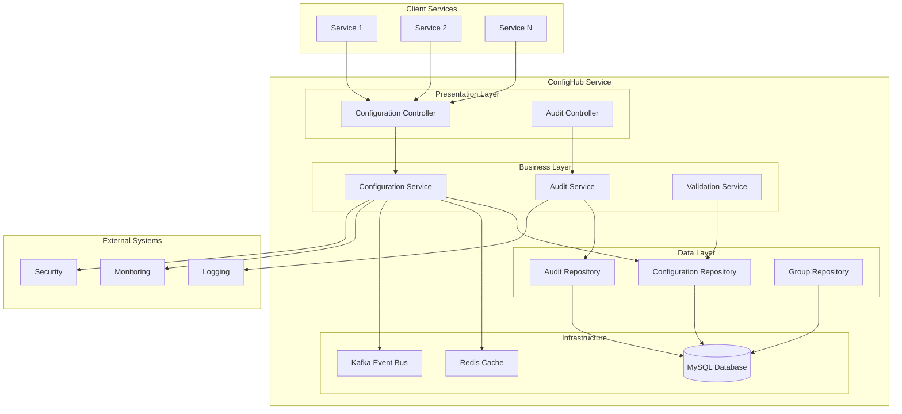

## Component Relationship Diagram

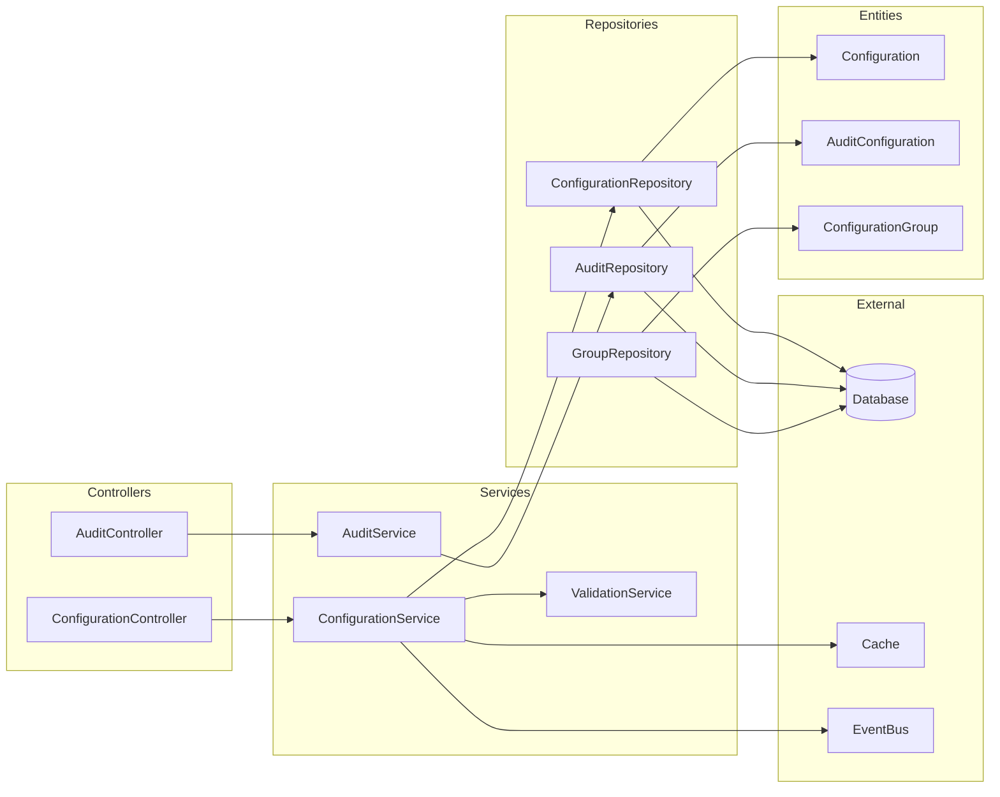

## Data Flow Diagram

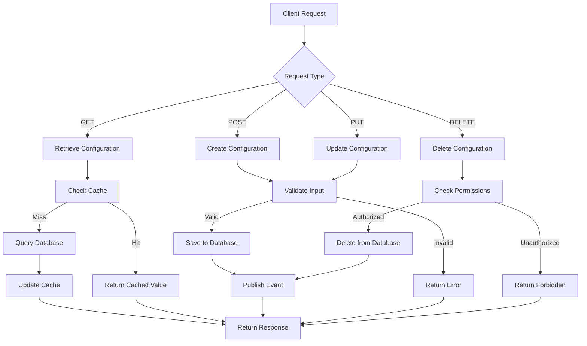

## Domain Model Diagram

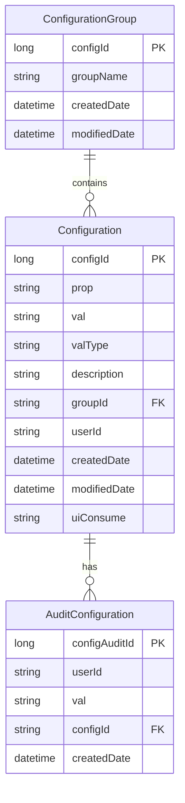

## Business Process Flow

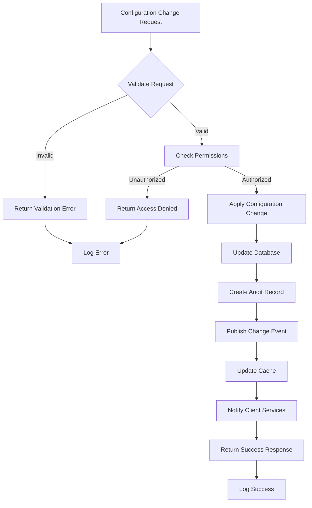

## Database Schema Diagram

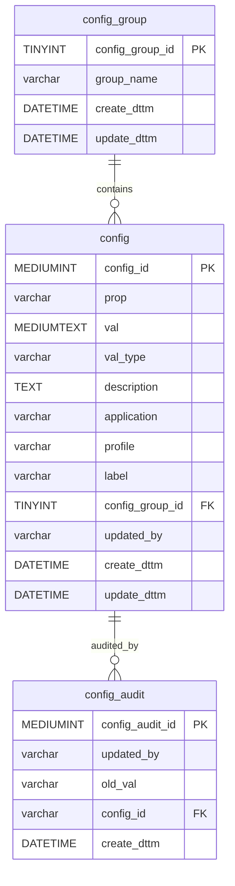

## Infrastructure Architecture

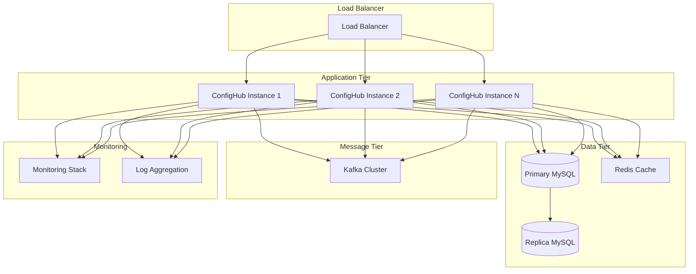

## Monitoring & Observability Stack

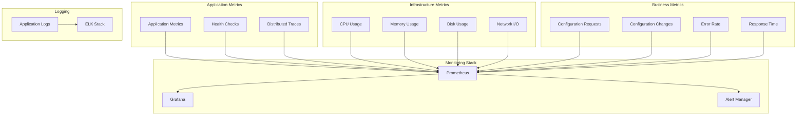

## Authentication Flow

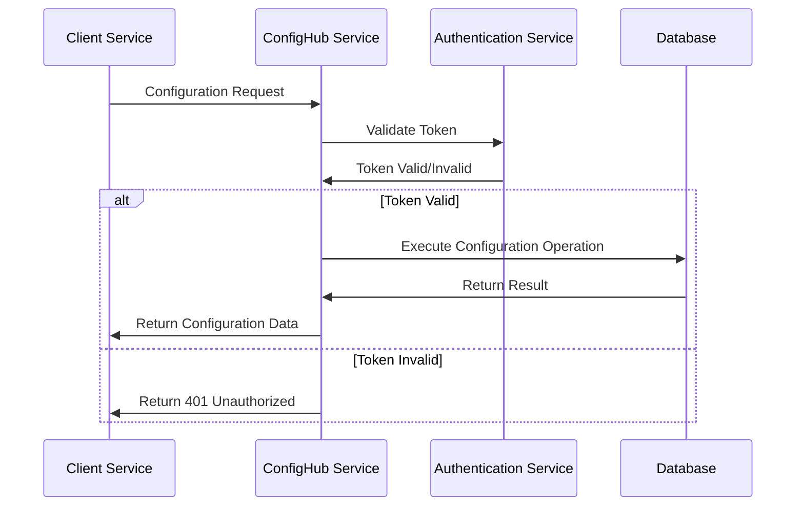

## Error Handling Flow

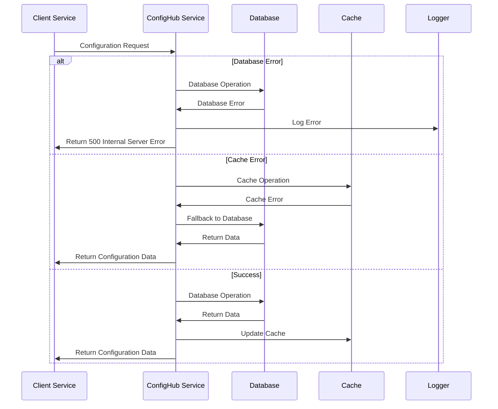

## Configuration Creation Flow

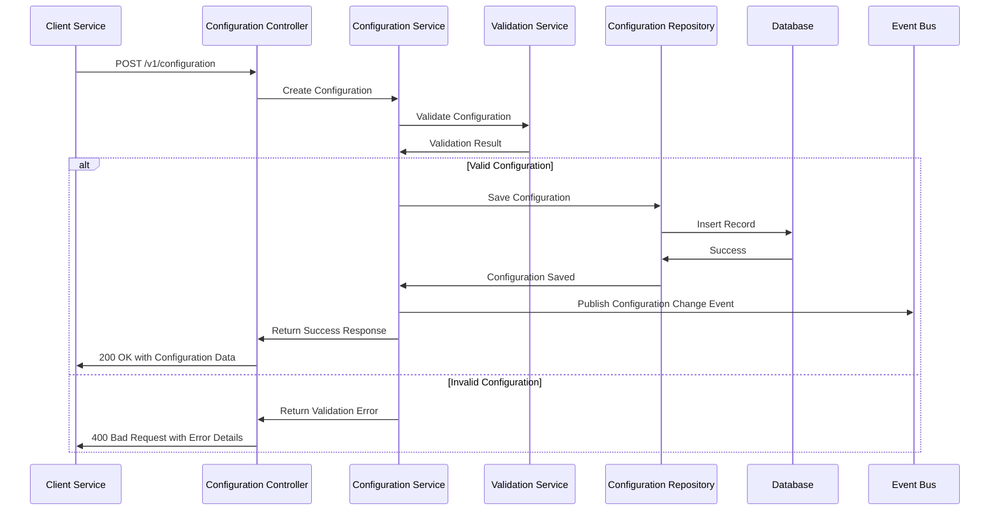

## Configuration Retrieval Flow

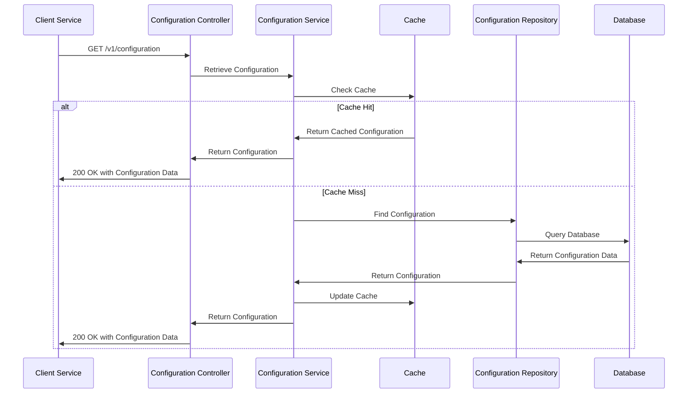

## Configuration Update Flow

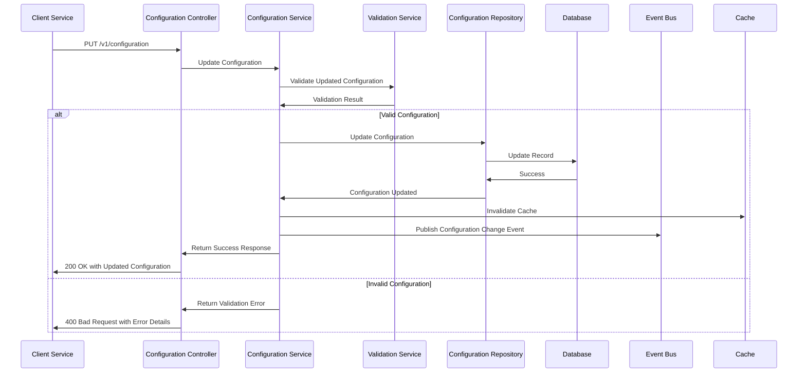

## Configuration Deletion Flow

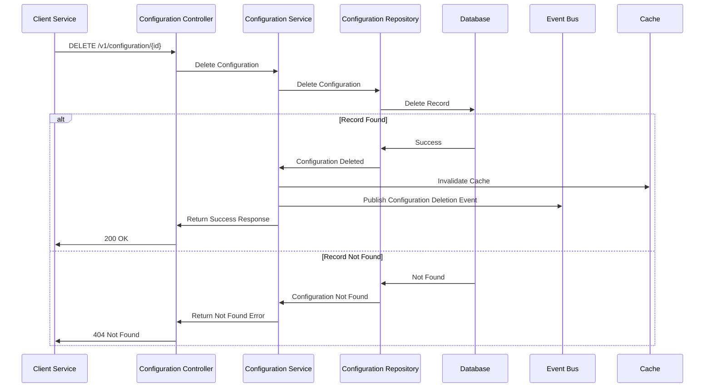

## Bulk Configuration Operations Flow

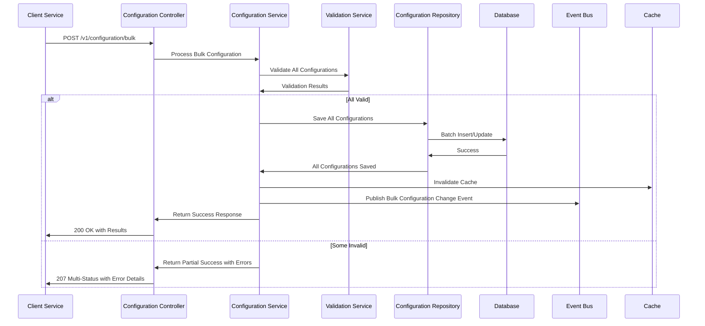
