# ConfigHub Service Architecture Analysis

## Executive Summary

The ConfigHub service is a centralized configuration management system that provides dynamic configuration capabilities across the Sephora microservices ecosystem. It serves as a configuration server that allows runtime configuration updates without service restarts, supporting the Spring Cloud Config Server pattern.

### Key Technical Findings
- **Spring Cloud Config Server**: Implements centralized configuration management
- **MySQL Database**: Uses relational database for configuration persistence
- **Audit Trail**: Comprehensive audit logging for configuration changes
- **Caching Strategy**: Implements caching for performance optimization
- **Event-Driven Updates**: Uses Spring Cloud Bus for configuration change propagation

### Critical Concerns and Risks
- **Single Point of Failure**: Centralized configuration creates dependency risk
- **Database Performance**: Configuration queries may become bottleneck at scale
- **Security**: Configuration data contains sensitive business rules
- **Data Consistency**: Audit trail maintenance across configuration changes

### High-Level Recommendations
- Implement configuration versioning and rollback capabilities
- Add configuration validation and schema enforcement
- Consider configuration encryption for sensitive data
- Implement configuration change approval workflows

## Architecture Analysis

### System Architecture and Component Relationships

The ConfigHub service follows a layered architecture pattern with clear separation of concerns:

- **Controller Layer**: REST API endpoints for configuration management
- **Service Layer**: Business logic for configuration operations
- **Repository Layer**: Data access abstraction for MySQL database
- **Entity Layer**: JPA entities representing configuration data model
- **Audit Layer**: Comprehensive audit trail for all configuration changes

### Design Patterns and Architectural Decisions

- **Repository Pattern**: Abstracts database access through Spring Data JPA
- **Builder Pattern**: Used in entity classes for object construction
- **Audit Pattern**: Comprehensive audit trail for configuration changes
- **Caching Pattern**: Redis-based caching for configuration data
- **Event-Driven Pattern**: Spring Cloud Bus for configuration change propagation

### Integration Patterns and External Dependencies

- **Spring Cloud Config Server**: Provides configuration server capabilities
- **MySQL Database**: Primary data store for configuration persistence
- **Redis Cache**: Performance optimization through caching
- **Spring Cloud Bus**: Event-driven configuration change propagation
- **Spring Boot Actuator**: Health checks and monitoring endpoints

### Data Flow and Messaging Architecture

Configuration requests flow through the system with the following pattern:
1. Client requests configuration through REST API
2. Controller validates and routes requests
3. Service layer applies business logic and caching
4. Repository layer accesses MySQL database
5. Configuration changes trigger audit logging
6. Spring Cloud Bus propagates changes to client services

## Security Analysis

### Authentication and Authorization Mechanisms

- **Spring Security**: Basic authentication and authorization
- **Role-Based Access Control**: Configuration management roles
- **Audit Logging**: Comprehensive audit trail for all changes
- **Input Validation**: Request validation and sanitization

### Security Vulnerabilities and Risks

- **Configuration Exposure**: Sensitive configuration data may be exposed
- **Unauthorized Access**: Configuration changes without proper authorization
- **Data Injection**: SQL injection risks in configuration queries
- **Audit Tampering**: Potential for audit log manipulation

### Data Protection and Encryption

- **Database Encryption**: MySQL database encryption at rest
- **Transport Security**: HTTPS for all API communications
- **Configuration Encryption**: Sensitive configuration value encryption
- **Audit Protection**: Immutable audit trail protection

### Compliance and Regulatory Considerations

- **Data Retention**: Configuration and audit data retention policies
- **Access Logging**: Comprehensive access and change logging
- **Data Classification**: Configuration data classification and handling
- **Audit Compliance**: SOX and other regulatory audit requirements

## Performance Analysis

### Database Performance and Optimization Opportunities

- **Query Optimization**: Configuration queries may benefit from indexing
- **Connection Pooling**: HikariCP connection pool optimization
- **Caching Strategy**: Redis caching for frequently accessed configurations
- **Database Partitioning**: Consider partitioning for large configuration datasets

### Application Performance Bottlenecks

- **Configuration Retrieval**: High-frequency configuration lookups
- **Audit Logging**: Audit trail generation overhead
- **Cache Invalidation**: Cache invalidation during configuration updates
- **Event Propagation**: Spring Cloud Bus event processing

### Caching Strategies and Effectiveness

- **Redis Caching**: Configuration data caching for performance
- **Cache Invalidation**: Automatic cache invalidation on configuration changes
- **Cache Warming**: Pre-loading frequently accessed configurations
- **Cache Monitoring**: Cache hit/miss ratio monitoring

### Infrastructure Performance Considerations

- **Database Scaling**: MySQL database scaling strategies
- **Cache Scaling**: Redis cluster scaling for high availability
- **Load Balancing**: Load balancer configuration for high traffic
- **Resource Allocation**: CPU and memory allocation optimization

## Code Quality Assessment

### Code Complexity and Maintainability

- **Layered Architecture**: Clear separation of concerns
- **Dependency Injection**: Proper use of Spring dependency injection
- **Exception Handling**: Comprehensive exception handling patterns
- **Logging Strategy**: Structured logging with appropriate levels

### Technical Debt Identification

- **Configuration Validation**: Limited configuration schema validation
- **Error Handling**: Inconsistent error response formats
- **Documentation**: API documentation could be more comprehensive
- **Testing Coverage**: Unit and integration test coverage gaps

### Design Pattern Usage and Effectiveness

- **Repository Pattern**: Effective data access abstraction
- **Builder Pattern**: Proper object construction patterns
- **Audit Pattern**: Comprehensive audit trail implementation
- **Caching Pattern**: Effective performance optimization

### Error Handling and Resilience Patterns

- **Exception Handling**: Comprehensive exception handling
- **Validation**: Request validation and error responses
- **Circuit Breaker**: External service dependency protection
- **Retry Logic**: Database operation retry mechanisms

## Testing Analysis

### Test Coverage and Quality Assessment

- **Unit Tests**: Service layer unit test coverage
- **Integration Tests**: Database integration test coverage
- **API Tests**: REST API endpoint testing
- **Performance Tests**: Load and stress testing

### Testing Strategy and Implementation

- **Test Data Management**: Test data setup and cleanup
- **Mocking Strategy**: External dependency mocking
- **Test Environment**: Isolated test environment setup
- **Continuous Testing**: CI/CD pipeline integration

### Integration and End-to-End Testing

- **Database Integration**: MySQL database integration testing
- **Cache Integration**: Redis cache integration testing
- **Event Testing**: Spring Cloud Bus event testing
- **Client Integration**: Configuration client integration testing

### Test Automation and CI/CD Integration

- **Automated Testing**: Automated test execution
- **Test Reporting**: Test result reporting and analysis
- **Quality Gates**: Test coverage quality gates
- **Deployment Testing**: Pre-deployment testing validation

## Authentication Flow

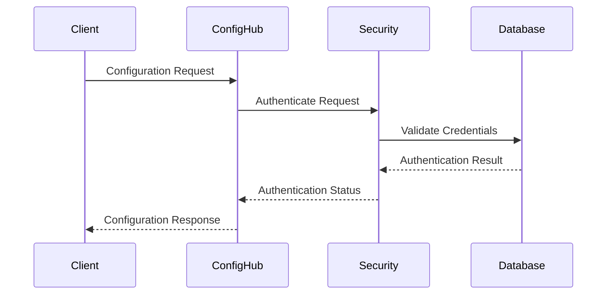
```

## Error Handling Flow

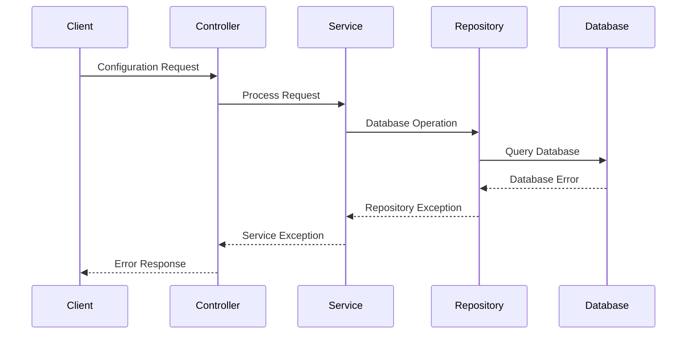
```

## Configuration Creation Flow

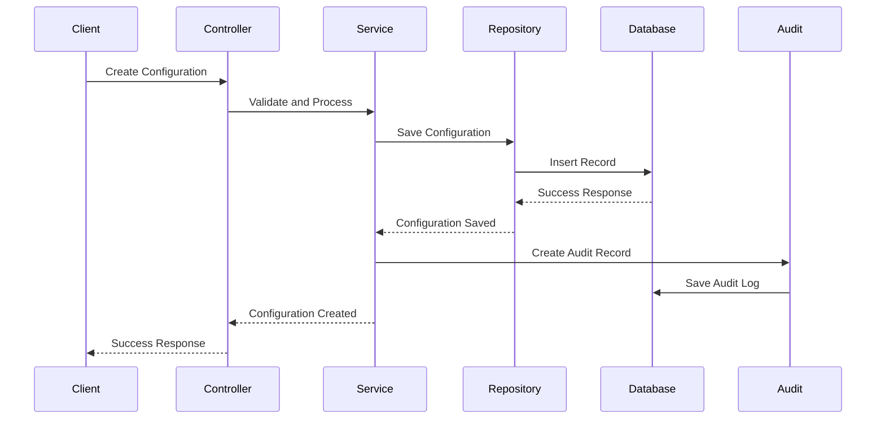
```

## Configuration Retrieval Flow

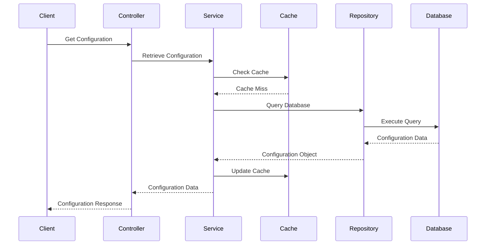
```

## Configuration Update Flow

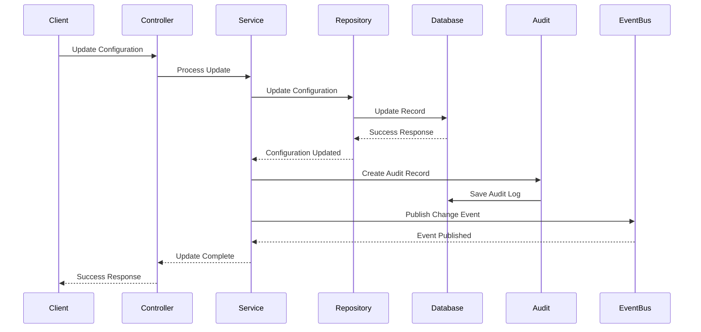
```

## Configuration Deletion Flow

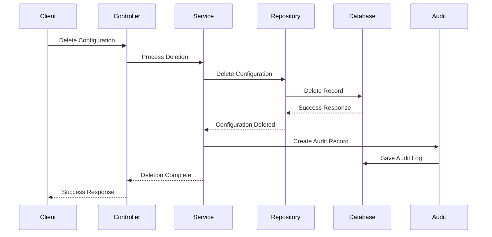
```

## Deployment & DevOps Analysis

### CI/CD Pipeline and Automation

- **Build Automation**: Maven-based build automation
- **Docker Containerization**: Containerized deployment
- **Environment Management**: Multi-environment deployment
- **Rollback Strategy**: Configuration rollback capabilities

### Containerization and Orchestration

- **Docker Images**: Optimized Docker image creation
- **Kubernetes Deployment**: Container orchestration
- **Service Discovery**: Service registration and discovery
- **Health Checks**: Application health monitoring

### Infrastructure and Environment Management

- **Environment Configuration**: Environment-specific configurations
- **Database Management**: Database migration and versioning
- **Cache Management**: Redis cache configuration
- **Monitoring Setup**: Application and infrastructure monitoring

### Monitoring and Observability Setup

- **Application Metrics**: Spring Boot Actuator metrics
- **Database Monitoring**: MySQL performance monitoring
- **Cache Monitoring**: Redis cache performance monitoring
- **Log Aggregation**: Centralized log collection and analysis

## Infrastructure Architecture

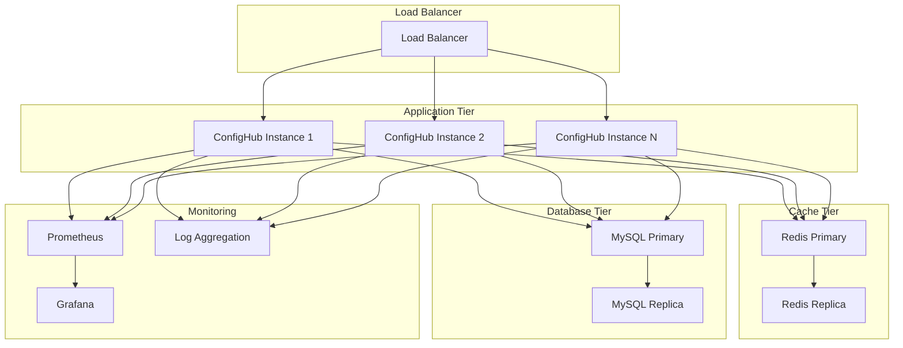

## Monitoring & Observability Stack

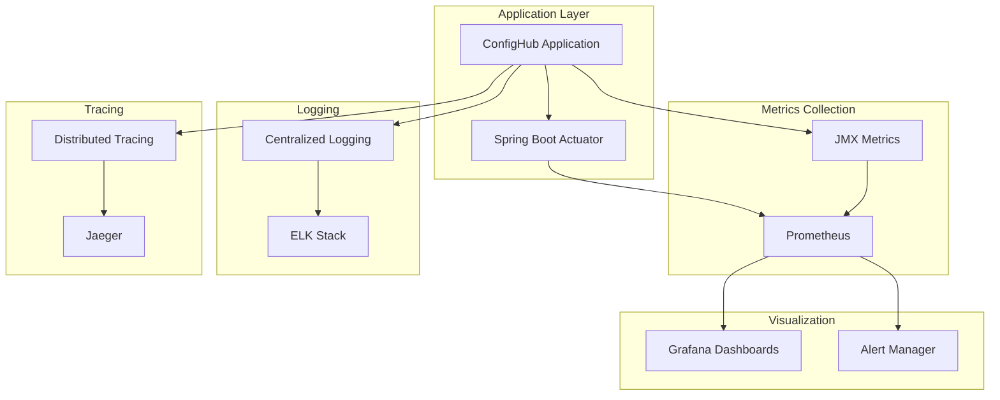

## Business Domain Analysis

### Domain Model and Business Entities

The ConfigHub service manages configuration entities with the following domain model:

- **Configuration**: Core configuration entity with properties and values
- **ConfigurationGroup**: Logical grouping of related configurations
- **AuditConfiguration**: Audit trail for configuration changes
- **PropertyValues**: Configuration property values and metadata

### Business Processes and Workflows

- **Configuration Management**: Create, read, update, delete configurations
- **Configuration Validation**: Validate configuration values and constraints
- **Configuration Deployment**: Deploy configurations to target environments
- **Configuration Auditing**: Track and audit configuration changes
- **Configuration Rollback**: Rollback configuration changes when needed

### Business Rules and Validation Logic

- **Configuration Validation**: Validate configuration schema and values
- **Access Control**: Role-based access control for configuration management
- **Audit Requirements**: Mandatory audit logging for all changes
- **Data Retention**: Configuration and audit data retention policies
- **Change Approval**: Configuration change approval workflows

### Integration Points and External Services

- **Client Services**: Configuration consumer services
- **Spring Cloud Bus**: Event-driven configuration change propagation
- **Monitoring Systems**: Integration with monitoring and alerting
- **Audit Systems**: Integration with enterprise audit systems
- **Security Systems**: Integration with authentication and authorization

## Domain Model Diagram

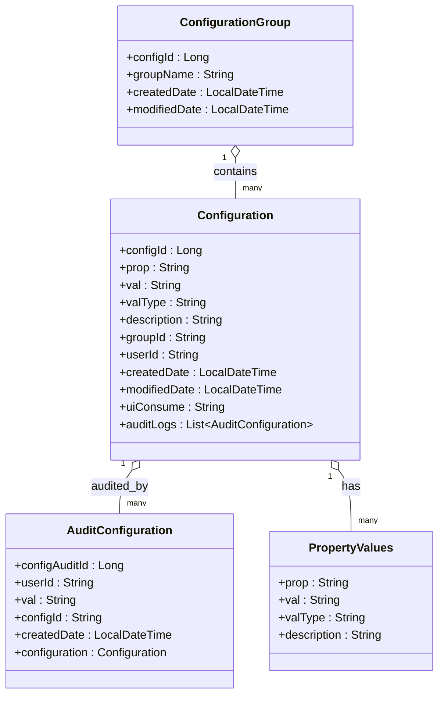
```

## Business Process Flow

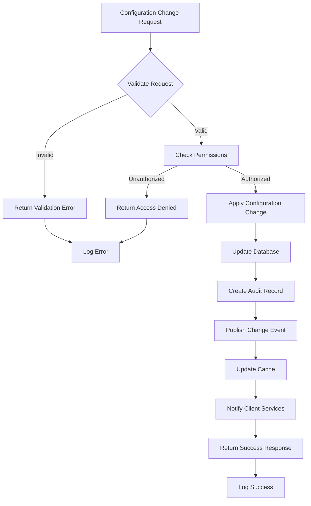

## Database Schema Diagram

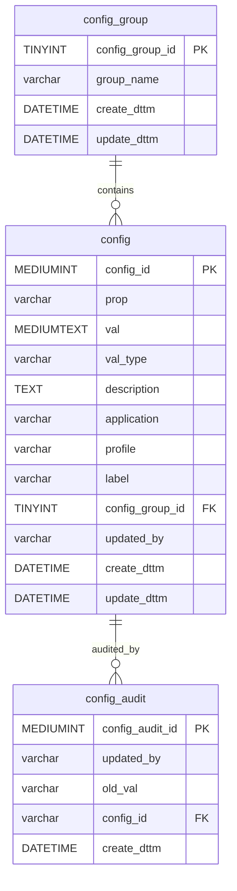

## Risk Assessment

### Technical Risks and Vulnerabilities

- **Single Point of Failure**: Centralized configuration creates system dependency
- **Database Performance**: Configuration queries may become bottleneck
- **Security Vulnerabilities**: Configuration data exposure risks
- **Data Consistency**: Audit trail and configuration data consistency
- **Scalability Limitations**: Database scaling challenges

### Business Continuity Risks

- **Service Dependency**: All services depend on configuration availability
- **Configuration Corruption**: Configuration data corruption risks
- **Audit Compliance**: Audit trail maintenance and compliance
- **Change Management**: Configuration change management risks
- **Data Loss**: Configuration and audit data loss risks

### Performance and Scalability Concerns

- **Database Scaling**: MySQL database scaling limitations
- **Cache Performance**: Redis cache performance under load
- **Event Processing**: Spring Cloud Bus event processing overhead
- **Memory Usage**: Configuration data memory consumption
- **Network Latency**: Configuration retrieval latency

### Security Threats and Mitigation Strategies

- **Unauthorized Access**: Implement strong authentication and authorization
- **Data Exposure**: Encrypt sensitive configuration data
- **Audit Tampering**: Implement immutable audit trails
- **SQL Injection**: Use parameterized queries and input validation
- **Configuration Poisoning**: Implement configuration validation and approval

## Detailed Recommendations

### Immediate Actions (High Priority)

1. **Configuration Validation**: Implement comprehensive configuration schema validation
2. **Security Hardening**: Enhance authentication and authorization mechanisms
3. **Performance Optimization**: Optimize database queries and caching strategy
4. **Monitoring Enhancement**: Improve monitoring and alerting capabilities
5. **Documentation**: Complete API documentation and operational procedures

### Short-Term Improvements (Medium Priority)

1. **Configuration Versioning**: Implement configuration versioning and rollback
2. **Change Approval Workflow**: Add configuration change approval processes
3. **Data Encryption**: Implement configuration data encryption
4. **Backup Strategy**: Enhance backup and disaster recovery procedures
5. **Testing Coverage**: Improve unit and integration test coverage

### Long-Term Strategic Enhancements (Low Priority)

1. **Microservices Migration**: Consider breaking down into smaller services
2. **Database Migration**: Evaluate alternative database technologies
3. **Event Sourcing**: Implement event sourcing for configuration changes
4. **API Gateway**: Implement API gateway for enhanced security
5. **Multi-Region Deployment**: Implement multi-region deployment strategy

## Action Plan

### Phase 1: Critical Fixes (1-2 weeks)

- Implement configuration validation framework
- Enhance security authentication mechanisms
- Optimize database query performance
- Improve error handling and logging
- Complete basic monitoring setup

### Phase 2: Quality Improvements (1-2 months)

- Implement configuration versioning system
- Add comprehensive audit trail enhancements
- Enhance caching strategy and performance
- Improve API documentation and testing
- Implement configuration change approval workflow

### Phase 3: Strategic Enhancements (3-6 months)

- Evaluate and implement alternative database solutions
- Consider microservices architecture evolution
- Implement advanced monitoring and alerting
- Enhance disaster recovery and backup procedures
- Plan for multi-region deployment strategy
