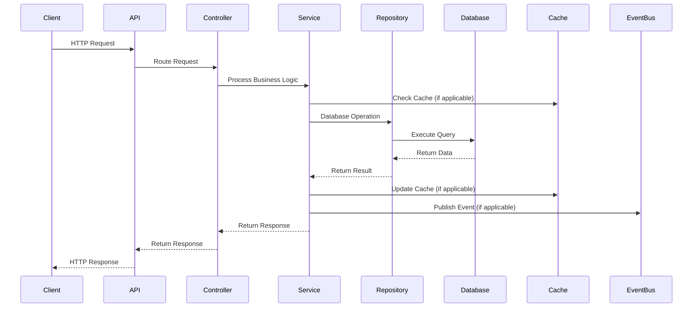
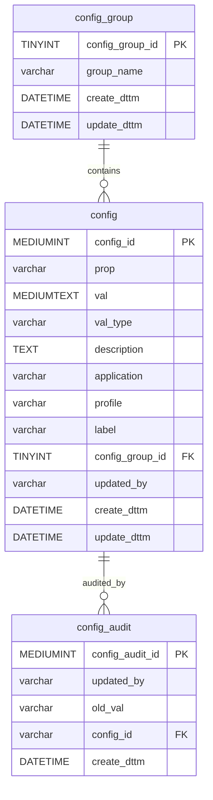

# ConfigHub Service API Contract

## API Overview

The ConfigHub service provides a centralized configuration management API that enables dynamic configuration updates across the Sephora microservices ecosystem. This service implements the Spring Cloud Config Server pattern, allowing services to retrieve and update configuration properties in real-time without requiring application restarts.

### Service Purpose and Scope
- **Configuration Management**: Create, read, update, and delete configuration properties
- **Configuration Validation**: Validate configuration values and constraints
- **Audit Trail**: Comprehensive audit logging for all configuration changes
- **Configuration Deployment**: Deploy configurations to target environments
- **Configuration Rollback**: Rollback configuration changes when needed

### API Versioning Strategy
- **Current Version**: v1
- **Versioning Approach**: URL path versioning (`/v1/configuration`)
- **Backward Compatibility**: Maintained through additive changes
- **Deprecation Policy**: 6-month deprecation notice for breaking changes

### Base URL and Endpoints
- **Base URL**: `/v1/configuration`
- **Authentication**: Required for all endpoints
- **Content-Type**: `application/json`
- **Response Format**: JSON

### Authentication Requirements
- **Authentication Type**: Bearer Token
- **Authorization**: Role-based access control
- **Required Headers**: `Authorization: Bearer <token>`
- **API Key**: Alternative authentication method available

## Request/Response Contracts

### Endpoint: `POST /v1/configuration`

**Description**: Create a new configuration property

**Authentication**: Required

**Request Headers**:
- `Authorization: Bearer <token>` (required)
- `Content-Type: application/json` (required)
- `X-Request-ID: <uuid>` (optional)

**Request Body**:
```json
{
  "prop": "string",
  "val": "string",
  "valType": "string",
  "description": "string",
  "groupId": "string",
  "application": "string",
  "profile": "string",
  "label": "string"
}
```

**Request Parameters**: None

**Response Codes**:
- `201 Created`: Configuration created successfully
- `400 Bad Request`: Validation error
- `401 Unauthorized`: Authentication required
- `403 Forbidden`: Insufficient permissions
- `409 Conflict`: Configuration already exists
- `500 Internal Server Error`: Server error

**Success Response (201)**:
```json
{
  "status": "success",
  "data": {
    "configId": 123,
    "prop": "database.url",
    "val": "jdbc:mysql://localhost:3306/configdb",
    "valType": "string",
    "description": "Database connection URL",
    "groupId": "database",
    "application": "GLOBAL",
    "profile": "DEFAULT",
    "label": "MASTER",
    "createdDate": "2024-01-15T10:30:00Z",
    "modifiedDate": "2024-01-15T10:30:00Z"
  }
}
```

**Error Response (400)**:
```json
{
  "status": "error",
  "message": "Validation failed",
  "errors": [
    {
      "field": "prop",
      "message": "Property name is required"
    },
    {
      "field": "val",
      "message": "Property value is required"
    }
  ]
}
```

### Endpoint: `GET /v1/configuration`

**Description**: Retrieve all configurations with optional filtering and pagination

**Authentication**: Required

**Request Headers**:
- `Authorization: Bearer <token>` (required)
- `X-Request-ID: <uuid>` (optional)

**Request Body**: None

**Request Parameters**:
- `pageNumber` (integer, optional): Page number for pagination (default: 0)
- `pageSize` (integer, optional): Number of items per page (default: 20)
- `sort` (string, optional): Sort field (default: "configId")
- `group` (string, optional): Filter by configuration group
- `application` (string, optional): Filter by application
- `profile` (string, optional): Filter by profile
- `label` (string, optional): Filter by label

**Response Codes**:
- `200 OK`: Configurations retrieved successfully
- `401 Unauthorized`: Authentication required
- `403 Forbidden`: Insufficient permissions
- `500 Internal Server Error`: Server error

**Success Response (200)**:
```json
{
  "status": "success",
  "data": {
    "content": [
      {
        "configId": 123,
        "prop": "database.url",
        "val": "jdbc:mysql://localhost:3306/configdb",
        "valType": "string",
        "description": "Database connection URL",
        "groupId": "database",
        "application": "GLOBAL",
        "profile": "DEFAULT",
        "label": "MASTER",
        "createdDate": "2024-01-15T10:30:00Z",
        "modifiedDate": "2024-01-15T10:30:00Z"
      }
    ],
    "totalElements": 1,
    "totalPages": 1,
    "size": 20,
    "number": 0,
    "first": true,
    "last": true
  }
}
```

### Endpoint: `GET /v1/configuration/{configId}`

**Description**: Retrieve a specific configuration by ID

**Authentication**: Required

**Request Headers**:
- `Authorization: Bearer <token>` (required)
- `X-Request-ID: <uuid>` (optional)

**Request Body**: None

**Request Parameters**:
- `configId` (long, required): Configuration ID

**Response Codes**:
- `200 OK`: Configuration retrieved successfully
- `401 Unauthorized`: Authentication required
- `403 Forbidden`: Insufficient permissions
- `404 Not Found`: Configuration not found
- `500 Internal Server Error`: Server error

**Success Response (200)**:
```json
{
  "status": "success",
  "data": {
    "configId": 123,
    "prop": "database.url",
    "val": "jdbc:mysql://localhost:3306/configdb",
    "valType": "string",
    "description": "Database connection URL",
    "groupId": "database",
    "application": "GLOBAL",
    "profile": "DEFAULT",
    "label": "MASTER",
    "createdDate": "2024-01-15T10:30:00Z",
    "modifiedDate": "2024-01-15T10:30:00Z"
  }
}
```

**Error Response (404)**:
```json
{
  "status": "error",
  "message": "Configuration not found",
  "configId": 123
}
```

### Endpoint: `PUT /v1/configuration/{configId}`

**Description**: Update an existing configuration

**Authentication**: Required

**Request Headers**:
- `Authorization: Bearer <token>` (required)
- `Content-Type: application/json` (required)
- `X-Request-ID: <uuid>` (optional)

**Request Body**:
```json
{
  "prop": "string",
  "val": "string",
  "valType": "string",
  "description": "string",
  "groupId": "string",
  "application": "string",
  "profile": "string",
  "label": "string"
}
```

**Request Parameters**:
- `configId` (long, required): Configuration ID

**Response Codes**:
- `200 OK`: Configuration updated successfully
- `400 Bad Request`: Validation error
- `401 Unauthorized`: Authentication required
- `403 Forbidden`: Insufficient permissions
- `404 Not Found`: Configuration not found
- `500 Internal Server Error`: Server error

**Success Response (200)**:
```json
{
  "status": "success",
  "data": {
    "configId": 123,
    "prop": "database.url",
    "val": "jdbc:mysql://localhost:3306/updateddb",
    "valType": "string",
    "description": "Updated database connection URL",
    "groupId": "database",
    "application": "GLOBAL",
    "profile": "DEFAULT",
    "label": "MASTER",
    "createdDate": "2024-01-15T10:30:00Z",
    "modifiedDate": "2024-01-15T11:45:00Z"
  }
}
```

### Endpoint: `DELETE /v1/configuration/{configId}`

**Description**: Delete a configuration

**Authentication**: Required

**Request Headers**:
- `Authorization: Bearer <token>` (required)
- `X-Request-ID: <uuid>` (optional)

**Request Body**: None

**Request Parameters**:
- `configId` (long, required): Configuration ID

**Response Codes**:
- `200 OK`: Configuration deleted successfully
- `401 Unauthorized`: Authentication required
- `403 Forbidden`: Insufficient permissions
- `404 Not Found`: Configuration not found
- `500 Internal Server Error`: Server error

**Success Response (200)**:
```json
{
  "status": "success",
  "message": "Configuration deleted successfully",
  "configId": 123
}
```

### Endpoint: `GET /v1/configuration/audit/{configId}`

**Description**: Retrieve audit trail for a specific configuration

**Authentication**: Required

**Request Headers**:
- `Authorization: Bearer <token>` (required)
- `X-Request-ID: <uuid>` (optional)

**Request Body**: None

**Request Parameters**:
- `configId` (long, required): Configuration ID
- `pageNumber` (integer, optional): Page number for pagination (default: 0)
- `pageSize` (integer, optional): Number of items per page (default: 20)

**Response Codes**:
- `200 OK`: Audit trail retrieved successfully
- `401 Unauthorized`: Authentication required
- `403 Forbidden`: Insufficient permissions
- `404 Not Found`: Configuration not found
- `500 Internal Server Error`: Server error

**Success Response (200)**:
```json
{
  "status": "success",
  "data": {
    "content": [
      {
        "configAuditId": 456,
        "userId": "admin@sephora.com",
        "val": "jdbc:mysql://localhost:3306/olddb",
        "configId": 123,
        "createdDate": "2024-01-15T10:30:00Z"
      }
    ],
    "totalElements": 1,
    "totalPages": 1,
    "size": 20,
    "number": 0
  }
}
```

### Endpoint: `GET /v1/configuration/groups`

**Description**: Retrieve all configuration groups

**Authentication**: Required

**Request Headers**:
- `Authorization: Bearer <token>` (required)
- `X-Request-ID: <uuid>` (optional)

**Request Body**: None

**Request Parameters**: None

**Response Codes**:
- `200 OK`: Configuration groups retrieved successfully
- `401 Unauthorized`: Authentication required
- `403 Forbidden`: Insufficient permissions
- `500 Internal Server Error`: Server error

**Success Response (200)**:
```json
{
  "status": "success",
  "data": [
    {
      "configId": 1,
      "groupName": "database",
      "createdDate": "2024-01-15T10:30:00Z",
      "modifiedDate": "2024-01-15T10:30:00Z"
    },
    {
      "configId": 2,
      "groupName": "security",
      "createdDate": "2024-01-15T10:30:00Z",
      "modifiedDate": "2024-01-15T10:30:00Z"
    }
  ]
}
```

## Data Models

### Request DTOs

#### ChannelPropertyDto
```json
{
  "prop": "string",
  "val": "string",
  "valType": "string",
  "description": "string",
  "groupId": "string",
  "application": "string",
  "profile": "string",
  "label": "string"
}
```

#### UpdatePropertyValuesDto
```json
{
  "prop": "string",
  "val": "string",
  "valType": "string",
  "description": "string",
  "groupId": "string"
}
```

### Response DTOs

#### PropertyValuesDtoResponse
```json
{
  "configId": "long",
  "prop": "string",
  "val": "string",
  "valType": "string",
  "description": "string",
  "groupId": "string",
  "application": "string",
  "profile": "string",
  "label": "string",
  "createdDate": "datetime",
  "modifiedDate": "datetime"
}
```

#### PageDTO
```json
{
  "content": "array",
  "totalElements": "long",
  "totalPages": "int",
  "size": "int",
  "number": "int",
  "first": "boolean",
  "last": "boolean"
}
```

### Entity Models

#### Configuration Entity
```json
{
  "configId": "Long (Primary Key)",
  "prop": "String (Property name)",
  "val": "String (Property value)",
  "valType": "String (Value type)",
  "description": "String (Description)",
  "groupId": "String (Group ID)",
  "userId": "String (Updated by)",
  "createdDate": "LocalDateTime (Creation timestamp)",
  "modifiedDate": "LocalDateTime (Modification timestamp)",
  "uiConsume": "String (UI consumption flag)",
  "auditLogs": "List<AuditConfiguration> (Audit trail)"
}
```

#### ConfigurationGroup Entity
```json
{
  "configId": "Long (Primary Key)",
  "groupName": "String (Group name)",
  "createdDate": "LocalDateTime (Creation timestamp)",
  "modifiedDate": "LocalDateTime (Modification timestamp)"
}
```

#### AuditConfiguration Entity
```json
{
  "configAuditId": "Long (Primary Key)",
  "userId": "String (User who made change)",
  "val": "String (Old value)",
  "configId": "String (Configuration ID)",
  "createdDate": "LocalDateTime (Audit timestamp)",
  "configuration": "Configuration (Related configuration)"
}
```

### Validation Rules

#### Configuration Property Validation
- **prop**: Required, max length 256 characters, alphanumeric with dots and underscores
- **val**: Required, max length 16MB (MEDIUMTEXT)
- **valType**: Optional, max length 50 characters
- **description**: Optional, max length 65KB (TEXT)
- **groupId**: Required, must reference existing configuration group
- **application**: Required, enum values: ["GLOBAL"]
- **profile**: Required, enum values: ["DEFAULT"]
- **label**: Required, enum values: ["MASTER"]
- **userId**: Required for updates, max length 256 characters

#### Configuration Group Validation
- **groupName**: Required, max length 256 characters, unique
- **configId**: Auto-generated, positive integer

#### Audit Configuration Validation
- **userId**: Required, max length 256 characters
- **val**: Optional, max length 16MB
- **configId**: Required, must reference existing configuration

## Integration Contracts

### External Service Dependencies

#### Spring Cloud Config Server
- **Purpose**: Configuration server capabilities
- **Integration Type**: Framework integration
- **Dependencies**: Spring Cloud Config Server starter
- **Configuration**: Config server properties in application.yml

#### MySQL Database
- **Purpose**: Primary data store for configuration persistence
- **Integration Type**: Database connection
- **Dependencies**: MySQL connector, Spring Data JPA
- **Configuration**: Database connection properties

#### Redis Cache
- **Purpose**: Performance optimization through caching
- **Integration Type**: Cache integration
- **Dependencies**: Spring Boot Redis starter
- **Configuration**: Redis connection properties

#### Spring Cloud Bus
- **Purpose**: Event-driven configuration change propagation
- **Integration Type**: Message bus integration
- **Dependencies**: Spring Cloud Bus starter
- **Configuration**: Bus properties and Kafka configuration

### Event Contracts

#### Configuration Change Event
```json
{
  "eventType": "CONFIGURATION_CHANGED",
  "configId": "long",
  "prop": "string",
  "oldValue": "string",
  "newValue": "string",
  "userId": "string",
  "timestamp": "datetime",
  "source": "string"
}
```

#### Configuration Deletion Event
```json
{
  "eventType": "CONFIGURATION_DELETED",
  "configId": "long",
  "prop": "string",
  "userId": "string",
  "timestamp": "datetime",
  "source": "string"
}
```

### Database Contracts

#### Database Schema Overview
The ConfigHub service uses a MySQL database with the following schema:

- **config**: Main configuration table storing all configuration properties
- **config_group**: Configuration groups for logical organization
- **config_audit**: Audit trail for all configuration changes
- **config_group_roles**: Role-based access control for configuration groups

#### Database Relationships
- **config_group** (1) → **config** (many): One group can have many configurations
- **config** (1) → **config_audit** (many): One configuration can have many audit records
- **config_group** (1) → **config_group_roles** (many): One group can have many role assignments

#### Database Constraints
- **Primary Keys**: All tables have auto-incrementing primary keys
- **Foreign Keys**: Proper foreign key constraints for referential integrity
- **Unique Constraints**: Configuration property names are unique within application/profile/label combination
- **Check Constraints**: Enum values for application, profile, and label fields

## API Endpoint Map

```mermaid
graph TB
    subgraph "ConfigHub API"
        API[API Gateway]
        
        subgraph "Configuration Management"
            CREATE[POST /v1/configuration]
            READ[GET /v1/configuration]
            READ_ID[GET /v1/configuration/{id}]
            UPDATE[PUT /v1/configuration/{id}]
            DELETE[DELETE /v1/configuration/{id}]
        end
        
        subgraph "Audit Management"
            AUDIT[GET /v1/configuration/audit/{id}]
        end
        
        subgraph "Group Management"
            GROUPS[GET /v1/configuration/groups]
        end
    end
    
    API --> CREATE
    API --> READ
    API --> READ_ID
    API --> UPDATE
    API --> DELETE
    API --> AUDIT
    API --> GROUPS
```

## Request/Response Flow



## Data Model Relationships


