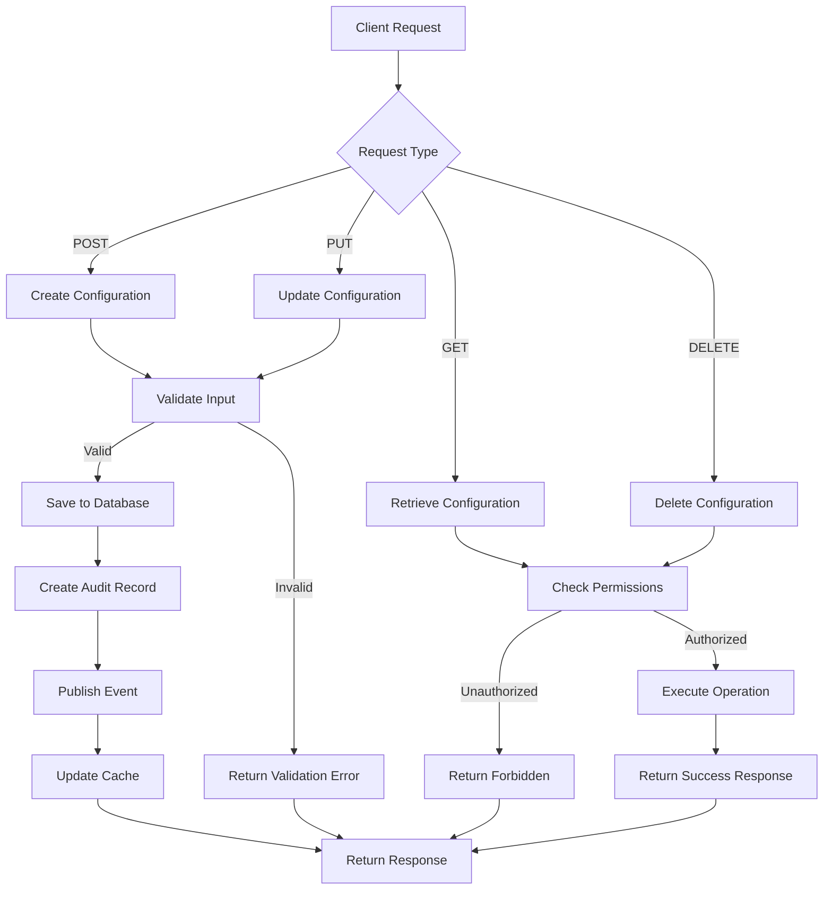
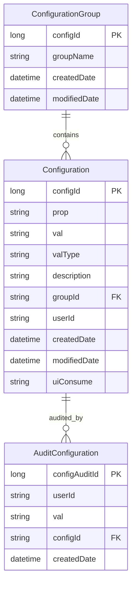

# ConfigHub Service API Contract

## API Overview

The ConfigHub service provides centralized configuration management capabilities for the Sephora microservices ecosystem. It enables dynamic configuration updates without requiring application restarts and maintains an audit trail of all configuration changes.

### Service Purpose and Scope
- **Configuration Management**: Create, read, update, and delete configuration properties
- **Dynamic Updates**: Real-time configuration updates via Spring Cloud Bus
- **Audit Trail**: Complete audit logging of configuration changes
- **Configuration Groups**: Logical grouping of related configurations
- **Validation**: Input validation and schema enforcement for configuration values

### API Versioning Strategy
- **Current Version**: v1
- **Base URL**: `/v1/configuration`
- **Backward Compatibility**: Maintained through additive changes only
- **Deprecation Policy**: 6-month notice for breaking changes

### Base URL and Endpoints
- **Base URL**: `https://confighub-service-svc/v1/configuration`
- **Health Check**: `/actuator/health`
- **API Documentation**: `/swagger-ui.html`

### Authentication Requirements
- **Service-to-Service**: Mutual TLS or API key authentication
- **Admin Operations**: Role-based access control (RBAC)
- **Audit Operations**: Read-only access for audit trail queries

## Request/Response Contracts

### Endpoint: `POST /v1/configuration`

**Description**: Create a new configuration property

**Authentication**: Required - Admin role

**Request Headers**:
- `Content-Type: application/json`
- `Authorization: Bearer {token}`
- `X-Request-ID: {uuid}`

**Request Body**:
```json
{
  "prop": "string",
  "val": "string",
  "valType": "string",
  "description": "string",
  "groupId": "string",
  "uiConsume": "string"
}
```

**Request Parameters**: None

**Response Codes**:
- `201 Created`: Configuration created successfully
- `400 Bad Request`: Validation error
- `401 Unauthorized`: Authentication required
- `403 Forbidden`: Insufficient permissions
- `409 Conflict`: Configuration already exists
- `500 Internal Server Error`: Server error

**Success Response** (201):
```json
{
  "status": "success",
  "data": {
    "configId": 123,
    "prop": "database.url",
    "val": "jdbc:mysql://localhost:3306/config",
    "valType": "string",
    "description": "Database connection URL",
    "groupId": "database",
    "uiConsume": "true",
    "createdDate": "2024-01-15T10:30:00Z",
    "modifiedDate": "2024-01-15T10:30:00Z"
  }
}
```

**Error Response** (400):
```json
{
  "status": "error",
  "message": "Validation failed",
  "errors": [
    {
      "field": "prop",
      "message": "Property name is required"
    },
    {
      "field": "val",
      "message": "Value cannot be empty"
    }
  ]
}
```

### Endpoint: `GET /v1/configuration`

**Description**: Retrieve all configurations with pagination and filtering

**Authentication**: Required - Read access

**Request Headers**:
- `Authorization: Bearer {token}`
- `X-Request-ID: {uuid}`

**Request Body**: None

**Request Parameters**:
- `pageNumber` (integer, optional): Page number for pagination (default: 0)
- `pageSize` (integer, optional): Number of items per page (default: 20)
- `sort` (string, optional): Sort field and direction (e.g., "prop,asc")
- `group` (string, optional): Filter by configuration group
- `application` (string, optional): Filter by application name
- `profile` (string, optional): Filter by profile name

**Response Codes**:
- `200 OK`: Configurations retrieved successfully
- `401 Unauthorized`: Authentication required
- `403 Forbidden`: Insufficient permissions
- `500 Internal Server Error`: Server error

**Success Response** (200):
```json
{
  "status": "success",
  "data": {
    "content": [
      {
        "configId": 123,
        "prop": "database.url",
        "val": "jdbc:mysql://localhost:3306/config",
        "valType": "string",
        "description": "Database connection URL",
        "groupId": "database",
        "uiConsume": "true",
        "createdDate": "2024-01-15T10:30:00Z",
        "modifiedDate": "2024-01-15T10:30:00Z"
      }
    ],
    "totalElements": 100,
    "totalPages": 5,
    "currentPage": 0,
    "pageSize": 20
  }
}
```

### Endpoint: `GET /v1/configuration/{configId}`

**Description**: Retrieve a specific configuration by ID

**Authentication**: Required - Read access

**Request Headers**:
- `Authorization: Bearer {token}`
- `X-Request-ID: {uuid}`

**Request Body**: None

**Request Parameters**:
- `configId` (long, required): Configuration ID

**Response Codes**:
- `200 OK`: Configuration retrieved successfully
- `401 Unauthorized`: Authentication required
- `403 Forbidden`: Insufficient permissions
- `404 Not Found`: Configuration not found
- `500 Internal Server Error`: Server error

**Success Response** (200):
```json
{
  "status": "success",
  "data": {
    "configId": 123,
    "prop": "database.url",
    "val": "jdbc:mysql://localhost:3306/config",
    "valType": "string",
    "description": "Database connection URL",
    "groupId": "database",
    "uiConsume": "true",
    "createdDate": "2024-01-15T10:30:00Z",
    "modifiedDate": "2024-01-15T10:30:00Z"
  }
}
```

**Error Response** (404):
```json
{
  "status": "error",
  "message": "Configuration not found",
  "configId": 123
}
```

### Endpoint: `PUT /v1/configuration/{configId}`

**Description**: Update an existing configuration

**Authentication**: Required - Admin role

**Request Headers**:
- `Content-Type: application/json`
- `Authorization: Bearer {token}`
- `X-Request-ID: {uuid}`

**Request Body**:
```json
{
  "prop": "string",
  "val": "string",
  "valType": "string",
  "description": "string",
  "groupId": "string",
  "uiConsume": "string"
}
```

**Request Parameters**:
- `configId` (long, required): Configuration ID to update

**Response Codes**:
- `200 OK`: Configuration updated successfully
- `400 Bad Request`: Validation error
- `401 Unauthorized`: Authentication required
- `403 Forbidden`: Insufficient permissions
- `404 Not Found`: Configuration not found
- `500 Internal Server Error`: Server error

**Success Response** (200):
```json
{
  "status": "success",
  "data": {
    "configId": 123,
    "prop": "database.url",
    "val": "jdbc:mysql://localhost:3306/config_updated",
    "valType": "string",
    "description": "Updated database connection URL",
    "groupId": "database",
    "uiConsume": "true",
    "createdDate": "2024-01-15T10:30:00Z",
    "modifiedDate": "2024-01-15T11:45:00Z"
  }
}
```

### Endpoint: `DELETE /v1/configuration/{configId}`

**Description**: Delete a configuration

**Authentication**: Required - Admin role

**Request Headers**:
- `Authorization: Bearer {token}`
- `X-Request-ID: {uuid}`

**Request Body**: None

**Request Parameters**:
- `configId` (long, required): Configuration ID to delete

**Response Codes**:
- `200 OK`: Configuration deleted successfully
- `401 Unauthorized`: Authentication required
- `403 Forbidden`: Insufficient permissions
- `404 Not Found`: Configuration not found
- `500 Internal Server Error`: Server error

**Success Response** (200):
```json
{
  "status": "success",
  "message": "Configuration deleted successfully",
  "configId": 123
}
```

### Endpoint: `GET /v1/configuration/audit/{configId}`

**Description**: Retrieve audit trail for a specific configuration

**Authentication**: Required - Read access

**Request Headers**:
- `Authorization: Bearer {token}`
- `X-Request-ID: {uuid}`

**Request Body**: None

**Request Parameters**:
- `configId` (long, required): Configuration ID
- `pageNumber` (integer, optional): Page number for pagination (default: 0)
- `pageSize` (integer, optional): Number of items per page (default: 20)

**Response Codes**:
- `200 OK`: Audit trail retrieved successfully
- `401 Unauthorized`: Authentication required
- `403 Forbidden`: Insufficient permissions
- `404 Not Found`: Configuration not found
- `500 Internal Server Error`: Server error

**Success Response** (200):
```json
{
  "status": "success",
  "data": {
    "content": [
      {
        "configAuditId": 456,
        "userId": "admin@sephora.com",
        "val": "jdbc:mysql://localhost:3306/config_old",
        "configId": 123,
        "createdDate": "2024-01-15T10:30:00Z"
      }
    ],
    "totalElements": 5,
    "totalPages": 1,
    "currentPage": 0,
    "pageSize": 20
  }
}
```

### Endpoint: `GET /v1/configuration/groups`

**Description**: Retrieve all configuration groups

**Authentication**: Required - Read access

**Request Headers**:
- `Authorization: Bearer {token}`
- `X-Request-ID: {uuid}`

**Request Body**: None

**Request Parameters**: None

**Response Codes**:
- `200 OK`: Configuration groups retrieved successfully
- `401 Unauthorized`: Authentication required
- `403 Forbidden`: Insufficient permissions
- `500 Internal Server Error`: Server error

**Success Response** (200):
```json
{
  "status": "success",
  "data": [
    {
      "configId": 1,
      "groupName": "database",
      "createdDate": "2024-01-15T10:30:00Z",
      "modifiedDate": "2024-01-15T10:30:00Z"
    },
    {
      "configId": 2,
      "groupName": "security",
      "createdDate": "2024-01-15T10:30:00Z",
      "modifiedDate": "2024-01-15T10:30:00Z"
    }
  ]
}
```

## Data Models

### Request DTOs

#### ChannelPropertyDto
```json
{
  "prop": "string",
  "val": "string",
  "valType": "string",
  "description": "string",
  "groupId": "string",
  "uiConsume": "string"
}
```

#### UpdatePropertyValuesDto
```json
{
  "configId": "long",
  "prop": "string",
  "val": "string",
  "valType": "string",
  "description": "string",
  "groupId": "string",
  "uiConsume": "string"
}
```

### Response DTOs

#### PropertyValuesDtoResponse
```json
{
  "configId": "long",
  "prop": "string",
  "val": "string",
  "valType": "string",
  "description": "string",
  "groupId": "string",
  "uiConsume": "string",
  "createdDate": "datetime",
  "modifiedDate": "datetime"
}
```

#### PageDTO
```json
{
  "content": "array",
  "totalElements": "long",
  "totalPages": "int",
  "currentPage": "int",
  "pageSize": "int"
}
```

#### ErrorListDto
```json
{
  "status": "string",
  "message": "string",
  "errors": [
    {
      "field": "string",
      "message": "string"
    }
  ]
}
```

### Entity Models

#### Configuration Entity
```json
{
  "configId": "long (Primary Key)",
  "prop": "string (Property name)",
  "val": "string (Property value)",
  "valType": "string (Value type)",
  "description": "string (Description)",
  "groupId": "string (Group ID - Foreign Key)",
  "userId": "string (User who updated)",
  "createdDate": "datetime (Creation timestamp)",
  "modifiedDate": "datetime (Last modification timestamp)",
  "uiConsume": "string (UI consumption flag)"
}
```

#### ConfigurationGroup Entity
```json
{
  "configId": "long (Primary Key)",
  "groupName": "string (Group name)",
  "createdDate": "datetime (Creation timestamp)",
  "modifiedDate": "datetime (Last modification timestamp)"
}
```

#### AuditConfiguration Entity
```json
{
  "configAuditId": "long (Primary Key)",
  "userId": "string (User who made the change)",
  "val": "string (Previous value)",
  "configId": "string (Configuration ID - Foreign Key)",
  "createdDate": "datetime (Audit timestamp)"
}
```

### Validation Rules

#### Configuration Property Validation
- **prop**: Required, max length 256 characters, alphanumeric and underscore only
- **val**: Required, max length 16MB (MEDIUMTEXT)
- **valType**: Optional, max length 50 characters
- **description**: Optional, max length 65535 characters (TEXT)
- **groupId**: Required, must reference existing configuration group
- **uiConsume**: Optional, boolean string ("true"/"false")

#### Configuration Group Validation
- **groupName**: Required, max length 256 characters, unique
- **createdDate**: Auto-generated timestamp
- **modifiedDate**: Auto-updated timestamp

#### Audit Configuration Validation
- **userId**: Required, max length 256 characters
- **val**: Required, max length 16MB (MEDIUMTEXT)
- **configId**: Required, must reference existing configuration
- **createdDate**: Auto-generated timestamp

## Integration Contracts

### External Service Dependencies

#### Spring Cloud Config Server
- **Purpose**: Provides configuration server capabilities
- **Integration**: Native Spring Cloud integration
- **Health Check**: `/actuator/health`
- **Configuration**: Spring Cloud Config properties

#### Kafka Event Bus
- **Purpose**: Configuration change event propagation
- **Topic**: `Sephora.ConfigHub.Client.ConfigUpdate_Dev`
- **Message Format**: JSON configuration change events
- **Consumer Groups**: Service-specific consumer groups

#### MySQL Database
- **Purpose**: Persistent configuration storage
- **Connection**: JDBC with HikariCP connection pooling
- **Schema**: Configuration tables with audit trail
- **Backup**: Regular automated backups

### Event Contracts

#### Configuration Change Event
```json
{
  "eventType": "CONFIGURATION_CHANGED",
  "timestamp": "2024-01-15T10:30:00Z",
  "configId": 123,
  "prop": "database.url",
  "oldValue": "jdbc:mysql://localhost:3306/config_old",
  "newValue": "jdbc:mysql://localhost:3306/config_new",
  "userId": "admin@sephora.com",
  "groupId": "database"
}
```

#### Configuration Deletion Event
```json
{
  "eventType": "CONFIGURATION_DELETED",
  "timestamp": "2024-01-15T10:30:00Z",
  "configId": 123,
  "prop": "database.url",
  "userId": "admin@sephora.com",
  "groupId": "database"
}
```

### Database Contracts

#### Database Schema Relationships
- **config_group** (1) → (N) **config**: One group can have many configurations
- **config** (1) → (N) **config_audit**: One configuration can have many audit records

#### Database Constraints
- **Primary Keys**: All tables have auto-incrementing primary keys
- **Foreign Keys**: config.groupId references config_group.config_group_id
- **Unique Constraints**: config_group.group_name must be unique
- **Indexes**: Indexes on frequently queried fields (prop, groupId, createdDate)

#### Database Performance
- **Connection Pooling**: HikariCP with configurable pool size
- **Query Optimization**: Prepared statements and parameterized queries
- **Caching**: Application-level caching for frequently accessed configurations
- **Partitioning**: Consider partitioning for large audit tables

## API Endpoint Map

```mermaid
graph TB
    subgraph "Configuration Management"
        POST_CREATE[POST /v1/configuration]
        GET_ALL[GET /v1/configuration]
        GET_BY_ID[GET /v1/configuration/{id}]
        PUT_UPDATE[PUT /v1/configuration/{id}]
        DELETE_CONFIG[DELETE /v1/configuration/{id}]
    end
    
    subgraph "Audit Management"
        GET_AUDIT[GET /v1/configuration/audit/{id}]
    end
    
    subgraph "Group Management"
        GET_GROUPS[GET /v1/configuration/groups]
    end
    
    subgraph "Health & Monitoring"
        HEALTH[GET /actuator/health]
        METRICS[GET /actuator/metrics]
        INFO[GET /actuator/info]
    end
    
    subgraph "Documentation"
        SWAGGER[GET /swagger-ui.html]
        API_DOCS[GET /v3/api-docs]
    end
```

## Request/Response Flow



## Data Model Relationships


