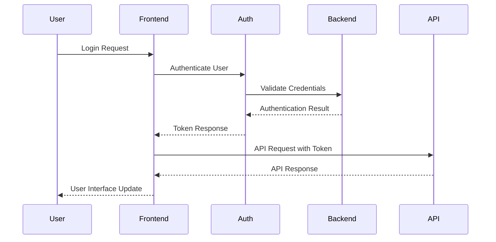
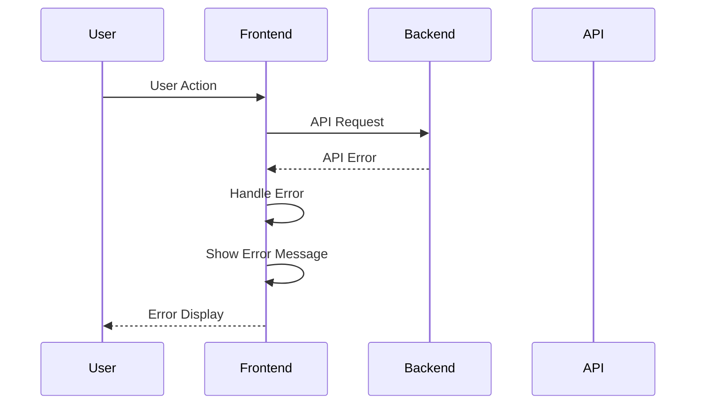
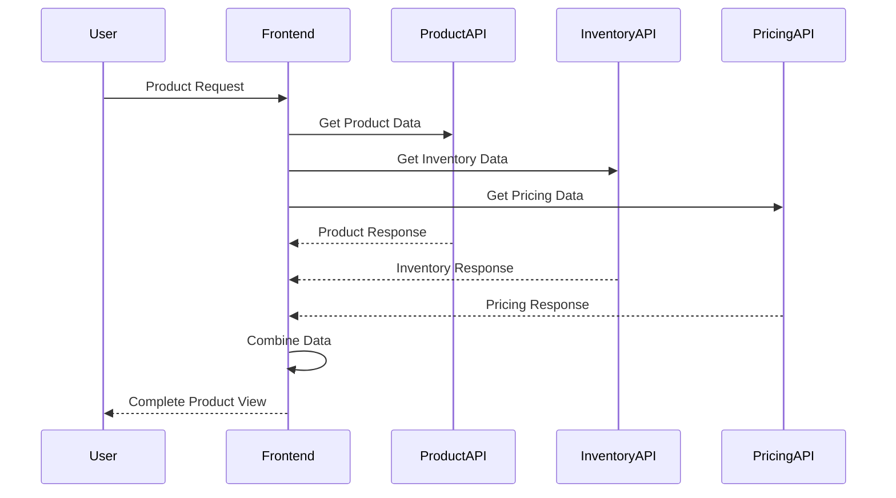
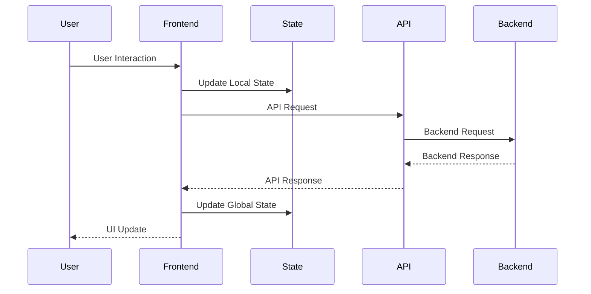
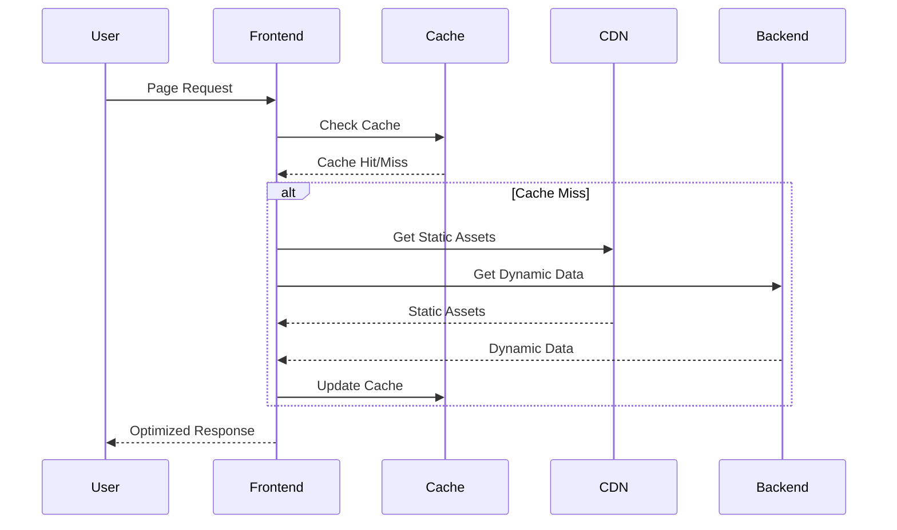
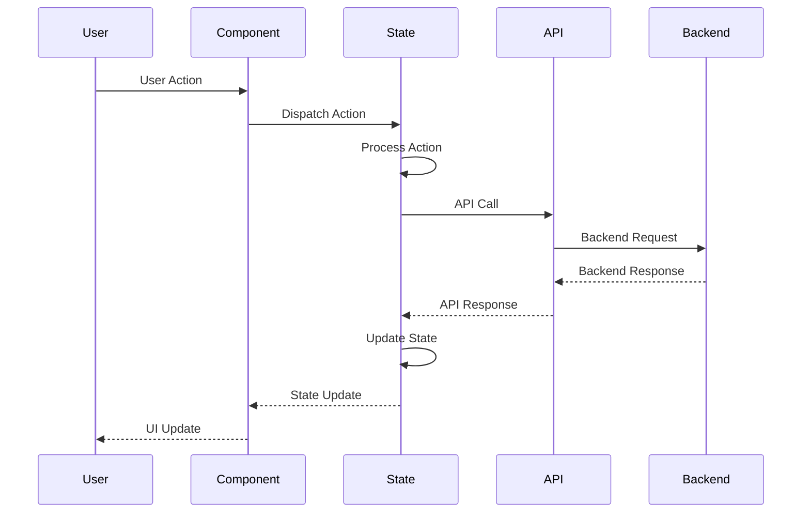
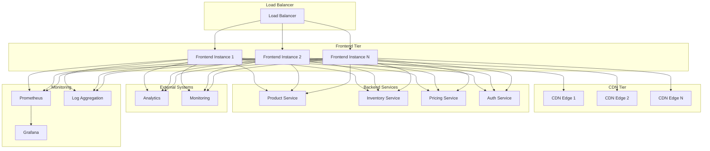
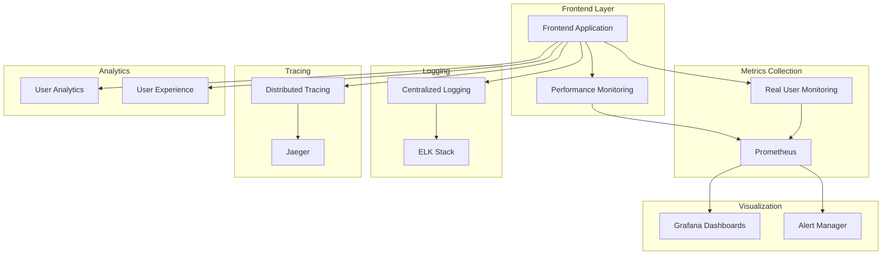
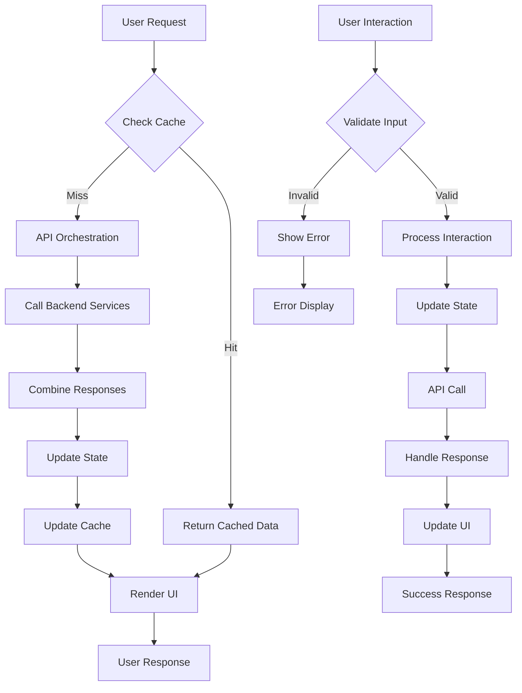
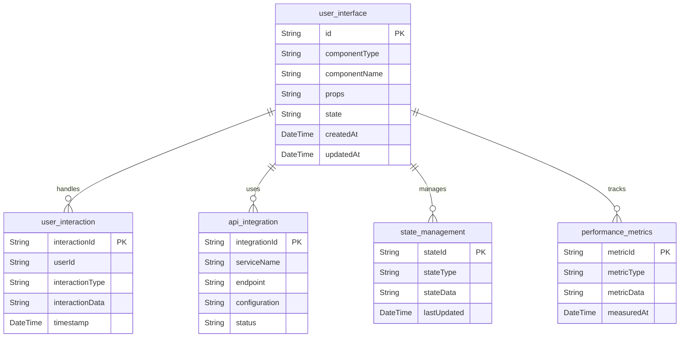

# Frontend UFE Service Architecture Analysis

## Executive Summary

The Frontend UFE (User-Facing Experience) Service is a critical component of the Sephora e-commerce platform that provides the user interface and frontend functionality. It handles user interactions, API orchestration, and provides a seamless user experience across all touchpoints.

### Key Technical Findings
- **Node.js Application**: Modern frontend application built with Node.js
- **API Orchestration**: Orchestrates calls to multiple backend services
- **User Interface**: Provides responsive and accessible user interfaces
- **Performance Optimization**: Implements caching and optimization strategies
- **Multi-Platform Support**: Supports web, mobile, and other platforms

### Critical Concerns and Risks
- **Performance**: Frontend performance and user experience
- **Security**: Client-side security and data protection
- **Scalability**: Handling high user traffic and load
- **Integration Complexity**: Multiple backend service integrations

### High-Level Recommendations
- Implement comprehensive frontend performance optimization
- Add robust security measures for client-side protection
- Enhance monitoring and observability for user experience
- Implement circuit breakers for backend service dependencies

## Architecture Analysis

### System Architecture and Component Relationships

The Frontend UFE Service follows a modern frontend architecture with clear separation of concerns:

- **Presentation Layer**: User interface components and pages
- **Application Layer**: Business logic and state management
- **API Layer**: Backend service integration and orchestration
- **Routing Layer**: Client-side routing and navigation
- **State Management**: Application state and data management
- **Caching Layer**: Client-side caching and optimization

### Design Patterns and Architectural Decisions

- **Component Pattern**: Reusable UI components
- **API Gateway Pattern**: Centralized API orchestration
- **State Management Pattern**: Centralized state management
- **Caching Pattern**: Client-side caching for performance
- **Circuit Breaker Pattern**: Backend service dependency protection

### Integration Patterns and External Dependencies

- **Backend Services**: Integration with all microservices
- **CDN**: Content delivery network for static assets
- **Analytics**: User behavior and performance analytics
- **Authentication**: User authentication and authorization
- **Monitoring**: Performance and error monitoring

### Data Flow and Messaging Architecture

Frontend data flows through the system with the following pattern:
1. User interactions trigger frontend events
2. Application layer processes business logic
3. API layer orchestrates backend service calls
4. State management updates application state
5. UI components re-render with updated data
6. Performance monitoring tracks user experience

## Security Analysis

### Authentication and Authorization Mechanisms

- **Client-Side Security**: Secure token management and storage
- **API Security**: Secure communication with backend services
- **Data Protection**: Client-side data protection measures
- **Session Management**: Secure session handling

### Security Vulnerabilities and Risks

- **Client-Side Vulnerabilities**: XSS, CSRF, and other frontend attacks
- **API Security**: Secure backend service communication
- **Data Exposure**: Sensitive data exposure in client-side code
- **Authentication**: Secure user authentication flow

### Data Protection and Encryption

- **Transport Security**: HTTPS for all communications
- **Data Encryption**: Encrypt sensitive data in transit
- **Token Security**: Secure token storage and management
- **Input Validation**: Client-side input validation

### Compliance and Regulatory Considerations

- **Data Privacy**: GDPR and privacy regulation compliance
- **Accessibility**: WCAG accessibility compliance
- **Performance**: Core Web Vitals compliance
- **Security**: Security best practices compliance

## Performance Analysis

### Frontend Performance and Optimization Opportunities

- **Bundle Optimization**: JavaScript and CSS bundle optimization
- **Image Optimization**: Image compression and lazy loading
- **Caching Strategy**: Effective client-side caching
- **Code Splitting**: Dynamic code splitting for performance

### Application Performance Bottlenecks

- **API Calls**: Backend service API performance
- **Bundle Size**: Large JavaScript bundle sizes
- **Rendering Performance**: Slow component rendering
- **Network Latency**: High network latency impact

### Caching Strategies and Effectiveness

- **Static Asset Caching**: CDN and browser caching
- **API Response Caching**: Client-side API response caching
- **State Caching**: Application state caching
- **Cache Invalidation**: Smart cache invalidation strategies

### Infrastructure Performance Considerations

- **CDN Performance**: Content delivery network optimization
- **Server Performance**: Node.js server performance
- **Load Balancing**: Frontend load balancing
- **Resource Allocation**: CPU and memory optimization

## Code Quality Assessment

### Code Complexity and Maintainability

- **Component Structure**: Clear component hierarchy
- **State Management**: Effective state management patterns
- **API Integration**: Clean backend service integration
- **Error Handling**: Comprehensive error handling

### Technical Debt Identification

- **Performance Optimization**: Bundle size optimization needed
- **Error Handling**: Inconsistent error handling patterns
- **Documentation**: Component documentation gaps
- **Testing Coverage**: Frontend test coverage improvements

### Design Pattern Usage and Effectiveness

- **Component Pattern**: Good component reusability
- **State Management**: Effective state management
- **API Gateway**: Good API orchestration
- **Caching Pattern**: Effective performance optimization

### Error Handling and Resilience Patterns

- **Circuit Breaker**: Backend service dependency protection
- **Retry Logic**: API retry mechanisms
- **Fallback Strategies**: Graceful degradation for backend services
- **Error Logging**: Comprehensive error logging

## Testing Analysis

### Test Coverage and Quality Assessment

- **Unit Tests**: Component unit test coverage
- **Integration Tests**: API integration testing
- **E2E Tests**: End-to-end user journey testing
- **Performance Tests**: Frontend performance testing

### Testing Strategy and Implementation

- **Component Testing**: React component testing approaches
- **API Mocking**: Backend service API mocking
- **Visual Testing**: Visual regression testing
- **Accessibility Testing**: Accessibility compliance testing

### Integration and End-to-End Testing

- **Backend Integration**: End-to-end backend integration testing
- **API Integration**: Backend service API testing
- **User Journey Testing**: Complete user journey testing
- **Cross-Browser Testing**: Cross-browser compatibility testing

### Test Automation and CI/CD Integration

- **Automated Testing**: CI/CD pipeline integration
- **Test Environment**: Isolated test environment setup
- **Test Data Management**: Frontend test data management
- **Performance Testing**: Automated performance regression testing

## Authentication Flow


```
```

## Error Handling Flow


```

## API Orchestration Flow


```

## User Interaction Flow


```

## Performance Optimization Flow


```

## State Management Flow


```

## Deployment & DevOps Analysis

### CI/CD Pipeline and Automation

- **Build Automation**: Automated build and packaging process
- **Deployment Automation**: Automated deployment to different environments
- **Configuration Management**: Environment-specific configuration management
- **Rollback Capabilities**: Automated rollback for failed deployments

### Containerization and Orchestration

- **Docker Containerization**: Containerized application deployment
- **Kubernetes Orchestration**: Container orchestration and scaling
- **Service Discovery**: Integration with service discovery mechanisms
- **Health Checks**: Proper health check implementation

### Infrastructure and Environment Management

- **Environment Separation**: Clear separation of dev, test, and production environments
- **Configuration Management**: Externalized configuration for different environments
- **Resource Management**: Proper resource allocation and monitoring
- **Security Hardening**: Security configurations for production deployment

### Monitoring and Observability Setup

- **Frontend Monitoring**: Comprehensive frontend metrics and monitoring
- **Performance Monitoring**: Performance metrics and monitoring
- **Error Monitoring**: Error tracking and monitoring
- **User Experience Monitoring**: User experience metrics

## Infrastructure Architecture



## Monitoring & Observability Stack



## Business Domain Analysis

### Domain Model and Business Entities

The Frontend UFE Service manages user interface entities with the following domain model:

- **UserInterface**: Core user interface components and pages
- **UserInteraction**: User interactions and events
- **APIIntegration**: Backend service integration
- **StateManagement**: Application state and data
- **PerformanceMetrics**: Performance and user experience metrics

### Business Processes and Workflows

- **User Experience**: Provide seamless user experience
- **API Orchestration**: Orchestrate backend service calls
- **State Management**: Manage application state
- **Performance Optimization**: Optimize frontend performance
- **Error Handling**: Handle errors gracefully

### Business Rules and Validation Logic

- **UI Validation**: User interface validation rules
- **API Validation**: API integration validation rules
- **State Rules**: State management business rules
- **Performance Rules**: Performance optimization rules
- **Security Rules**: Security and privacy rules

### Integration Points and External Services

- **Backend Services**: All microservices integration
- **CDN Services**: Content delivery network integration
- **Analytics Services**: User analytics integration
- **Monitoring Services**: Performance monitoring integration
- **Authentication Services**: User authentication integration

## Domain Model Diagram

```mermaid
classDiagram
    class UserInterface {
        +String id
        +String componentType
        +String componentName
        +Object props
        +Object state
        +DateTime createdAt
        +DateTime updatedAt
    }
    
    class UserInteraction {
        +String interactionId
        +String userId
        +String interactionType
        +Object interactionData
        +DateTime timestamp
    }
    
    class APIIntegration {
        +String integrationId
        +String serviceName
        +String endpoint
        +Object configuration
        +String status
    }
    
    class StateManagement {
        +String stateId
        +String stateType
        +Object stateData
        +DateTime lastUpdated
    }
    
    class PerformanceMetrics {
        +String metricId
        +String metricType
        +Object metricData
        +DateTime measuredAt
    }
    
    UserInterface ||--o{ UserInteraction : "handles"
    UserInterface ||--o{ APIIntegration : "uses"
    UserInterface ||--o{ StateManagement : "manages"
    UserInterface ||--o{ PerformanceMetrics : "tracks"
```

## Business Process Flow



## Component Architecture Diagram


```

## Risk Assessment

### Technical Risks and Vulnerabilities

- **Performance Issues**: Frontend performance degradation
- **Security Vulnerabilities**: Client-side security risks
- **Backend Dependencies**: Backend service dependency risks
- **Scalability**: High user traffic handling challenges
- **Browser Compatibility**: Cross-browser compatibility issues

### Business Continuity Risks

- **User Experience**: Poor user experience impact
- **Performance Degradation**: Slow frontend performance
- **Service Outages**: Backend service dependency outages
- **Data Loss**: Client-side data loss risks

### Performance and Scalability Concerns

- **Bundle Size**: Large JavaScript bundle sizes
- **API Performance**: Backend service API performance
- **Network Latency**: High network latency impact
- **Resource Usage**: High resource consumption

### Security Threats and Mitigation Strategies

- **XSS Attacks**: Implement proper input sanitization
- **CSRF Attacks**: Implement CSRF protection
- **Data Exposure**: Secure sensitive data handling
- **Authentication**: Secure authentication flow

## Detailed Recommendations

### Immediate Actions (High Priority)

1. **Performance Optimization**: Optimize bundle sizes and loading
2. **Security Hardening**: Implement comprehensive security measures
3. **Error Handling**: Improve error handling and user feedback
4. **Monitoring**: Implement comprehensive frontend monitoring
5. **Testing**: Increase test coverage and automation

### Short-Term Improvements (Medium Priority)

1. **Caching Strategy**: Optimize client-side caching
2. **API Optimization**: Optimize backend service integration
3. **State Management**: Improve state management patterns
4. **Accessibility**: Enhance accessibility compliance
5. **Documentation**: Complete component documentation

### Long-Term Strategic Enhancements (Low Priority)

1. **Architecture Evolution**: Consider modern frontend architecture
2. **Performance Monitoring**: Implement advanced performance monitoring
3. **User Experience**: Enhance user experience analytics
4. **Internationalization**: Implement multi-language support
5. **Progressive Enhancement**: Implement progressive web app features

## Action Plan

### Phase 1: Critical Fixes (1-2 weeks)

- Optimize bundle sizes and loading performance
- Implement comprehensive security measures
- Improve error handling and user feedback
- Set up basic frontend monitoring
- Increase test coverage

### Phase 2: Quality Improvements (1-2 months)

- Implement comprehensive caching strategy
- Optimize backend service integration
- Enhance accessibility compliance
- Improve component documentation
- Implement performance monitoring

### Phase 3: Strategic Enhancements (3-6 months)

- Evaluate modern frontend architecture
- Implement advanced performance monitoring
- Enhance user experience analytics
- Plan for progressive web app features
- Implement internationalization support
