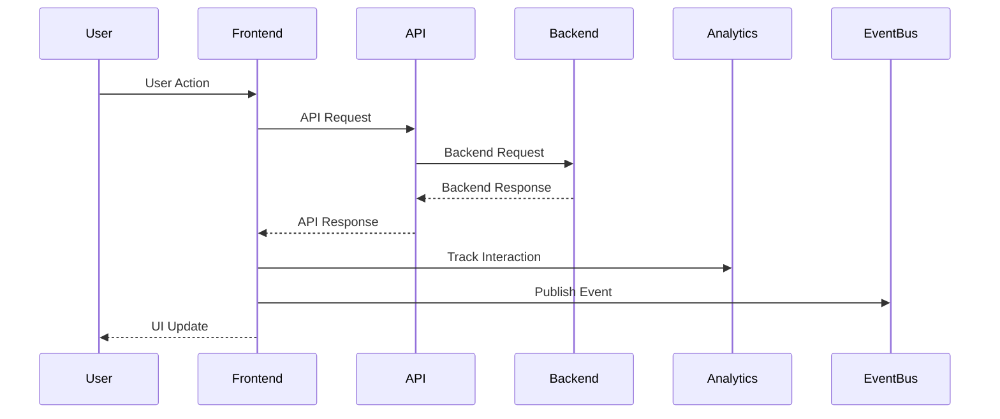
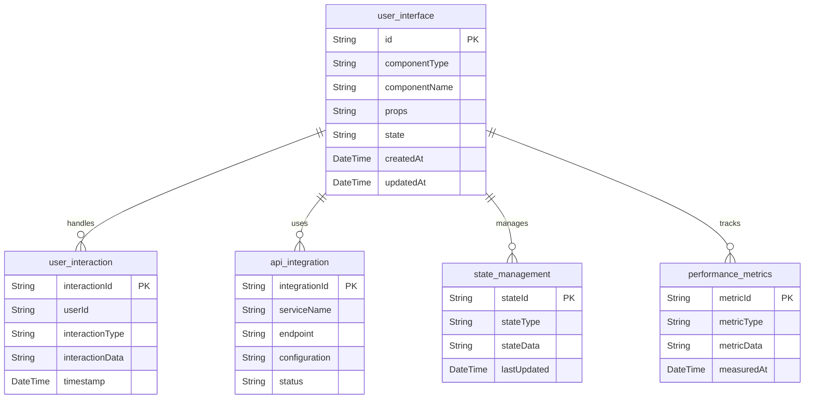

# Frontend UFE Service API Contract

## API Overview

The Frontend UFE (User-Facing Experience) Service provides the user interface and frontend functionality for the Sephora e-commerce platform. It handles user interactions, API orchestration, and provides a seamless user experience across all touchpoints.

### API Versioning
- **Current Version**: v1
- **Base URL**: `/api/v1`
- **Content Type**: `application/json`

### Authentication Requirements
- **Authentication**: Bearer token required for all endpoints
- **Authorization**: Role-based access control
- **Rate Limiting**: 1000 requests per minute per client

## Request/Response Contracts

### 1. Get User Interface Configuration

**Endpoint**: `GET /v1/ui/config`

**Description**: Retrieves user interface configuration and settings.

**Query Parameters**:
- `platform` (optional): Filter by platform (web, mobile, etc.)
- `locale` (optional): Filter by locale/language

**Response (200 OK)**:
```json
{
  "configId": "string",
  "platform": "string",
  "locale": "string",
  "theme": "string",
  "features": {},
  "settings": {},
  "lastUpdated": "2024-01-01T00:00:00Z"
}
```

**Error Responses**:
- `401 Unauthorized`: Missing or invalid authentication
- `403 Forbidden`: Insufficient permissions

### 2. Update User Interface Configuration

**Endpoint**: `PUT /v1/ui/config`

**Description**: Updates user interface configuration.

**Request Body**:
```json
{
  "platform": "string",
  "locale": "string",
  "theme": "string",
  "features": {},
  "settings": {}
}
```

**Response (200 OK)**:
```json
{
  "configId": "string",
  "platform": "string",
  "locale": "string",
  "theme": "string",
  "features": {},
  "settings": {},
  "updatedAt": "2024-01-01T00:00:00Z"
}
```

**Error Responses**:
- `400 Bad Request`: Invalid request data
- `401 Unauthorized`: Missing or invalid authentication
- `403 Forbidden`: Insufficient permissions

### 3. Track User Interaction

**Endpoint**: `POST /v1/interactions`

**Description**: Tracks user interactions and events.

**Request Body**:
```json
{
  "userId": "string",
  "interactionType": "string",
  "interactionData": {},
  "sessionId": "string",
  "timestamp": "2024-01-01T00:00:00Z"
}
```

**Response (201 Created)**:
```json
{
  "interactionId": "string",
  "userId": "string",
  "interactionType": "string",
  "interactionData": {},
  "sessionId": "string",
  "timestamp": "2024-01-01T00:00:00Z",
  "trackedAt": "2024-01-01T00:00:00Z"
}
```

**Error Responses**:
- `400 Bad Request`: Invalid request data
- `401 Unauthorized`: Missing or invalid authentication
- `403 Forbidden`: Insufficient permissions

### 4. Get User Interactions

**Endpoint**: `GET /v1/interactions`

**Description**: Retrieves user interactions with optional filtering.

**Query Parameters**:
- `userId` (optional): Filter by user ID
- `interactionType` (optional): Filter by interaction type
- `startDate` (optional): Start date for filtering
- `endDate` (optional): End date for filtering
- `page` (optional): Page number (default: 0)
- `size` (optional): Page size (default: 20)

**Response (200 OK)**:
```json
{
  "content": [
    {
      "interactionId": "string",
      "userId": "string",
      "interactionType": "string",
      "interactionData": {},
      "sessionId": "string",
      "timestamp": "2024-01-01T00:00:00Z"
    }
  ],
  "pageable": {
    "pageNumber": 0,
    "pageSize": 20,
    "totalElements": 100,
    "totalPages": 5
  }
}
```

**Error Responses**:
- `401 Unauthorized`: Missing or invalid authentication
- `403 Forbidden`: Insufficient permissions

### 5. Orchestrate API Calls

**Endpoint**: `POST /v1/orchestrate`

**Description**: Orchestrates multiple backend service API calls.

**Request Body**:
```json
{
  "orchestrationId": "string",
  "services": [
    {
      "serviceName": "string",
      "endpoint": "string",
      "method": "string",
      "headers": {},
      "body": {}
    }
  ],
  "dependencies": [],
  "timeout": 30000
}
```

**Response (200 OK)**:
```json
{
  "orchestrationId": "string",
  "status": "COMPLETED",
  "results": [
    {
      "serviceName": "string",
      "status": "SUCCESS",
      "response": {},
      "duration": 100
    }
  ],
  "totalDuration": 500,
  "completedAt": "2024-01-01T00:00:00Z"
}
```

**Error Responses**:
- `400 Bad Request`: Invalid request data
- `401 Unauthorized`: Missing or invalid authentication
- `403 Forbidden`: Insufficient permissions
- `408 Request Timeout`: Orchestration timeout

### 6. Get Application State

**Endpoint**: `GET /v1/state/{stateType}`

**Description**: Retrieves application state for a specific state type.

**Path Parameters**:
- `stateType`: Type of state to retrieve

**Query Parameters**:
- `userId` (optional): Filter by user ID
- `sessionId` (optional): Filter by session ID

**Response (200 OK)**:
```json
{
  "stateId": "string",
  "stateType": "string",
  "stateData": {},
  "userId": "string",
  "sessionId": "string",
  "lastUpdated": "2024-01-01T00:00:00Z"
}
```

**Error Responses**:
- `401 Unauthorized`: Missing or invalid authentication
- `403 Forbidden`: Insufficient permissions
- `404 Not Found`: State not found

### 7. Update Application State

**Endpoint**: `PUT /v1/state/{stateType}`

**Description**: Updates application state for a specific state type.

**Path Parameters**:
- `stateType`: Type of state to update

**Request Body**:
```json
{
  "stateData": {},
  "userId": "string",
  "sessionId": "string"
}
```

**Response (200 OK)**:
```json
{
  "stateId": "string",
  "stateType": "string",
  "stateData": {},
  "userId": "string",
  "sessionId": "string",
  "updatedAt": "2024-01-01T00:00:00Z"
}
```

**Error Responses**:
- `400 Bad Request`: Invalid request data
- `401 Unauthorized`: Missing or invalid authentication
- `403 Forbidden`: Insufficient permissions

### 8. Get Performance Metrics

**Endpoint**: `GET /v1/performance`

**Description**: Retrieves frontend performance metrics.

**Query Parameters**:
- `metricType` (optional): Filter by metric type
- `startDate` (optional): Start date for metrics
- `endDate` (optional): End date for metrics
- `page` (optional): Page number (default: 0)
- `size` (optional): Page size (default: 20)

**Response (200 OK)**:
```json
{
  "content": [
    {
      "metricId": "string",
      "metricType": "string",
      "metricData": {},
      "userId": "string",
      "sessionId": "string",
      "measuredAt": "2024-01-01T00:00:00Z"
    }
  ],
  "pageable": {
    "pageNumber": 0,
    "pageSize": 20,
    "totalElements": 50,
    "totalPages": 3
  }
}
```

**Error Responses**:
- `401 Unauthorized`: Missing or invalid authentication
- `403 Forbidden`: Insufficient permissions

## Data Models

### UserInterface Entity
```json
{
  "id": "string",
  "componentType": "string",
  "componentName": "string",
  "props": "object",
  "state": "object",
  "createdAt": "string",
  "updatedAt": "string"
}
```

### UserInteraction Entity
```json
{
  "interactionId": "string",
  "userId": "string",
  "interactionType": "string",
  "interactionData": "object",
  "timestamp": "string"
}
```

### APIIntegration Entity
```json
{
  "integrationId": "string",
  "serviceName": "string",
  "endpoint": "string",
  "configuration": "object",
  "status": "string"
}
```

### StateManagement Entity
```json
{
  "stateId": "string",
  "stateType": "string",
  "stateData": "object",
  "lastUpdated": "string"
}
```

### PerformanceMetrics Entity
```json
{
  "metricId": "string",
  "metricType": "string",
  "metricData": "object",
  "measuredAt": "string"
}
```

## Validation Rules

### User Interface Validation
- `componentType`: Required, non-empty string, max 50 characters
- `componentName`: Required, non-empty string, max 100 characters
- `props`: Required object
- `state`: Required object
- `createdAt`: Required, valid ISO 8601 datetime

### User Interaction Validation
- `userId`: Required, non-empty string, max 50 characters
- `interactionType`: Required, non-empty string, max 50 characters
- `interactionData`: Required object
- `sessionId`: Required, non-empty string, max 50 characters
- `timestamp`: Required, valid ISO 8601 datetime

### API Integration Validation
- `serviceName`: Required, non-empty string, max 50 characters
- `endpoint`: Required, non-empty string, max 200 characters
- `configuration`: Required object
- `status`: Required, enum values: ["ACTIVE", "INACTIVE", "ERROR"]

### State Management Validation
- `stateType`: Required, non-empty string, max 50 characters
- `stateData`: Required object
- `userId`: Required, non-empty string, max 50 characters
- `sessionId`: Required, non-empty string, max 50 characters

### Performance Metrics Validation
- `metricType`: Required, non-empty string, max 50 characters
- `metricData`: Required object
- `userId`: Required, non-empty string, max 50 characters
- `sessionId`: Required, non-empty string, max 50 characters
- `measuredAt`: Required, valid ISO 8601 datetime

## Integration Contracts

### External System Integration

#### Backend Services
- **Protocol**: REST API
- **Authentication**: Bearer token
- **Rate Limiting**: 500 requests per minute
- **Timeout**: 15 seconds
- **Retry Policy**: 2 attempts with linear backoff

#### Analytics Services
- **Protocol**: REST API
- **Authentication**: Bearer token
- **Rate Limiting**: 1000 requests per minute
- **Timeout**: 10 seconds
- **Retry Policy**: 3 attempts with exponential backoff

### Event Publishing

#### User Interaction Events
```json
{
  "eventType": "USER_INTERACTION_TRACKED",
  "eventId": "string",
  "timestamp": "2024-01-01T00:00:00Z",
  "data": {
    "userId": "string",
    "interactionType": "string",
    "interactionData": {},
    "sessionId": "string"
  }
}
```

#### Performance Events
```json
{
  "eventType": "PERFORMANCE_METRIC_RECORDED",
  "eventId": "string",
  "timestamp": "2024-01-01T00:00:00Z",
  "data": {
    "metricType": "string",
    "metricData": {},
    "userId": "string",
    "sessionId": "string"
  }
}
```

#### State Change Events
```json
{
  "eventType": "APPLICATION_STATE_UPDATED",
  "eventId": "string",
  "timestamp": "2024-01-01T00:00:00Z",
  "data": {
    "stateType": "string",
    "stateData": {},
    "userId": "string",
    "sessionId": "string"
  }
}
```

## API Endpoint Map

```mermaid
graph TB
    subgraph "UI Management"
        GET_UI_CONFIG[GET /v1/ui/config]
        UPDATE_UI_CONFIG[PUT /v1/ui/config]
    end
    
    subgraph "User Interactions"
        TRACK_INTERACTION[POST /v1/interactions]
        GET_INTERACTIONS[GET /v1/interactions]
    end
    
    subgraph "API Orchestration"
        ORCHESTRATE[POST /v1/orchestrate]
    end
    
    subgraph "State Management"
        GET_STATE[GET /v1/state/{stateType}]
        UPDATE_STATE[PUT /v1/state/{stateType}]
    end
    
    subgraph "Performance"
        GET_PERFORMANCE[GET /v1/performance]
    end
    
    subgraph "External Systems"
        BACKEND_SERVICES[Backend Services]
        ANALYTICS[Analytics Services]
        KAFKA[Kafka Events]
    end
    
    TRACK_INTERACTION --> KAFKA
    GET_PERFORMANCE --> KAFKA
    UPDATE_STATE --> KAFKA
    ORCHESTRATE --> BACKEND_SERVICES
    TRACK_INTERACTION --> ANALYTICS
    GET_PERFORMANCE --> ANALYTICS
```

## Request/Response Flow



## Data Model Relationships



## Error Handling

### Standard Error Response Format
```json
{
  "timestamp": "2024-01-01T00:00:00Z",
  "status": 400,
  "error": "Bad Request",
  "message": "Validation failed",
  "path": "/api/v1/interactions",
  "details": [
    {
      "field": "userId",
      "message": "User ID is required"
    }
  ]
}
```

### Common Error Codes
- `400 Bad Request`: Invalid request data or validation errors
- `401 Unauthorized`: Missing or invalid authentication
- `403 Forbidden`: Insufficient permissions
- `404 Not Found`: Resource not found
- `408 Request Timeout`: Request timeout
- `422 Unprocessable Entity`: Business rule validation failed
- `500 Internal Server Error`: Unexpected server error
- `503 Service Unavailable`: Service temporarily unavailable

### Retry Logic
- **Transient Errors**: Retry with exponential backoff
- **Permanent Errors**: No retry, return error immediately
- **Rate Limiting**: Respect retry-after header
- **Circuit Breaker**: Prevent cascading failures

## Performance Considerations

### Caching Strategy
- **UI Configuration**: Cache for 1 hour
- **Application State**: Cache for 5 minutes
- **API Responses**: Cache for 2 minutes
- **Static Assets**: Cache for 24 hours

### Rate Limiting
- **Standard Clients**: 1000 requests per minute
- **High-Volume Clients**: 5000 requests per minute
- **Burst Allowance**: 200 requests per 10 seconds

### Response Time Targets
- **UI Configuration**: < 50ms
- **User Interactions**: < 100ms
- **API Orchestration**: < 500ms
- **State Management**: < 100ms

## Security Considerations

### Authentication
- **Bearer Token**: Required for all endpoints
- **Token Validation**: Validate with authentication service
- **Token Expiry**: Handle expired tokens gracefully

### Authorization
- **Role-Based Access**: Different permissions for different roles
- **Resource-Level Access**: Control access to specific UI data
- **Audit Logging**: Log all access attempts

### Data Protection
- **Input Validation**: Validate all input data
- **Output Sanitization**: Sanitize output data
- **Encryption**: Encrypt sensitive data in transit and at rest
- **XSS Protection**: Implement XSS protection measures
