# Inventory Availability Service Architecture Analysis

## Executive Summary

The Inventory Availability Service is a critical component of the Sephora e-commerce platform that provides real-time inventory management and availability information across all product touchpoints. It handles inventory updates, availability calculations, and provides inventory data to other services in the ecosystem.

### Key Technical Findings
- **Spring Boot Application**: Modern microservice architecture with Spring Boot framework
- **CosmosDB Integration**: NoSQL database for inventory data storage
- **Redis Caching**: Performance optimization through distributed caching
- **Kafka Integration**: Event-driven inventory updates
- **Real-time Processing**: High-performance inventory calculations

### Critical Concerns and Risks
- **Data Consistency**: Ensuring inventory accuracy across multiple services
- **Performance**: High-volume inventory operations and real-time updates
- **Scalability**: Handling large product catalogs and inventory data
- **Data Synchronization**: Complex synchronization between inventory sources

### High-level Recommendations
- Implement advanced caching strategies for inventory data
- Add inventory data validation and quality checks
- Consider implementing inventory forecasting capabilities
- Enhance monitoring and alerting for inventory operations

## Architecture Analysis

### System Architecture and Component Relationships

The Inventory Availability Service follows a layered architecture with clear separation of concerns:

- **Presentation Layer**: REST controllers handling HTTP requests
- **Business Logic Layer**: Service implementations for inventory operations
- **Data Access Layer**: Repository interfaces and CosmosDB integration
- **Integration Layer**: External service clients and event publishers
- **Infrastructure Layer**: Caching, monitoring, and external integrations

### Design Patterns and Architectural Decisions

- **Repository Pattern**: Abstracts data access logic from business services
- **Service Layer Pattern**: Encapsulates business logic and external integrations
- **Event-Driven Pattern**: Publishes inventory events for other services
- **Caching Pattern**: Multi-level caching for performance optimization
- **Circuit Breaker Pattern**: Resilience against external service failures

### Integration Patterns and External Dependencies

- **CosmosDB**: Primary data store for inventory information
- **Redis Cache**: Distributed caching for performance optimization
- **Kafka**: Message broker for inventory change events
- **Spring Cloud**: Service discovery and configuration management
- **External Inventory Systems**: Integration with warehouse management systems

### Data Flow and Messaging Architecture

Inventory data flows through the following path:
1. Inventory updates received via REST APIs or Kafka events
2. Controllers validate and route requests to appropriate services
3. Services execute business logic and interact with repositories
4. Repositories perform database operations via CosmosDB
5. Inventory changes trigger Kafka events for service notification
6. Cache is updated for performance optimization

## Security Analysis

### Authentication and Authorization Mechanisms

- **Spring Security**: Framework for authentication and authorization
- **Service-to-Service Authentication**: Mutual TLS or API key authentication
- **Role-Based Access Control**: Different access levels for inventory management
- **Audit Logging**: Comprehensive logging of inventory changes

### Security Vulnerabilities and Risks

- **Data Exposure**: Sensitive inventory information in responses
- **External Service Security**: Dependency on external inventory systems
- **Cache Security**: Potential data leakage through cache
- **Input Validation**: Malicious inventory updates

### Data Protection and Encryption

- **Transport Security**: HTTPS/TLS for all API communications
- **Data Encryption**: Encryption of sensitive inventory data at rest
- **Cache Encryption**: Encrypted storage for cached inventory data
- **Key Management**: Secure storage and rotation of encryption keys

### Compliance and Regulatory Considerations

- **Data Privacy**: Compliance with data protection regulations
- **Audit Logging**: Comprehensive logging of inventory data access
- **Data Retention**: Proper retention policies for inventory data
- **Access Controls**: Role-based access to inventory information

## Performance Analysis

### Database Performance and Optimization Opportunities

- **Query Optimization**: Optimize CosmosDB queries for inventory lookups
- **Connection Pooling**: Optimize database connection management
- **Caching Strategy**: Implement multi-level caching for frequently accessed inventory
- **Database Partitioning**: Consider partitioning for large inventory datasets

### Application Performance Bottlenecks

- **Inventory Calculations**: Optimize real-time inventory calculations
- **Event Processing**: Efficient handling of inventory change events
- **Memory Usage**: Monitor memory consumption with large inventory sets
- **Response Times**: Ensure sub-second response times for inventory requests

### Caching Strategies and Effectiveness

- **Application-Level Caching**: Cache frequently accessed inventory data
- **Distributed Caching**: Redis for shared inventory cache
- **Query Result Caching**: Cache inventory query results
- **Cache Invalidation**: Proper cache invalidation on inventory updates

### Infrastructure Performance Considerations

- **Database Scaling**: Vertical and horizontal scaling strategies
- **Load Balancing**: Distribute inventory requests across instances
- **Resource Allocation**: Optimize CPU and memory allocation
- **Network Performance**: Minimize network latency for inventory requests

## Code Quality Assessment

### Code Complexity and Maintainability

- **Cyclomatic Complexity**: Monitor complexity in business logic methods
- **Code Duplication**: Identify and eliminate duplicate inventory handling code
- **Modularity**: Ensure proper separation of concerns across layers
- **Documentation**: Comprehensive API and code documentation

### Technical Debt Identification

- **Legacy Integration**: Identify and refactor outdated inventory integrations
- **Hardcoded Values**: Replace hardcoded configuration with externalized values
- **Error Handling**: Improve error handling and recovery mechanisms
- **Testing Coverage**: Increase unit and integration test coverage

### Design Pattern Usage and Effectiveness

- **Repository Pattern**: Effective abstraction of data access
- **Service Layer**: Proper business logic encapsulation
- **Event-Driven Pattern**: Good event publishing and consumption
- **Caching Pattern**: Effective caching implementation

### Error Handling and Resilience Patterns

- **Circuit Breaker**: Implement for external service dependencies
- **Retry Mechanisms**: Automatic retry for transient failures
- **Fallback Strategies**: Graceful degradation when services are unavailable
- **Error Logging**: Comprehensive error logging and monitoring

## Testing Analysis

### Test Coverage and Quality Assessment

- **Unit Test Coverage**: Target 80%+ coverage for business logic
- **Integration Test Coverage**: Test database and external service integrations
- **API Test Coverage**: Comprehensive testing of REST endpoints
- **Performance Test Coverage**: Load and stress testing scenarios

### Testing Strategy and Implementation

- **Test-Driven Development**: Write tests before implementing features
- **Mock Testing**: Use mocks for external service dependencies
- **Database Testing**: Use test containers for database integration tests
- **Contract Testing**: Ensure API contracts are properly tested

### Integration and End-to-End Testing

- **External Service Integration**: Test external inventory system integrations
- **Cache Integration**: Test caching behavior and invalidation
- **Event Integration**: Test Kafka event publishing and consumption
- **End-to-End Scenarios**: Test complete inventory workflows

### Test Automation and CI/CD Integration

- **Automated Testing**: Integrate tests into CI/CD pipeline
- **Test Environment**: Dedicated test environment for inventory testing
- **Test Data Management**: Proper test data setup and cleanup
- **Performance Testing**: Automated performance regression testing

## Deployment & DevOps Analysis

### CI/CD Pipeline and Automation

- **Build Automation**: Automated build and packaging process
- **Deployment Automation**: Automated deployment to different environments
- **Configuration Management**: Environment-specific configuration management
- **Rollback Capabilities**: Automated rollback for failed deployments

### Containerization and Orchestration

- **Docker Containerization**: Containerized application deployment
- **Kubernetes Orchestration**: Container orchestration and scaling
- **Service Discovery**: Integration with service discovery mechanisms
- **Health Checks**: Proper health check implementation

### Infrastructure and Environment Management

- **Environment Separation**: Clear separation of dev, test, and production environments
- **Configuration Management**: Externalized configuration for different environments
- **Resource Management**: Proper resource allocation and monitoring
- **Security Hardening**: Security configurations for production deployment

### Monitoring and Observability Setup

- **Application Monitoring**: Comprehensive application metrics and monitoring
- **Database Monitoring**: Database performance and health monitoring
- **Cache Monitoring**: Cache performance and hit rates
- **Event Monitoring**: Monitor Kafka event publishing and consumption

## Business Domain Analysis

### Domain Model and Business Entities

The Inventory Availability Service manages the following core business entities:

- **Inventory**: Central inventory entity with quantities and locations
- **ShipNode**: Inventory locations and fulfillment centers
- **InventoryTransaction**: Inventory movement and transaction history
- **AvailabilityRule**: Business rules for inventory availability
- **InventoryReservation**: Inventory reservations and holds

### Business Processes and Workflows

- **Inventory Updates**: Process for updating inventory quantities
- **Availability Calculations**: Workflow for calculating product availability
- **Inventory Reservations**: Process for reserving inventory
- **Inventory Synchronization**: Synchronization with external inventory systems

### Business Rules and Validation Logic

- **Inventory Validation**: Validate inventory quantities and locations
- **Availability Rules**: Enforce business rules for product availability
- **Reservation Rules**: Handle inventory reservations and holds
- **Threshold Management**: Manage inventory thresholds and alerts

### Integration Points and External Services

- **Warehouse Management Systems**: Integration with WMS for inventory updates
- **Product Services**: Integration for product-inventory relationships
- **Order Management**: Integration for order fulfillment
- **Analytics Services**: Integration for inventory analytics

## Risk Assessment

### Technical Risks and Vulnerabilities

- **Data Inconsistency**: Risk of inventory data inconsistency across services
- **Performance Degradation**: Slow inventory operations impact user experience
- **Cache Inconsistency**: Stale cache data affecting inventory accuracy
- **External Service Failures**: Dependency on external inventory systems

### Business Continuity Risks

- **Service Outage**: Inventory service failure impacts product availability
- **Data Corruption**: Invalid inventory data can cause downstream issues
- **Synchronization Issues**: Complex sync between inventory sources
- **Recovery Time**: Time required to restore inventory service functionality

### Performance and Scalability Concerns

- **Inventory Data Volume**: Large inventory datasets impact performance
- **Concurrent Access**: High concurrent access may cause performance issues
- **Cache Memory**: Large inventory cache consumes significant memory
- **External Service Limits**: Rate limits on external inventory systems

### Security Threats and Mitigation Strategies

- **Data Breaches**: Unauthorized access to inventory information
- **External Service Security**: Dependency on external inventory system security
- **Cache Security**: Potential data leakage through cache
- **Input Validation**: Malicious inventory updates

## Detailed Recommendations

### Immediate Actions (High Priority)

1. **Implement Comprehensive Caching**: Optimize inventory data caching strategy
2. **Add Data Validation**: Implement comprehensive data validation for inventory updates
3. **Improve Error Handling**: Enhance error handling and recovery mechanisms
4. **Increase Test Coverage**: Achieve 80%+ test coverage for critical components

### Short-term Improvements (Medium Priority)

1. **Optimize Database Queries**: Implement query optimization for CosmosDB
2. **Add Inventory Forecasting**: Implement inventory forecasting capabilities
3. **Enhance Monitoring**: Improve monitoring and alerting for inventory operations
4. **Implement Data Quality Checks**: Add data quality validation and reporting

### Long-term Strategic Enhancements (Low Priority)

1. **Implement Advanced Analytics**: Add advanced inventory analytics capabilities
2. **Add Machine Learning**: Implement ML for inventory optimization
3. **Implement Real-time Dashboards**: Add real-time inventory dashboards
4. **Add Predictive Analytics**: Implement predictive inventory analytics

## Action Plan

### Phase 1: Critical Fixes (1-2 weeks)

- Implement comprehensive caching strategy for inventory data
- Add data validation for inventory updates
- Improve error handling and recovery mechanisms
- Add inventory data quality checks

### Phase 2: Quality Improvements (1-2 months)

- Optimize CosmosDB queries and performance
- Implement inventory forecasting capabilities
- Enhance monitoring and alerting systems
- Add advanced caching strategies and invalidation

### Phase 3: Strategic Enhancements (3-6 months)

- Implement advanced inventory analytics
- Add machine learning for inventory optimization
- Implement real-time inventory dashboards
- Add predictive inventory analytics

## System Architecture Diagram

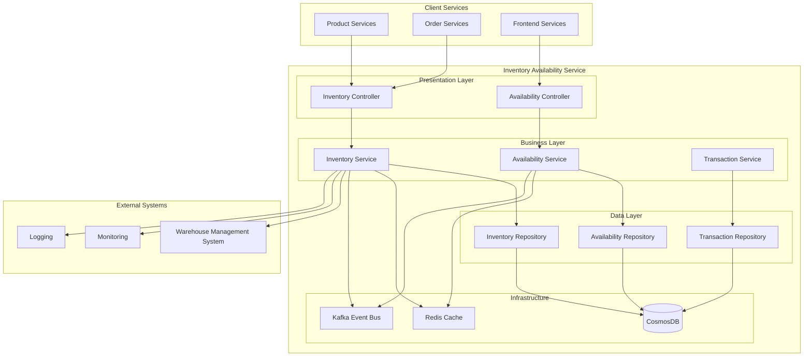

## Component Relationship Diagram

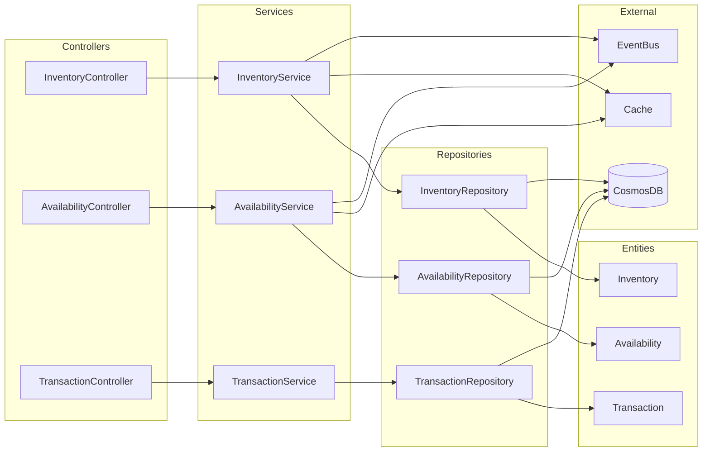

## Data Flow Diagram

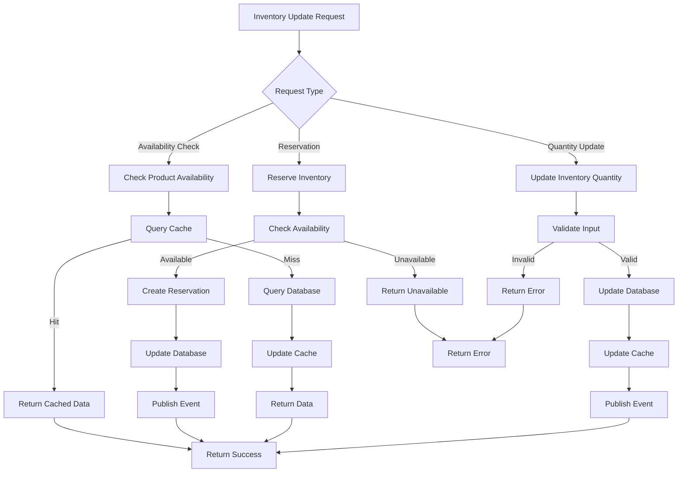

## Domain Model Diagram

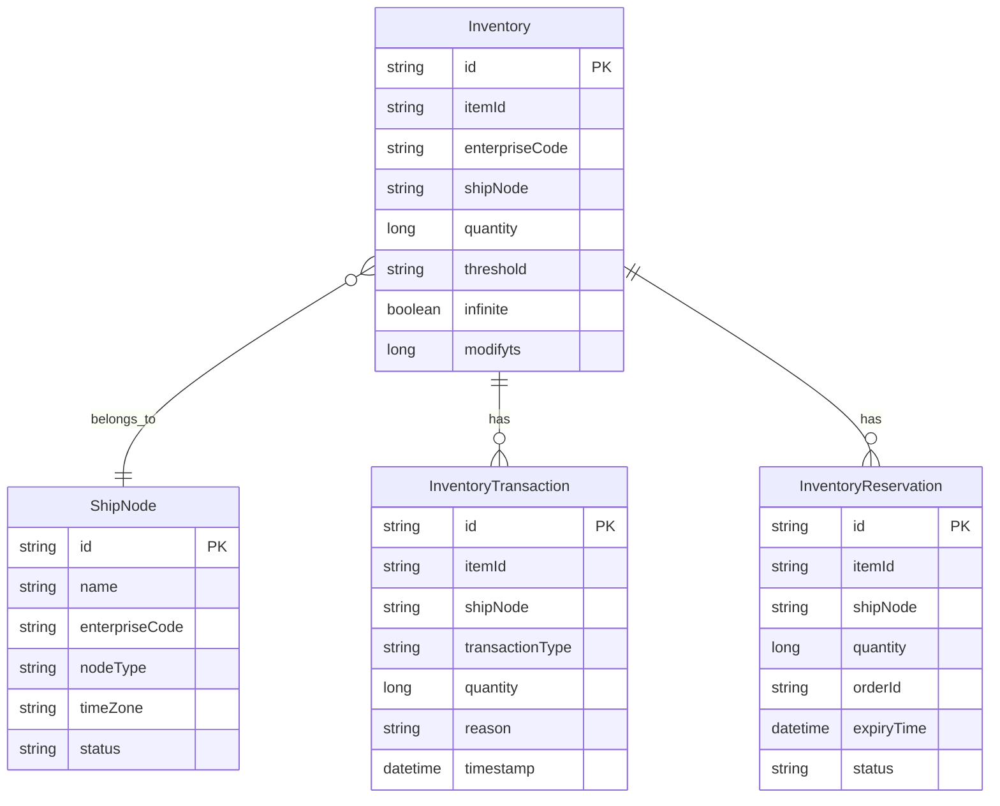

## Business Process Flow

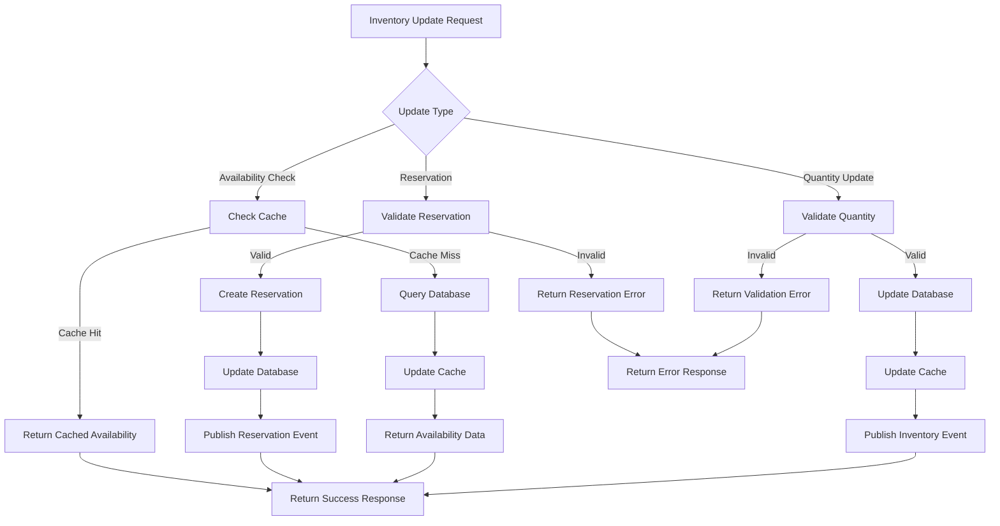

## Database Schema Diagram

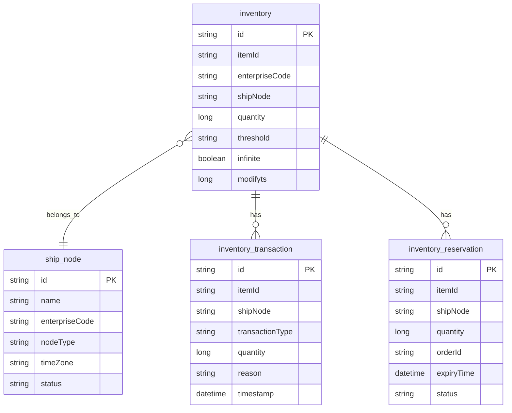

## Infrastructure Architecture

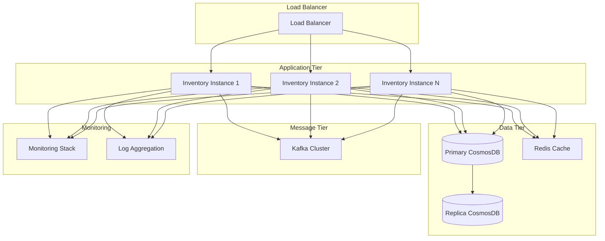

## Monitoring & Observability Stack

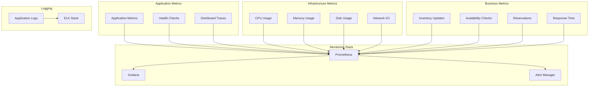

## Authentication Flow

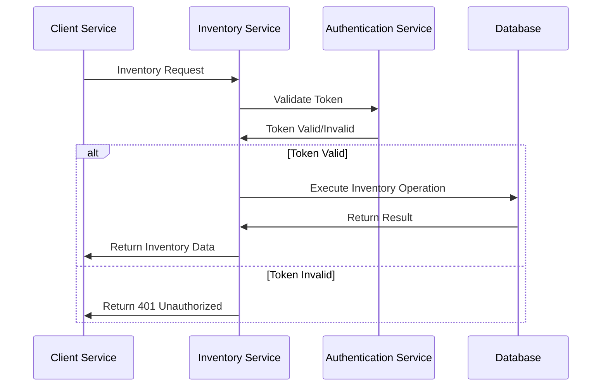

## Error Handling Flow

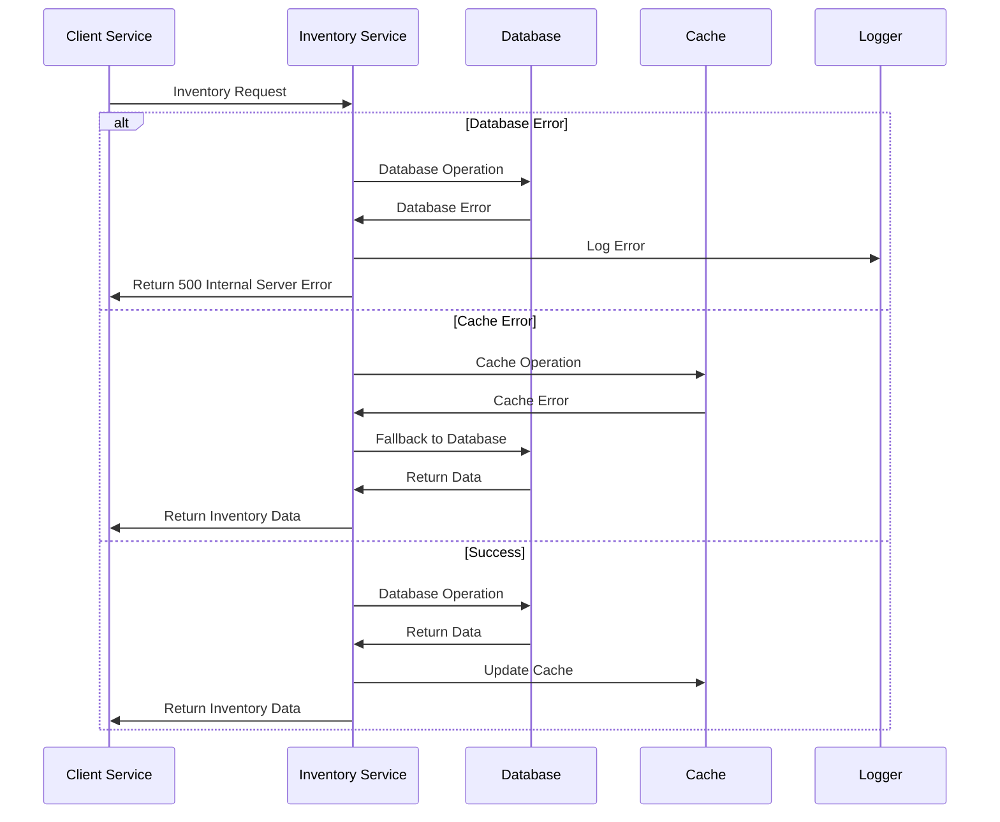

## Inventory Update Flow

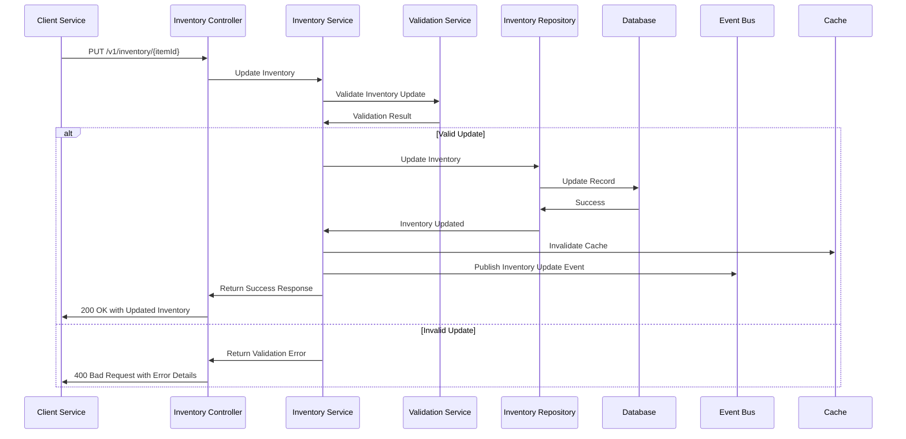

## Availability Check Flow

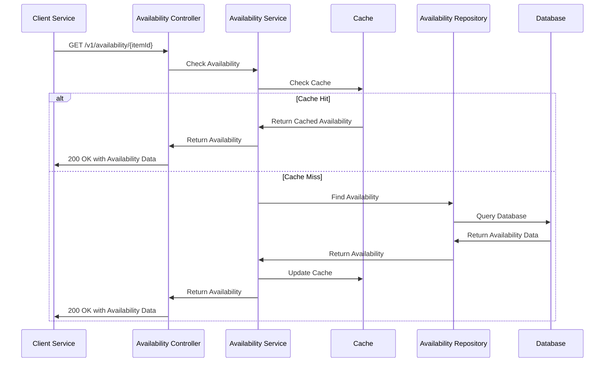

## Inventory Reservation Flow

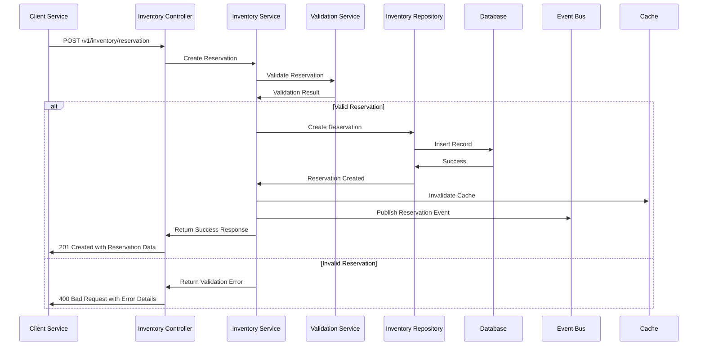

## Inventory Synchronization Flow

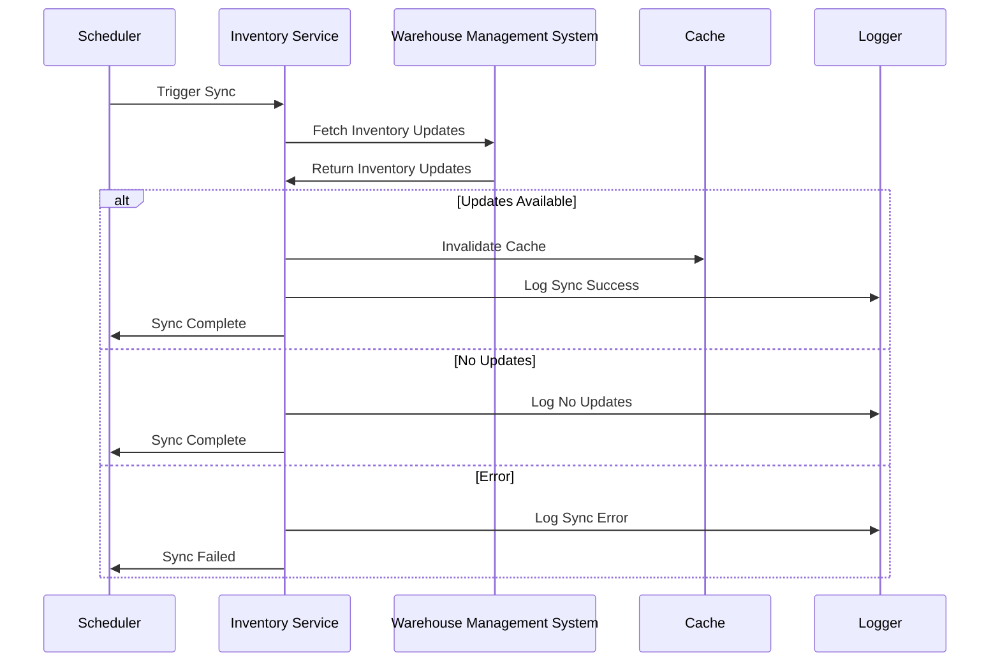
