# Inventory Availability Service Architecture Analysis

## Executive Summary

The Inventory Availability Service is a critical component of the Sephora e-commerce platform that provides real-time inventory management and availability information. It handles inventory tracking, availability calculations, supply chain integration, and provides inventory data to other services in the ecosystem.

### Key Technical Findings
- **Real-time Inventory Management**: Provides real-time inventory tracking and availability
- **CosmosDB Integration**: Uses Azure CosmosDB for scalable inventory data storage
- **Multi-location Support**: Handles inventory across multiple locations and ship nodes
- **Event-Driven Architecture**: Uses Kafka for inventory change notifications
- **Caching Strategy**: Implements Redis caching for performance optimization

### Critical Concerns and Risks
- **Data Consistency**: Real-time inventory updates require consistency across services
- **Performance**: High-frequency inventory queries may impact performance
- **Scalability**: Inventory data volume may grow significantly
- **Integration Complexity**: Multiple external system integrations

### High-Level Recommendations
- Implement inventory data consistency patterns
- Optimize database queries and caching strategy
- Add comprehensive monitoring for inventory operations
- Implement circuit breakers for external service dependencies

## Architecture Analysis

### System Architecture and Component Relationships

The Inventory Availability Service follows a layered microservices architecture with clear separation of concerns:

- **Controller Layer**: REST API endpoints for inventory operations
- **Service Layer**: Business logic for inventory management
- **Repository Layer**: Data access abstraction for CosmosDB
- **Integration Layer**: External service integrations
- **Event Layer**: Kafka event publishing and consumption
- **Cache Layer**: Redis caching for performance optimization

### Design Patterns and Architectural Decisions

- **Repository Pattern**: Abstracts data access across CosmosDB
- **Event-Driven Pattern**: Kafka-based event publishing for inventory changes
- **Caching Pattern**: Redis-based caching for frequently accessed data
- **Circuit Breaker Pattern**: External service dependency protection
- **Saga Pattern**: Distributed transaction management for inventory operations

### Integration Patterns and External Dependencies

- **CosmosDB**: Primary data store for inventory information
- **Redis Cache**: Performance optimization through caching
- **Kafka**: Event streaming for inventory changes
- **External Inventory Systems**: Integration with warehouse management systems
- **Sourcing Service**: Integration for availability calculations

### Data Flow and Messaging Architecture

Inventory data flows through the system with the following pattern:
1. Inventory updates from external systems
2. Service layer processes business logic
3. Repository layer accesses CosmosDB
4. Cache layer optimizes performance
5. Event publishing for inventory changes
6. Real-time availability calculations
7. Response formatting and caching

## Security Analysis

### Authentication and Authorization Mechanisms

- **REST API Security**: Standard REST authentication and authorization
- **Service-to-Service Security**: Secure integration with other services
- **Data Access Control**: Role-based access to inventory data
- **External System Security**: Secure integration with external inventory systems

### Security Vulnerabilities and Risks

- **Data Exposure**: Sensitive inventory data exposure risks
- **External Integration**: External system integration security
- **Cache Security**: Potential data leakage through cache
- **API Security**: Inventory API security vulnerabilities

### Data Protection and Encryption

- **Database Encryption**: CosmosDB data encryption at rest
- **Transport Security**: HTTPS for all API communications
- **External API Security**: Secure external system integration
- **Data Masking**: Sensitive inventory data masking

### Compliance and Regulatory Considerations

- **Data Privacy**: Inventory data privacy compliance
- **Audit Requirements**: Inventory change audit trails
- **Data Retention**: Inventory data retention policies
- **Access Logging**: Comprehensive access logging

## Performance Analysis

### Database Performance and Optimization Opportunities

- **Query Optimization**: CosmosDB query optimization and indexing
- **Partitioning Strategy**: Proper partitioning for large inventory datasets
- **Connection Management**: Optimize database connection management
- **Caching Strategy**: Effective caching for inventory queries

### Application Performance Bottlenecks

- **Real-time Updates**: High-frequency inventory update processing
- **External API Calls**: External system API performance
- **Cache Management**: Cache invalidation and management overhead
- **Event Processing**: Kafka event processing performance

### Caching Strategies and Effectiveness

- **Inventory Caching**: Frequently accessed inventory data caching
- **Availability Caching**: Real-time availability calculation caching
- **External Data Caching**: External system data caching
- **Cache Invalidation**: Smart cache invalidation strategies

### Infrastructure Performance Considerations

- **Database Scaling**: CosmosDB scaling strategies
- **Cache Scaling**: Redis cluster scaling
- **Load Balancing**: Inventory API load balancing
- **Resource Allocation**: CPU and memory optimization

## Code Quality Assessment

### Code Complexity and Maintainability

- **Service Layer**: Clear business logic separation
- **Repository Pattern**: Effective data access abstraction
- **Integration Layer**: Clean external service integration
- **Event Processing**: Well-structured event handling

### Technical Debt Identification

- **Performance Optimization**: Query performance optimization needed
- **Error Handling**: Inconsistent error handling patterns
- **Documentation**: API documentation gaps
- **Testing Coverage**: Integration test coverage improvements

### Design Pattern Usage and Effectiveness

- **Repository Pattern**: Good data access abstraction
- **Event-Driven Pattern**: Effective event publishing
- **Caching Pattern**: Effective performance optimization
- **Circuit Breaker Pattern**: External service dependency protection

### Error Handling and Resilience Patterns

- **Circuit Breaker**: External service dependency protection
- **Retry Logic**: External API retry mechanisms
- **Fallback Strategies**: Graceful degradation for external services
- **Error Logging**: Comprehensive error logging

## Testing Analysis

### Test Coverage and Quality Assessment

- **Unit Tests**: Service layer unit test coverage
- **Integration Tests**: Database and external service integration
- **API Tests**: REST API endpoint testing
- **Performance Tests**: Load and stress testing

### Testing Strategy and Implementation

- **Database Testing**: CosmosDB integration testing approaches
- **External Service Mocking**: External system API mocking
- **Event Testing**: Kafka event testing
- **Cache Testing**: Redis cache testing

### Integration and End-to-End Testing

- **External System Integration**: End-to-end integration testing
- **Database Integration**: CosmosDB integration testing
- **Event Integration**: Kafka event flow testing
- **API Integration**: REST API testing

### Test Automation and CI/CD Integration

- **Automated Testing**: CI/CD pipeline integration
- **Test Environment**: Isolated test environment setup
- **Test Data Management**: Inventory test data management
- **Performance Testing**: Automated performance regression testing

## Authentication Flow


```

## Error Handling Flow


```

## Inventory Update Flow


```

## Inventory Query Flow


```

## Availability Calculation Flow


```

## Supply Update Flow


```

## Deployment & DevOps Analysis

### CI/CD Pipeline and Automation

- **Build Automation**: Maven-based build automation
- **Docker Containerization**: Containerized deployment
- **Environment Management**: Multi-environment deployment
- **Database Migration**: Automated database migration

### Containerization and Orchestration

- **Docker Images**: Optimized Docker image creation
- **Kubernetes Deployment**: Container orchestration
- **Service Discovery**: Service registration and discovery
- **Health Checks**: Application health monitoring

### Infrastructure and Environment Management

- **Environment Configuration**: Environment-specific configurations
- **Database Management**: CosmosDB configuration
- **Cache Management**: Redis cache configuration
- **External Service Configuration**: External system configuration

### Monitoring and Observability Setup

- **Inventory Metrics**: Inventory operation performance monitoring
- **External API Monitoring**: External system API monitoring
- **Database Monitoring**: CosmosDB performance monitoring
- **Event Monitoring**: Kafka event monitoring

## Infrastructure Architecture


## Monitoring & Observability Stack


## Business Domain Analysis

### Domain Model and Business Entities

The Inventory Availability Service manages inventory entities with the following domain model:

- **Inventory**: Core inventory entity with quantity and location information
- **ShipNode**: Shipping node and location information
- **Availability**: Real-time availability calculations
- **Supply**: Supply chain and replenishment information
- **InventoryControl**: Inventory control and management rules

### Business Processes and Workflows

- **Inventory Management**: Create, read, update, delete inventory
- **Availability Calculation**: Real-time availability calculations
- **Supply Chain Integration**: Integration with supply chain systems
- **Inventory Tracking**: Real-time inventory tracking
- **Availability Reporting**: Inventory availability reporting

### Business Rules and Validation Logic

- **Inventory Validation**: Inventory data validation rules
- **Availability Rules**: Availability calculation rules
- **Supply Chain Rules**: Supply chain integration rules
- **Location Rules**: Multi-location inventory rules
- **Threshold Rules**: Inventory threshold management

### Integration Points and External Services

- **Warehouse Management System**: Primary inventory data source
- **Sourcing Service**: Availability calculation integration
- **Product Service**: Product information integration
- **Order Service**: Order fulfillment integration
- **Analytics Service**: Inventory analytics integration

## Domain Model Diagram


```

## Business Process Flow


## Database Schema Diagram

```mermaid
erDiagram
    inventory {
        String id PK
        String itemId
        String enterpriseCode
        String shipNode
        Long quantity
        String threshold
        Boolean infinite
        Long modifyts
    }
    
    ship_node {
        String id PK
        String name
        String enterpriseCode
        String nodeType
        String timeZone
        String status
    }
    
    availability {
        String availabilityId PK
        String itemId
        String location
        Integer availableQuantity
        Boolean available
        DateTime calculatedAt
    }
    
    supply {
        String supplyId PK
        String itemId
        String source
        Integer quantity
        DateTime expectedDate
        String status
    }
    
    inventory_control {
        String controlId PK
        String itemId
        String controlType
        String value
        Boolean active
    }
    
    inventory ||--|| ship_node : "belongs_to"
    inventory ||--o{ availability : "has"
    inventory ||--o{ supply : "has"
    inventory ||--o{ inventory_control : "has"
```



## Risk Assessment

### Technical Risks and Vulnerabilities

- **Data Consistency**: Real-time inventory consistency challenges
- **Performance**: High-frequency inventory query performance
- **External Dependencies**: External system integration risks
- **Scalability**: Inventory data volume scaling challenges
- **Cache Management**: Cache invalidation complexity

### Business Continuity Risks

- **External System Dependency**: Warehouse management system availability
- **Data Loss**: Inventory data loss risks
- **Performance Degradation**: Slow inventory queries impact business
- **Integration Failures**: External system integration failures

### Performance and Scalability Concerns

- **Database Performance**: CosmosDB performance under load
- **Cache Performance**: Redis cache performance under load
- **External API Limits**: External system API rate limits
- **Event Processing**: Kafka event processing capacity

### Security Threats and Mitigation Strategies

- **Data Exposure**: Encrypt sensitive inventory data
- **External API Security**: Secure external system integration
- **Access Control**: Implement proper authorization
- **Audit Logging**: Comprehensive audit trails

## Detailed Recommendations

### Immediate Actions (High Priority)

1. **Performance Optimization**: Optimize inventory query performance
2. **Data Consistency**: Implement inventory consistency patterns
3. **External Service Resilience**: Add circuit breakers for external systems
4. **Performance Monitoring**: Implement comprehensive performance monitoring
5. **Error Handling**: Improve error handling and recovery mechanisms

### Short-Term Improvements (Medium Priority)

1. **Cache Strategy**: Optimize caching strategy and invalidation
2. **Database Optimization**: Optimize CosmosDB queries and indexing
3. **Event Processing**: Improve Kafka event processing
4. **Testing Coverage**: Increase integration test coverage
5. **Documentation**: Complete API documentation

### Long-Term Strategic Enhancements (Low Priority)

1. **Microservices Evolution**: Consider breaking down into smaller services
2. **Database Migration**: Evaluate database optimization strategies
3. **Event Sourcing**: Implement event sourcing for inventory changes
4. **API Gateway**: Implement API gateway for enhanced security
5. **Multi-Region Deployment**: Implement multi-region deployment

## Action Plan

### Phase 1: Critical Fixes (1-2 weeks)

- Optimize inventory query performance
- Add circuit breakers for external services
- Optimize database queries and indexing
- Improve error handling and logging
- Set up basic performance monitoring

### Phase 2: Quality Improvements (1-2 months)

- Implement comprehensive caching strategy
- Add data consistency patterns
- Enhance external service integration
- Improve API documentation
- Increase test coverage

### Phase 3: Strategic Enhancements (3-6 months)

- Evaluate microservices architecture evolution
- Consider database optimization strategies
- Implement advanced monitoring and alerting
- Plan for multi-region deployment
- Enhance disaster recovery procedures
