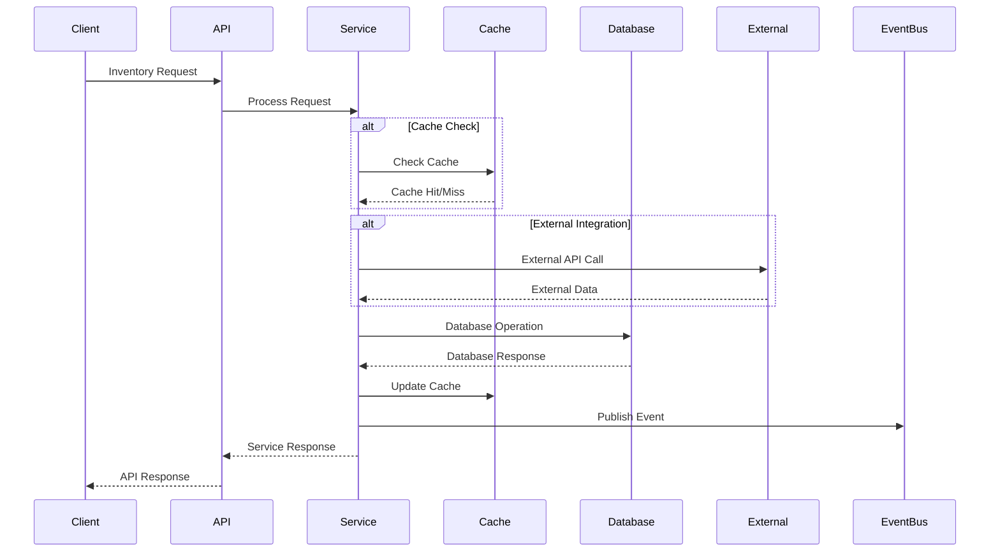
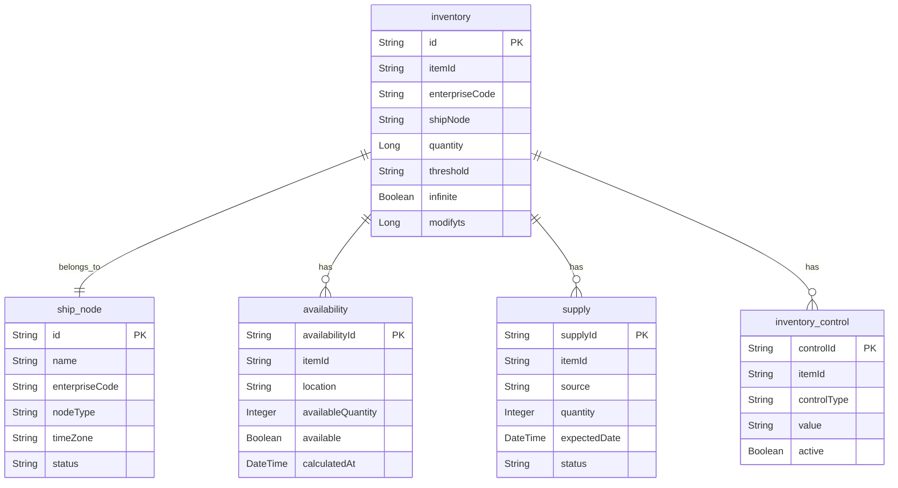

# Inventory Availability Service API Contract

## API Overview

The Inventory Availability Service provides RESTful APIs for managing inventory data, availability calculations, and supply chain integration. The service handles real-time inventory tracking, availability calculations, and provides inventory data to other services in the ecosystem.

### API Versioning
- **Current Version**: v1
- **Base URL**: `/api/v1`
- **Content Type**: `application/json`

### Authentication Requirements
- **Authentication**: Bearer token required for all endpoints
- **Authorization**: Role-based access control
- **Rate Limiting**: 1000 requests per minute per client

## Request/Response Contracts

### 1. Create Inventory Record

**Endpoint**: `POST /v1/inventory`

**Description**: Creates a new inventory record for a product at a specific location.

**Request Body**:
```json
{
  "itemId": "string",
  "enterpriseCode": "string",
  "shipNode": "string",
  "quantity": 0,
  "threshold": "string",
  "infinite": false
}
```

**Response (201 Created)**:
```json
{
  "id": "string",
  "itemId": "string",
  "enterpriseCode": "string",
  "shipNode": "string",
  "quantity": 0,
  "threshold": "string",
  "infinite": false,
  "modifyts": 0,
  "createdAt": "2024-01-01T00:00:00Z",
  "updatedAt": "2024-01-01T00:00:00Z"
}
```

**Error Responses**:
- `400 Bad Request`: Invalid request data
- `401 Unauthorized`: Missing or invalid authentication
- `403 Forbidden`: Insufficient permissions
- `409 Conflict`: Inventory record already exists

### 2. Get Inventory Records

**Endpoint**: `GET /v1/inventory`

**Description**: Retrieves inventory records with optional filtering.

**Query Parameters**:
- `itemId` (optional): Filter by item ID
- `enterpriseCode` (optional): Filter by enterprise code
- `shipNode` (optional): Filter by ship node
- `page` (optional): Page number (default: 0)
- `size` (optional): Page size (default: 20)

**Response (200 OK)**:
```json
{
  "content": [
    {
      "id": "string",
      "itemId": "string",
      "enterpriseCode": "string",
      "shipNode": "string",
      "quantity": 0,
      "threshold": "string",
      "infinite": false,
      "modifyts": 0
    }
  ],
  "pageable": {
    "pageNumber": 0,
    "pageSize": 20,
    "totalElements": 100,
    "totalPages": 5
  }
}
```

**Error Responses**:
- `401 Unauthorized`: Missing or invalid authentication
- `403 Forbidden`: Insufficient permissions

### 3. Get Inventory by ID

**Endpoint**: `GET /v1/inventory/{id}`

**Description**: Retrieves a specific inventory record by ID.

**Path Parameters**:
- `id`: Inventory record ID

**Response (200 OK)**:
```json
{
  "id": "string",
  "itemId": "string",
  "enterpriseCode": "string",
  "shipNode": "string",
  "quantity": 0,
  "threshold": "string",
  "infinite": false,
  "modifyts": 0
}
```

**Error Responses**:
- `401 Unauthorized`: Missing or invalid authentication
- `403 Forbidden`: Insufficient permissions
- `404 Not Found`: Inventory record not found

### 4. Update Inventory Record

**Endpoint**: `PUT /v1/inventory/{id}`

**Description**: Updates an existing inventory record.

**Path Parameters**:
- `id`: Inventory record ID

**Request Body**:
```json
{
  "itemId": "string",
  "enterpriseCode": "string",
  "shipNode": "string",
  "quantity": 0,
  "threshold": "string",
  "infinite": false
}
```

**Response (200 OK)**:
```json
{
  "id": "string",
  "itemId": "string",
  "enterpriseCode": "string",
  "shipNode": "string",
  "quantity": 0,
  "threshold": "string",
  "infinite": false,
  "modifyts": 0,
  "updatedAt": "2024-01-01T00:00:00Z"
}
```

**Error Responses**:
- `400 Bad Request`: Invalid request data
- `401 Unauthorized`: Missing or invalid authentication
- `403 Forbidden`: Insufficient permissions
- `404 Not Found`: Inventory record not found

### 5. Delete Inventory Record

**Endpoint**: `DELETE /v1/inventory/{id}`

**Description**: Deletes an inventory record.

**Path Parameters**:
- `id`: Inventory record ID

**Response (204 No Content)**:
No response body

**Error Responses**:
- `401 Unauthorized`: Missing or invalid authentication
- `403 Forbidden`: Insufficient permissions
- `404 Not Found`: Inventory record not found

### 6. Get Availability

**Endpoint**: `GET /v1/availability/{itemId}`

**Description**: Retrieves real-time availability for a product.

**Path Parameters**:
- `itemId`: Product item ID

**Query Parameters**:
- `location` (optional): Specific location filter
- `includeSupply` (optional): Include supply information (default: false)

**Response (200 OK)**:
```json
{
  "itemId": "string",
  "availability": [
    {
      "location": "string",
      "availableQuantity": 0,
      "available": true,
      "calculatedAt": "2024-01-01T00:00:00Z"
    }
  ],
  "supply": [
    {
      "source": "string",
      "quantity": 0,
      "expectedDate": "2024-01-01T00:00:00Z",
      "status": "string"
    }
  ]
}
```

**Error Responses**:
- `401 Unauthorized`: Missing or invalid authentication
- `403 Forbidden`: Insufficient permissions
- `404 Not Found`: Product not found

### 7. Update Supply Information

**Endpoint**: `PUT /v1/supply/{itemId}`

**Description**: Updates supply information for a product.

**Path Parameters**:
- `itemId`: Product item ID

**Request Body**:
```json
{
  "supply": [
    {
      "source": "string",
      "quantity": 0,
      "expectedDate": "2024-01-01T00:00:00Z",
      "status": "string"
    }
  ]
}
```

**Response (200 OK)**:
```json
{
  "itemId": "string",
  "supply": [
    {
      "supplyId": "string",
      "source": "string",
      "quantity": 0,
      "expectedDate": "2024-01-01T00:00:00Z",
      "status": "string"
    }
  ],
  "updatedAt": "2024-01-01T00:00:00Z"
}
```

**Error Responses**:
- `400 Bad Request`: Invalid request data
- `401 Unauthorized`: Missing or invalid authentication
- `403 Forbidden`: Insufficient permissions
- `404 Not Found`: Product not found

### 8. Get Ship Nodes

**Endpoint**: `GET /v1/shipnodes`

**Description**: Retrieves available ship nodes.

**Query Parameters**:
- `enterpriseCode` (optional): Filter by enterprise code
- `nodeType` (optional): Filter by node type
- `status` (optional): Filter by status

**Response (200 OK)**:
```json
{
  "content": [
    {
      "id": "string",
      "name": "string",
      "enterpriseCode": "string",
      "nodeType": "string",
      "timeZone": "string",
      "status": "string"
    }
  ],
  "pageable": {
    "pageNumber": 0,
    "pageSize": 20,
    "totalElements": 50,
    "totalPages": 3
  }
}
```

**Error Responses**:
- `401 Unauthorized`: Missing or invalid authentication
- `403 Forbidden`: Insufficient permissions

## Data Models

### Inventory Entity
```json
{
  "id": "string",
  "itemId": "string",
  "enterpriseCode": "string",
  "shipNode": "string",
  "quantity": "number",
  "threshold": "string",
  "infinite": "boolean",
  "modifyts": "number"
}
```

### ShipNode Entity
```json
{
  "id": "string",
  "name": "string",
  "enterpriseCode": "string",
  "nodeType": "string",
  "timeZone": "string",
  "status": "string"
}
```

### Availability Entity
```json
{
  "availabilityId": "string",
  "itemId": "string",
  "location": "string",
  "availableQuantity": "number",
  "available": "boolean",
  "calculatedAt": "string"
}
```

### Supply Entity
```json
{
  "supplyId": "string",
  "itemId": "string",
  "source": "string",
  "quantity": "number",
  "expectedDate": "string",
  "status": "string"
}
```

### InventoryControl Entity
```json
{
  "controlId": "string",
  "itemId": "string",
  "controlType": "string",
  "value": "string",
  "active": "boolean"
}
```

## Validation Rules

### Inventory Validation
- `itemId`: Required, non-empty string, max 50 characters
- `enterpriseCode`: Required, non-empty string, max 20 characters
- `shipNode`: Required, non-empty string, max 50 characters
- `quantity`: Required, non-negative integer
- `threshold`: Optional string, max 100 characters
- `infinite`: Optional boolean, default false

### ShipNode Validation
- `name`: Required, non-empty string, max 100 characters
- `enterpriseCode`: Required, non-empty string, max 20 characters
- `nodeType`: Required, enum values: ["STORE", "WAREHOUSE", "DISTRIBUTION_CENTER"]
- `timeZone`: Required, valid timezone string
- `status`: Required, enum values: ["ACTIVE", "INACTIVE", "MAINTENANCE"]

### Availability Validation
- `itemId`: Required, non-empty string, max 50 characters
- `location`: Required, non-empty string, max 50 characters
- `availableQuantity`: Required, non-negative integer
- `available`: Required boolean
- `calculatedAt`: Required, valid ISO 8601 datetime

### Supply Validation
- `itemId`: Required, non-empty string, max 50 characters
- `source`: Required, non-empty string, max 100 characters
- `quantity`: Required, non-negative integer
- `expectedDate`: Required, valid ISO 8601 date
- `status`: Required, enum values: ["PENDING", "IN_TRANSIT", "RECEIVED", "CANCELLED"]

## Integration Contracts

### External System Integration

#### Warehouse Management System (WMS)
- **Protocol**: REST API
- **Authentication**: API Key
- **Rate Limiting**: 100 requests per minute
- **Timeout**: 30 seconds
- **Retry Policy**: 3 attempts with exponential backoff

#### Sourcing Service Integration
- **Protocol**: REST API
- **Authentication**: Bearer token
- **Rate Limiting**: 500 requests per minute
- **Timeout**: 15 seconds
- **Retry Policy**: 2 attempts with linear backoff

### Event Publishing

#### Inventory Update Events
```json
{
  "eventType": "INVENTORY_UPDATED",
  "eventId": "string",
  "timestamp": "2024-01-01T00:00:00Z",
  "data": {
    "itemId": "string",
    "enterpriseCode": "string",
    "shipNode": "string",
    "quantity": 0,
    "previousQuantity": 0
  }
}
```

#### Availability Change Events
```json
{
  "eventType": "AVAILABILITY_CHANGED",
  "eventId": "string",
  "timestamp": "2024-01-01T00:00:00Z",
  "data": {
    "itemId": "string",
    "location": "string",
    "availableQuantity": 0,
    "available": true,
    "previousAvailable": false
  }
}
```

#### Supply Update Events
```json
{
  "eventType": "SUPPLY_UPDATED",
  "eventId": "string",
  "timestamp": "2024-01-01T00:00:00Z",
  "data": {
    "itemId": "string",
    "supply": [
      {
        "source": "string",
        "quantity": 0,
        "expectedDate": "2024-01-01T00:00:00Z",
        "status": "string"
      }
    ]
  }
}
```

## API Endpoint Map

```mermaid
graph TB
    subgraph "Inventory Management"
        CREATE[POST /v1/inventory]
        GET_ALL[GET /v1/inventory]
        GET_ONE[GET /v1/inventory/{id}]
        UPDATE[PUT /v1/inventory/{id}]
        DELETE[DELETE /v1/inventory/{id}]
    end
    
    subgraph "Availability"
        AVAIL[GET /v1/availability/{itemId}]
    end
    
    subgraph "Supply Management"
        SUPPLY[PUT /v1/supply/{itemId}]
    end
    
    subgraph "Ship Nodes"
        SHIPNODES[GET /v1/shipnodes]
    end
    
    subgraph "External Systems"
        WMS[Warehouse Management System]
        SOURCING[Sourcing Service]
    end
    
    subgraph "Event Bus"
        KAFKA[Kafka Events]
    end
    
    CREATE --> KAFKA
    UPDATE --> KAFKA
    DELETE --> KAFKA
    AVAIL --> SOURCING
    SUPPLY --> KAFKA
```

## Request/Response Flow



## Data Model Relationships



## Error Handling

### Standard Error Response Format
```json
{
  "timestamp": "2024-01-01T00:00:00Z",
  "status": 400,
  "error": "Bad Request",
  "message": "Validation failed",
  "path": "/api/v1/inventory",
  "details": [
    {
      "field": "itemId",
      "message": "Item ID is required"
    }
  ]
}
```

### Common Error Codes
- `400 Bad Request`: Invalid request data or validation errors
- `401 Unauthorized`: Missing or invalid authentication
- `403 Forbidden`: Insufficient permissions
- `404 Not Found`: Resource not found
- `409 Conflict`: Resource conflict
- `422 Unprocessable Entity`: Business rule validation failed
- `500 Internal Server Error`: Unexpected server error
- `503 Service Unavailable`: Service temporarily unavailable

### Retry Logic
- **Transient Errors**: Retry with exponential backoff
- **Permanent Errors**: No retry, return error immediately
- **Rate Limiting**: Respect retry-after header
- **Circuit Breaker**: Prevent cascading failures

## Performance Considerations

### Caching Strategy
- **Inventory Data**: Cache for 5 minutes
- **Availability Data**: Cache for 1 minute
- **Ship Node Data**: Cache for 1 hour
- **Supply Data**: Cache for 15 minutes

### Rate Limiting
- **Standard Clients**: 1000 requests per minute
- **High-Volume Clients**: 5000 requests per minute
- **Burst Allowance**: 200 requests per 10 seconds

### Response Time Targets
- **Inventory Queries**: < 100ms
- **Availability Calculations**: < 200ms
- **Supply Updates**: < 500ms
- **Bulk Operations**: < 2 seconds

## Security Considerations

### Authentication
- **Bearer Token**: Required for all endpoints
- **Token Validation**: Validate with authentication service
- **Token Expiry**: Handle expired tokens gracefully

### Authorization
- **Role-Based Access**: Different permissions for different roles
- **Resource-Level Access**: Control access to specific inventory data
- **Audit Logging**: Log all access attempts

### Data Protection
- **Input Validation**: Validate all input data
- **Output Sanitization**: Sanitize output data
- **Encryption**: Encrypt sensitive data in transit and at rest
