# Omni Product Service Architecture Analysis

## Executive Summary

The Omni Product Service is a comprehensive product management system that provides unified product data and functionality across multiple channels and touchpoints. It serves as the central hub for product information, handling product catalog management, product search, and product-related operations in the Sephora ecosystem.

### Key Technical Findings
- **Spring Boot Application**: Modern microservice architecture with Spring Boot framework
- **GraphQL API**: Flexible query interface for product data retrieval
- **Commerce Tools Integration**: External product data source integration
- **Redis Caching**: Performance optimization through distributed caching
- **Resilience4j**: Circuit breaker and resilience patterns implementation

### Critical Concerns and Risks
- **External Dependency**: Heavy reliance on Commerce Tools for product data
- **Data Synchronization**: Complex data synchronization between internal and external systems
- **Performance**: Product catalog operations may become bottleneck with scale
- **Data Consistency**: Ensuring consistency across multiple data sources

### High-level Recommendations
- Implement comprehensive caching strategies for product data
- Add data validation and quality checks for external data sources
- Consider implementing a product data lake for analytics
- Enhance monitoring and alerting for external service dependencies

## Architecture Analysis

### System Architecture and Component Relationships

The Omni Product Service follows a layered architecture with clear separation of concerns:

- **Presentation Layer**: GraphQL resolvers and REST controllers
- **Business Logic Layer**: Service implementations for product operations
- **Data Access Layer**: Repository interfaces and data mappers
- **Integration Layer**: External service clients and adapters
- **Infrastructure Layer**: Caching, monitoring, and external integrations

### Design Patterns and Architectural Decisions

- **Adapter Pattern**: Integration with Commerce Tools and other external systems
- **Repository Pattern**: Abstracts data access logic from business services
- **Service Layer Pattern**: Encapsulates business logic and external integrations
- **DTO Pattern**: Separates internal entities from external API contracts
- **Circuit Breaker Pattern**: Resilience against external service failures

### Integration Patterns and External Dependencies

- **Commerce Tools**: Primary external product data source
- **Redis Cache**: Distributed caching for performance optimization
- **GraphQL**: Flexible query interface for product data
- **Spring Cloud**: Service discovery and configuration management
- **Resilience4j**: Circuit breaker and resilience patterns

### Data Flow and Messaging Architecture

Product data flows through the following path:
1. Client requests product data via GraphQL or REST APIs
2. Controllers/resolvers validate and route requests to appropriate services
3. Services check cache for data availability
4. If cache miss, services fetch data from Commerce Tools or other sources
5. Data is transformed and cached for future requests
6. Response is returned to client with appropriate error handling

## Security Analysis

### Authentication and Authorization Mechanisms

- **Spring Security**: Framework for authentication and authorization
- **Service-to-Service Authentication**: Mutual TLS or API key authentication
- **GraphQL Security**: Field-level security for sensitive product data
- **Rate Limiting**: Protection against abuse and DoS attacks

### Security Vulnerabilities and Risks

- **Data Exposure**: Sensitive product information in responses
- **External Service Security**: Dependency on Commerce Tools security
- **Cache Security**: Potential data leakage through cache
- **Input Validation**: GraphQL query injection and validation

### Data Protection and Encryption

- **Transport Security**: HTTPS/TLS for all API communications
- **Data Encryption**: Encryption of sensitive product data at rest
- **Cache Encryption**: Encrypted storage for cached product data
- **Key Management**: Secure storage and rotation of encryption keys

### Compliance and Regulatory Considerations

- **Data Privacy**: Compliance with data protection regulations
- **Audit Logging**: Comprehensive logging of product data access
- **Data Retention**: Proper retention policies for product data
- **Access Controls**: Role-based access to product information

## Performance Analysis

### Database Performance and Optimization Opportunities

- **Query Optimization**: Optimize GraphQL query execution
- **Caching Strategy**: Multi-level caching for product data
- **Connection Pooling**: Optimize external service connections
- **Data Pagination**: Efficient pagination for large product catalogs

### Application Performance Bottlenecks

- **External Service Calls**: Commerce Tools API response times
- **GraphQL Query Complexity**: Complex nested queries impact performance
- **Cache Misses**: Performance impact of cache misses
- **Data Transformation**: Overhead of data mapping and transformation

### Caching Strategies and Effectiveness

- **Application-Level Caching**: Cache frequently accessed product data
- **Distributed Caching**: Redis for shared product cache
- **Query Result Caching**: Cache GraphQL query results
- **Cache Invalidation**: Proper cache invalidation on data updates

### Infrastructure Performance Considerations

- **Load Balancing**: Distribute product requests across instances
- **Auto Scaling**: Scale based on product catalog demand
- **Resource Allocation**: Optimize CPU and memory for product operations
- **Network Performance**: Minimize latency for external service calls

## Code Quality Assessment

### Code Complexity and Maintainability

- **Cyclomatic Complexity**: Monitor complexity in business logic methods
- **Code Duplication**: Identify and eliminate duplicate product handling code
- **Modularity**: Ensure proper separation of concerns across layers
- **Documentation**: Comprehensive API and code documentation

### Technical Debt Identification

- **Legacy Integration**: Identify and refactor outdated external integrations
- **Hardcoded Values**: Replace hardcoded configuration with externalized values
- **Error Handling**: Improve error handling and recovery mechanisms
- **Testing Coverage**: Increase unit and integration test coverage

### Design Pattern Usage and Effectiveness

- **Adapter Pattern**: Effective abstraction of external service integrations
- **Repository Pattern**: Proper data access abstraction
- **Service Layer**: Good business logic encapsulation
- **DTO Pattern**: Clean separation of internal and external models

### Error Handling and Resilience Patterns

- **Circuit Breaker**: Implement for external service dependencies
- **Retry Mechanisms**: Automatic retry for transient failures
- **Fallback Strategies**: Graceful degradation when external services are unavailable
- **Error Logging**: Comprehensive error logging and monitoring

## Testing Analysis

### Test Coverage and Quality Assessment

- **Unit Test Coverage**: Target 80%+ coverage for business logic
- **Integration Test Coverage**: Test external service integrations
- **GraphQL Test Coverage**: Comprehensive testing of GraphQL resolvers
- **Performance Test Coverage**: Load and stress testing scenarios

### Testing Strategy and Implementation

- **Test-Driven Development**: Write tests before implementing features
- **Mock Testing**: Use mocks for external service dependencies
- **Contract Testing**: Ensure API contracts are properly tested
- **End-to-End Testing**: Test complete product workflows

### Integration and End-to-End Testing

- **External Service Integration**: Test Commerce Tools integration
- **Cache Integration**: Test caching behavior and invalidation
- **GraphQL Integration**: Test GraphQL query execution and performance
- **End-to-End Scenarios**: Test complete product data flows

### Test Automation and CI/CD Integration

- **Automated Testing**: Integrate tests into CI/CD pipeline
- **Test Environment**: Dedicated test environment for product testing
- **Test Data Management**: Proper test data setup and cleanup
- **Performance Testing**: Automated performance regression testing

## Deployment & DevOps Analysis

### CI/CD Pipeline and Automation

- **Build Automation**: Automated build and packaging process
- **Deployment Automation**: Automated deployment to different environments
- **Configuration Management**: Environment-specific configuration management
- **Rollback Capabilities**: Automated rollback for failed deployments

### Containerization and Orchestration

- **Docker Containerization**: Containerized application deployment
- **Kubernetes Orchestration**: Container orchestration and scaling
- **Service Discovery**: Integration with service discovery mechanisms
- **Health Checks**: Proper health check implementation

### Infrastructure and Environment Management

- **Environment Separation**: Clear separation of dev, test, and production environments
- **Configuration Management**: Externalized configuration for different environments
- **Resource Management**: Proper resource allocation and monitoring
- **Security Hardening**: Security configurations for production deployment

### Monitoring and Observability Setup

- **Application Monitoring**: Comprehensive application metrics and monitoring
- **External Service Monitoring**: Monitor Commerce Tools and other external dependencies
- **Cache Monitoring**: Monitor cache performance and hit rates
- **GraphQL Monitoring**: Monitor GraphQL query performance and errors

## Business Domain Analysis

### Domain Model and Business Entities

The Omni Product Service manages the following core business entities:

- **Product**: Central product entity with attributes and relationships
- **Product Variant**: Product variations and SKUs
- **Product Category**: Product categorization and hierarchy
- **Product Brand**: Brand information and relationships
- **Product Media**: Product images, videos, and media assets

### Business Processes and Workflows

- **Product Catalog Management**: Process for managing product catalog
- **Product Search and Discovery**: Workflow for product search and filtering
- **Product Data Synchronization**: Process for syncing with external systems
- **Product Validation**: Validation of product data and relationships

### Business Rules and Validation Logic

- **Product Data Validation**: Validate product attributes and relationships
- **Category Hierarchy**: Enforce proper category relationships
- **Brand Relationships**: Maintain brand-product relationships
- **Media Validation**: Validate product media assets and formats

### Integration Points and External Services

- **Commerce Tools**: Primary external product data source
- **Product Aggregation Service**: Integration for product aggregation
- **Inventory Service**: Integration for product availability
- **Search Service**: Integration for product search capabilities

## Risk Assessment

### Technical Risks and Vulnerabilities

- **External Service Dependency**: Heavy reliance on Commerce Tools
- **Data Synchronization Issues**: Complex data sync between systems
- **Performance Degradation**: Slow product operations impact user experience
- **Cache Inconsistency**: Stale cache data affecting product information

### Business Continuity Risks

- **Service Outage**: Omni Product Service failure impacts product functionality
- **External Service Outage**: Commerce Tools outage affects product data
- **Data Corruption**: Invalid product data can cause downstream issues
- **Recovery Time**: Time required to restore product service functionality

### Performance and Scalability Concerns

- **Product Catalog Size**: Large product catalogs impact performance
- **Concurrent Access**: High concurrent access may cause performance issues
- **Cache Memory**: Large product cache consumes significant memory
- **External Service Limits**: Commerce Tools API rate limits

### Security Threats and Mitigation Strategies

- **Data Breaches**: Unauthorized access to product information
- **External Service Security**: Dependency on Commerce Tools security
- **Cache Security**: Potential data leakage through cache
- **Input Validation**: GraphQL query injection and validation

## Detailed Recommendations

### Immediate Actions (High Priority)

1. **Implement Comprehensive Caching**: Optimize product data caching strategy
2. **Add External Service Resilience**: Enhance circuit breaker and retry mechanisms
3. **Improve Error Handling**: Enhance error handling and recovery mechanisms
4. **Increase Test Coverage**: Achieve 80%+ test coverage for critical components

### Short-term Improvements (Medium Priority)

1. **Optimize GraphQL Queries**: Implement query optimization and complexity analysis
2. **Add Data Validation**: Implement comprehensive data validation for external data
3. **Enhance Monitoring**: Improve monitoring and alerting for external dependencies
4. **Implement Data Quality Checks**: Add data quality validation and reporting

### Long-term Strategic Enhancements (Low Priority)

1. **Implement Product Data Lake**: Create data lake for product analytics
2. **Add Advanced Search**: Implement advanced product search capabilities
3. **Implement Product Recommendations**: Add product recommendation engine
4. **Add Product Analytics**: Implement product performance analytics

## Action Plan

### Phase 1: Critical Fixes (1-2 weeks)

- Implement comprehensive caching strategy for product data
- Add circuit breaker and retry mechanisms for external services
- Improve error handling and recovery mechanisms
- Add data validation for external product data

### Phase 2: Quality Improvements (1-2 months)

- Optimize GraphQL query execution and performance
- Implement comprehensive data quality checks
- Enhance monitoring and alerting systems
- Add advanced caching strategies and invalidation

### Phase 3: Strategic Enhancements (3-6 months)

- Implement product data lake for analytics
- Add advanced product search and filtering capabilities
- Implement product recommendation engine
- Add comprehensive product analytics and reporting

## System Architecture Diagram

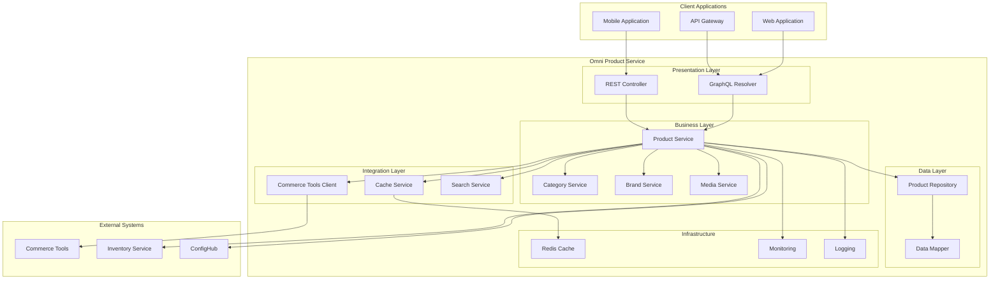

## Component Relationship Diagram

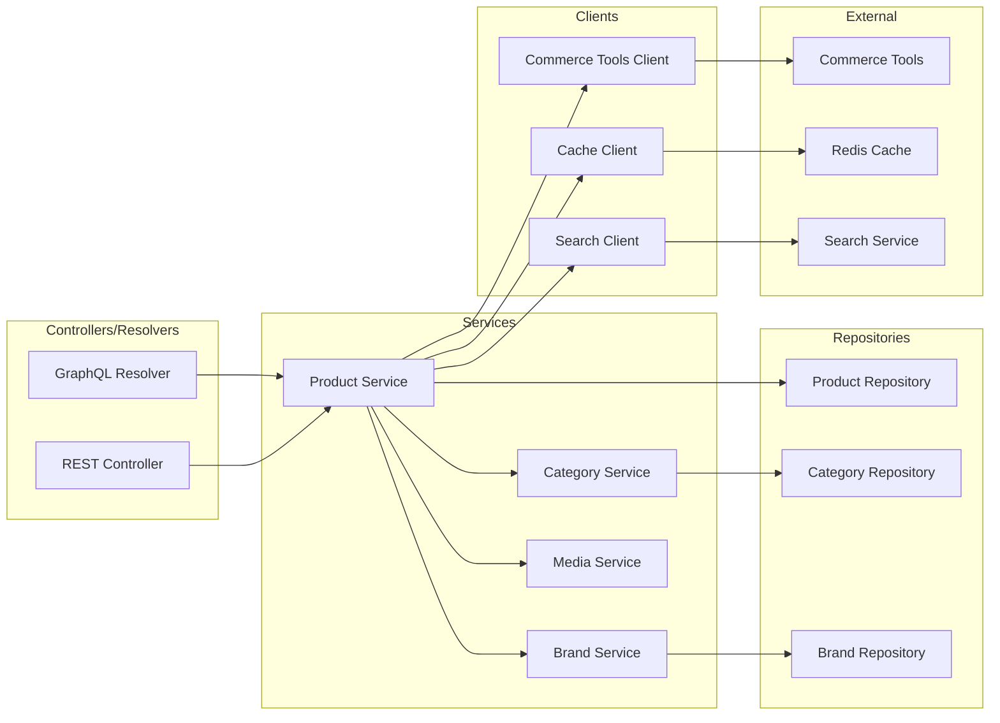

## Data Flow Diagram

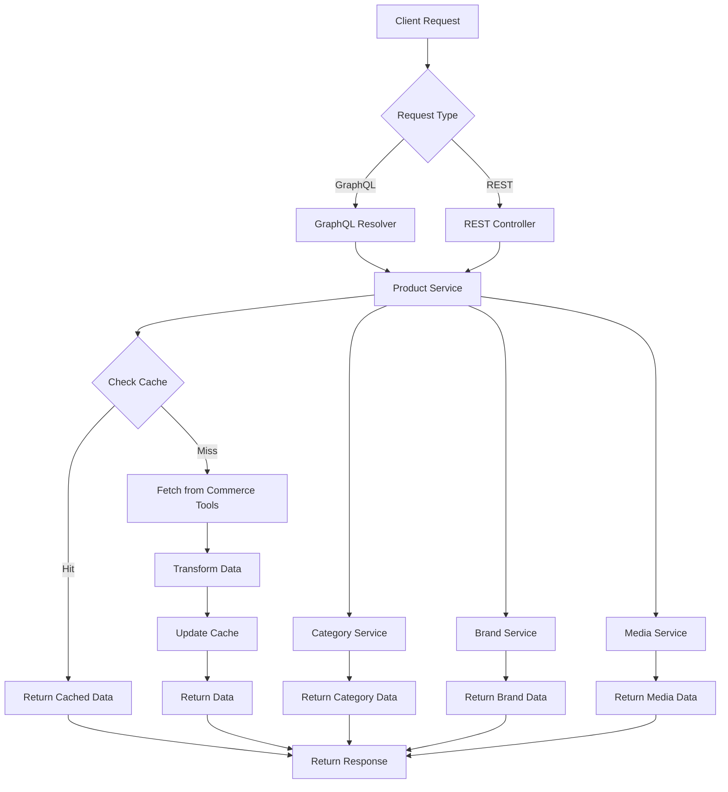

## Domain Model Diagram

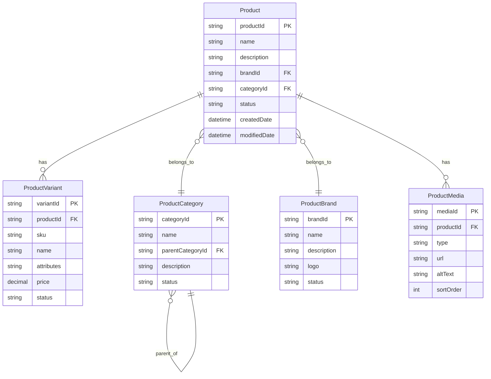

## Business Process Flow

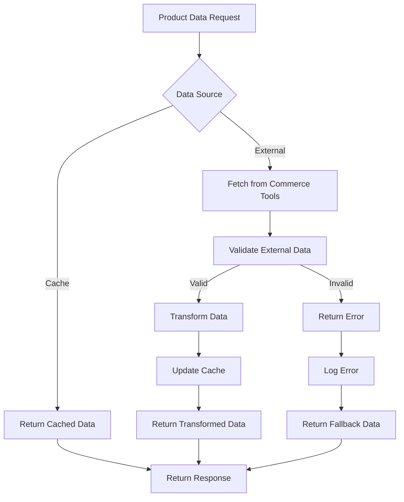

## Database Schema Diagram

## Infrastructure Architecture

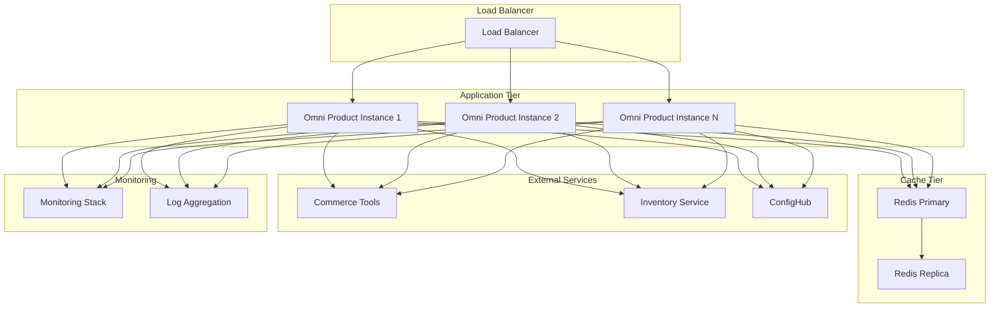

## Monitoring & Observability Stack

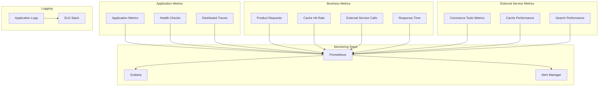

## Authentication Flow

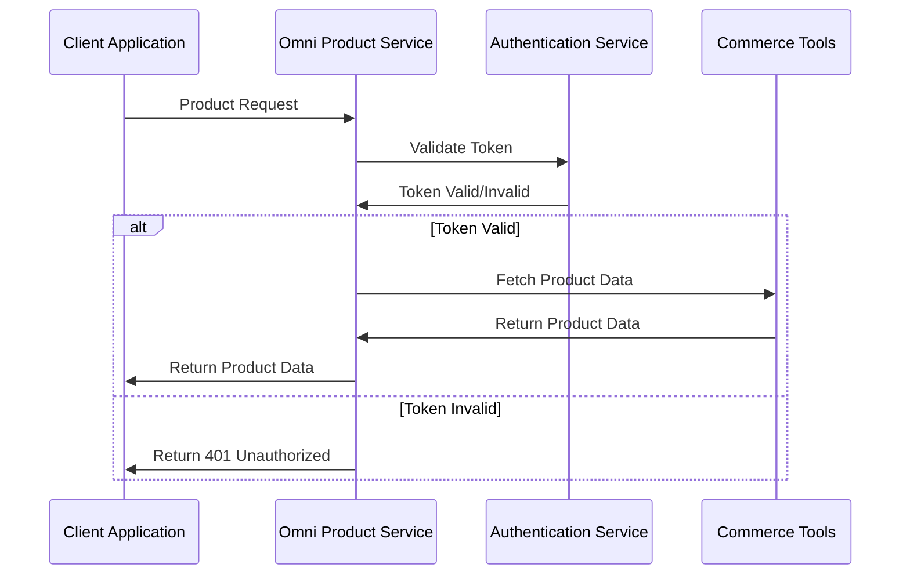

## Error Handling Flow

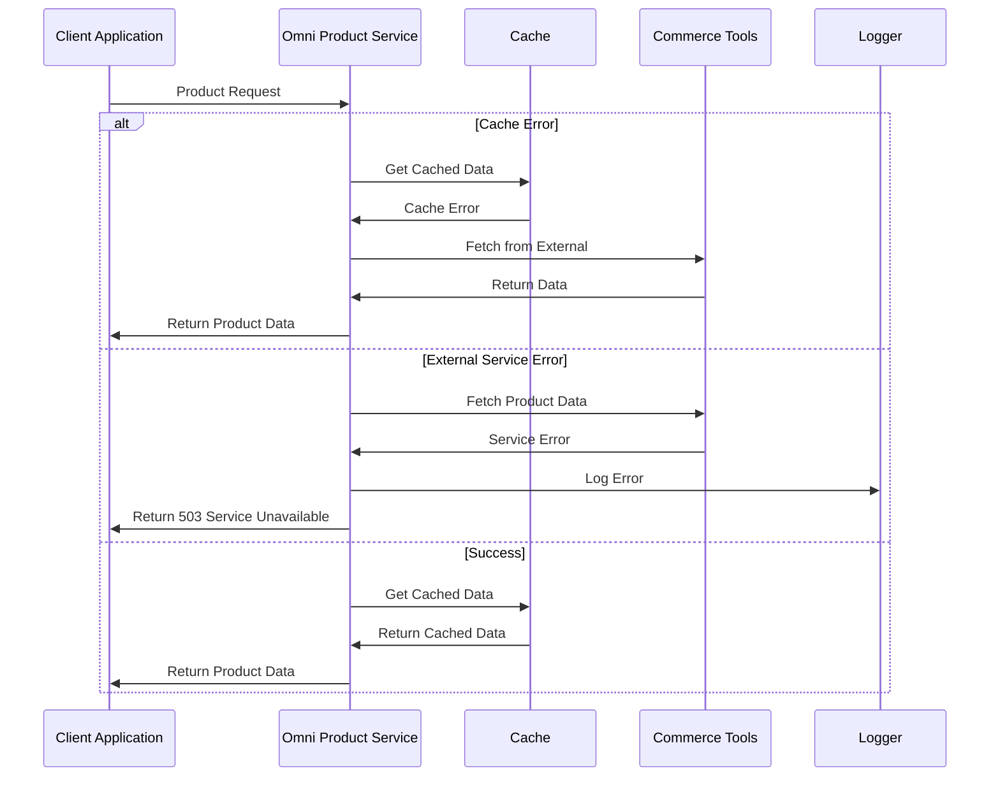

## Product Data Synchronization Flow

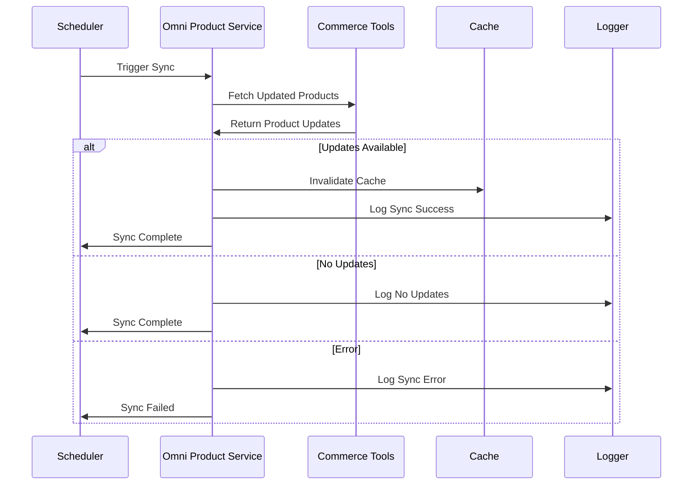

## GraphQL Query Processing Flow

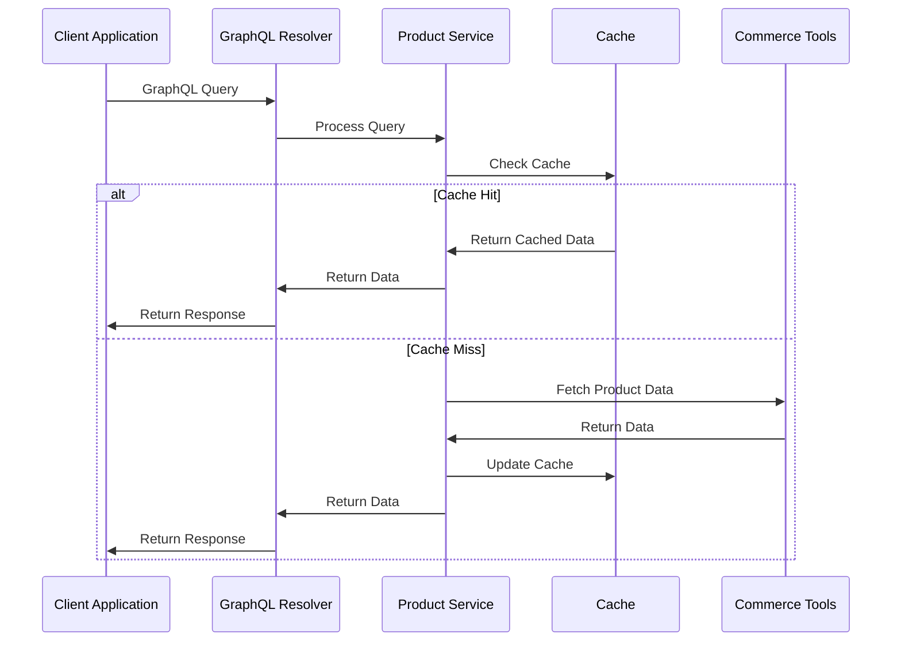

## Product Search Flow

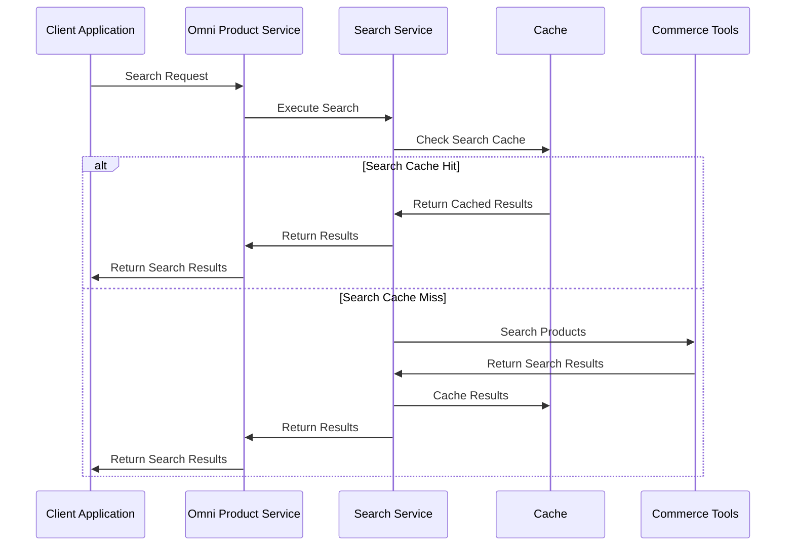

## Product Category Management Flow

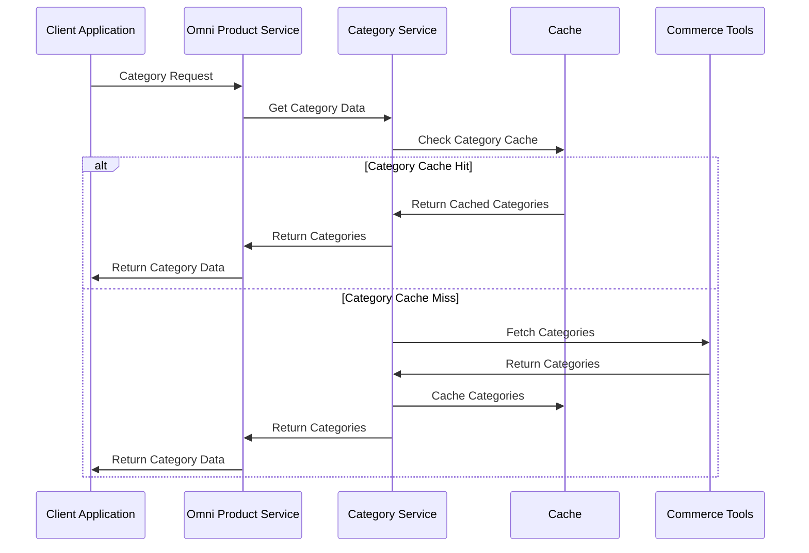
