# Omni Product Service Architecture Analysis

## Executive Summary

The Omni Product Service is a comprehensive product management system that provides unified product data access across multiple channels and platforms. It serves as a central hub for product information, handling product catalog management, inventory integration, and multi-channel product data synchronization.

### Key Technical Findings
- **GraphQL API**: Implements GraphQL for flexible product data queries
- **Commerce Tools Integration**: Connects with Commerce Tools for product data
- **Multi-Database Strategy**: Uses both MySQL and CosmosDB for different data types
- **Caching Layer**: Implements Redis caching for performance optimization
- **Event-Driven Architecture**: Uses Kafka for product change notifications

### Critical Concerns and Risks
- **Data Consistency**: Multi-database approach creates consistency challenges
- **Performance**: GraphQL queries may become complex and slow
- **Integration Complexity**: Multiple external system integrations
- **Data Synchronization**: Real-time sync between Commerce Tools and internal systems

### High-Level Recommendations
- Implement data consistency patterns across databases
- Optimize GraphQL query performance with proper resolvers
- Add comprehensive monitoring for external integrations
- Implement circuit breakers for external service dependencies

## Architecture Analysis

### System Architecture and Component Relationships

The Omni Product Service follows a layered microservices architecture with clear separation of concerns:

- **GraphQL Layer**: GraphQL resolvers and schema management
- **Controller Layer**: REST API endpoints for product operations
- **Service Layer**: Business logic for product management
- **Repository Layer**: Data access abstraction for multiple databases
- **Integration Layer**: External service integrations (Commerce Tools, etc.)
- **Event Layer**: Kafka event publishing and consumption

### Design Patterns and Architectural Decisions

- **GraphQL Pattern**: Flexible query interface for product data
- **Repository Pattern**: Abstracts data access across multiple databases
- **Adapter Pattern**: Commerce Tools integration adapter
- **Event-Driven Pattern**: Kafka-based event publishing
- **Caching Pattern**: Redis-based caching for performance
- **Circuit Breaker Pattern**: External service dependency protection

### Integration Patterns and External Dependencies

- **Commerce Tools**: Primary product data source
- **MySQL Database**: Relational data storage
- **CosmosDB**: NoSQL data storage for flexible schemas
- **Redis Cache**: Performance optimization through caching
- **Kafka**: Event streaming for product changes
- **GraphQL**: Flexible API interface

### Data Flow and Messaging Architecture

Product data flows through the system with the following pattern:
1. GraphQL/REST requests for product data
2. Service layer processes business logic
3. Repository layer accesses appropriate database
4. External integrations fetch additional data
5. Data aggregation and transformation
6. Response formatting and caching
7. Event publishing for data changes

## Security Analysis

### Authentication and Authorization Mechanisms

- **GraphQL Security**: Field-level authorization for GraphQL queries
- **REST API Security**: Standard REST authentication and authorization
- **External Service Security**: Secure integration with Commerce Tools
- **Data Access Control**: Role-based access to product data

### Security Vulnerabilities and Risks

- **GraphQL Introspection**: Potential information disclosure
- **Data Exposure**: Sensitive product data exposure risks
- **External Integration**: Commerce Tools integration security
- **Query Complexity**: GraphQL query complexity attacks

### Data Protection and Encryption

- **Database Encryption**: Data encryption at rest
- **Transport Security**: HTTPS for all API communications
- **External API Security**: Secure Commerce Tools API integration
- **Data Masking**: Sensitive product data masking

### Compliance and Regulatory Considerations

- **Data Privacy**: Product data privacy compliance
- **Audit Requirements**: Product data change audit trails
- **Data Retention**: Product data retention policies
- **Access Logging**: Comprehensive access logging

## Performance Analysis

### Database Performance and Optimization Opportunities

- **Query Optimization**: GraphQL query optimization and caching
- **Database Partitioning**: Consider partitioning for large product datasets
- **Connection Pooling**: Optimize database connection management
- **Indexing Strategy**: Proper indexing for product queries

### Application Performance Bottlenecks

- **GraphQL Resolution**: Complex GraphQL query resolution
- **External API Calls**: Commerce Tools API performance
- **Data Aggregation**: Multi-source data aggregation overhead
- **Cache Management**: Cache invalidation and management

### Caching Strategies and Effectiveness

- **GraphQL Caching**: Query result caching
- **Product Data Caching**: Frequently accessed product data
- **External API Caching**: Commerce Tools data caching
- **Cache Invalidation**: Smart cache invalidation strategies

### Infrastructure Performance Considerations

- **Database Scaling**: Multi-database scaling strategies
- **Cache Scaling**: Redis cluster scaling
- **Load Balancing**: GraphQL and REST load balancing
- **Resource Allocation**: CPU and memory optimization

## Code Quality Assessment

### Code Complexity and Maintainability

- **GraphQL Schema**: Well-structured GraphQL schema
- **Service Layer**: Clear business logic separation
- **Repository Pattern**: Effective data access abstraction
- **Integration Layer**: Clean external service integration

### Technical Debt Identification

- **GraphQL Optimization**: Query performance optimization needed
- **Error Handling**: Inconsistent error handling patterns
- **Documentation**: GraphQL schema documentation gaps
- **Testing Coverage**: Integration test coverage improvements

### Design Pattern Usage and Effectiveness

- **GraphQL Pattern**: Effective flexible query interface
- **Repository Pattern**: Good data access abstraction
- **Adapter Pattern**: Clean external service integration
- **Event-Driven Pattern**: Effective event publishing

### Error Handling and Resilience Patterns

- **Circuit Breaker**: External service dependency protection
- **Retry Logic**: External API retry mechanisms
- **Fallback Strategies**: Graceful degradation for external services
- **Error Logging**: Comprehensive error logging

## Testing Analysis

### Test Coverage and Quality Assessment

- **Unit Tests**: Service layer unit test coverage
- **Integration Tests**: Database and external service integration
- **GraphQL Tests**: GraphQL query and mutation testing
- **Performance Tests**: Load and stress testing

### Testing Strategy and Implementation

- **GraphQL Testing**: GraphQL query testing strategies
- **External Service Mocking**: Commerce Tools API mocking
- **Database Testing**: Multi-database testing approaches
- **Event Testing**: Kafka event testing

### Integration and End-to-End Testing

- **Commerce Tools Integration**: End-to-end integration testing
- **Database Integration**: Multi-database integration testing
- **Event Integration**: Kafka event flow testing
- **API Integration**: GraphQL and REST API testing

### Test Automation and CI/CD Integration

- **Automated Testing**: CI/CD pipeline integration
- **Test Environment**: Isolated test environment setup
- **Test Data Management**: Product test data management
- **Performance Testing**: Automated performance regression testing

## Authentication Flow

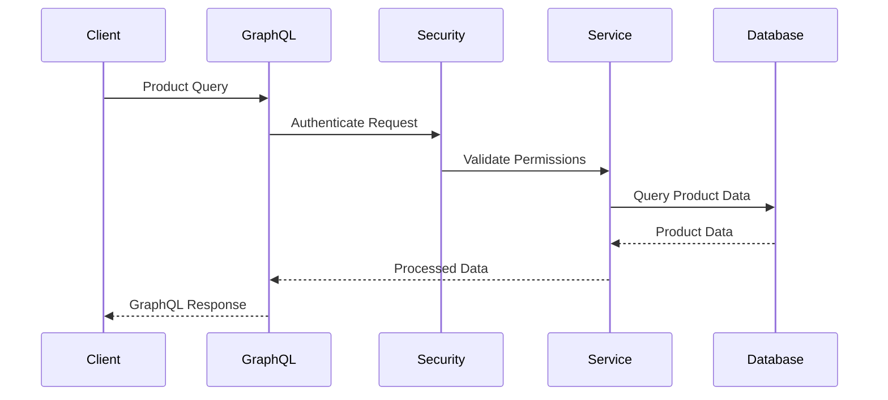

## Error Handling Flow

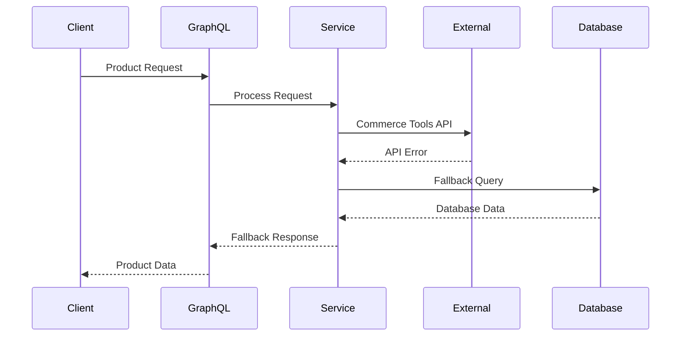

## Product Creation Flow

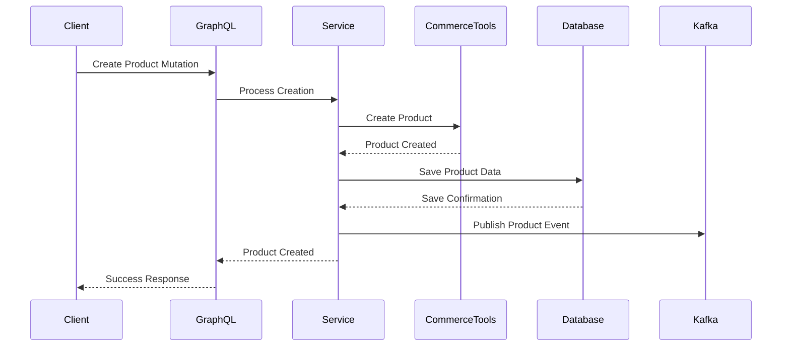

## Product Retrieval Flow

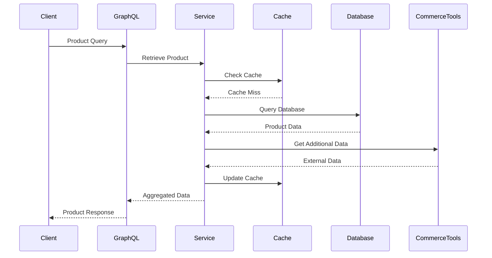

## Product Update Flow

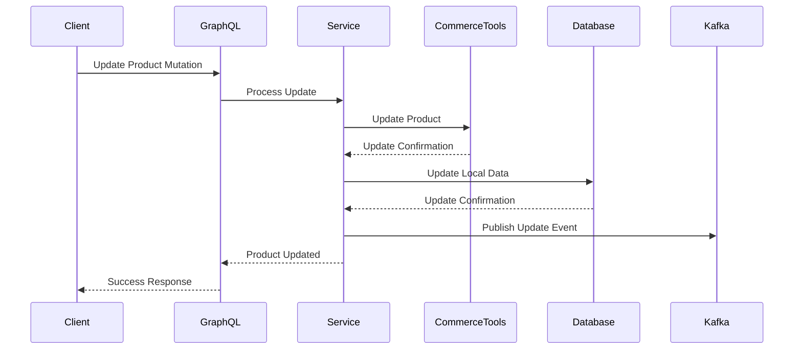

## Product Deletion Flow

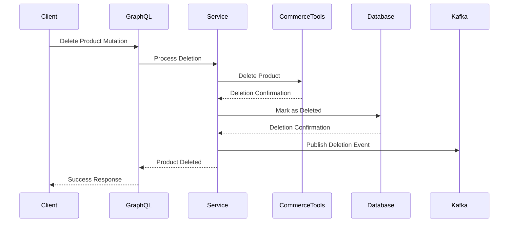

## Product Search Flow

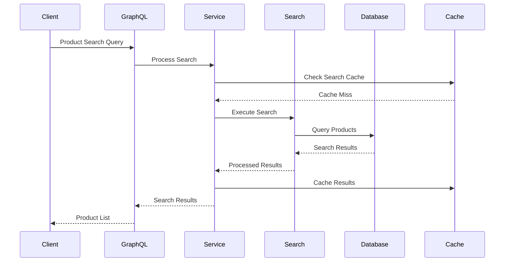

## Deployment & DevOps Analysis

### CI/CD Pipeline and Automation

- **Build Automation**: Maven-based build automation
- **Docker Containerization**: Containerized deployment
- **Environment Management**: Multi-environment deployment
- **GraphQL Schema Deployment**: Automated schema deployment

### Containerization and Orchestration

- **Docker Images**: Optimized Docker image creation
- **Kubernetes Deployment**: Container orchestration
- **Service Discovery**: Service registration and discovery
- **Health Checks**: Application health monitoring

### Infrastructure and Environment Management

- **Environment Configuration**: Environment-specific configurations
- **Database Management**: Multi-database configuration
- **Cache Management**: Redis cache configuration
- **External Service Configuration**: Commerce Tools configuration

### Monitoring and Observability Setup

- **GraphQL Metrics**: GraphQL query performance monitoring
- **External API Monitoring**: Commerce Tools API monitoring
- **Database Monitoring**: Multi-database performance monitoring
- **Event Monitoring**: Kafka event monitoring

## Infrastructure Architecture

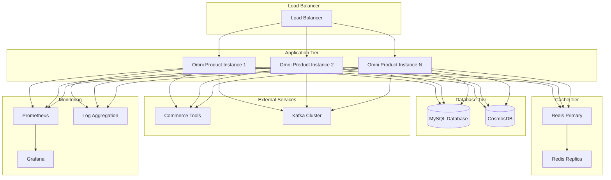

## Monitoring & Observability Stack

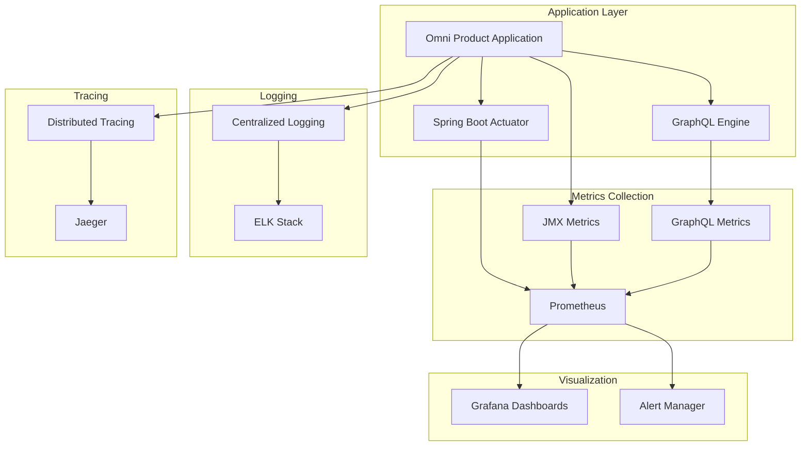

## Business Domain Analysis

### Domain Model and Business Entities

The Omni Product Service manages product entities with the following domain model:

- **Product**: Core product entity with basic information
- **ProductVariant**: Product variations and SKUs
- **ProductCategory**: Product categorization
- **ProductBrand**: Brand information
- **ProductMedia**: Product images and media
- **ProductInventory**: Inventory information
- **ProductPricing**: Pricing and availability

### Business Processes and Workflows

- **Product Management**: Create, read, update, delete products
- **Product Synchronization**: Sync with Commerce Tools
- **Product Search**: Advanced product search and filtering
- **Product Categorization**: Product category management
- **Inventory Integration**: Real-time inventory updates
- **Pricing Management**: Dynamic pricing and availability

### Business Rules and Validation Logic

- **Product Validation**: Product data validation rules
- **Category Hierarchy**: Product category hierarchy management
- **Inventory Rules**: Inventory availability rules
- **Pricing Rules**: Pricing calculation and validation
- **Brand Management**: Brand association and validation

### Integration Points and External Services

- **Commerce Tools**: Primary product data source
- **Inventory Service**: Real-time inventory data
- **Pricing Service**: Dynamic pricing information
- **Media Service**: Product image and media management
- **Search Service**: Product search and indexing

## Domain Model Diagram

```mermaid
classDiagram
    class Product {
        +String productId
        +String name
        +String description
        +String brandId
        +String categoryId
        +Boolean active
        +DateTime createdAt
        +DateTime updatedAt
        +List~ProductVariant~ variants
        +List~ProductMedia~ media
        +ProductInventory inventory
        +ProductPricing pricing
    }
    
    class ProductVariant {
        +String variantId
        +String productId
        +String sku
        +String name
        +Map~String, String~ attributes
        +ProductInventory inventory
        +ProductPricing pricing
    }
    
    class ProductCategory {
        +String categoryId
        +String name
        +String parentId
        +Integer level
        +Boolean active
    }
    
    class ProductBrand {
        +String brandId
        +String name
        +String description
        +String logo
        +Boolean active
    }
    
    class ProductMedia {
        +String mediaId
        +String productId
        +String type
        +String url
        +String altText
        +Integer order
    }
    
    class ProductInventory {
        +String inventoryId
        +String productId
        +Integer quantity
        +String location
        +Boolean available
    }
    
    class ProductPricing {
        +String pricingId
        +String productId
        +BigDecimal price
        +String currency
        +BigDecimal salePrice
        +DateTime validFrom
        +DateTime validTo
    }
    
    Product ||--o{ ProductVariant : "has"
    Product ||--o{ ProductMedia : "has"
    Product ||--|| ProductInventory : "has"
    Product ||--|| ProductPricing : "has"
    Product ||--|| ProductBrand : "belongs_to"
    Product ||--|| ProductCategory : "belongs_to"
    ProductCategory ||--o{ ProductCategory : "has_children"
```

## Business Process Flow

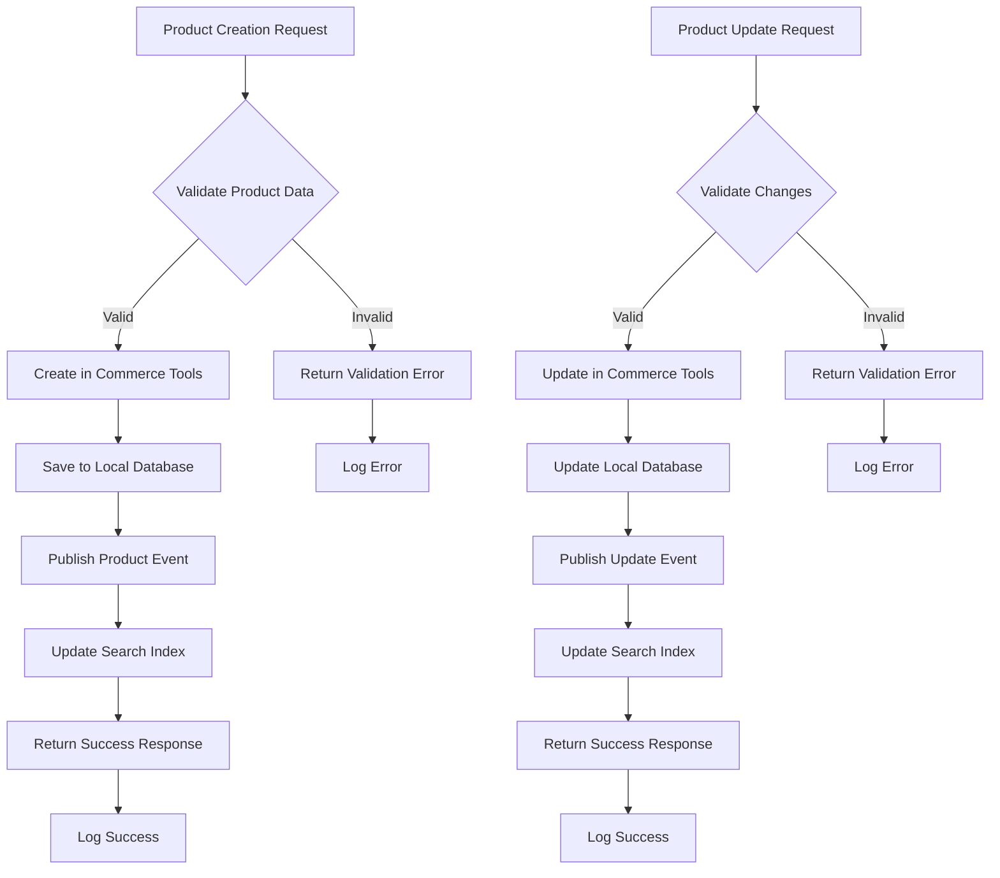

## Database Schema Diagram

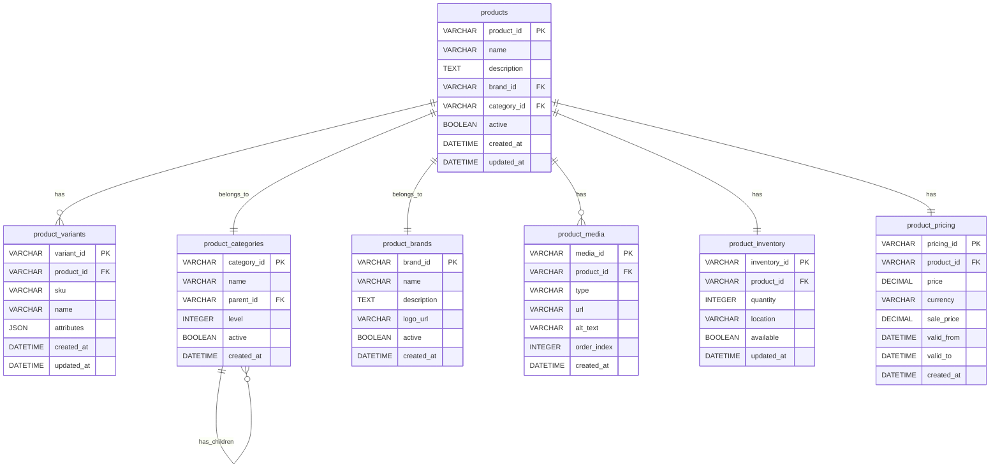

## Risk Assessment

### Technical Risks and Vulnerabilities

- **Data Consistency**: Multi-database consistency challenges
- **GraphQL Performance**: Complex query performance issues
- **External Dependencies**: Commerce Tools integration risks
- **Data Synchronization**: Real-time sync challenges
- **Cache Management**: Cache invalidation complexity

### Business Continuity Risks

- **External Service Dependency**: Commerce Tools availability
- **Data Loss**: Product data loss risks
- **Performance Degradation**: Slow product queries impact business
- **Integration Failures**: External service integration failures

### Performance and Scalability Concerns

- **GraphQL Query Complexity**: Complex query performance
- **Database Scaling**: Multi-database scaling challenges
- **Cache Performance**: Redis cache performance under load
- **External API Limits**: Commerce Tools API rate limits

### Security Threats and Mitigation Strategies

- **GraphQL Security**: Implement query complexity limits
- **Data Exposure**: Encrypt sensitive product data
- **External API Security**: Secure Commerce Tools integration
- **Access Control**: Implement proper authorization

## Detailed Recommendations

### Immediate Actions (High Priority)

1. **GraphQL Optimization**: Implement query complexity limits and caching
2. **Data Consistency**: Implement consistency patterns across databases
3. **External Service Resilience**: Add circuit breakers for Commerce Tools
4. **Performance Monitoring**: Implement comprehensive performance monitoring
5. **Error Handling**: Improve error handling and recovery mechanisms

### Short-Term Improvements (Medium Priority)

1. **Cache Strategy**: Optimize caching strategy and invalidation
2. **Database Optimization**: Optimize database queries and indexing
3. **Event Processing**: Improve Kafka event processing
4. **Testing Coverage**: Increase integration test coverage
5. **Documentation**: Complete GraphQL schema documentation

### Long-term Strategic Enhancements (Low Priority)

1. **Microservices Evolution**: Consider breaking down into smaller services
2. **Database Migration**: Evaluate database consolidation strategies
3. **Event Sourcing**: Implement event sourcing for product changes
4. **API Gateway**: Implement API gateway for enhanced security
5. **Multi-Region Deployment**: Implement multi-region deployment

## Action Plan

### Phase 1: Critical Fixes (1-2 weeks)

- Implement GraphQL query complexity limits
- Add circuit breakers for external services
- Optimize database queries and indexing
- Improve error handling and logging
- Set up basic performance monitoring

### Phase 2: Quality Improvements (1-2 months)

- Implement comprehensive caching strategy
- Add data consistency patterns
- Enhance external service integration
- Improve GraphQL schema documentation
- Increase test coverage

### Phase 3: Strategic Enhancements (3-6 months)

- Evaluate microservices architecture evolution
- Consider database consolidation strategies
- Implement advanced monitoring and alerting
- Plan for multi-region deployment
- Enhance disaster recovery procedures
