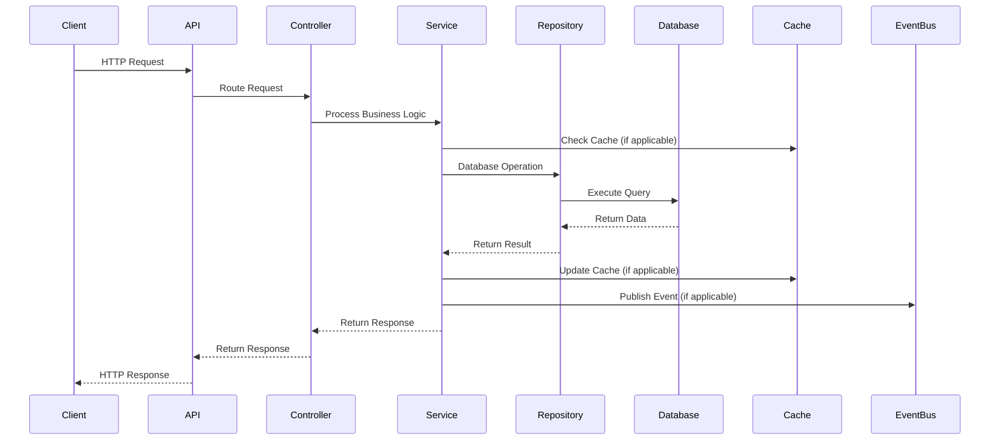
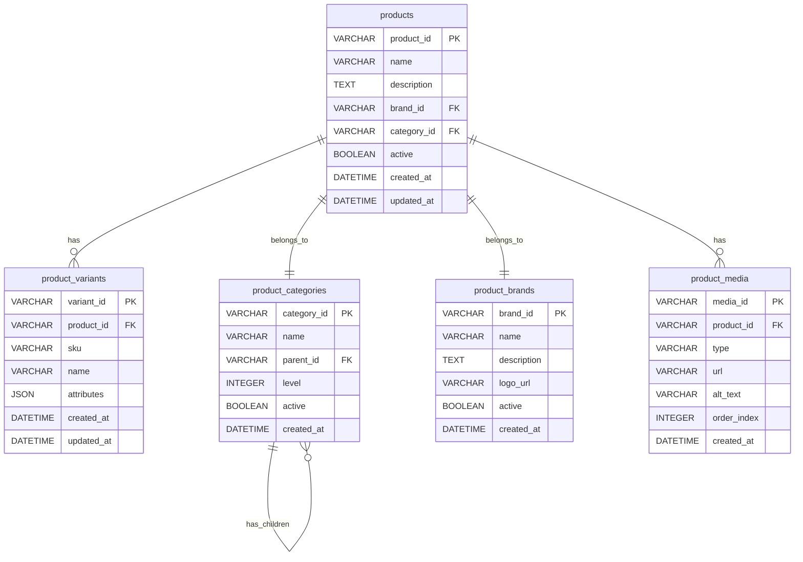

# Omni Product Service API Contract

## API Overview

The Omni Product Service provides a comprehensive product management API that enables flexible product data queries through GraphQL and REST endpoints. This service serves as the central hub for product information, handling product catalog management, product search, and product-related operations in the Sephora ecosystem.

### Service Purpose and Scope
- **Product Management**: Create, read, update, and delete product information
- **GraphQL API**: Flexible query interface for product data retrieval
- **Product Search**: Advanced product search and filtering capabilities
- **Product Aggregation**: Product data aggregation and transformation
- **Commerce Tools Integration**: Integration with external product data source

### API Versioning Strategy
- **Current Version**: v1
- **Versioning Approach**: URL path versioning (`/v1/items`)
- **Backward Compatibility**: Maintained through additive changes
- **Deprecation Policy**: 6-month deprecation notice for breaking changes

### Base URL and Endpoints
- **Base URL**: `/v1/items`
- **GraphQL Endpoint**: `/graphql`
- **Authentication**: Required for all endpoints
- **Content-Type**: `application/json`
- **Response Format**: JSON

### Authentication Requirements
- **Authentication Type**: Bearer Token
- **Authorization**: Role-based access control
- **Required Headers**: `Authorization: Bearer <token>`
- **API Key**: Alternative authentication method available

## Request/Response Contracts

### Endpoint: `POST /v1/items`

**Description**: Create a new product item

**Authentication**: Required

**Request Headers**:
- `Authorization: Bearer <token>` (required)
- `Content-Type: application/json` (required)
- `X-Request-ID: <uuid>` (optional)

**Request Body**:
```json
{
  "name": "string",
  "description": "string",
  "brandId": "string",
  "categoryId": "string",
  "active": true,
  "variants": [
    {
      "sku": "string",
      "name": "string",
      "attributes": {
        "color": "string",
        "size": "string"
      }
    }
  ]
}
```

**Request Parameters**: None

**Response Codes**:
- `201 Created`: Product created successfully
- `400 Bad Request`: Validation error
- `401 Unauthorized`: Authentication required
- `403 Forbidden`: Insufficient permissions
- `409 Conflict`: Product already exists
- `500 Internal Server Error`: Server error

**Success Response (201)**:
```json
{
  "status": "success",
  "data": {
    "productId": "PROD123",
    "name": "Sephora Collection Foundation",
    "description": "Long-lasting foundation for all skin types",
    "brandId": "SEPHORA",
    "categoryId": "MAKEUP_FOUNDATION",
    "active": true,
    "createdAt": "2024-01-15T10:30:00Z",
    "updatedAt": "2024-01-15T10:30:00Z",
    "variants": [
      {
        "variantId": "VAR456",
        "sku": "SEPHORA-FOUNDATION-001",
        "name": "Sephora Foundation - Light",
        "attributes": {
          "color": "Light",
          "size": "30ml"
        }
      }
    ]
  }
}
```

**Error Response (400)**:
```json
{
  "status": "error",
  "message": "Validation failed",
  "errors": [
    {
      "field": "name",
      "message": "Product name is required"
    },
    {
      "field": "brandId",
      "message": "Brand ID is required"
    }
  ]
}
```

### Endpoint: `GET /v1/items`

**Description**: Retrieve all products with optional filtering and pagination

**Authentication**: Required

**Request Headers**:
- `Authorization: Bearer <token>` (required)
- `X-Request-ID: <uuid>` (optional)

**Request Body**: None

**Request Parameters**:
- `pageNumber` (integer, optional): Page number for pagination (default: 0)
- `pageSize` (integer, optional): Number of items per page (default: 20)
- `sort` (string, optional): Sort field (default: "productId")
- `brandId` (string, optional): Filter by brand ID
- `categoryId` (string, optional): Filter by category ID
- `active` (boolean, optional): Filter by active status

**Response Codes**:
- `200 OK`: Products retrieved successfully
- `401 Unauthorized`: Authentication required
- `403 Forbidden`: Insufficient permissions
- `500 Internal Server Error`: Server error

**Success Response (200)**:
```json
{
  "status": "success",
  "data": {
    "content": [
      {
        "productId": "PROD123",
        "name": "Sephora Collection Foundation",
        "description": "Long-lasting foundation for all skin types",
        "brandId": "SEPHORA",
        "categoryId": "MAKEUP_FOUNDATION",
        "active": true,
        "createdAt": "2024-01-15T10:30:00Z",
        "updatedAt": "2024-01-15T10:30:00Z"
      }
    ],
    "totalElements": 1,
    "totalPages": 1,
    "size": 20,
    "number": 0,
    "first": true,
    "last": true
  }
}
```

### Endpoint: `GET /v1/items/{productId}`

**Description**: Retrieve a specific product by ID

**Authentication**: Required

**Request Headers**:
- `Authorization: Bearer <token>` (required)
- `X-Request-ID: <uuid>` (optional)

**Request Body**: None

**Request Parameters**:
- `productId` (string, required): Product ID

**Response Codes**:
- `200 OK`: Product retrieved successfully
- `401 Unauthorized`: Authentication required
- `403 Forbidden`: Insufficient permissions
- `404 Not Found`: Product not found
- `500 Internal Server Error`: Server error

**Success Response (200)**:
```json
{
  "status": "success",
  "data": {
    "productId": "PROD123",
    "name": "Sephora Collection Foundation",
    "description": "Long-lasting foundation for all skin types",
    "brandId": "SEPHORA",
    "categoryId": "MAKEUP_FOUNDATION",
    "active": true,
    "createdAt": "2024-01-15T10:30:00Z",
    "updatedAt": "2024-01-15T10:30:00Z",
    "variants": [
      {
        "variantId": "VAR456",
        "sku": "SEPHORA-FOUNDATION-001",
        "name": "Sephora Foundation - Light",
        "attributes": {
          "color": "Light",
          "size": "30ml"
        }
      }
    ]
  }
}
```

**Error Response (404)**:
```json
{
  "status": "error",
  "message": "Product not found",
  "productId": "PROD123"
}
```

### Endpoint: `PUT /v1/items/{productId}`

**Description**: Update an existing product

**Authentication**: Required

**Request Headers**:
- `Authorization: Bearer <token>` (required)
- `Content-Type: application/json` (required)
- `X-Request-ID: <uuid>` (optional)

**Request Body**:
```json
{
  "name": "string",
  "description": "string",
  "brandId": "string",
  "categoryId": "string",
  "active": true,
  "variants": [
    {
      "sku": "string",
      "name": "string",
      "attributes": {
        "color": "string",
        "size": "string"
      }
    }
  ]
}
```

**Request Parameters**:
- `productId` (string, required): Product ID

**Response Codes**:
- `200 OK`: Product updated successfully
- `400 Bad Request`: Validation error
- `401 Unauthorized`: Authentication required
- `403 Forbidden`: Insufficient permissions
- `404 Not Found`: Product not found
- `500 Internal Server Error`: Server error

**Success Response (200)**:
```json
{
  "status": "success",
  "data": {
    "productId": "PROD123",
    "name": "Updated Sephora Collection Foundation",
    "description": "Updated long-lasting foundation for all skin types",
    "brandId": "SEPHORA",
    "categoryId": "MAKEUP_FOUNDATION",
    "active": true,
    "createdAt": "2024-01-15T10:30:00Z",
    "updatedAt": "2024-01-15T11:45:00Z",
    "variants": [
      {
        "variantId": "VAR456",
        "sku": "SEPHORA-FOUNDATION-001",
        "name": "Updated Sephora Foundation - Light",
        "attributes": {
          "color": "Light",
          "size": "30ml"
        }
      }
    ]
  }
}
```

### Endpoint: `DELETE /v1/items/{productId}`

**Description**: Delete a product

**Authentication**: Required

**Request Headers**:
- `Authorization: Bearer <token>` (required)
- `X-Request-ID: <uuid>` (optional)

**Request Body**: None

**Request Parameters**:
- `productId` (string, required): Product ID

**Response Codes**:
- `200 OK`: Product deleted successfully
- `401 Unauthorized`: Authentication required
- `403 Forbidden`: Insufficient permissions
- `404 Not Found`: Product not found
- `500 Internal Server Error`: Server error

**Success Response (200)**:
```json
{
  "status": "success",
  "message": "Product deleted successfully",
  "productId": "PROD123"
}
```

### GraphQL Endpoint: `POST /graphql`

**Description**: GraphQL query endpoint for flexible product data retrieval

**Authentication**: Required

**Request Headers**:
- `Authorization: Bearer <token>` (required)
- `Content-Type: application/json` (required)
- `X-Request-ID: <uuid>` (optional)

**Request Body**:
```json
{
  "query": "query GetProduct($productId: ID!) { product(productId: $productId) { productId name description brandId categoryId active variants { variantId sku name attributes } } }",
  "variables": {
    "productId": "PROD123"
  }
}
```

**Response Codes**:
- `200 OK`: GraphQL query executed successfully
- `400 Bad Request`: GraphQL query error
- `401 Unauthorized`: Authentication required
- `403 Forbidden`: Insufficient permissions
- `500 Internal Server Error`: Server error

**Success Response (200)**:
```json
{
  "data": {
    "product": {
      "productId": "PROD123",
      "name": "Sephora Collection Foundation",
      "description": "Long-lasting foundation for all skin types",
      "brandId": "SEPHORA",
      "categoryId": "MAKEUP_FOUNDATION",
      "active": true,
      "variants": [
        {
          "variantId": "VAR456",
          "sku": "SEPHORA-FOUNDATION-001",
          "name": "Sephora Foundation - Light",
          "attributes": {
            "color": "Light",
            "size": "30ml"
          }
        }
      ]
    }
  }
}
```

**Error Response (400)**:
```json
{
  "errors": [
    {
      "message": "Cannot query field 'invalidField' on type 'Product'",
      "locations": [
        {
          "line": 1,
          "column": 10
        }
      ]
    }
  ]
}
```

## Data Models

### Request DTOs

#### ProductCreateRequestDto
```json
{
  "name": "string",
  "description": "string",
  "brandId": "string",
  "categoryId": "string",
  "active": "boolean",
  "variants": [
    {
      "sku": "string",
      "name": "string",
      "attributes": {
        "color": "string",
        "size": "string"
      }
    }
  ]
}
```

#### ProductUpdateRequestDto
```json
{
  "name": "string",
  "description": "string",
  "brandId": "string",
  "categoryId": "string",
  "active": "boolean",
  "variants": [
    {
      "sku": "string",
      "name": "string",
      "attributes": {
        "color": "string",
        "size": "string"
      }
    }
  ]
}
```

### Response DTOs

#### ProductResponseDto
```json
{
  "productId": "string",
  "name": "string",
  "description": "string",
  "brandId": "string",
  "categoryId": "string",
  "active": "boolean",
  "createdAt": "datetime",
  "updatedAt": "datetime",
  "variants": [
    {
      "variantId": "string",
      "sku": "string",
      "name": "string",
      "attributes": {
        "color": "string",
        "size": "string"
      }
    }
  ]
}
```

#### ProductListResponseDto
```json
{
  "content": [
    {
      "productId": "string",
      "name": "string",
      "description": "string",
      "brandId": "string",
      "categoryId": "string",
      "active": "boolean",
      "createdAt": "datetime",
      "updatedAt": "datetime"
    }
  ],
  "totalElements": "long",
  "totalPages": "int",
  "size": "int",
  "number": "int",
  "first": "boolean",
  "last": "boolean"
}
```

### Entity Models

#### Product Entity
```json
{
  "productId": "String (Primary Key)",
  "name": "String (Product name)",
  "description": "String (Product description)",
  "brandId": "String (Brand ID)",
  "categoryId": "String (Category ID)",
  "active": "Boolean (Active status)",
  "createdAt": "LocalDateTime (Creation timestamp)",
  "updatedAt": "LocalDateTime (Modification timestamp)",
  "variants": "List<ProductVariant> (Product variants)"
}
```

#### ProductVariant Entity
```json
{
  "variantId": "String (Primary Key)",
  "productId": "String (Product ID - Foreign Key)",
  "sku": "String (Stock keeping unit)",
  "name": "String (Variant name)",
  "attributes": "Map<String, String> (Variant attributes)",
  "createdAt": "LocalDateTime (Creation timestamp)",
  "updatedAt": "LocalDateTime (Modification timestamp)"
}
```

### Validation Rules

#### Product Validation
- **name**: Required, max length 255 characters
- **description**: Optional, max length 1000 characters
- **brandId**: Required, must reference existing brand
- **categoryId**: Required, must reference existing category
- **active**: Optional, boolean value
- **variants**: Optional, array of product variants

#### ProductVariant Validation
- **sku**: Required, max length 100 characters, unique
- **name**: Required, max length 255 characters
- **attributes**: Optional, JSON object with variant attributes
- **productId**: Required, must reference existing product

## Integration Contracts

### External Service Dependencies

#### Commerce Tools
- **Purpose**: Primary product data source
- **Integration Type**: REST API integration
- **Dependencies**: Commerce Tools API client
- **Configuration**: Commerce Tools API credentials and endpoints

#### MySQL Database
- **Purpose**: Relational data storage for product information
- **Integration Type**: Database connection
- **Dependencies**: MySQL connector, Spring Data JPA
- **Configuration**: Database connection properties

#### Redis Cache
- **Purpose**: Performance optimization through caching
- **Integration Type**: Cache integration
- **Dependencies**: Spring Boot Redis starter
- **Configuration**: Redis connection properties

#### Kafka Event Bus
- **Purpose**: Event-driven communication for product changes
- **Integration Type**: Message bus integration
- **Dependencies**: Spring Cloud Stream Kafka binder
- **Configuration**: Kafka broker properties and topic configuration

### Event Contracts

#### Product Created Event
```json
{
  "eventType": "PRODUCT_CREATED",
  "productId": "string",
  "name": "string",
  "brandId": "string",
  "categoryId": "string",
  "timestamp": "datetime",
  "source": "string"
}
```

#### Product Updated Event
```json
{
  "eventType": "PRODUCT_UPDATED",
  "productId": "string",
  "name": "string",
  "brandId": "string",
  "categoryId": "string",
  "timestamp": "datetime",
  "source": "string"
}
```

#### Product Deleted Event
```json
{
  "eventType": "PRODUCT_DELETED",
  "productId": "string",
  "timestamp": "datetime",
  "source": "string"
}
```

### Database Contracts

#### Database Schema Overview
The Omni Product Service uses a MySQL database with the following schema:

- **products**: Main product table storing all product information
- **product_variants**: Product variants and SKUs
- **product_categories**: Product categorization
- **product_brands**: Brand information
- **product_media**: Product images and media

#### Database Relationships
- **products** (1) → **product_variants** (many): One product can have many variants
- **products** (many) → **product_brands** (1): Many products belong to one brand
- **products** (many) → **product_categories** (1): Many products belong to one category
- **products** (1) → **product_media** (many): One product can have many media items

#### Database Constraints
- **Primary Keys**: All tables have auto-incrementing primary keys
- **Foreign Keys**: Proper foreign key constraints for referential integrity
- **Unique Constraints**: Product SKUs must be unique
- **Indexes**: Indexes on frequently queried fields (brandId, categoryId, active)

## API Endpoint Map

```mermaid
graph TB
    subgraph "Omni Product API"
        API[API Gateway]
        
        subgraph "Product Management"
            CREATE[POST /v1/items]
            READ[GET /v1/items]
            READ_ID[GET /v1/items/{id}]
            UPDATE[PUT /v1/items/{id}]
            DELETE[DELETE /v1/items/{id}]
        end
        
        subgraph "GraphQL"
            GRAPHQL[POST /graphql]
        end
    end
    
    API --> CREATE
    API --> READ
    API --> READ_ID
    API --> UPDATE
    API --> DELETE
    API --> GRAPHQL
```

## Request/Response Flow



## Data Model Relationships


```
```
