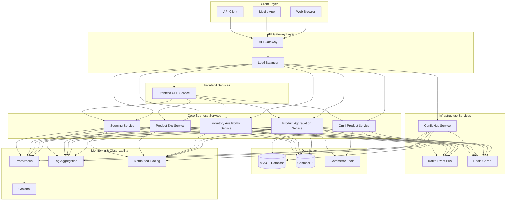
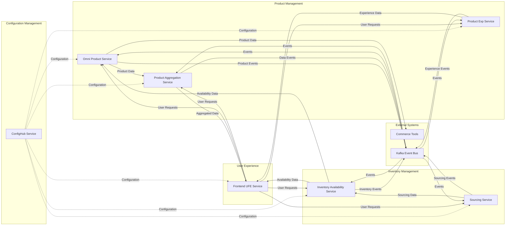
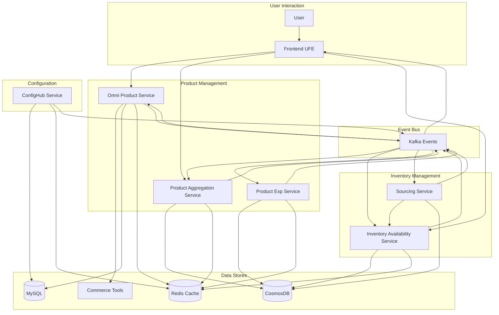
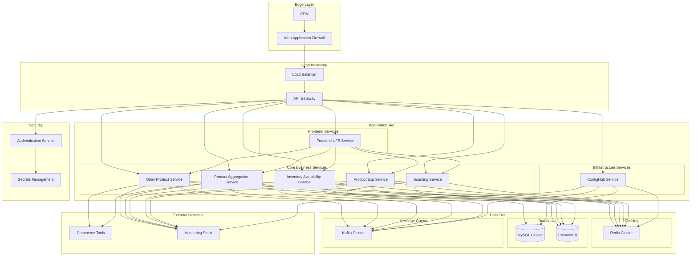
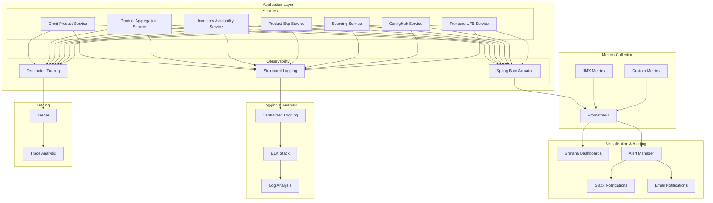
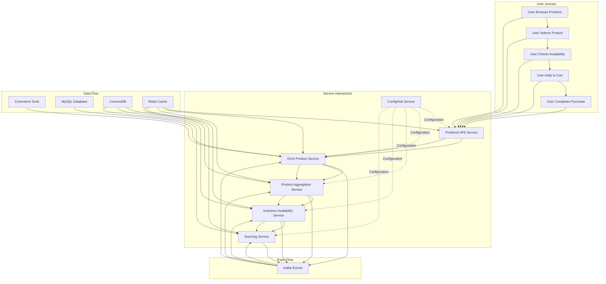
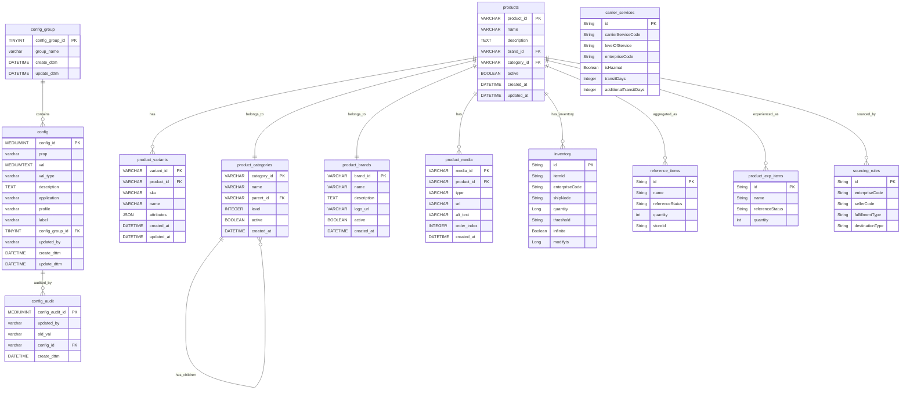

# Overall System Architecture Analysis

## Executive Summary

The Sephora microservices ecosystem represents a comprehensive e-commerce platform built on modern cloud-native architecture principles. The system consists of seven core services that work together to provide a complete product management, inventory, configuration, and frontend experience. This architecture follows microservices patterns with clear service boundaries, event-driven communication, and distributed data management.

### Complete System Overview and Business Context

The Sephora platform serves as a multi-channel e-commerce solution that manages product catalogs, inventory availability, configuration management, and user experience across web and mobile channels. The system handles product data synchronization, real-time inventory updates, dynamic configuration management, and seamless user interactions.

### Multi-Service Architecture Patterns

- **Microservices Architecture**: Each service operates independently with its own data store and business logic
- **Event-Driven Communication**: Kafka-based event streaming for service-to-service communication
- **API-First Design**: REST and GraphQL APIs for service integration
- **Distributed Data Management**: Multi-database strategy with MySQL, CosmosDB, and Redis
- **Service Discovery**: Centralized service registration and discovery
- **Configuration Management**: Centralized configuration via ConfigHub service

### Cross-Service Integration Strategies

- **Synchronous Communication**: REST APIs for direct service-to-service calls
- **Asynchronous Communication**: Kafka events for decoupled service communication
- **Shared Configuration**: ConfigHub service for centralized configuration management
- **Data Consistency**: Event sourcing and saga patterns for distributed transactions
- **Circuit Breaker Pattern**: Resilience patterns for external service dependencies

### System-Wide Technical Decisions

- **Spring Boot Framework**: Consistent Java-based microservices
- **Container Orchestration**: Kubernetes for deployment and scaling
- **Monitoring Stack**: Prometheus, Grafana, and ELK for observability
- **Security**: OAuth2/JWT for authentication and authorization
- **Caching Strategy**: Redis for distributed caching across services

## System Architecture Overview

### High-Level System Architecture Across All Services

The system architecture follows a layered approach with clear separation between presentation, business logic, data access, and infrastructure layers. Each service maintains its own bounded context while communicating through well-defined APIs and events.

### Service Boundaries and Responsibilities

1. **ConfigHub Service**: Centralized configuration management and distribution
2. **Omni Product Service**: Product catalog management and GraphQL API
3. **Product Aggregation Service**: Product data aggregation and transformation
4. **Inventory Availability Service**: Real-time inventory management and availability
5. **Product Exp Service**: Product experience and user interaction management
6. **Sourcing Service**: Product sourcing and supply chain management
7. **Frontend UFE**: User interface and experience management

### Inter-Service Communication Patterns

- **REST APIs**: Direct service-to-service communication for synchronous operations
- **GraphQL**: Flexible data querying for product information
- **Kafka Events**: Asynchronous event-driven communication for data changes
- **Service Mesh**: Service-to-service communication management and observability
- **API Gateway**: Centralized API management and routing

### Data Flow Across the Entire System

Data flows through the system in multiple patterns:
1. **Configuration Flow**: ConfigHub distributes configuration to all services
2. **Product Data Flow**: Product services manage and distribute product information
3. **Inventory Flow**: Inventory service provides real-time availability data
4. **User Interaction Flow**: Frontend service manages user interactions
5. **Event Flow**: Kafka events propagate changes across the system

## Complete System Architecture Diagram



## Service Interaction Map



## Cross-Service Data Flow



## Infrastructure Overview

```mermaid
graph TB
    subgraph "Load Balancing"
        LB[Load Balancer]
        CDN[CDN]
    end
    
    subgraph "Application Tier"
        subgraph "Frontend"
            UFE1[UFE Instance 1]
            UFE2[UFE Instance 2]
        end
        
        subgraph "Core Services"
            OPS1[OPS Instance 1]
            OPS2[OPS Instance 2]
            PAS1[PAS Instance 1]
            PAS2[PAS Instance 2]
            IAS1[IAS Instance 1]
            IAS2[IAS Instance 2]
            PES1[PES Instance 1]
            PES2[PES Instance 2]
            SS1[SS Instance 1]
            SS2[SS Instance 2]
        end
        
        subgraph "Infrastructure"
            CH1[ConfigHub Instance 1]
            CH2[ConfigHub Instance 2]
        end
    end
    
    subgraph "Cache Tier"
        REDIS1[Redis Primary]
        REDIS2[Redis Replica]
    end
    
    subgraph "Database Tier"
        MYSQL1[(MySQL Primary)]
        MYSQL2[(MySQL Replica)]
        COSMOS1[(CosmosDB Primary)]
        COSMOS2[(CosmosDB Replica)]
    end
    
    subgraph "Message Queue"
        KAFKA1[Kafka Broker 1]
        KAFKA2[Kafka Broker 2]
        KAFKA3[Kafka Broker 3]
    end
    
    subgraph "External Services"
        COMMERCE[Commerce Tools]
        MONITORING[Monitoring Stack]
    end
    
    CDN --> LB
    LB --> UFE1
    LB --> UFE2
    LB --> OPS1
    LB --> OPS2
    LB --> PAS1
    LB --> PAS2
    LB --> IAS1
    LB --> IAS2
    LB --> PES1
    LB --> PES2
    LB --> SS1
    LB --> SS2
    LB --> CH1
    LB --> CH2
    
    UFE1 --> REDIS1
    UFE2 --> REDIS1
    OPS1 --> REDIS1
    OPS2 --> REDIS1
    PAS1 --> REDIS1
    PAS2 --> REDIS1
    IAS1 --> REDIS1
    IAS2 --> REDIS1
    PES1 --> REDIS1
    PES2 --> REDIS1
    SS1 --> REDIS1
    SS2 --> REDIS1
    CH1 --> REDIS1
    CH2 --> REDIS1
    
    REDIS1 --> REDIS2
    
    OPS1 --> MYSQL1
    OPS2 --> MYSQL1
    CH1 --> MYSQL1
    CH2 --> MYSQL1
    
    PAS1 --> COSMOS1
    PAS2 --> COSMOS1
    IAS1 --> COSMOS1
    IAS2 --> COSMOS1
    PES1 --> COSMOS1
    PES2 --> COSMOS1
    SS1 --> COSMOS1
    SS2 --> COSMOS1
    
    MYSQL1 --> MYSQL2
    COSMOS1 --> COSMOS2
    
    OPS1 --> KAFKA1
    OPS2 --> KAFKA1
    PAS1 --> KAFKA2
    PAS2 --> KAFKA2
    IAS1 --> KAFKA3
    IAS2 --> KAFKA3
    PES1 --> KAFKA1
    PES2 --> KAFKA1
    SS1 --> KAFKA2
    SS2 --> KAFKA2
    CH1 --> KAFKA3
    CH2 --> KAFKA3
    
    OPS1 --> COMMERCE
    OPS2 --> COMMERCE
    PAS1 --> COMMERCE
    PAS2 --> COMMERCE
    
    OPS1 --> MONITORING
    OPS2 --> MONITORING
    PAS1 --> MONITORING
    PAS2 --> MONITORING
    IAS1 --> MONITORING
    IAS2 --> MONITORING
    PES1 --> MONITORING
    PES2 --> MONITORING
    SS1 --> MONITORING
    SS2 --> MONITORING
    CH1 --> MONITORING
    CH2 --> MONITORING
```



## Service Integration Analysis

### Service-to-Service Communication Patterns

The system implements multiple communication patterns to ensure loose coupling and high availability:

- **Synchronous REST APIs**: For direct service-to-service calls requiring immediate responses
- **Asynchronous Event Streaming**: Kafka-based events for decoupled communication
- **GraphQL Queries**: For flexible data retrieval from product services
- **Service Discovery**: Centralized service registration and discovery
- **Circuit Breaker Pattern**: Resilience against service failures

### Shared Data Models and Contracts

- **Product Data Model**: Shared product entity definitions across services
- **Inventory Data Model**: Standardized inventory and availability models
- **Configuration Model**: Centralized configuration schema
- **Event Schema**: Standardized Kafka event schemas
- **API Contracts**: Well-defined REST and GraphQL API contracts

### Event-Driven Architecture Implementation

- **Product Events**: Product creation, updates, and deletion events
- **Inventory Events**: Real-time inventory change notifications
- **Configuration Events**: Configuration change propagation
- **User Interaction Events**: User behavior and interaction tracking
- **System Events**: Health checks, monitoring, and alerting events

### API Gateway and Routing Strategies

- **Centralized Routing**: Single entry point for all client requests
- **Load Balancing**: Distribution of requests across service instances
- **Rate Limiting**: Protection against API abuse
- **Authentication**: Centralized authentication and authorization
- **Request/Response Transformation**: Data format standardization

## Cross-Service Security

### Authentication and Authorization Across Services

- **OAuth2/JWT**: Centralized authentication with JWT tokens
- **Service-to-Service Authentication**: Mutual TLS for inter-service communication
- **Role-Based Access Control**: Granular permissions based on user roles
- **API Key Management**: Secure API key distribution and rotation
- **Session Management**: Secure session handling across services

### Service-to-Service Security Patterns

- **Mutual TLS**: Encrypted communication between services
- **API Gateway Security**: Centralized security enforcement
- **Service Mesh**: Security policies and traffic management
- **Secrets Management**: Secure storage and distribution of secrets
- **Network Policies**: Kubernetes network policies for service isolation

### Data Protection and Encryption Strategies

- **Data Encryption at Rest**: Database and file system encryption
- **Data Encryption in Transit**: TLS/SSL for all network communication
- **Sensitive Data Masking**: PII and sensitive data protection
- **Key Management**: Centralized encryption key management
- **Audit Logging**: Comprehensive security audit trails

### Compliance and Regulatory Considerations

- **Data Privacy**: GDPR and CCPA compliance
- **PCI DSS**: Payment card data security standards
- **SOX Compliance**: Financial reporting compliance
- **Data Retention**: Automated data retention and deletion
- **Audit Requirements**: Comprehensive audit trail maintenance

## System Performance

### Cross-Service Performance Considerations

- **Service Latency**: End-to-end request processing time optimization
- **Database Performance**: Multi-database query optimization
- **Cache Performance**: Distributed caching strategy effectiveness
- **Network Latency**: Inter-service communication optimization
- **Resource Utilization**: CPU, memory, and network resource optimization

### Load Balancing and Scaling Strategies

- **Horizontal Scaling**: Auto-scaling based on demand
- **Load Distribution**: Intelligent request distribution
- **Database Scaling**: Read replicas and sharding strategies
- **Cache Scaling**: Redis cluster scaling for high availability
- **Event Processing**: Kafka cluster scaling for high throughput

### Caching Strategies Across Services

- **Distributed Caching**: Redis cluster for shared data caching
- **Service-Level Caching**: Local caching within each service
- **CDN Caching**: Static content caching at the edge
- **Database Query Caching**: Optimized database query caching
- **Cache Invalidation**: Smart cache invalidation strategies

### Database Performance and Optimization

- **Query Optimization**: Database query performance tuning
- **Indexing Strategy**: Optimal database indexing across services
- **Connection Pooling**: Efficient database connection management
- **Data Partitioning**: Large dataset partitioning strategies
- **Backup and Recovery**: Automated backup and disaster recovery

## Deployment & DevOps

### Multi-Service Deployment Strategies

- **Container Orchestration**: Kubernetes-based deployment
- **Blue-Green Deployment**: Zero-downtime deployment strategy
- **Canary Deployment**: Gradual rollout with monitoring
- **Rollback Strategy**: Automated rollback capabilities
- **Environment Management**: Consistent environment configuration

### CI/CD Pipeline for All Services

- **Automated Build**: Maven-based build automation
- **Automated Testing**: Unit, integration, and end-to-end testing
- **Automated Deployment**: Kubernetes deployment automation
- **Quality Gates**: Automated quality checks and approvals
- **Monitoring Integration**: Deployment monitoring and alerting

### Containerization and Orchestration

- **Docker Images**: Optimized container images for each service
- **Kubernetes Deployment**: Container orchestration and management
- **Service Mesh**: Istio for service-to-service communication
- **Resource Management**: CPU and memory resource allocation
- **Health Checks**: Comprehensive health check implementation

### Monitoring and Observability Across Services

- **Distributed Tracing**: End-to-end request tracing
- **Metrics Collection**: Prometheus-based metrics collection
- **Log Aggregation**: Centralized log collection and analysis
- **Alerting**: Proactive alerting and notification
- **Dashboard**: Grafana dashboards for system monitoring

## Complete Infrastructure Architecture



## Multi-Service Monitoring Stack



## Business Domain Integration

### Cross-Service Business Processes

- **Product Lifecycle Management**: End-to-end product management across services
- **Inventory Management**: Real-time inventory tracking and availability
- **Order Processing**: Complete order lifecycle management
- **User Experience**: Seamless user interaction across all touchpoints
- **Configuration Management**: Dynamic configuration across all services

### Domain Boundaries and Relationships

- **Product Domain**: Product catalog, variants, and categorization
- **Inventory Domain**: Stock management and availability
- **User Domain**: User interactions and experience
- **Configuration Domain**: System configuration and settings
- **Integration Domain**: External system integrations

### Business Rules Across Services

- **Data Consistency**: Ensuring data consistency across service boundaries
- **Business Validation**: Cross-service business rule validation
- **Audit Requirements**: Comprehensive audit trails across services
- **Compliance Rules**: Regulatory compliance across all services
- **Performance SLAs**: Service level agreements for business processes

### Integration with External Systems

- **Commerce Tools**: Product data source and management
- **Payment Systems**: Payment processing and management
- **Shipping Systems**: Shipping and logistics integration
- **Analytics Platforms**: Business intelligence and analytics
- **Marketing Systems**: Marketing campaign and promotion management

## Cross-Service Domain Model

```mermaid
classDiagram
    class Product {
        +String productId
        +String name
        +String description
        +String brandId
        +String categoryId
        +Boolean active
        +DateTime createdAt
        +DateTime updatedAt
    }
    
    class ProductVariant {
        +String variantId
        +String productId
        +String sku
        +String name
        +Map~String, String~ attributes
    }
    
    class Inventory {
        +String inventoryId
        +String productId
        +String location
        +Integer quantity
        +Boolean available
        +DateTime updatedAt
    }
    
    class Configuration {
        +Long configId
        +String prop
        +String val
        +String valType
        +String description
        +String groupId
        +DateTime createdDate
        +DateTime modifiedDate
    }
    
    class UserInteraction {
        +String interactionId
        +String userId
        +String productId
        +String interactionType
        +DateTime timestamp
    }
    
    class SourcingRule {
        +String ruleId
        +String productId
        +String sourceLocation
        +String destinationLocation
        +Integer priority
    }
    
    Product ||--o{ ProductVariant : "has"
    Product ||--o{ Inventory : "has"
    Product ||--o{ UserInteraction : "interacts_with"
    Product ||--o{ SourcingRule : "sourced_by"
    Configuration ||--o{ Product : "configures"
```

## End-to-End Business Process Flow



## Complete Database Schema


```

## Risk Assessment

### System-Wide Technical Risks

- **Service Dependencies**: Inter-service dependency risks
- **Data Consistency**: Distributed data consistency challenges
- **Performance Bottlenecks**: System-wide performance issues
- **Security Vulnerabilities**: Cross-service security risks
- **Scalability Limitations**: System-wide scaling challenges

### Service Dependency Risks

- **ConfigHub Dependency**: All services depend on configuration service
- **Database Dependencies**: Service dependencies on database availability
- **External Service Dependencies**: Commerce Tools and other external dependencies
- **Event Bus Dependencies**: Kafka availability impact on all services
- **Cache Dependencies**: Redis availability impact on performance

### Business Continuity Considerations

- **Service Outages**: Impact of individual service failures
- **Data Loss**: Risk of data loss across services
- **Performance Degradation**: System-wide performance impact
- **Recovery Time**: Time required to restore system functionality
- **Data Corruption**: Risk of data corruption across services

### Performance and Scalability Concerns

- **Database Scaling**: Multi-database scaling challenges
- **Cache Performance**: Distributed cache performance under load
- **Event Processing**: Kafka event processing capacity
- **Network Latency**: Inter-service communication latency
- **Resource Constraints**: System-wide resource limitations

## Strategic Recommendations

### System-Wide Improvements

1. **Service Mesh Implementation**: Implement Istio for better service-to-service communication
2. **Distributed Tracing**: Implement comprehensive distributed tracing
3. **Circuit Breaker Pattern**: Implement circuit breakers across all services
4. **API Gateway Enhancement**: Enhance API gateway with advanced features
5. **Monitoring Enhancement**: Implement comprehensive system-wide monitoring

### Architecture Evolution Strategies

1. **Event Sourcing**: Implement event sourcing for better data consistency
2. **CQRS Pattern**: Implement Command Query Responsibility Segregation
3. **Microservices Refinement**: Break down larger services into smaller ones
4. **Database Consolidation**: Evaluate database consolidation strategies
5. **Cloud-Native Migration**: Migrate to cloud-native architecture patterns

### Technology Stack Recommendations

1. **Service Mesh**: Implement Istio for service-to-service communication
2. **Distributed Tracing**: Implement Jaeger for end-to-end tracing
3. **Advanced Monitoring**: Implement advanced monitoring and alerting
4. **Security Enhancement**: Implement advanced security patterns
5. **Performance Optimization**: Implement advanced performance optimization

### Long-Term Strategic Planning

1. **Multi-Region Deployment**: Plan for multi-region deployment
2. **Disaster Recovery**: Implement comprehensive disaster recovery
3. **Capacity Planning**: Implement capacity planning and scaling strategies
4. **Technology Modernization**: Plan for technology stack modernization
5. **Team Structure**: Align team structure with microservices architecture
