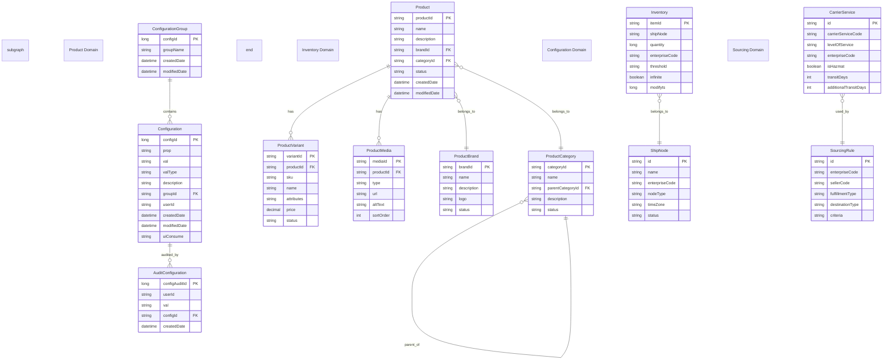
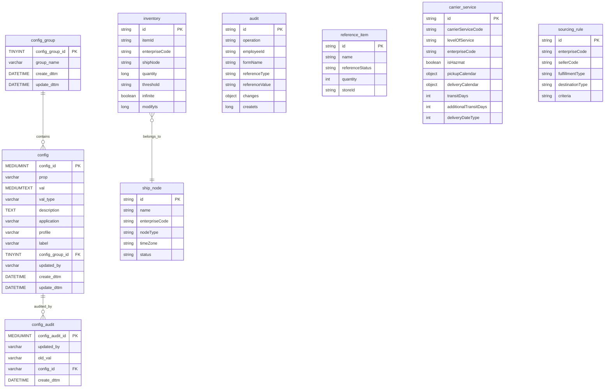

# Overall System Architecture Analysis

## Executive Summary

The Sephora microservices ecosystem is a comprehensive e-commerce platform built on modern cloud-native architecture principles. The system consists of seven core services that work together to provide a complete product management, inventory, configuration, and user experience solution.

### Complete System Overview and Business Context

The Sephora platform serves as a multi-channel e-commerce solution that manages product catalogs, inventory availability, configuration management, and user experiences across web, mobile, and other digital touchpoints. The system is designed to handle high-volume transactions, provide real-time inventory updates, and deliver personalized shopping experiences.

### Multi-Service Architecture Patterns

The system follows several key architectural patterns:

- **Microservices Architecture**: Each service is independently deployable and scalable
- **Event-Driven Architecture**: Services communicate through Kafka events for loose coupling
- **API-First Design**: All services expose REST and/or GraphQL APIs
- **CQRS Pattern**: Separate read and write models for optimal performance
- **Circuit Breaker Pattern**: Resilience against service failures

### Cross-Service Integration Strategies

- **Synchronous Communication**: REST APIs for direct service-to-service calls
- **Asynchronous Communication**: Kafka events for event-driven integration
- **Service Discovery**: Centralized service discovery and load balancing
- **Configuration Management**: Centralized configuration via ConfigHub
- **Shared Data Models**: Common DTOs and entity models across services

### System-Wide Technical Decisions

- **Spring Boot Framework**: Consistent technology stack across all services
- **Azure Cloud Platform**: Cloud-native deployment and infrastructure
- **CosmosDB and MySQL**: Multi-database strategy for different data types
- **Redis Caching**: Distributed caching for performance optimization
- **Kubernetes Orchestration**: Container orchestration and scaling

## System Architecture Overview

### High-Level System Architecture Across All Services

The system architecture consists of the following service layers:

1. **Configuration Layer**: ConfigHub service for centralized configuration management
2. **Product Layer**: Omni Product Service and Product Aggregation Service for product management
3. **Inventory Layer**: Inventory Availability Service for real-time inventory management
4. **Sourcing Layer**: Sourcing Service for fulfillment and delivery options
5. **Experience Layer**: Product Experience Service for user interactions
6. **Frontend Layer**: Frontend UFE for web-based user interfaces

### Service Boundaries and Responsibilities

#### ConfigHub Service
- **Primary Responsibility**: Centralized configuration management
- **Data Store**: MySQL database with audit trail
- **Integration**: Kafka events for configuration change propagation
- **Consumers**: All other services for configuration retrieval

#### Omni Product Service
- **Primary Responsibility**: Product catalog management and GraphQL API
- **Data Store**: External Commerce Tools integration
- **Integration**: Redis caching, Commerce Tools API
- **Consumers**: Frontend applications, mobile apps

#### Inventory Availability Service
- **Primary Responsibility**: Real-time inventory management
- **Data Store**: CosmosDB for inventory data
- **Integration**: Kafka events, Redis caching
- **Consumers**: Product services, frontend applications

#### Sourcing Service
- **Primary Responsibility**: Fulfillment and delivery options
- **Data Store**: CosmosDB for sourcing rules and configurations
- **Integration**: Inventory service, carrier services
- **Consumers**: E-commerce applications, order management

#### Product Aggregation Service
- **Primary Responsibility**: Product data aggregation and enrichment
- **Data Store**: CosmosDB for aggregated product data
- **Integration**: Multiple product data sources
- **Consumers**: Analytics, reporting systems

#### Product Experience Service
- **Primary Responsibility**: User experience and product interactions
- **Data Store**: CosmosDB for user interaction data
- **Integration**: Product services, user services
- **Consumers**: Frontend applications, mobile apps

#### Frontend UFE
- **Primary Responsibility**: Web-based user interface
- **Technology**: Node.js, React, modern web technologies
- **Integration**: All backend services via APIs
- **Consumers**: End users, customers

### Inter-Service Communication Patterns

#### Synchronous Communication
- **REST APIs**: Direct service-to-service calls for immediate responses
- **GraphQL**: Flexible query interface for product data
- **Health Checks**: Service health monitoring and discovery

#### Asynchronous Communication
- **Kafka Events**: Event-driven communication for loose coupling
- **Configuration Changes**: Real-time configuration updates across services
- **Inventory Updates**: Real-time inventory change notifications
- **Product Updates**: Product catalog change events

### Data Flow Across the Entire System

#### Product Data Flow
1. **Commerce Tools** → **Omni Product Service** → **Product Aggregation Service**
2. **Product Aggregation Service** → **Frontend UFE** (via APIs)
3. **Product Updates** → **Kafka Events** → **All Consumer Services**

#### Inventory Data Flow
1. **Inventory Availability Service** → **Real-time Updates** → **Product Services**
2. **Inventory Changes** → **Kafka Events** → **Sourcing Service**
3. **Inventory Queries** → **REST APIs** → **Frontend Applications**

#### Configuration Data Flow
1. **ConfigHub Service** → **Configuration Updates** → **All Services**
2. **Configuration Changes** → **Kafka Events** → **Service Restart/Refresh**
3. **Configuration Queries** → **REST APIs** → **Service Startup**

## Service Integration Analysis

### Service-to-Service Communication Patterns

#### Direct API Calls
- **Product Services**: Omni Product Service calls Product Aggregation Service
- **Inventory Integration**: Product services call Inventory Availability Service
- **Configuration Retrieval**: All services call ConfigHub for configuration

#### Event-Driven Integration
- **Configuration Changes**: ConfigHub publishes events, all services consume
- **Inventory Updates**: Inventory service publishes events, sourcing service consumes
- **Product Updates**: Product services publish events, frontend consumes

#### Shared Data Models
- **Product DTOs**: Common product data transfer objects
- **Configuration Models**: Shared configuration entity models
- **Inventory Models**: Common inventory data structures

### Shared Data Models and Contracts

#### Product Data Models
```json
{
  "productId": "string",
  "name": "string",
  "description": "string",
  "brandId": "string",
  "categoryId": "string",
  "variants": ["ProductVariant"],
  "media": ["ProductMedia"]
}
```

#### Inventory Data Models
```json
{
  "itemId": "string",
  "shipNode": "string",
  "quantity": "number",
  "enterpriseCode": "string",
  "status": "string"
}
```

#### Configuration Models
```json
{
  "configId": "number",
  "prop": "string",
  "val": "string",
  "groupId": "string",
  "description": "string"
}
```

### Event-Driven Architecture Implementation

#### Kafka Topics
- **Configuration Changes**: `Sephora.ConfigHub.Client.ConfigUpdate_Dev`
- **Inventory Updates**: `inventory-updates`
- **Product Updates**: `product-catalog-updates`
- **Sourcing Events**: `sourcing-options-updates`

#### Event Schemas
```json
{
  "eventType": "string",
  "timestamp": "datetime",
  "serviceId": "string",
  "payload": "object"
}
```

### API Gateway and Routing Strategies

#### API Gateway Functions
- **Request Routing**: Route requests to appropriate services
- **Authentication**: Centralized authentication and authorization
- **Rate Limiting**: Protect services from abuse
- **Load Balancing**: Distribute load across service instances

#### Service Discovery
- **Kubernetes Service Discovery**: Automatic service discovery
- **Health Checks**: Monitor service health and availability
- **Load Balancing**: Distribute requests across healthy instances

## Cross-Service Security

### Authentication and Authorization Across Services

#### Service-to-Service Authentication
- **Mutual TLS**: Encrypted communication between services
- **API Keys**: Service-specific API keys for authentication
- **JWT Tokens**: Stateless authentication tokens

#### Role-Based Access Control
- **Admin Roles**: Full access to all service operations
- **Service Roles**: Limited access for service-to-service communication
- **Read-Only Roles**: Read-only access for monitoring and analytics

### Service-to-Service Security Patterns

#### Network Security
- **Service Mesh**: Istio or similar for service-to-service security
- **Network Policies**: Kubernetes network policies for traffic control
- **TLS Termination**: Centralized TLS termination at API gateway

#### Data Protection
- **Data Encryption**: Encrypt sensitive data at rest and in transit
- **Key Management**: Centralized key management service
- **Audit Logging**: Comprehensive audit trails across all services

### Data Protection and Encryption Strategies

#### Data Classification
- **Public Data**: Product catalog information
- **Internal Data**: Configuration and operational data
- **Sensitive Data**: User information and business data

#### Encryption Implementation
- **Transport Encryption**: TLS 1.3 for all communications
- **Storage Encryption**: Database and file system encryption
- **Application Encryption**: Application-level encryption for sensitive data

### Compliance and Regulatory Considerations

#### Data Privacy
- **GDPR Compliance**: European data protection regulations
- **CCPA Compliance**: California consumer privacy regulations
- **Data Retention**: Proper data retention and deletion policies

#### Audit and Monitoring
- **Comprehensive Logging**: Log all data access and modifications
- **Audit Trails**: Maintain audit trails for compliance
- **Monitoring**: Real-time monitoring of security events

## System Performance

### Cross-Service Performance Considerations

#### Latency Optimization
- **Caching Strategy**: Multi-level caching across services
- **Connection Pooling**: Optimize database and external service connections
- **Load Balancing**: Distribute load efficiently across services

#### Throughput Optimization
- **Horizontal Scaling**: Scale services independently based on demand
- **Database Optimization**: Optimize database queries and indexing
- **External Service Optimization**: Optimize external service calls

### Load Balancing and Scaling Strategies

#### Load Balancing
- **Application Load Balancer**: Distribute traffic across service instances
- **Database Load Balancing**: Read replicas for database scaling
- **Cache Load Balancing**: Distributed caching across multiple nodes

#### Auto Scaling
- **CPU-Based Scaling**: Scale based on CPU utilization
- **Memory-Based Scaling**: Scale based on memory usage
- **Custom Metrics**: Scale based on business metrics

### Caching Strategies Across Services

#### Multi-Level Caching
- **Application Cache**: In-memory caching within each service
- **Distributed Cache**: Redis for shared caching across services
- **CDN Cache**: Content delivery network for static content

#### Cache Invalidation
- **Event-Driven Invalidation**: Invalidate cache based on events
- **Time-Based Invalidation**: TTL-based cache expiration
- **Manual Invalidation**: Manual cache invalidation for critical updates

### Database Performance and Optimization

#### Database Strategy
- **Multi-Database Approach**: Different databases for different data types
- **Read Replicas**: Scale read operations with database replicas
- **Sharding**: Horizontal partitioning for large datasets

#### Query Optimization
- **Indexing Strategy**: Optimize database indexes for common queries
- **Query Optimization**: Optimize complex queries and joins
- **Connection Pooling**: Efficient database connection management

## Deployment & DevOps

### Multi-Service Deployment Strategies

#### Containerization
- **Docker Containers**: All services containerized for consistency
- **Multi-Stage Builds**: Optimize container images for size and security
- **Base Images**: Use secure base images for all containers

#### Orchestration
- **Kubernetes**: Container orchestration and management
- **Service Mesh**: Istio for service-to-service communication
- **Helm Charts**: Package and deploy services consistently

### CI/CD Pipeline for All Services

#### Build Pipeline
- **Source Code Management**: Git-based source control
- **Automated Testing**: Unit, integration, and end-to-end tests
- **Security Scanning**: Automated security vulnerability scanning
- **Artifact Management**: Store and version application artifacts

#### Deployment Pipeline
- **Environment Promotion**: Promote through dev, test, staging, production
- **Blue-Green Deployment**: Zero-downtime deployments
- **Rollback Capabilities**: Quick rollback to previous versions
- **Canary Deployments**: Gradual rollout of new versions

### Containerization and Orchestration

#### Container Strategy
- **Microservice Containers**: Each service in its own container
- **Sidecar Containers**: Logging, monitoring, and security sidecars
- **Init Containers**: Setup and initialization containers

#### Kubernetes Resources
- **Deployments**: Manage service replicas and updates
- **Services**: Expose services for internal and external access
- **ConfigMaps and Secrets**: Manage configuration and secrets
- **Ingress**: External access and load balancing

### Monitoring and Observability Across Services

#### Centralized Monitoring
- **Metrics Collection**: Prometheus for metrics collection
- **Log Aggregation**: ELK stack for centralized logging
- **Distributed Tracing**: Jaeger for request tracing across services

#### Alerting and Notification
- **Alert Rules**: Define alerting rules for critical metrics
- **Notification Channels**: Email, Slack, PagerDuty notifications
- **Escalation Policies**: Escalate alerts based on severity and time

## Business Domain Integration

### Cross-Service Business Processes

#### Product Management Process
1. **Product Creation**: Commerce Tools → Omni Product Service
2. **Product Aggregation**: Omni Product Service → Product Aggregation Service
3. **Inventory Integration**: Product services → Inventory Availability Service
4. **Frontend Display**: All services → Frontend UFE

#### Order Fulfillment Process
1. **Product Selection**: Frontend UFE → Product services
2. **Inventory Check**: Product services → Inventory Availability Service
3. **Sourcing Options**: Order service → Sourcing Service
4. **Order Processing**: Complete order through all services

#### Configuration Management Process
1. **Configuration Update**: Admin → ConfigHub Service
2. **Event Propagation**: ConfigHub → Kafka → All services
3. **Service Refresh**: Services refresh configuration
4. **Validation**: Services validate new configuration

### Domain Boundaries and Relationships

#### Product Domain
- **Omni Product Service**: Product catalog and GraphQL API
- **Product Aggregation Service**: Product data aggregation
- **Product Experience Service**: User product interactions

#### Inventory Domain
- **Inventory Availability Service**: Real-time inventory management
- **Sourcing Service**: Fulfillment and delivery options

#### Configuration Domain
- **ConfigHub Service**: Centralized configuration management

#### User Experience Domain
- **Frontend UFE**: Web-based user interface
- **Product Experience Service**: User interaction management

### Business Rules Across Services

#### Product Rules
- **Product Validation**: Validate product data across all services
- **Category Hierarchy**: Maintain consistent category relationships
- **Brand Relationships**: Ensure brand-product consistency

#### Inventory Rules
- **Real-time Updates**: Ensure inventory accuracy across all services
- **Availability Rules**: Define product availability logic
- **Reservation Rules**: Handle inventory reservations and holds

#### Configuration Rules
- **Validation Rules**: Validate configuration changes
- **Access Control**: Control who can modify configurations
- **Audit Requirements**: Maintain audit trail for all changes

### Integration with External Systems

#### Commerce Tools Integration
- **Product Data**: Primary source of product information
- **Catalog Management**: Product catalog operations
- **API Integration**: REST API integration for data synchronization

#### Payment Systems
- **Payment Processing**: Integration with payment gateways
- **Transaction Management**: Handle payment transactions
- **Refund Processing**: Process refunds and chargebacks

#### Shipping and Logistics
- **Carrier Integration**: Integration with shipping carriers
- **Tracking**: Package tracking and delivery updates
- **Rate Calculation**: Shipping rate calculation and optimization

## Risk Assessment

### System-Wide Technical Risks

#### Service Dependencies
- **Single Points of Failure**: Critical services that affect multiple others
- **Cascade Failures**: Service failures propagating to other services
- **Data Consistency**: Maintaining consistency across multiple services

#### Performance Risks
- **Bottlenecks**: Performance bottlenecks in critical services
- **Scalability Limits**: Services reaching scalability limits
- **Resource Contention**: Resource contention between services

### Service Dependency Risks

#### Critical Dependencies
- **ConfigHub Service**: All services depend on configuration
- **Inventory Service**: Product services depend on inventory data
- **Commerce Tools**: External dependency for product data

#### Mitigation Strategies
- **Circuit Breakers**: Prevent cascade failures
- **Fallback Mechanisms**: Provide fallback when services are unavailable
- **Monitoring**: Comprehensive monitoring of service dependencies

### Business Continuity Considerations

#### Disaster Recovery
- **Data Backup**: Regular backup of all service data
- **Service Recovery**: Quick recovery of individual services
- **System Recovery**: Complete system recovery procedures

#### High Availability
- **Service Redundancy**: Multiple instances of each service
- **Geographic Distribution**: Services distributed across regions
- **Load Balancing**: Distribute load across multiple instances

### Performance and Scalability Concerns

#### Current Limitations
- **Database Performance**: Database performance under high load
- **External Service Limits**: Rate limits on external services
- **Cache Performance**: Cache performance and memory usage

#### Future Scalability
- **Horizontal Scaling**: Ability to scale services horizontally
- **Database Scaling**: Database scaling strategies
- **External Service Scaling**: Scaling external service integrations

## Strategic Recommendations

### System-Wide Improvements

#### Architecture Improvements
- **Service Mesh Implementation**: Implement Istio for service-to-service communication
- **Event Sourcing**: Implement event sourcing for better data consistency
- **CQRS Pattern**: Implement CQRS for read/write optimization

#### Performance Improvements
- **Caching Optimization**: Optimize caching strategies across all services
- **Database Optimization**: Optimize database performance and scaling
- **External Service Optimization**: Optimize external service integrations

### Architecture Evolution Strategies

#### Short-term (3-6 months)
- **Service Mesh**: Implement service mesh for better observability
- **Enhanced Monitoring**: Improve monitoring and alerting
- **Performance Optimization**: Optimize performance bottlenecks

#### Medium-term (6-12 months)
- **Event Sourcing**: Implement event sourcing for data consistency
- **Advanced Caching**: Implement advanced caching strategies
- **Database Scaling**: Implement database scaling solutions

#### Long-term (12+ months)
- **Microservices Evolution**: Evolve microservices architecture
- **Cloud-Native Features**: Implement more cloud-native features
- **AI/ML Integration**: Integrate AI/ML capabilities

### Technology Stack Recommendations

#### Current Stack Assessment
- **Spring Boot**: Continue with Spring Boot for consistency
- **Kubernetes**: Continue with Kubernetes for orchestration
- **Azure**: Continue with Azure cloud platform

#### Technology Evolution
- **Service Mesh**: Implement Istio for service mesh
- **Observability**: Enhance observability with modern tools
- **Security**: Implement advanced security features

### Long-term Strategic Planning

#### Business Alignment
- **Scalability**: Ensure architecture supports business growth
- **Flexibility**: Maintain flexibility for business changes
- **Cost Optimization**: Optimize costs while maintaining performance

#### Technology Roadmap
- **Modernization**: Modernize legacy components
- **Innovation**: Implement innovative technologies
- **Standards**: Adopt industry standards and best practices

## Complete System Architecture Diagram


## Service Interaction Map


## Cross-Service Data Flow


## Infrastructure Overview


## Complete Infrastructure Architecture


## Multi-Service Monitoring Stack


## Cross-Service Domain Model



## End-to-End Business Process Flow


## Complete Database Schema


