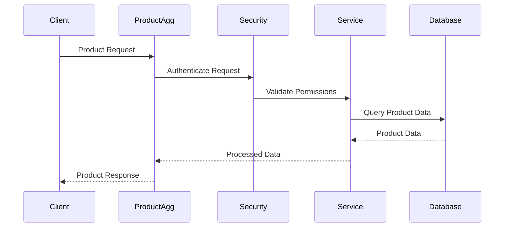
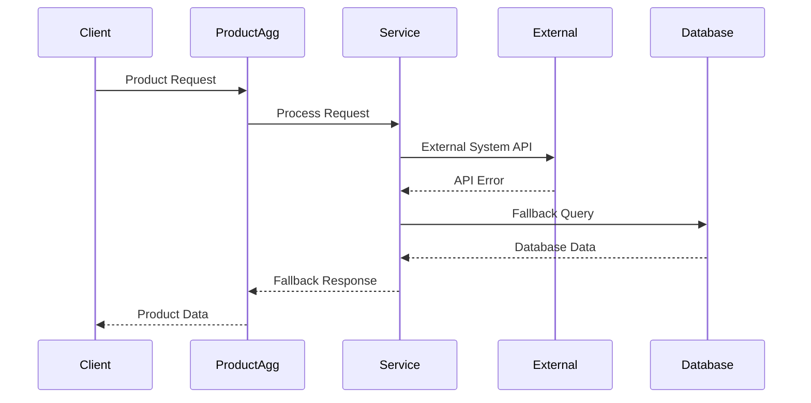
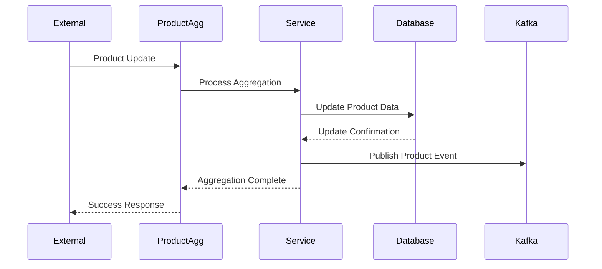
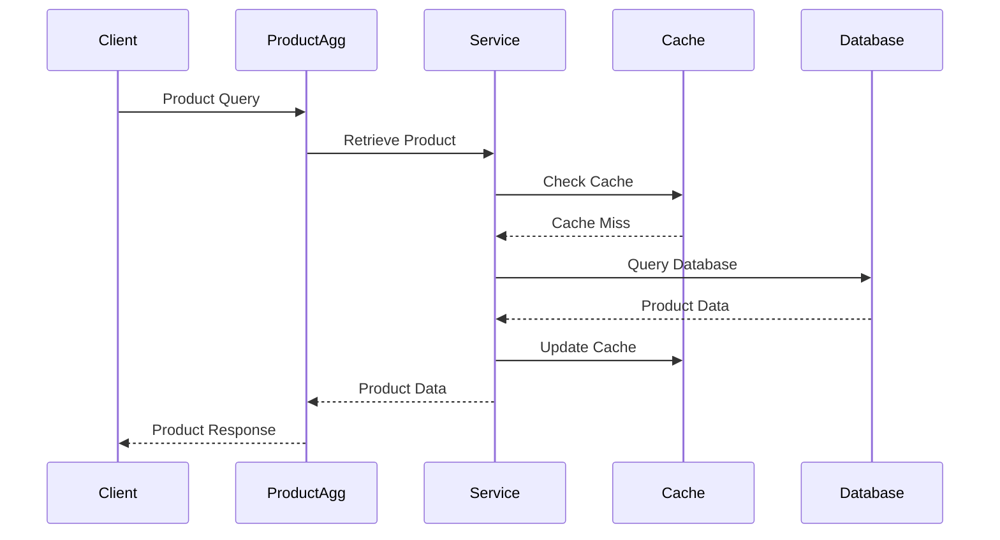
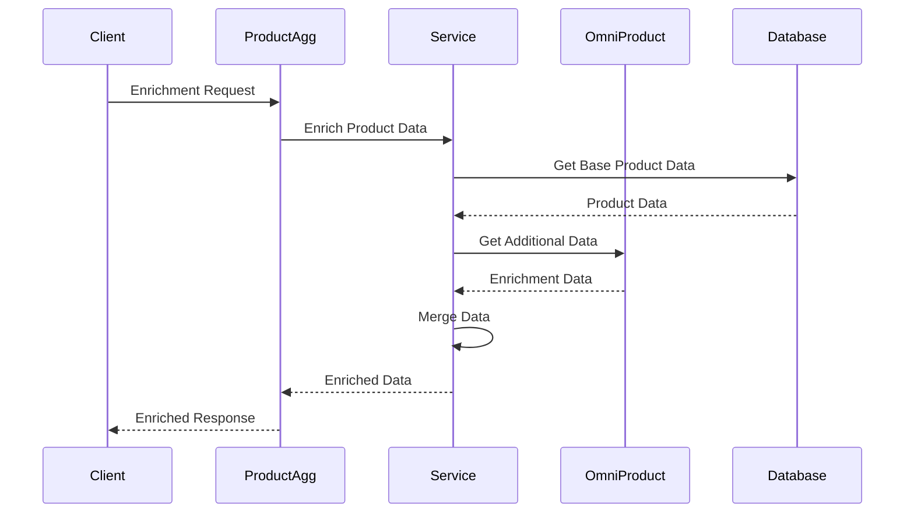
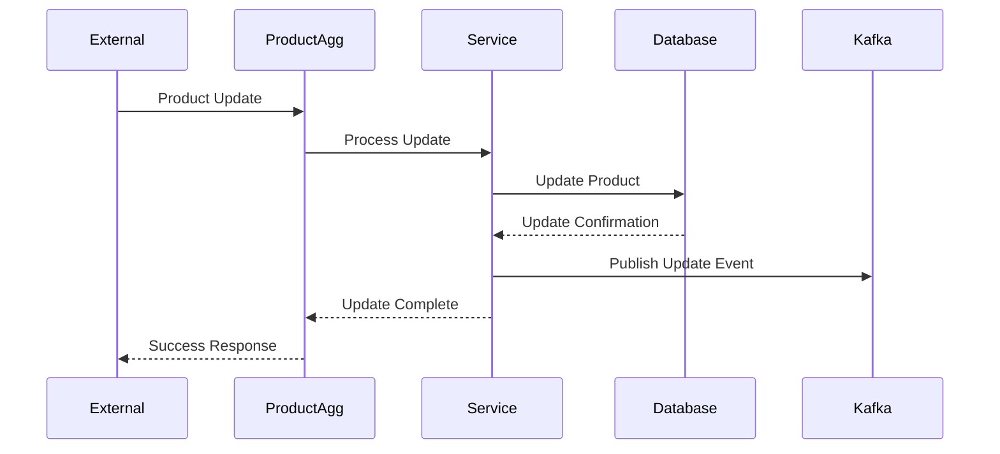
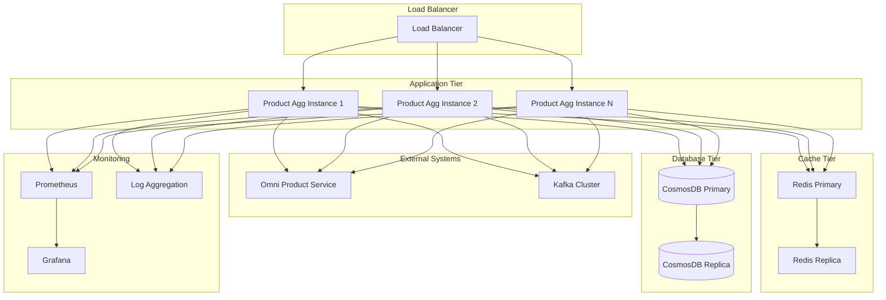
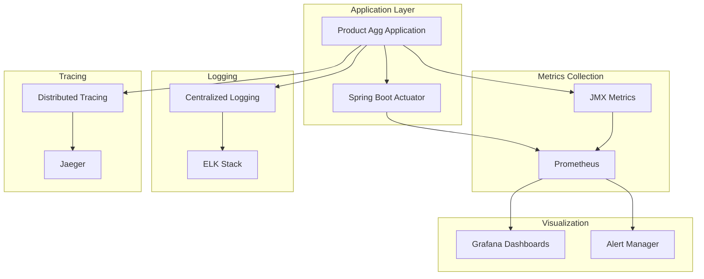
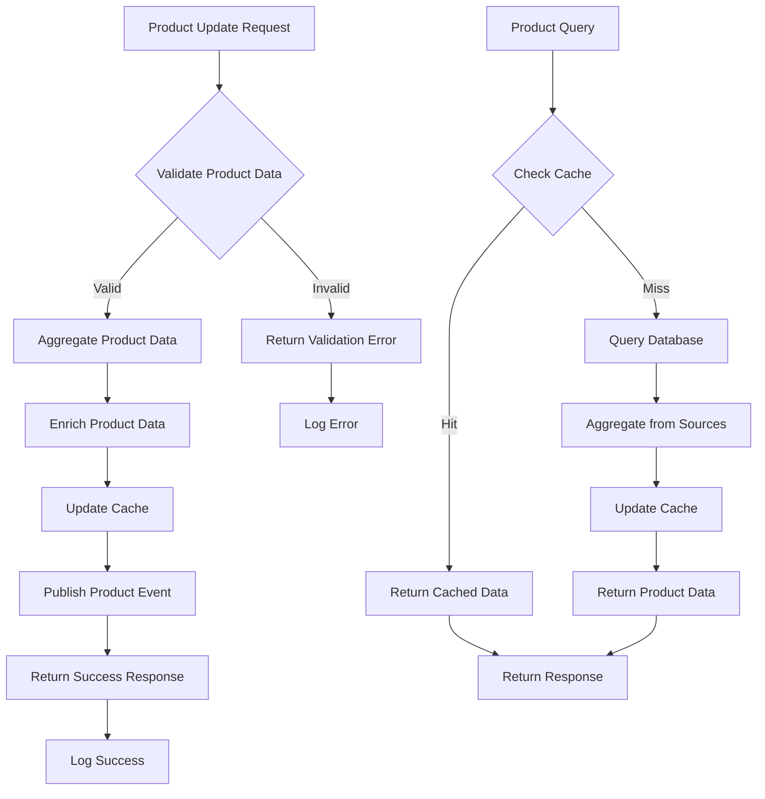
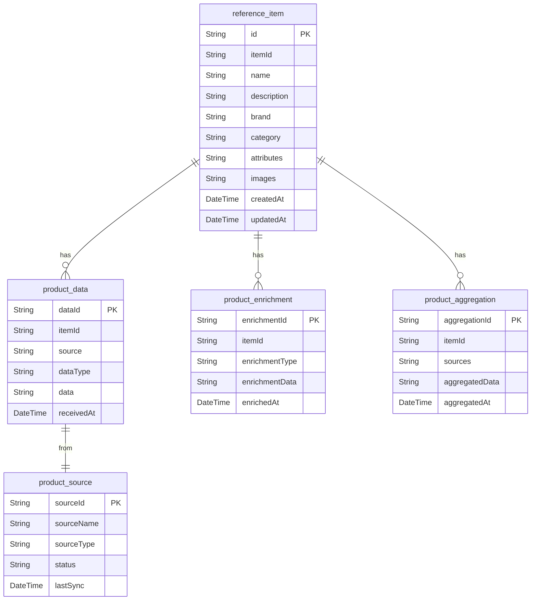

# Product Aggregation Service Architecture Analysis

## Executive Summary

The Product Aggregation Service is a critical component of the Sephora e-commerce platform that aggregates product data from multiple sources and provides a unified product catalog. It handles product data consolidation, enrichment, and provides aggregated product information to other services in the ecosystem.

### Key Technical Findings
- **Product Data Aggregation**: Consolidates product data from multiple sources
- **CosmosDB Integration**: Uses Azure CosmosDB for scalable product data storage
- **Data Enrichment**: Enhances product data with additional information
- **Event-Driven Architecture**: Uses Kafka for product change notifications
- **Caching Strategy**: Implements Redis caching for performance optimization

### Critical Concerns and Risks
- **Data Consistency**: Product data consistency across multiple sources
- **Performance**: High-frequency product queries may impact performance
- **Scalability**: Product catalog size may grow significantly
- **Integration Complexity**: Multiple external system integrations

### High-Level Recommendations
- Implement product data consistency patterns
- Optimize database queries and caching strategy
- Add comprehensive monitoring for product operations
- Implement circuit breakers for external service dependencies

## Architecture Analysis

### System Architecture and Component Relationships

The Product Aggregation Service follows a layered microservices architecture with clear separation of concerns:

- **Controller Layer**: REST API endpoints for product operations
- **Service Layer**: Business logic for product aggregation
- **Repository Layer**: Data access abstraction for CosmosDB
- **Integration Layer**: External service integrations
- **Event Layer**: Kafka event publishing and consumption
- **Cache Layer**: Redis caching for performance optimization

### Design Patterns and Architectural Decisions

- **Repository Pattern**: Abstracts data access across CosmosDB
- **Event-Driven Pattern**: Kafka-based event publishing for product changes
- **Caching Pattern**: Redis-based caching for frequently accessed data
- **Circuit Breaker Pattern**: External service dependency protection
- **Saga Pattern**: Distributed transaction management for product operations

### Integration Patterns and External Dependencies

- **CosmosDB**: Primary data store for aggregated product information
- **Redis Cache**: Performance optimization through caching
- **Kafka**: Event streaming for product changes
- **External Product Systems**: Integration with multiple product data sources
- **Omni Product Service**: Integration for product data enrichment

### Data Flow and Messaging Architecture

Product data flows through the system with the following pattern:
1. Product updates from external systems
2. Service layer processes aggregation logic
3. Repository layer accesses CosmosDB
4. Cache layer optimizes performance
5. Event publishing for product changes
6. Data enrichment and consolidation
7. Response formatting and caching

## Security Analysis

### Authentication and Authorization Mechanisms

- **REST API Security**: Standard REST authentication and authorization
- **Service-to-Service Security**: Secure integration with other services
- **Data Access Control**: Role-based access to product data
- **External System Security**: Secure integration with external product systems

### Security Vulnerabilities and Risks

- **Data Exposure**: Sensitive product data exposure risks
- **External Integration**: External system integration security
- **Cache Security**: Potential data leakage through cache
- **API Security**: Product API security vulnerabilities

### Data Protection and Encryption

- **Database Encryption**: CosmosDB data encryption at rest
- **Transport Security**: HTTPS for all API communications
- **External API Security**: Secure external system integration
- **Data Masking**: Sensitive product data masking

### Compliance and Regulatory Considerations

- **Data Privacy**: Product data privacy compliance
- **Audit Requirements**: Product change audit trails
- **Data Retention**: Product data retention policies
- **Access Logging**: Comprehensive access logging

## Performance Analysis

### Database Performance and Optimization Opportunities

- **Query Optimization**: CosmosDB query optimization and indexing
- **Partitioning Strategy**: Proper partitioning for large product datasets
- **Connection Management**: Optimize database connection management
- **Caching Strategy**: Effective caching for product queries

### Application Performance Bottlenecks

- **Data Aggregation**: High-frequency product aggregation processing
- **External API Calls**: External system API performance
- **Cache Management**: Cache invalidation and management overhead
- **Event Processing**: Kafka event processing performance

### Caching Strategies and Effectiveness

- **Product Caching**: Frequently accessed product data caching
- **Aggregation Caching**: Product aggregation result caching
- **External Data Caching**: External system data caching
- **Cache Invalidation**: Smart cache invalidation strategies

### Infrastructure Performance Considerations

- **Database Scaling**: CosmosDB scaling strategies
- **Cache Scaling**: Redis cluster scaling
- **Load Balancing**: Product API load balancing
- **Resource Allocation**: CPU and memory optimization

## Code Quality Assessment

### Code Complexity and Maintainability

- **Service Layer**: Clear business logic separation
- **Repository Pattern**: Effective data access abstraction
- **Integration Layer**: Clean external service integration
- **Event Processing**: Well-structured event handling

### Technical Debt Identification

- **Performance Optimization**: Query performance optimization needed
- **Error Handling**: Inconsistent error handling patterns
- **Documentation**: API documentation gaps
- **Testing Coverage**: Integration test coverage improvements

### Design Pattern Usage and Effectiveness

- **Repository Pattern**: Good data access abstraction
- **Event-Driven Pattern**: Effective event publishing
- **Caching Pattern**: Effective performance optimization
- **Circuit Breaker Pattern**: External service dependency protection

### Error Handling and Resilience Patterns

- **Circuit Breaker**: External service dependency protection
- **Retry Logic**: External API retry mechanisms
- **Fallback Strategies**: Graceful degradation for external services
- **Error Logging**: Comprehensive error logging

## Testing Analysis

### Test Coverage and Quality Assessment

- **Unit Tests**: Service layer unit test coverage
- **Integration Tests**: Database and external service integration
- **API Tests**: REST API endpoint testing
- **Performance Tests**: Load and stress testing

### Testing Strategy and Implementation

- **Database Testing**: CosmosDB integration testing approaches
- **External Service Mocking**: External system API mocking
- **Event Testing**: Kafka event testing
- **Cache Testing**: Redis cache testing

### Integration and End-to-End Testing

- **External System Integration**: End-to-end integration testing
- **Database Integration**: CosmosDB integration testing
- **Event Integration**: Kafka event flow testing
- **API Integration**: REST API testing

### Test Automation and CI/CD Integration

- **Automated Testing**: CI/CD pipeline integration
- **Test Environment**: Isolated test environment setup
- **Test Data Management**: Product test data management
- **Performance Testing**: Automated performance regression testing

## Authentication Flow


```

## Error Handling Flow


```

## Product Aggregation Flow


```

## Product Query Flow


```

## Data Enrichment Flow


```

## Product Update Flow


```

## Deployment & DevOps Analysis

### CI/CD Pipeline and Automation

- **Build Automation**: Maven-based build automation
- **Docker Containerization**: Containerized deployment
- **Environment Management**: Multi-environment deployment
- **Database Migration**: Automated database migration

### Containerization and Orchestration

- **Docker Images**: Optimized Docker image creation
- **Kubernetes Deployment**: Container orchestration
- **Service Discovery**: Service registration and discovery
- **Health Checks**: Application health monitoring

### Infrastructure and Environment Management

- **Environment Configuration**: Environment-specific configurations
- **Database Management**: CosmosDB configuration
- **Cache Management**: Redis cache configuration
- **External Service Configuration**: External system configuration

### Monitoring and Observability Setup

- **Product Metrics**: Product operation performance monitoring
- **External API Monitoring**: External system API monitoring
- **Database Monitoring**: CosmosDB performance monitoring
- **Event Monitoring**: Kafka event monitoring

## Infrastructure Architecture



## Monitoring & Observability Stack



## Business Domain Analysis

### Domain Model and Business Entities

The Product Aggregation Service manages product entities with the following domain model:

- **ReferenceItem**: Core product entity with aggregated information
- **ProductData**: Product data from various sources
- **ProductEnrichment**: Enriched product information
- **ProductAggregation**: Aggregated product data
- **ProductSource**: Source system information

### Business Processes and Workflows

- **Product Aggregation**: Consolidate product data from multiple sources
- **Data Enrichment**: Enhance product data with additional information
- **Product Updates**: Handle product data updates
- **Data Synchronization**: Synchronize with external product systems
- **Product Queries**: Handle product data queries

### Business Rules and Validation Logic

- **Product Validation**: Product data validation rules
- **Aggregation Rules**: Product aggregation business rules
- **Enrichment Rules**: Data enrichment rules
- **Source Rules**: External source integration rules
- **Quality Rules**: Data quality validation rules

### Integration Points and External Services

- **Omni Product Service**: Primary product data source
- **External Product Systems**: Multiple external product data sources
- **Inventory Service**: Inventory information integration
- **Pricing Service**: Pricing information integration
- **Analytics Service**: Product analytics integration

## Domain Model Diagram

```mermaid
classDiagram
    class ReferenceItem {
        +String id
        +String itemId
        +String name
        +String description
        +String brand
        +String category
        +Map attributes
        +List images
        +DateTime createdAt
        +DateTime updatedAt
    }
    
    class ProductData {
        +String dataId
        +String itemId
        +String source
        +String dataType
        +Object data
        +DateTime receivedAt
    }
    
    class ProductEnrichment {
        +String enrichmentId
        +String itemId
        +String enrichmentType
        +Object enrichmentData
        +DateTime enrichedAt
    }
    
    class ProductAggregation {
        +String aggregationId
        +String itemId
        +List sources
        +Object aggregatedData
        +DateTime aggregatedAt
    }
    
    class ProductSource {
        +String sourceId
        +String sourceName
        +String sourceType
        +String status
        +DateTime lastSync
    }
    
    ReferenceItem ||--o{ ProductData : "has"
    ReferenceItem ||--o{ ProductEnrichment : "has"
    ReferenceItem ||--o{ ProductAggregation : "has"
    ProductData ||--|| ProductSource : "from"
```

## Business Process Flow



## Database Schema Diagram



## Risk Assessment

### Technical Risks and Vulnerabilities

- **Data Consistency**: Product data consistency challenges
- **Performance**: High-frequency product query performance
- **External Dependencies**: External system integration risks
- **Scalability**: Product catalog size scaling challenges
- **Cache Management**: Cache invalidation complexity

### Business Continuity Risks

- **External System Dependency**: External product system availability
- **Data Loss**: Product data loss risks
- **Performance Degradation**: Slow product queries impact business
- **Integration Failures**: External system integration failures

### Performance and Scalability Concerns

- **Database Performance**: CosmosDB performance under load
- **Cache Performance**: Redis cache performance under load
- **External API Limits**: External system API rate limits
- **Event Processing**: Kafka event processing capacity

### Security Threats and Mitigation Strategies

- **Data Exposure**: Encrypt sensitive product data
- **External API Security**: Secure external system integration
- **Access Control**: Implement proper authorization
- **Audit Logging**: Comprehensive audit trails

## Detailed Recommendations

### Immediate Actions (High Priority)

1. **Performance Optimization**: Optimize product query performance
2. **Data Consistency**: Implement product data consistency patterns
3. **External Service Resilience**: Add circuit breakers for external systems
4. **Performance Monitoring**: Implement comprehensive performance monitoring
5. **Error Handling**: Improve error handling and recovery mechanisms

### Short-Term Improvements (Medium Priority)

1. **Cache Strategy**: Optimize caching strategy and invalidation
2. **Database Optimization**: Optimize CosmosDB queries and indexing
3. **Event Processing**: Improve Kafka event processing
4. **Testing Coverage**: Increase integration test coverage
5. **Documentation**: Complete API documentation

### Long-Term Strategic Enhancements (Low Priority)

1. **Microservices Evolution**: Consider breaking down into smaller services
2. **Database Migration**: Evaluate database optimization strategies
3. **Event Sourcing**: Implement event sourcing for product changes
4. **API Gateway**: Implement API gateway for enhanced security
5. **Multi-Region Deployment**: Implement multi-region deployment

## Action Plan

### Phase 1: Critical Fixes (1-2 weeks)

- Optimize product query performance
- Add circuit breakers for external services
- Optimize database queries and indexing
- Improve error handling and logging
- Set up basic performance monitoring

### Phase 2: Quality Improvements (1-2 months)

- Implement comprehensive caching strategy
- Add data consistency patterns
- Enhance external service integration
- Improve API documentation
- Increase test coverage

### Phase 3: Strategic Enhancements (3-6 months)

- Evaluate microservices architecture evolution
- Consider database optimization strategies
- Implement advanced monitoring and alerting
- Plan for multi-region deployment
- Enhance disaster recovery procedures
