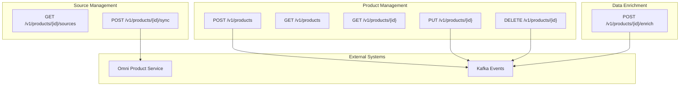
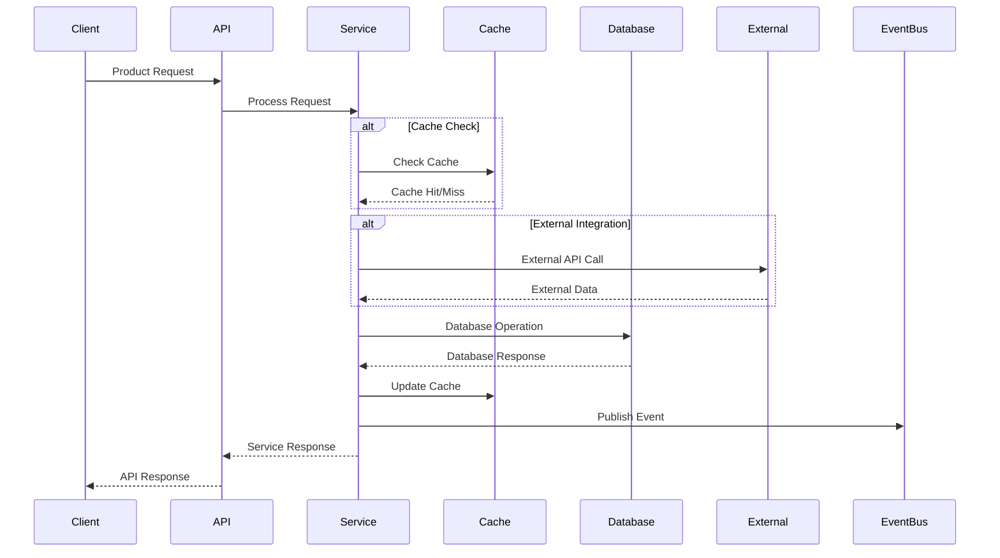
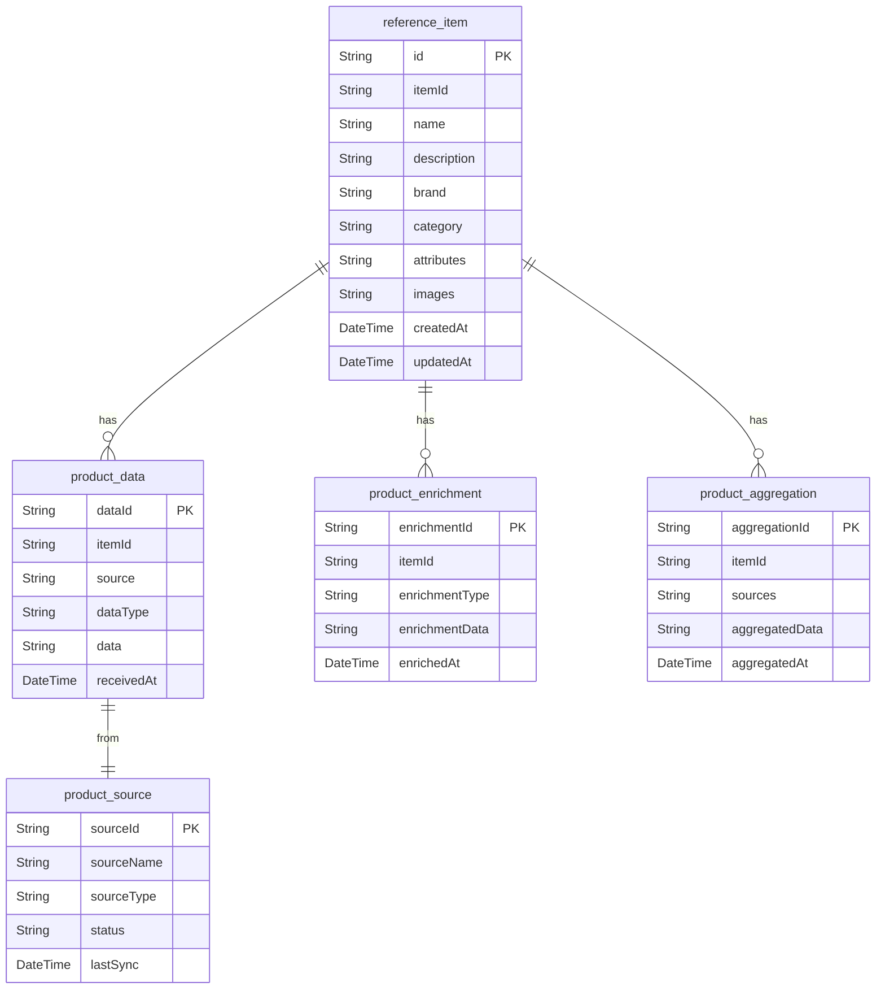

# Product Aggregation Service API Contract

## API Overview

The Product Aggregation Service provides RESTful APIs for aggregating product data from multiple sources and providing a unified product catalog. The service handles product data consolidation, enrichment, and provides aggregated product information to other services in the ecosystem.

### API Versioning
- **Current Version**: v1
- **Base URL**: `/api/v1`
- **Content Type**: `application/json`

### Authentication Requirements
- **Authentication**: Bearer token required for all endpoints
- **Authorization**: Role-based access control
- **Rate Limiting**: 1000 requests per minute per client

## Request/Response Contracts

### 1. Create Product Aggregation

**Endpoint**: `POST /v1/products`

**Description**: Creates a new product aggregation record.

**Request Body**:
```json
{
  "itemId": "string",
  "name": "string",
  "description": "string",
  "brand": "string",
  "category": "string",
  "attributes": {},
  "images": []
}
```

**Response (201 Created)**:
```json
{
  "id": "string",
  "itemId": "string",
  "name": "string",
  "description": "string",
  "brand": "string",
  "category": "string",
  "attributes": {},
  "images": [],
  "createdAt": "2024-01-01T00:00:00Z",
  "updatedAt": "2024-01-01T00:00:00Z"
}
```

**Error Responses**:
- `400 Bad Request`: Invalid request data
- `401 Unauthorized`: Missing or invalid authentication
- `403 Forbidden`: Insufficient permissions
- `409 Conflict`: Product aggregation already exists

### 2. Get Product Aggregations

**Endpoint**: `GET /v1/products`

**Description**: Retrieves product aggregations with optional filtering.

**Query Parameters**:
- `itemId` (optional): Filter by item ID
- `brand` (optional): Filter by brand
- `category` (optional): Filter by category
- `page` (optional): Page number (default: 0)
- `size` (optional): Page size (default: 20)

**Response (200 OK)**:
```json
{
  "content": [
    {
      "id": "string",
      "itemId": "string",
      "name": "string",
      "description": "string",
      "brand": "string",
      "category": "string",
      "attributes": {},
      "images": []
    }
  ],
  "pageable": {
    "pageNumber": 0,
    "pageSize": 20,
    "totalElements": 100,
    "totalPages": 5
  }
}
```

**Error Responses**:
- `401 Unauthorized`: Missing or invalid authentication
- `403 Forbidden`: Insufficient permissions

### 3. Get Product Aggregation by ID

**Endpoint**: `GET /v1/products/{id}`

**Description**: Retrieves a specific product aggregation by ID.

**Path Parameters**:
- `id`: Product aggregation ID

**Response (200 OK)**:
```json
{
  "id": "string",
  "itemId": "string",
  "name": "string",
  "description": "string",
  "brand": "string",
  "category": "string",
  "attributes": {},
  "images": []
}
```

**Error Responses**:
- `401 Unauthorized`: Missing or invalid authentication
- `403 Forbidden`: Insufficient permissions
- `404 Not Found`: Product aggregation not found

### 4. Update Product Aggregation

**Endpoint**: `PUT /v1/products/{id}`

**Description**: Updates an existing product aggregation.

**Path Parameters**:
- `id`: Product aggregation ID

**Request Body**:
```json
{
  "itemId": "string",
  "name": "string",
  "description": "string",
  "brand": "string",
  "category": "string",
  "attributes": {},
  "images": []
}
```

**Response (200 OK)**:
```json
{
  "id": "string",
  "itemId": "string",
  "name": "string",
  "description": "string",
  "brand": "string",
  "category": "string",
  "attributes": {},
  "images": [],
  "updatedAt": "2024-01-01T00:00:00Z"
}
```

**Error Responses**:
- `400 Bad Request`: Invalid request data
- `401 Unauthorized`: Missing or invalid authentication
- `403 Forbidden`: Insufficient permissions
- `404 Not Found`: Product aggregation not found

### 5. Delete Product Aggregation

**Endpoint**: `DELETE /v1/products/{id}`

**Description**: Deletes a product aggregation.

**Path Parameters**:
- `id`: Product aggregation ID

**Response (204 No Content)**:
No response body

**Error Responses**:
- `401 Unauthorized`: Missing or invalid authentication
- `403 Forbidden`: Insufficient permissions
- `404 Not Found`: Product aggregation not found

### 6. Enrich Product Data

**Endpoint**: `POST /v1/products/{id}/enrich`

**Description**: Enriches product data with additional information from external sources.

**Path Parameters**:
- `id`: Product aggregation ID

**Request Body**:
```json
{
  "enrichmentType": "string",
  "enrichmentData": {}
}
```

**Response (200 OK)**:
```json
{
  "id": "string",
  "itemId": "string",
  "enrichmentType": "string",
  "enrichmentData": {},
  "enrichedAt": "2024-01-01T00:00:00Z"
}
```

**Error Responses**:
- `400 Bad Request`: Invalid request data
- `401 Unauthorized`: Missing or invalid authentication
- `403 Forbidden`: Insufficient permissions
- `404 Not Found`: Product aggregation not found

### 7. Get Product Sources

**Endpoint**: `GET /v1/products/{id}/sources`

**Description**: Retrieves source information for a product aggregation.

**Path Parameters**:
- `id`: Product aggregation ID

**Response (200 OK)**:
```json
{
  "productId": "string",
  "sources": [
    {
      "sourceId": "string",
      "sourceName": "string",
      "sourceType": "string",
      "status": "string",
      "lastSync": "2024-01-01T00:00:00Z"
    }
  ]
}
```

**Error Responses**:
- `401 Unauthorized`: Missing or invalid authentication
- `403 Forbidden`: Insufficient permissions
- `404 Not Found`: Product aggregation not found

### 8. Sync Product Data

**Endpoint**: `POST /v1/products/{id}/sync`

**Description**: Triggers a synchronization of product data from external sources.

**Path Parameters**:
- `id`: Product aggregation ID

**Response (202 Accepted)**:
```json
{
  "syncId": "string",
  "status": "IN_PROGRESS",
  "startedAt": "2024-01-01T00:00:00Z"
}
```

**Error Responses**:
- `401 Unauthorized`: Missing or invalid authentication
- `403 Forbidden`: Insufficient permissions
- `404 Not Found`: Product aggregation not found

## Data Models

### ReferenceItem Entity
```json
{
  "id": "string",
  "itemId": "string",
  "name": "string",
  "description": "string",
  "brand": "string",
  "category": "string",
  "attributes": "object",
  "images": "array"
}
```

### ProductData Entity
```json
{
  "dataId": "string",
  "itemId": "string",
  "source": "string",
  "dataType": "string",
  "data": "object",
  "receivedAt": "string"
}
```

### ProductEnrichment Entity
```json
{
  "enrichmentId": "string",
  "itemId": "string",
  "enrichmentType": "string",
  "enrichmentData": "object",
  "enrichedAt": "string"
}
```

### ProductAggregation Entity
```json
{
  "aggregationId": "string",
  "itemId": "string",
  "sources": "array",
  "aggregatedData": "object",
  "aggregatedAt": "string"
}
```

### ProductSource Entity
```json
{
  "sourceId": "string",
  "sourceName": "string",
  "sourceType": "string",
  "status": "string",
  "lastSync": "string"
}
```

## Validation Rules

### Product Aggregation Validation
- `itemId`: Required, non-empty string, max 50 characters
- `name`: Required, non-empty string, max 200 characters
- `description`: Optional string, max 1000 characters
- `brand`: Required, non-empty string, max 100 characters
- `category`: Required, non-empty string, max 100 characters
- `attributes`: Optional object
- `images`: Optional array of strings

### Product Data Validation
- `itemId`: Required, non-empty string, max 50 characters
- `source`: Required, non-empty string, max 100 characters
- `dataType`: Required, non-empty string, max 50 characters
- `data`: Required object
- `receivedAt`: Required, valid ISO 8601 datetime

### Product Enrichment Validation
- `itemId`: Required, non-empty string, max 50 characters
- `enrichmentType`: Required, non-empty string, max 50 characters
- `enrichmentData`: Required object
- `enrichedAt`: Required, valid ISO 8601 datetime

### Product Source Validation
- `sourceName`: Required, non-empty string, max 100 characters
- `sourceType`: Required, enum values: ["EXTERNAL", "INTERNAL", "MANUAL"]
- `status`: Required, enum values: ["ACTIVE", "INACTIVE", "ERROR"]
- `lastSync`: Required, valid ISO 8601 datetime

## Integration Contracts

### External System Integration

#### Omni Product Service
- **Protocol**: REST API
- **Authentication**: Bearer token
- **Rate Limiting**: 500 requests per minute
- **Timeout**: 15 seconds
- **Retry Policy**: 2 attempts with linear backoff

#### External Product Systems
- **Protocol**: REST API
- **Authentication**: API Key
- **Rate Limiting**: 100 requests per minute
- **Timeout**: 30 seconds
- **Retry Policy**: 3 attempts with exponential backoff

### Event Publishing

#### Product Aggregation Events
```json
{
  "eventType": "PRODUCT_AGGREGATED",
  "eventId": "string",
  "timestamp": "2024-01-01T00:00:00Z",
  "data": {
    "itemId": "string",
    "aggregationId": "string",
    "sources": [],
    "aggregatedData": {}
  }
}
```

#### Product Update Events
```json
{
  "eventType": "PRODUCT_UPDATED",
  "eventId": "string",
  "timestamp": "2024-01-01T00:00:00Z",
  "data": {
    "itemId": "string",
    "previousData": {},
    "newData": {}
  }
}
```

#### Product Enrichment Events
```json
{
  "eventType": "PRODUCT_ENRICHED",
  "eventId": "string",
  "timestamp": "2024-01-01T00:00:00Z",
  "data": {
    "itemId": "string",
    "enrichmentType": "string",
    "enrichmentData": {}
  }
}
```

## API Endpoint Map



## Request/Response Flow



## Data Model Relationships



## Error Handling

### Standard Error Response Format
```json
{
  "timestamp": "2024-01-01T00:00:00Z",
  "status": 400,
  "error": "Bad Request",
  "message": "Validation failed",
  "path": "/api/v1/products",
  "details": [
    {
      "field": "itemId",
      "message": "Item ID is required"
    }
  ]
}
```

### Common Error Codes
- `400 Bad Request`: Invalid request data or validation errors
- `401 Unauthorized`: Missing or invalid authentication
- `403 Forbidden`: Insufficient permissions
- `404 Not Found`: Resource not found
- `409 Conflict`: Resource conflict
- `422 Unprocessable Entity`: Business rule validation failed
- `500 Internal Server Error`: Unexpected server error
- `503 Service Unavailable`: Service temporarily unavailable

### Retry Logic
- **Transient Errors**: Retry with exponential backoff
- **Permanent Errors**: No retry, return error immediately
- **Rate Limiting**: Respect retry-after header
- **Circuit Breaker**: Prevent cascading failures

## Performance Considerations

### Caching Strategy
- **Product Data**: Cache for 10 minutes
- **Aggregation Results**: Cache for 5 minutes
- **Source Data**: Cache for 1 hour
- **Enrichment Data**: Cache for 15 minutes

### Rate Limiting
- **Standard Clients**: 1000 requests per minute
- **High-Volume Clients**: 5000 requests per minute
- **Burst Allowance**: 200 requests per 10 seconds

### Response Time Targets
- **Product Queries**: < 100ms
- **Aggregation Operations**: < 500ms
- **Enrichment Operations**: < 1 second
- **Sync Operations**: < 5 seconds

## Security Considerations

### Authentication
- **Bearer Token**: Required for all endpoints
- **Token Validation**: Validate with authentication service
- **Token Expiry**: Handle expired tokens gracefully

### Authorization
- **Role-Based Access**: Different permissions for different roles
- **Resource-Level Access**: Control access to specific product data
- **Audit Logging**: Log all access attempts

### Data Protection
- **Input Validation**: Validate all input data
- **Output Sanitization**: Sanitize output data
- **Encryption**: Encrypt sensitive data in transit and at rest
