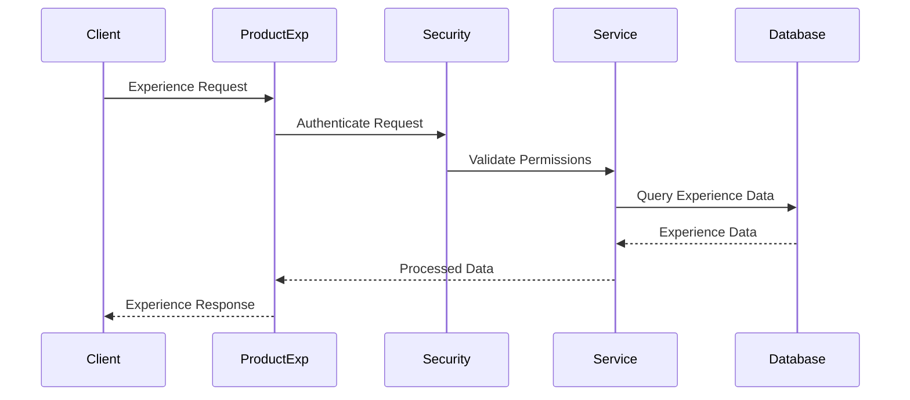
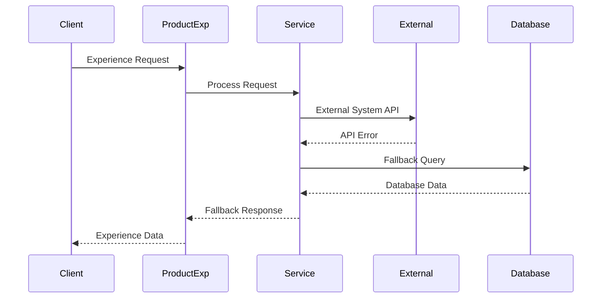
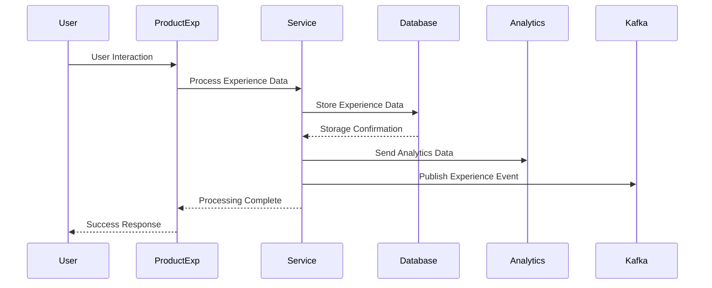
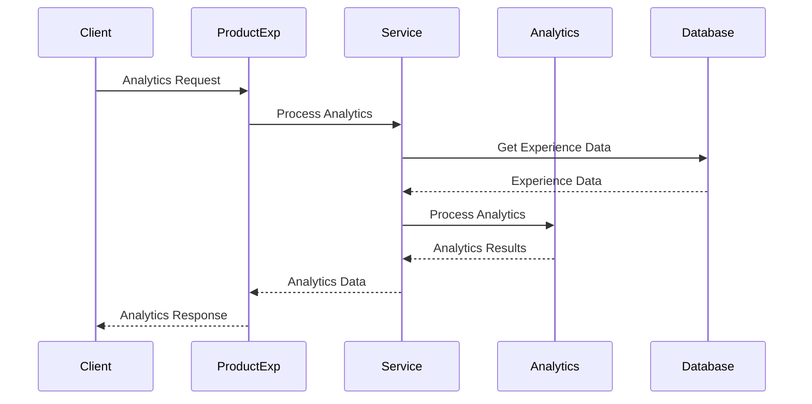
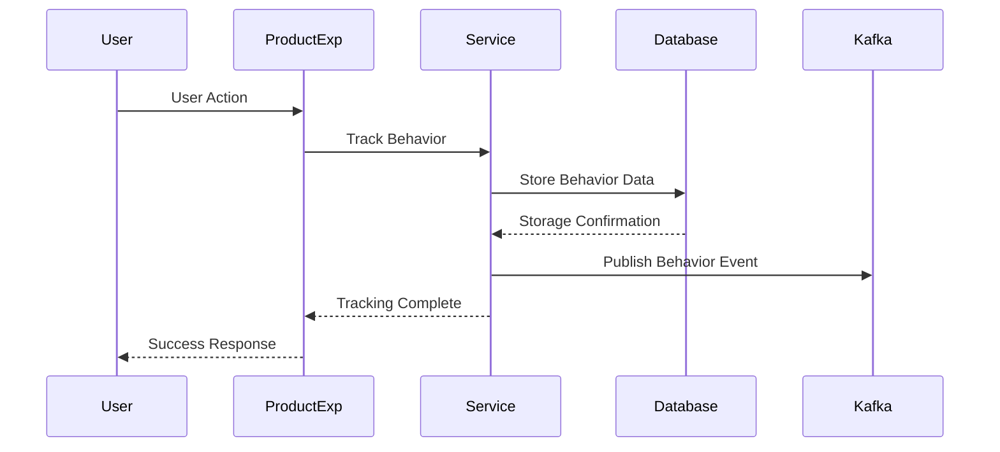
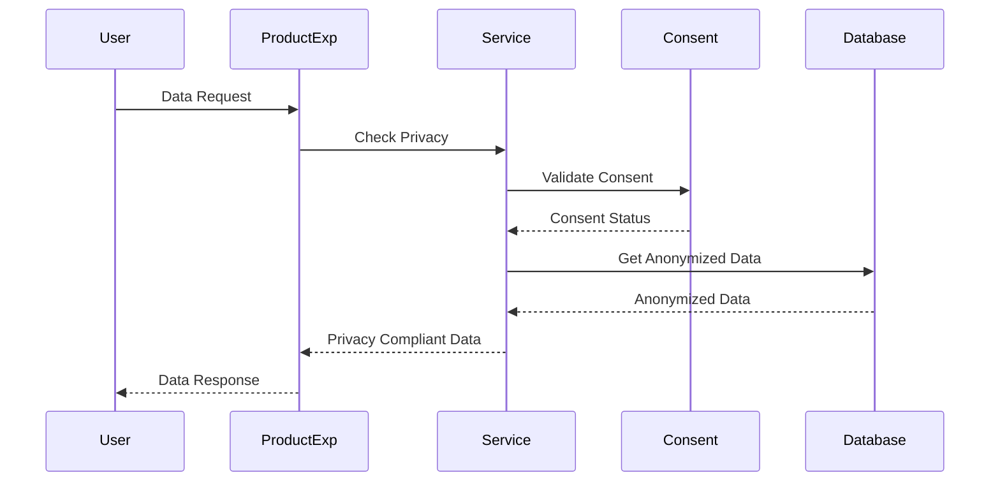
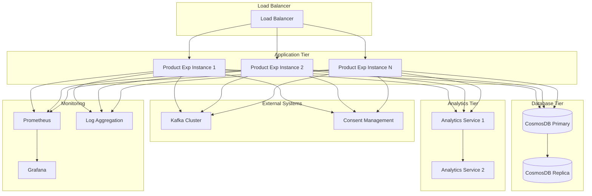
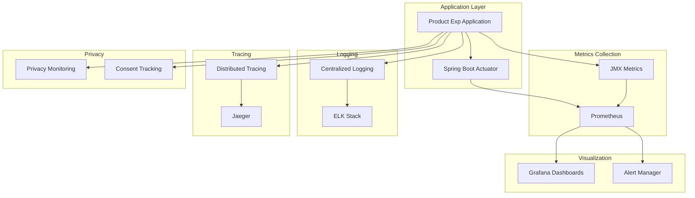
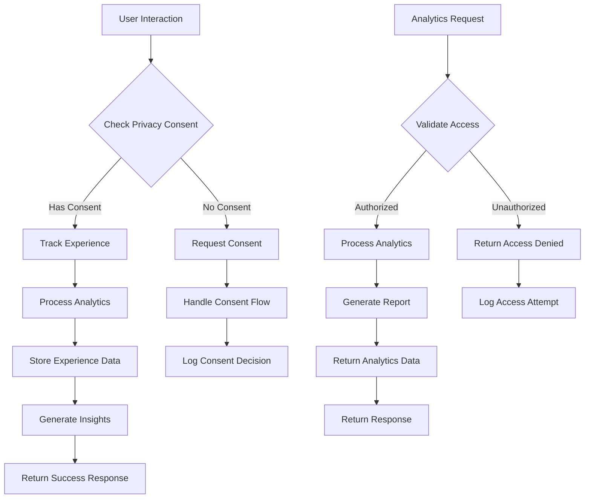
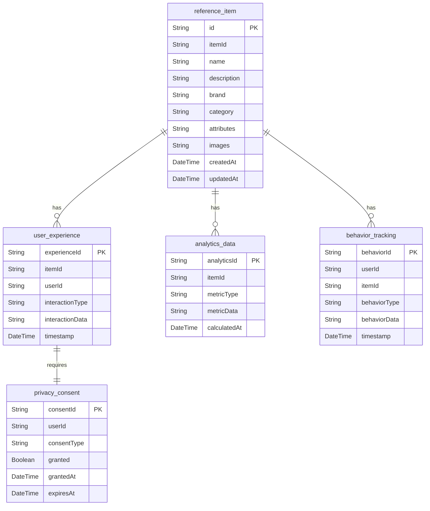

# Product Exp Service Architecture Analysis

## Executive Summary

The Product Exp Service is a specialized component of the Sephora e-commerce platform that handles product experience data, user interactions, and product analytics. It manages product experience metrics, user behavior tracking, and provides insights for product optimization.

### Key Technical Findings
- **Product Experience Management**: Handles product experience data and analytics
- **CosmosDB Integration**: Uses Azure CosmosDB for scalable experience data storage
- **User Behavior Tracking**: Tracks user interactions with products
- **Event-Driven Architecture**: Uses Kafka for experience data events
- **Analytics Integration**: Integrates with analytics services for insights

### Critical Concerns and Risks
- **Data Privacy**: User behavior data privacy and compliance
- **Performance**: High-frequency experience data processing
- **Scalability**: Experience data volume may grow significantly
- **Integration Complexity**: Multiple analytics system integrations

### High-Level Recommendations
- Implement data privacy and compliance measures
- Optimize database queries and data processing
- Add comprehensive monitoring for experience operations
- Implement circuit breakers for external service dependencies

## Architecture Analysis

### System Architecture and Component Relationships

The Product Exp Service follows a layered microservices architecture with clear separation of concerns:

- **Controller Layer**: REST API endpoints for experience operations
- **Service Layer**: Business logic for experience data management
- **Repository Layer**: Data access abstraction for CosmosDB
- **Integration Layer**: External service integrations
- **Event Layer**: Kafka event publishing and consumption
- **Analytics Layer**: Analytics data processing and insights

### Design Patterns and Architectural Decisions

- **Repository Pattern**: Abstracts data access across CosmosDB
- **Event-Driven Pattern**: Kafka-based event publishing for experience data
- **Analytics Pattern**: Real-time analytics data processing
- **Circuit Breaker Pattern**: External service dependency protection
- **Saga Pattern**: Distributed transaction management for experience operations

### Integration Patterns and External Dependencies

- **CosmosDB**: Primary data store for experience data
- **Kafka**: Event streaming for experience data changes
- **Analytics Services**: Integration with analytics platforms
- **User Behavior Systems**: Integration with user tracking systems
- **Product Services**: Integration for product information

### Data Flow and Messaging Architecture

Experience data flows through the system with the following pattern:
1. User interaction events from frontend
2. Service layer processes experience logic
3. Repository layer accesses CosmosDB
4. Analytics layer processes insights
5. Event publishing for experience changes
6. Data aggregation and reporting
7. Response formatting and caching

## Security Analysis

### Authentication and Authorization Mechanisms

- **REST API Security**: Standard REST authentication and authorization
- **Service-to-Service Security**: Secure integration with other services
- **Data Access Control**: Role-based access to experience data
- **Privacy Controls**: User data privacy and consent management

### Security Vulnerabilities and Risks

- **Data Privacy**: User behavior data privacy risks
- **External Integration**: External system integration security
- **Data Exposure**: Sensitive experience data exposure
- **API Security**: Experience API security vulnerabilities

### Data Protection and Encryption

- **Database Encryption**: CosmosDB data encryption at rest
- **Transport Security**: HTTPS for all API communications
- **Data Anonymization**: User data anonymization for privacy
- **Consent Management**: User consent tracking and management

### Compliance and Regulatory Considerations

- **Data Privacy**: GDPR and privacy regulation compliance
- **Audit Requirements**: Experience data audit trails
- **Data Retention**: Experience data retention policies
- **Consent Logging**: User consent logging and tracking

## Performance Analysis

### Database Performance and Optimization Opportunities

- **Query Optimization**: CosmosDB query optimization and indexing
- **Partitioning Strategy**: Proper partitioning for large experience datasets
- **Connection Management**: Optimize database connection management
- **Data Archival**: Experience data archival strategies

### Application Performance Bottlenecks

- **Real-time Processing**: High-frequency experience data processing
- **Analytics Processing**: Analytics data processing performance
- **Event Processing**: Kafka event processing performance
- **Data Aggregation**: Experience data aggregation overhead

### Caching Strategies and Effectiveness

- **Experience Caching**: Frequently accessed experience data caching
- **Analytics Caching**: Analytics result caching
- **User Data Caching**: User behavior data caching
- **Cache Invalidation**: Smart cache invalidation strategies

### Infrastructure Performance Considerations

- **Database Scaling**: CosmosDB scaling strategies
- **Analytics Scaling**: Analytics processing scaling
- **Load Balancing**: Experience API load balancing
- **Resource Allocation**: CPU and memory optimization

## Code Quality Assessment

### Code Complexity and Maintainability

- **Service Layer**: Clear business logic separation
- **Repository Pattern**: Effective data access abstraction
- **Analytics Layer**: Clean analytics processing
- **Event Processing**: Well-structured event handling

### Technical Debt Identification

- **Performance Optimization**: Query performance optimization needed
- **Error Handling**: Inconsistent error handling patterns
- **Documentation**: API documentation gaps
- **Testing Coverage**: Integration test coverage improvements

### Design Pattern Usage and Effectiveness

- **Repository Pattern**: Good data access abstraction
- **Event-Driven Pattern**: Effective event publishing
- **Analytics Pattern**: Effective analytics processing
- **Circuit Breaker Pattern**: External service dependency protection

### Error Handling and Resilience Patterns

- **Circuit Breaker**: External service dependency protection
- **Retry Logic**: External API retry mechanisms
- **Fallback Strategies**: Graceful degradation for external services
- **Error Logging**: Comprehensive error logging

## Testing Analysis

### Test Coverage and Quality Assessment

- **Unit Tests**: Service layer unit test coverage
- **Integration Tests**: Database and external service integration
- **API Tests**: REST API endpoint testing
- **Performance Tests**: Load and stress testing

### Testing Strategy and Implementation

- **Database Testing**: CosmosDB integration testing approaches
- **Analytics Testing**: Analytics processing testing
- **Event Testing**: Kafka event testing
- **Privacy Testing**: Data privacy compliance testing

### Integration and End-to-End Testing

- **Analytics Integration**: End-to-end analytics integration testing
- **Database Integration**: CosmosDB integration testing
- **Event Integration**: Kafka event flow testing
- **API Integration**: REST API testing

### Test Automation and CI/CD Integration

- **Automated Testing**: CI/CD pipeline integration
- **Test Environment**: Isolated test environment setup
- **Test Data Management**: Experience test data management
- **Performance Testing**: Automated performance regression testing

## Authentication Flow


```

## Error Handling Flow


```

## Experience Data Flow


```

## Analytics Processing Flow


```

## User Behavior Tracking Flow


```

## Data Privacy Flow


```

## Deployment & DevOps Analysis

### CI/CD Pipeline and Automation

- **Build Automation**: Maven-based build automation
- **Docker Containerization**: Containerized deployment
- **Environment Management**: Multi-environment deployment
- **Database Migration**: Automated database migration

### Containerization and Orchestration

- **Docker Images**: Optimized Docker image creation
- **Kubernetes Deployment**: Container orchestration
- **Service Discovery**: Service registration and discovery
- **Health Checks**: Application health monitoring

### Infrastructure and Environment Management

- **Environment Configuration**: Environment-specific configurations
- **Database Management**: CosmosDB configuration
- **Analytics Configuration**: Analytics service configuration
- **Privacy Configuration**: Privacy and consent configuration

### Monitoring and Observability Setup

- **Experience Metrics**: Experience operation performance monitoring
- **Analytics Monitoring**: Analytics processing monitoring
- **Database Monitoring**: CosmosDB performance monitoring
- **Privacy Monitoring**: Data privacy compliance monitoring

## Infrastructure Architecture



## Monitoring & Observability Stack



## Business Domain Analysis

### Domain Model and Business Entities

The Product Exp Service manages experience entities with the following domain model:

- **ReferenceItem**: Core product entity with experience data
- **UserExperience**: User interaction and experience data
- **AnalyticsData**: Analytics and insights data
- **BehaviorTracking**: User behavior tracking data
- **PrivacyConsent**: User privacy and consent data

### Business Processes and Workflows

- **Experience Tracking**: Track user product experiences
- **Analytics Processing**: Process experience analytics
- **Behavior Analysis**: Analyze user behavior patterns
- **Privacy Management**: Manage user privacy and consent
- **Insights Generation**: Generate product insights

### Business Rules and Validation Logic

- **Experience Validation**: Experience data validation rules
- **Privacy Rules**: Data privacy and consent rules
- **Analytics Rules**: Analytics processing rules
- **Behavior Rules**: User behavior tracking rules
- **Compliance Rules**: Regulatory compliance rules

### Integration Points and External Services

- **Analytics Services**: Analytics processing integration
- **Consent Management**: User consent management integration
- **Product Services**: Product information integration
- **User Services**: User data integration
- **Reporting Services**: Experience reporting integration

## Domain Model Diagram

```mermaid
classDiagram
    class ReferenceItem {
        +String id
        +String itemId
        +String name
        +String description
        +String brand
        +String category
        +Map attributes
        +List images
        +DateTime createdAt
        +DateTime updatedAt
    }
    
    class UserExperience {
        +String experienceId
        +String itemId
        +String userId
        +String interactionType
        +Object interactionData
        +DateTime timestamp
    }
    
    class AnalyticsData {
        +String analyticsId
        +String itemId
        +String metricType
        +Object metricData
        +DateTime calculatedAt
    }
    
    class BehaviorTracking {
        +String behaviorId
        +String userId
        +String itemId
        +String behaviorType
        +Object behaviorData
        +DateTime timestamp
    }
    
    class PrivacyConsent {
        +String consentId
        +String userId
        +String consentType
        +Boolean granted
        +DateTime grantedAt
        +DateTime expiresAt
    }
    
    ReferenceItem ||--o{ UserExperience : "has"
    ReferenceItem ||--o{ AnalyticsData : "has"
    ReferenceItem ||--o{ BehaviorTracking : "has"
    UserExperience ||--|| PrivacyConsent : "requires"
```

## Business Process Flow



## Database Schema Diagram



## Risk Assessment

### Technical Risks and Vulnerabilities

- **Data Privacy**: User data privacy and compliance risks
- **Performance**: High-frequency experience data processing
- **External Dependencies**: External analytics system integration risks
- **Scalability**: Experience data volume scaling challenges
- **Compliance**: Regulatory compliance complexity

### Business Continuity Risks

- **Analytics Dependency**: Analytics service availability
- **Data Loss**: Experience data loss risks
- **Performance Degradation**: Slow analytics processing impact
- **Privacy Violations**: Data privacy compliance failures

### Performance and Scalability Concerns

- **Database Performance**: CosmosDB performance under load
- **Analytics Performance**: Analytics processing under load
- **External API Limits**: External system API rate limits
- **Event Processing**: Kafka event processing capacity

### Security Threats and Mitigation Strategies

- **Data Privacy**: Implement comprehensive privacy controls
- **External API Security**: Secure external system integration
- **Access Control**: Implement proper authorization
- **Audit Logging**: Comprehensive audit trails

## Detailed Recommendations

### Immediate Actions (High Priority)

1. **Privacy Compliance**: Implement comprehensive privacy controls
2. **Performance Optimization**: Optimize experience data processing
3. **External Service Resilience**: Add circuit breakers for external systems
4. **Privacy Monitoring**: Implement privacy compliance monitoring
5. **Error Handling**: Improve error handling and recovery mechanisms

### Short-Term Improvements (Medium Priority)

1. **Analytics Strategy**: Optimize analytics processing strategy
2. **Database Optimization**: Optimize CosmosDB queries and indexing
3. **Event Processing**: Improve Kafka event processing
4. **Testing Coverage**: Increase integration test coverage
5. **Documentation**: Complete API documentation

### Long-Term Strategic Enhancements (Low Priority)

1. **Microservices Evolution**: Consider breaking down into smaller services
2. **Database Migration**: Evaluate database optimization strategies
3. **Event Sourcing**: Implement event sourcing for experience changes
4. **API Gateway**: Implement API gateway for enhanced security
5. **Multi-Region Deployment**: Implement multi-region deployment

## Action Plan

### Phase 1: Critical Fixes (1-2 weeks)

- Implement privacy compliance measures
- Optimize experience data processing
- Add circuit breakers for external services
- Optimize database queries and indexing
- Set up privacy monitoring

### Phase 2: Quality Improvements (1-2 months)

- Implement comprehensive analytics strategy
- Add data privacy patterns
- Enhance external service integration
- Improve API documentation
- Increase test coverage

### Phase 3: Strategic Enhancements (3-6 months)

- Evaluate microservices architecture evolution
- Consider database optimization strategies
- Implement advanced monitoring and alerting
- Plan for multi-region deployment
- Enhance disaster recovery procedures
