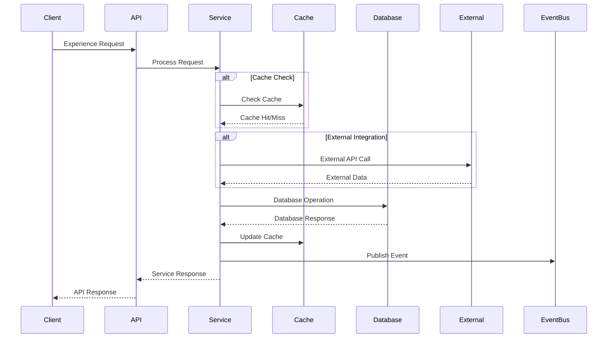

# Product Exp Service API Contract

## API Overview

The Product Exp Service provides RESTful APIs for managing product experience data, user interactions, and product analytics. The service handles experience tracking, user behavior analysis, and provides insights for product optimization.

### API Versioning
- **Current Version**: v1
- **Base URL**: `/api/v1`
- **Content Type**: `application/json`

### Authentication Requirements
- **Authentication**: Bearer token required for all endpoints
- **Authorization**: Role-based access control
- **Rate Limiting**: 1000 requests per minute per client

## Request/Response Contracts

### 1. Create User Experience

**Endpoint**: `POST /v1/experience`

**Description**: Creates a new user experience record.

**Request Body**:
```json
{
  "itemId": "string",
  "userId": "string",
  "interactionType": "string",
  "interactionData": {}
}
```

**Response (201 Created)**:
```json
{
  "experienceId": "string",
  "itemId": "string",
  "userId": "string",
  "interactionType": "string",
  "interactionData": {},
  "timestamp": "2024-01-01T00:00:00Z",
  "createdAt": "2024-01-01T00:00:00Z"
}
```

**Error Responses**:
- `400 Bad Request`: Invalid request data
- `401 Unauthorized`: Missing or invalid authentication
- `403 Forbidden`: Insufficient permissions
- `409 Conflict`: Experience record already exists

### 2. Get User Experiences

**Endpoint**: `GET /v1/experience`

**Description**: Retrieves user experience records with optional filtering.

**Query Parameters**:
- `itemId` (optional): Filter by item ID
- `userId` (optional): Filter by user ID
- `interactionType` (optional): Filter by interaction type
- `page` (optional): Page number (default: 0)
- `size` (optional): Page size (default: 20)

**Response (200 OK)**:
```json
{
  "content": [
    {
      "experienceId": "string",
      "itemId": "string",
      "userId": "string",
      "interactionType": "string",
      "interactionData": {},
      "timestamp": "2024-01-01T00:00:00Z"
    }
  ],
  "pageable": {
    "pageNumber": 0,
    "pageSize": 20,
    "totalElements": 100,
    "totalPages": 5
  }
}
```

**Error Responses**:
- `401 Unauthorized`: Missing or invalid authentication
- `403 Forbidden`: Insufficient permissions

### 3. Get User Experience by ID

**Endpoint**: `GET /v1/experience/{id}`

**Description**: Retrieves a specific user experience by ID.

**Path Parameters**:
- `id`: Experience record ID

**Response (200 OK)**:
```json
{
  "experienceId": "string",
  "itemId": "string",
  "userId": "string",
  "interactionType": "string",
  "interactionData": {},
  "timestamp": "2024-01-01T00:00:00Z"
}
```

**Error Responses**:
- `401 Unauthorized`: Missing or invalid authentication
- `403 Forbidden`: Insufficient permissions
- `404 Not Found`: Experience record not found

### 4. Track User Behavior

**Endpoint**: `POST /v1/behavior`

**Description**: Tracks user behavior and interactions.

**Request Body**:
```json
{
  "userId": "string",
  "itemId": "string",
  "behaviorType": "string",
  "behaviorData": {}
}
```

**Response (201 Created)**:
```json
{
  "behaviorId": "string",
  "userId": "string",
  "itemId": "string",
  "behaviorType": "string",
  "behaviorData": {},
  "timestamp": "2024-01-01T00:00:00Z"
}
```

**Error Responses**:
- `400 Bad Request`: Invalid request data
- `401 Unauthorized`: Missing or invalid authentication
- `403 Forbidden`: Insufficient permissions

### 5. Get Analytics Data

**Endpoint**: `GET /v1/analytics/{itemId}`

**Description**: Retrieves analytics data for a specific product.

**Path Parameters**:
- `itemId`: Product item ID

**Query Parameters**:
- `metricType` (optional): Filter by metric type
- `startDate` (optional): Start date for analytics
- `endDate` (optional): End date for analytics

**Response (200 OK)**:
```json
{
  "itemId": "string",
  "analytics": [
    {
      "analyticsId": "string",
      "metricType": "string",
      "metricData": {},
      "calculatedAt": "2024-01-01T00:00:00Z"
    }
  ]
}
```

**Error Responses**:
- `401 Unauthorized`: Missing or invalid authentication
- `403 Forbidden`: Insufficient permissions
- `404 Not Found`: Product not found

### 6. Update Privacy Consent

**Endpoint**: `PUT /v1/consent/{userId}`

**Description**: Updates user privacy consent settings.

**Path Parameters**:
- `userId`: User ID

**Request Body**:
```json
{
  "consentType": "string",
  "granted": true,
  "expiresAt": "2024-12-31T23:59:59Z"
}
```

**Response (200 OK)**:
```json
{
  "consentId": "string",
  "userId": "string",
  "consentType": "string",
  "granted": true,
  "grantedAt": "2024-01-01T00:00:00Z",
  "expiresAt": "2024-12-31T23:59:59Z"
}
```

**Error Responses**:
- `400 Bad Request`: Invalid request data
- `401 Unauthorized`: Missing or invalid authentication
- `403 Forbidden`: Insufficient permissions
- `404 Not Found`: User not found

### 7. Get Privacy Consent

**Endpoint**: `GET /v1/consent/{userId}`

**Description**: Retrieves user privacy consent settings.

**Path Parameters**:
- `userId`: User ID

**Response (200 OK)**:
```json
{
  "userId": "string",
  "consents": [
    {
      "consentId": "string",
      "consentType": "string",
      "granted": true,
      "grantedAt": "2024-01-01T00:00:00Z",
      "expiresAt": "2024-12-31T23:59:59Z"
    }
  ]
}
```

**Error Responses**:
- `401 Unauthorized`: Missing or invalid authentication
- `403 Forbidden`: Insufficient permissions
- `404 Not Found`: User not found

### 8. Generate Insights

**Endpoint**: `POST /v1/insights/{itemId}`

**Description**: Generates insights for a specific product.

**Path Parameters**:
- `itemId`: Product item ID

**Request Body**:
```json
{
  "insightType": "string",
  "parameters": {}
}
```

**Response (202 Accepted)**:
```json
{
  "insightId": "string",
  "itemId": "string",
  "insightType": "string",
  "status": "IN_PROGRESS",
  "startedAt": "2024-01-01T00:00:00Z"
}
```

**Error Responses**:
- `400 Bad Request`: Invalid request data
- `401 Unauthorized`: Missing or invalid authentication
- `403 Forbidden`: Insufficient permissions
- `404 Not Found`: Product not found

## Data Models

### ReferenceItem Entity
```json
{
  "id": "string",
  "itemId": "string",
  "name": "string",
  "description": "string",
  "brand": "string",
  "category": "string",
  "attributes": "object",
  "images": "array"
}
```

### UserExperience Entity
```json
{
  "experienceId": "string",
  "itemId": "string",
  "userId": "string",
  "interactionType": "string",
  "interactionData": "object",
  "timestamp": "string"
}
```

### AnalyticsData Entity
```json
{
  "analyticsId": "string",
  "itemId": "string",
  "metricType": "string",
  "metricData": "object",
  "calculatedAt": "string"
}
```

### BehaviorTracking Entity
```json
{
  "behaviorId": "string",
  "userId": "string",
  "itemId": "string",
  "behaviorType": "string",
  "behaviorData": "object",
  "timestamp": "string"
}
```

### PrivacyConsent Entity
```json
{
  "consentId": "string",
  "userId": "string",
  "consentType": "string",
  "granted": "boolean",
  "grantedAt": "string",
  "expiresAt": "string"
}
```

## Validation Rules

### User Experience Validation
- `itemId`: Required, non-empty string, max 50 characters
- `userId`: Required, non-empty string, max 50 characters
- `interactionType`: Required, non-empty string, max 50 characters
- `interactionData`: Required object
- `timestamp`: Required, valid ISO 8601 datetime

### Behavior Tracking Validation
- `userId`: Required, non-empty string, max 50 characters
- `itemId`: Required, non-empty string, max 50 characters
- `behaviorType`: Required, non-empty string, max 50 characters
- `behaviorData`: Required object
- `timestamp`: Required, valid ISO 8601 datetime

### Analytics Data Validation
- `itemId`: Required, non-empty string, max 50 characters
- `metricType`: Required, non-empty string, max 50 characters
- `metricData`: Required object
- `calculatedAt`: Required, valid ISO 8601 datetime

### Privacy Consent Validation
- `userId`: Required, non-empty string, max 50 characters
- `consentType`: Required, enum values: ["TRACKING", "ANALYTICS", "MARKETING"]
- `granted`: Required boolean
- `grantedAt`: Required, valid ISO 8601 datetime
- `expiresAt`: Optional, valid ISO 8601 datetime

## Integration Contracts

### External System Integration

#### Analytics Services
- **Protocol**: REST API
- **Authentication**: Bearer token
- **Rate Limiting**: 500 requests per minute
- **Timeout**: 15 seconds
- **Retry Policy**: 2 attempts with linear backoff

#### Consent Management
- **Protocol**: REST API
- **Authentication**: Bearer token
- **Rate Limiting**: 1000 requests per minute
- **Timeout**: 10 seconds
- **Retry Policy**: 3 attempts with exponential backoff

### Event Publishing

#### User Experience Events
```json
{
  "eventType": "USER_EXPERIENCE_CREATED",
  "eventId": "string",
  "timestamp": "2024-01-01T00:00:00Z",
  "data": {
    "itemId": "string",
    "userId": "string",
    "interactionType": "string",
    "interactionData": {}
  }
}
```

#### Behavior Tracking Events
```json
{
  "eventType": "BEHAVIOR_TRACKED",
  "eventId": "string",
  "timestamp": "2024-01-01T00:00:00Z",
  "data": {
    "userId": "string",
    "itemId": "string",
    "behaviorType": "string",
    "behaviorData": {}
  }
}
```

#### Privacy Consent Events
```json
{
  "eventType": "PRIVACY_CONSENT_UPDATED",
  "eventId": "string",
  "timestamp": "2024-01-01T00:00:00Z",
  "data": {
    "userId": "string",
    "consentType": "string",
    "granted": true,
    "expiresAt": "2024-12-31T23:59:59Z"
  }
}
```

## API Endpoint Map

```mermaid
graph TB
    subgraph "Experience Management"
        CREATE_EXP[POST /v1/experience]
        GET_EXP[GET /v1/experience]
        GET_EXP_ONE[GET /v1/experience/{id}]
    end
    
    subgraph "Behavior Tracking"
        TRACK_BEHAVIOR[POST /v1/behavior]
    end
    
    subgraph "Analytics"
        GET_ANALYTICS[GET /v1/analytics/{itemId}]
        GENERATE_INSIGHTS[POST /v1/insights/{itemId}]
    end
    
    subgraph "Privacy Management"
        UPDATE_CONSENT[PUT /v1/consent/{userId}]
        GET_CONSENT[GET /v1/consent/{userId}]
    end
    
    subgraph "External Systems"
        ANALYTICS[Analytics Services]
        CONSENT[Consent Management]
        KAFKA[Kafka Events]
    end
    
    CREATE_EXP --> KAFKA
    TRACK_BEHAVIOR --> KAFKA
    UPDATE_CONSENT --> KAFKA
    GET_ANALYTICS --> ANALYTICS
    GENERATE_INSIGHTS --> ANALYTICS
    UPDATE_CONSENT --> CONSENT
    GET_CONSENT --> CONSENT
```
```

## Request/Response Flow


```

## Data Model Relationships

```mermaid
erDiagram
    reference_item {
        String id PK
        String itemId
        String name
        String description
        String brand
        String category
        String attributes
        String images
        DateTime createdAt
        DateTime updatedAt
    }
    
    user_experience {
        String experienceId PK
        String itemId
        String userId
        String interactionType
        String interactionData
        DateTime timestamp
    }
    
    analytics_data {
        String analyticsId PK
        String itemId
        String metricType
        String metricData
        DateTime calculatedAt
    }
    
    behavior_tracking {
        String behaviorId PK
        String userId
        String itemId
        String behaviorType
        String behaviorData
        DateTime timestamp
    }
    
    privacy_consent {
        String consentId PK
        String userId
        String consentType
        Boolean granted
        DateTime grantedAt
        DateTime expiresAt
    }
    
    reference_item "1" o-- "many" user_experience : has
    reference_item "1" o-- "many" analytics_data : has
    reference_item "1" o-- "many" behavior_tracking : has
    user_experience "1" -- "1" privacy_consent : requires
```
```
```

## Error Handling

### Standard Error Response Format
```json
{
  "timestamp": "2024-01-01T00:00:00Z",
  "status": 400,
  "error": "Bad Request",
  "message": "Validation failed",
  "path": "/api/v1/experience",
  "details": [
    {
      "field": "itemId",
      "message": "Item ID is required"
    }
  ]
}
```

### Common Error Codes
- `400 Bad Request`: Invalid request data or validation errors
- `401 Unauthorized`: Missing or invalid authentication
- `403 Forbidden`: Insufficient permissions
- `404 Not Found`: Resource not found
- `409 Conflict`: Resource conflict
- `422 Unprocessable Entity`: Business rule validation failed
- `500 Internal Server Error`: Unexpected server error
- `503 Service Unavailable`: Service temporarily unavailable

### Retry Logic
- **Transient Errors**: Retry with exponential backoff
- **Permanent Errors**: No retry, return error immediately
- **Rate Limiting**: Respect retry-after header
- **Circuit Breaker**: Prevent cascading failures

## Performance Considerations

### Caching Strategy
- **Experience Data**: Cache for 5 minutes
- **Analytics Data**: Cache for 15 minutes
- **Behavior Data**: Cache for 10 minutes
- **Consent Data**: Cache for 1 hour

### Rate Limiting
- **Standard Clients**: 1000 requests per minute
- **High-Volume Clients**: 5000 requests per minute
- **Burst Allowance**: 200 requests per 10 seconds

### Response Time Targets
- **Experience Queries**: < 100ms
- **Analytics Operations**: < 500ms
- **Behavior Tracking**: < 200ms
- **Insight Generation**: < 2 seconds

## Security Considerations

### Authentication
- **Bearer Token**: Required for all endpoints
- **Token Validation**: Validate with authentication service
- **Token Expiry**: Handle expired tokens gracefully

### Authorization
- **Role-Based Access**: Different permissions for different roles
- **Resource-Level Access**: Control access to specific experience data
- **Audit Logging**: Log all access attempts

### Data Protection
- **Input Validation**: Validate all input data
- **Output Sanitization**: Sanitize output data
- **Encryption**: Encrypt sensitive data in transit and at rest
- **Data Anonymization**: Anonymize user data for privacy
