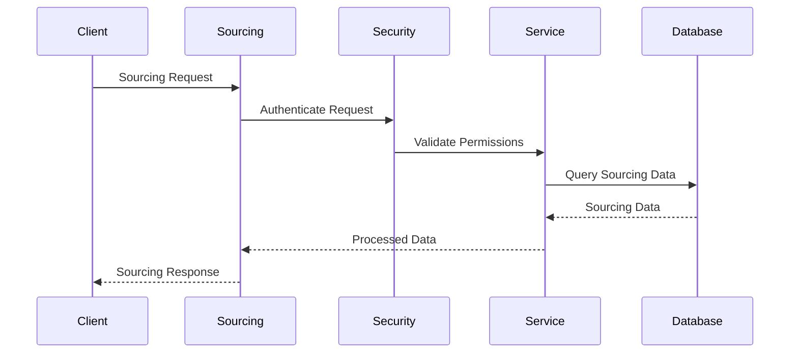
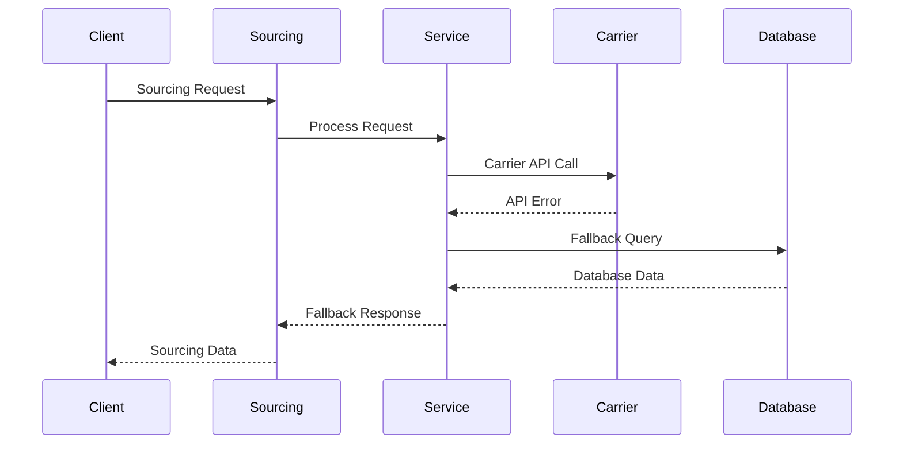
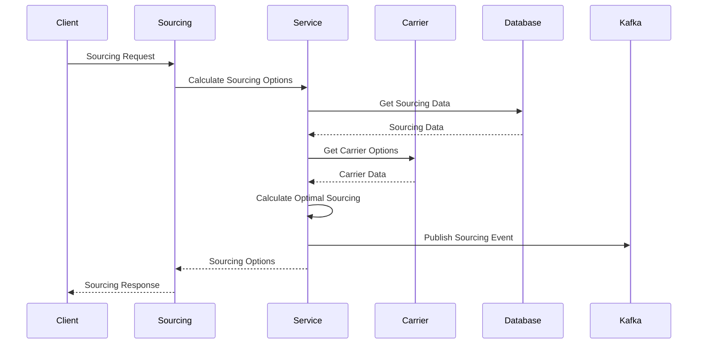
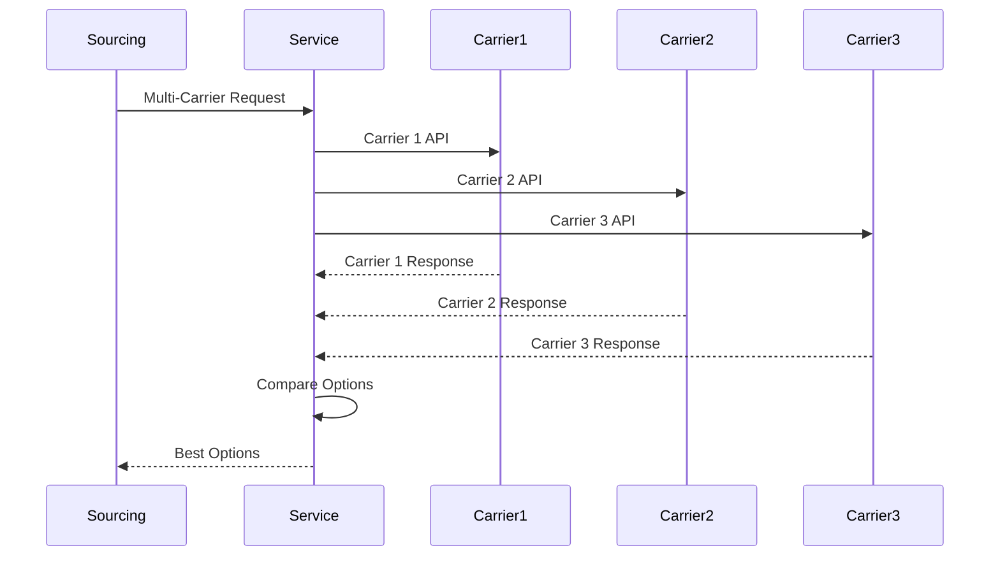
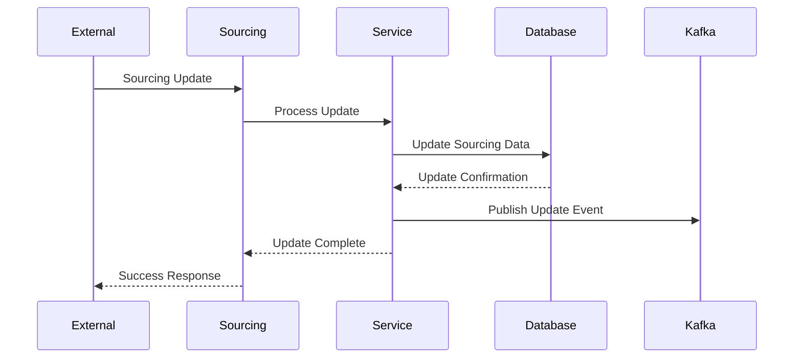
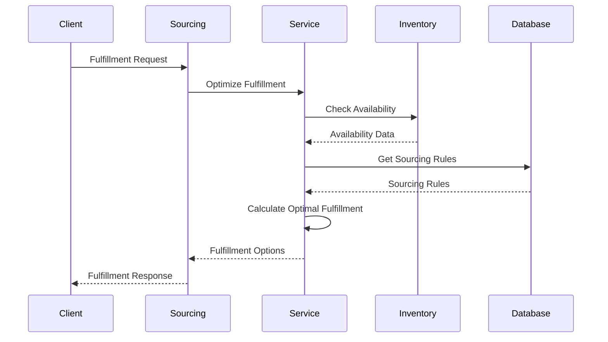
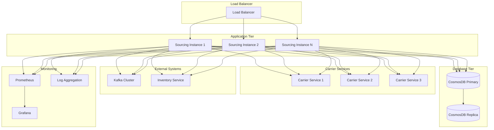
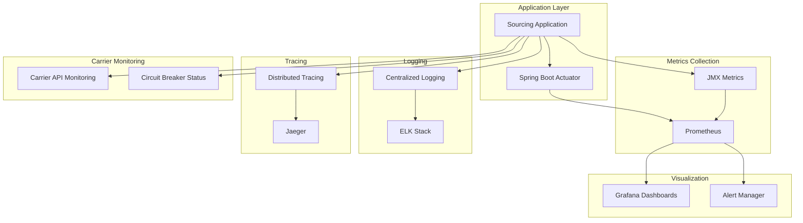
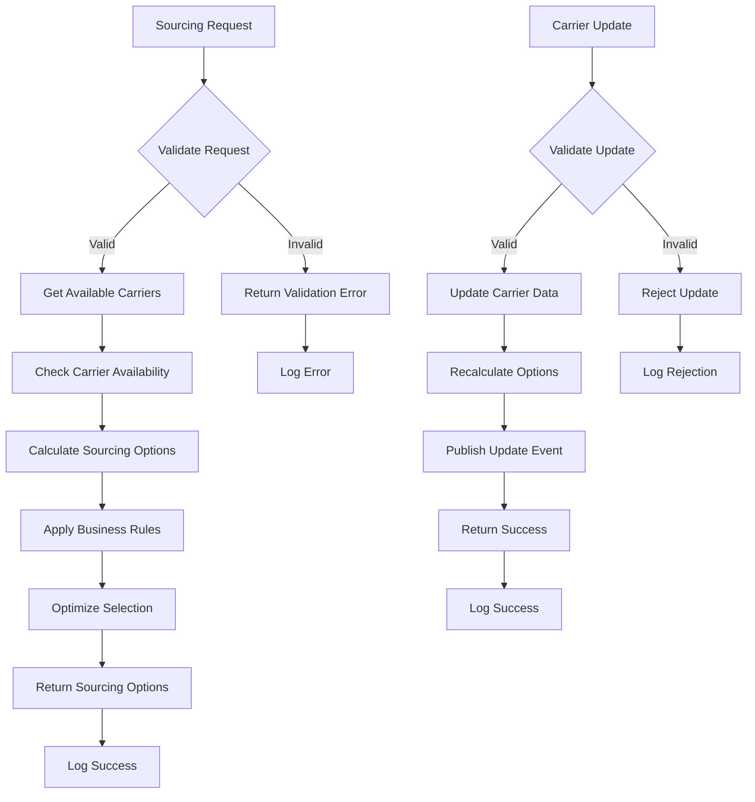
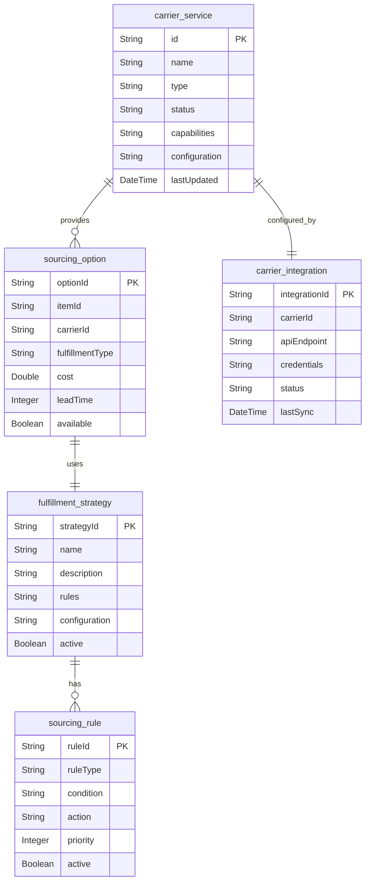

# Sourcing Service Architecture Analysis

## Executive Summary

The Sourcing Service is a critical component of the Sephora e-commerce platform that manages product sourcing options, carrier services, and fulfillment strategies. It handles sourcing calculations, carrier selection, and provides sourcing recommendations for optimal fulfillment.

### Key Technical Findings
- **Sourcing Management**: Manages product sourcing options and strategies
- **CosmosDB Integration**: Uses Azure CosmosDB for scalable sourcing data storage
- **Carrier Service Integration**: Integrates with multiple carrier services
- **Event-Driven Architecture**: Uses Kafka for sourcing change notifications
- **Fulfillment Optimization**: Optimizes fulfillment strategies and costs

### Critical Concerns and Risks
- **Carrier Dependencies**: External carrier service dependencies
- **Performance**: High-frequency sourcing calculations
- **Scalability**: Sourcing data volume may grow significantly
- **Integration Complexity**: Multiple carrier system integrations

### High-Level Recommendations
- Implement carrier service resilience patterns
- Optimize sourcing calculation performance
- Add comprehensive monitoring for sourcing operations
- Implement circuit breakers for external carrier dependencies

## Architecture Analysis

### System Architecture and Component Relationships

The Sourcing Service follows a layered microservices architecture with clear separation of concerns:

- **Controller Layer**: REST API endpoints for sourcing operations
- **Service Layer**: Business logic for sourcing management
- **Repository Layer**: Data access abstraction for CosmosDB
- **Integration Layer**: External carrier service integrations
- **Event Layer**: Kafka event publishing and consumption
- **Calculation Layer**: Sourcing calculation and optimization

### Design Patterns and Architectural Decisions

- **Repository Pattern**: Abstracts data access across CosmosDB
- **Event-Driven Pattern**: Kafka-based event publishing for sourcing changes
- **Circuit Breaker Pattern**: External carrier service dependency protection
- **Strategy Pattern**: Different sourcing strategies for different scenarios
- **Saga Pattern**: Distributed transaction management for sourcing operations

### Integration Patterns and External Dependencies

- **CosmosDB**: Primary data store for sourcing information
- **Kafka**: Event streaming for sourcing changes
- **Carrier Services**: Integration with multiple carrier APIs
- **Inventory Service**: Integration for availability calculations
- **Product Services**: Integration for product information

### Data Flow and Messaging Architecture

Sourcing data flows through the system with the following pattern:
1. Sourcing requests from other services
2. Service layer processes sourcing logic
3. Repository layer accesses CosmosDB
4. Carrier integration layer calls external APIs
5. Calculation layer optimizes sourcing options
6. Event publishing for sourcing changes
7. Response formatting and caching

## Security Analysis

### Authentication and Authorization Mechanisms

- **REST API Security**: Standard REST authentication and authorization
- **Service-to-Service Security**: Secure integration with other services
- **Data Access Control**: Role-based access to sourcing data
- **Carrier API Security**: Secure integration with carrier services

### Security Vulnerabilities and Risks

- **External API Security**: Carrier service API security risks
- **Data Exposure**: Sensitive sourcing data exposure
- **Integration Security**: External system integration security
- **API Security**: Sourcing API security vulnerabilities

### Data Protection and Encryption

- **Database Encryption**: CosmosDB data encryption at rest
- **Transport Security**: HTTPS for all API communications
- **Carrier API Security**: Secure carrier service integration
- **Data Masking**: Sensitive sourcing data masking

### Compliance and Regulatory Considerations

- **Carrier Compliance**: Carrier service compliance requirements
- **Audit Requirements**: Sourcing change audit trails
- **Data Retention**: Sourcing data retention policies
- **Access Logging**: Comprehensive access logging

## Performance Analysis

### Database Performance and Optimization Opportunities

- **Query Optimization**: CosmosDB query optimization and indexing
- **Partitioning Strategy**: Proper partitioning for large sourcing datasets
- **Connection Management**: Optimize database connection management
- **Caching Strategy**: Effective caching for sourcing queries

### Application Performance Bottlenecks

- **Sourcing Calculations**: High-frequency sourcing calculation processing
- **Carrier API Calls**: External carrier API performance
- **Cache Management**: Cache invalidation and management overhead
- **Event Processing**: Kafka event processing performance

### Caching Strategies and Effectiveness

- **Sourcing Caching**: Frequently accessed sourcing data caching
- **Carrier Data Caching**: Carrier service data caching
- **Calculation Caching**: Sourcing calculation result caching
- **Cache Invalidation**: Smart cache invalidation strategies

### Infrastructure Performance Considerations

- **Database Scaling**: CosmosDB scaling strategies
- **Carrier API Scaling**: Carrier service API scaling
- **Load Balancing**: Sourcing API load balancing
- **Resource Allocation**: CPU and memory optimization

## Code Quality Assessment

### Code Complexity and Maintainability

- **Service Layer**: Clear business logic separation
- **Repository Pattern**: Effective data access abstraction
- **Carrier Integration**: Clean external carrier service integration
- **Calculation Logic**: Well-structured sourcing calculations

### Technical Debt Identification

- **Performance Optimization**: Query performance optimization needed
- **Error Handling**: Inconsistent error handling patterns
- **Documentation**: API documentation gaps
- **Testing Coverage**: Integration test coverage improvements

### Design Pattern Usage and Effectiveness

- **Repository Pattern**: Good data access abstraction
- **Event-Driven Pattern**: Effective event publishing
- **Circuit Breaker Pattern**: Effective external service protection
- **Strategy Pattern**: Effective sourcing strategy management

### Error Handling and Resilience Patterns

- **Circuit Breaker**: External carrier service dependency protection
- **Retry Logic**: External API retry mechanisms
- **Fallback Strategies**: Graceful degradation for external services
- **Error Logging**: Comprehensive error logging

## Testing Analysis

### Test Coverage and Quality Assessment

- **Unit Tests**: Service layer unit test coverage
- **Integration Tests**: Database and external service integration
- **API Tests**: REST API endpoint testing
- **Performance Tests**: Load and stress testing

### Testing Strategy and Implementation

- **Database Testing**: CosmosDB integration testing approaches
- **Carrier Service Mocking**: External carrier API mocking
- **Event Testing**: Kafka event testing
- **Calculation Testing**: Sourcing calculation testing

### Integration and End-to-End Testing

- **Carrier Integration**: End-to-end carrier integration testing
- **Database Integration**: CosmosDB integration testing
- **Event Integration**: Kafka event flow testing
- **API Integration**: REST API testing

### Test Automation and CI/CD Integration

- **Automated Testing**: CI/CD pipeline integration
- **Test Environment**: Isolated test environment setup
- **Test Data Management**: Sourcing test data management
- **Performance Testing**: Automated performance regression testing

## Authentication Flow



## Error Handling Flow



## Sourcing Calculation Flow



## Carrier Integration Flow



## Sourcing Update Flow



## Fulfillment Optimization Flow



## Deployment & DevOps Analysis

### CI/CD Pipeline and Automation

- **Build Automation**: Maven-based build automation
- **Docker Containerization**: Containerized deployment
- **Environment Management**: Multi-environment deployment
- **Database Migration**: Automated database migration

### Containerization and Orchestration

- **Docker Images**: Optimized Docker image creation
- **Kubernetes Deployment**: Container orchestration
- **Service Discovery**: Service registration and discovery
- **Health Checks**: Application health monitoring

### Infrastructure and Environment Management

- **Environment Configuration**: Environment-specific configurations
- **Database Management**: CosmosDB configuration
- **Carrier Configuration**: Carrier service configuration
- **External Service Configuration**: External system configuration

### Monitoring and Observability Setup

- **Sourcing Metrics**: Sourcing operation performance monitoring
- **Carrier API Monitoring**: Carrier service API monitoring
- **Database Monitoring**: CosmosDB performance monitoring
- **Event Monitoring**: Kafka event monitoring

## Infrastructure Architecture



## Monitoring & Observability Stack



## Business Domain Analysis

### Domain Model and Business Entities

The Sourcing Service manages sourcing entities with the following domain model:

- **CarrierService**: Carrier service information and capabilities
- **SourcingOption**: Available sourcing options for products
- **FulfillmentStrategy**: Fulfillment strategy and rules
- **SourcingRule**: Business rules for sourcing decisions
- **CarrierIntegration**: Carrier service integration configuration

### Business Processes and Workflows

- **Sourcing Calculation**: Calculate optimal sourcing options
- **Carrier Selection**: Select best carrier for fulfillment
- **Fulfillment Optimization**: Optimize fulfillment strategies
- **Cost Calculation**: Calculate sourcing and fulfillment costs
- **Rule Management**: Manage sourcing business rules

### Business Rules and Validation Logic

- **Sourcing Rules**: Sourcing decision business rules
- **Carrier Rules**: Carrier service selection rules
- **Cost Rules**: Cost calculation and optimization rules
- **Fulfillment Rules**: Fulfillment strategy rules
- **Integration Rules**: Carrier integration rules

### Integration Points and External Services

- **Carrier Services**: Multiple carrier service integrations
- **Inventory Service**: Inventory availability integration
- **Product Service**: Product information integration
- **Order Service**: Order fulfillment integration
- **Analytics Service**: Sourcing analytics integration

## Domain Model Diagram

```mermaid
classDiagram
    class CarrierService {
        +String id
        +String name
        +String type
        +String status
        +Map capabilities
        +Object configuration
        +DateTime lastUpdated
    }
    
    class SourcingOption {
        +String optionId
        +String itemId
        +String carrierId
        +String fulfillmentType
        +Double cost
        +Integer leadTime
        +Boolean available
    }
    
    class FulfillmentStrategy {
        +String strategyId
        +String name
        +String description
        +List rules
        +Object configuration
        +Boolean active
    }
    
    class SourcingRule {
        +String ruleId
        +String ruleType
        +String condition
        +String action
        +Integer priority
        +Boolean active
    }
    
    class CarrierIntegration {
        +String integrationId
        +String carrierId
        +String apiEndpoint
        +Object credentials
        +String status
        +DateTime lastSync
    }
    
    CarrierService ||--o{ SourcingOption : "provides"
    SourcingOption ||--|| FulfillmentStrategy : "uses"
    FulfillmentStrategy ||--o{ SourcingRule : "has"
    CarrierService ||--|| CarrierIntegration : "configured_by"
```

## Business Process Flow



## Database Schema Diagram



## Risk Assessment

### Technical Risks and Vulnerabilities

- **Carrier Dependencies**: External carrier service dependency risks
- **Performance**: High-frequency sourcing calculation performance
- **External Dependencies**: External system integration risks
- **Scalability**: Sourcing data volume scaling challenges
- **Integration Complexity**: Multiple carrier system complexity

### Business Continuity Risks

- **Carrier Service Dependency**: Carrier service availability
- **Data Loss**: Sourcing data loss risks
- **Performance Degradation**: Slow sourcing calculations impact business
- **Integration Failures**: External carrier integration failures

### Performance and Scalability Concerns

- **Database Performance**: CosmosDB performance under load
- **Carrier API Performance**: Carrier service API performance under load
- **External API Limits**: External system API rate limits
- **Event Processing**: Kafka event processing capacity

### Security Threats and Mitigation Strategies

- **External API Security**: Secure carrier service integration
- **Data Exposure**: Encrypt sensitive sourcing data
- **Access Control**: Implement proper authorization
- **Audit Logging**: Comprehensive audit trails

## Detailed Recommendations

### Immediate Actions (High Priority)

1. **Carrier Resilience**: Implement carrier service resilience patterns
2. **Performance Optimization**: Optimize sourcing calculation performance
3. **External Service Resilience**: Add circuit breakers for external systems
4. **Performance Monitoring**: Implement comprehensive performance monitoring
5. **Error Handling**: Improve error handling and recovery mechanisms

### Short-Term Improvements (Medium Priority)

1. **Caching Strategy**: Optimize caching strategy and invalidation
2. **Database Optimization**: Optimize CosmosDB queries and indexing
3. **Event Processing**: Improve Kafka event processing
4. **Testing Coverage**: Increase integration test coverage
5. **Documentation**: Complete API documentation

### Long-Term Strategic Enhancements (Low Priority)

1. **Microservices Evolution**: Consider breaking down into smaller services
2. **Database Migration**: Evaluate database optimization strategies
3. **Event Sourcing**: Implement event sourcing for sourcing changes
4. **API Gateway**: Implement API gateway for enhanced security
5. **Multi-Region Deployment**: Implement multi-region deployment

## Action Plan

### Phase 1: Critical Fixes (1-2 weeks)

- Implement carrier service resilience patterns
- Optimize sourcing calculation performance
- Add circuit breakers for external services
- Optimize database queries and indexing
- Set up basic performance monitoring

### Phase 2: Quality Improvements (1-2 months)

- Implement comprehensive caching strategy
- Add data consistency patterns
- Enhance external service integration
- Improve API documentation
- Increase test coverage

### Phase 3: Strategic Enhancements (3-6 months)

- Evaluate microservices architecture evolution
- Consider database optimization strategies
- Implement advanced monitoring and alerting
- Plan for multi-region deployment
- Enhance disaster recovery procedures
