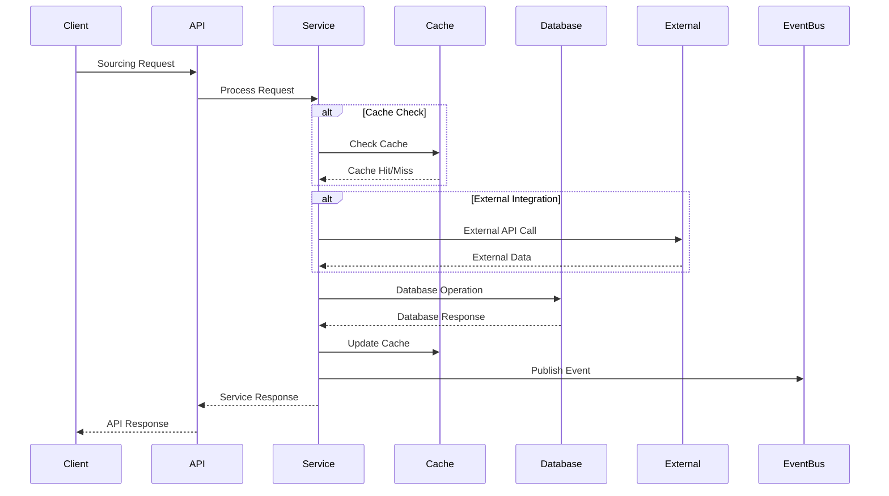
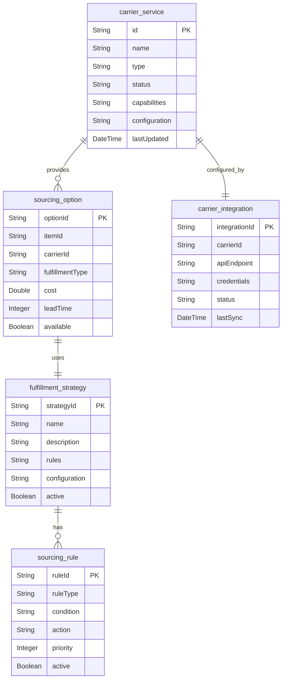

# Sourcing Service API Contract

## API Overview

The Sourcing Service provides RESTful APIs for managing product sourcing options, carrier services, and fulfillment strategies. The service handles sourcing calculations, carrier selection, and provides sourcing recommendations for optimal fulfillment.

### API Versioning
- **Current Version**: v1
- **Base URL**: `/api/v1`
- **Content Type**: `application/json`

### Authentication Requirements
- **Authentication**: Bearer token required for all endpoints
- **Authorization**: Role-based access control
- **Rate Limiting**: 1000 requests per minute per client

## Request/Response Contracts

### 1. Create Carrier Service

**Endpoint**: `POST /v1/carriers`

**Description**: Creates a new carrier service record.

**Request Body**:
```json
{
  "name": "string",
  "type": "string",
  "status": "string",
  "capabilities": {},
  "configuration": {}
}
```

**Response (201 Created)**:
```json
{
  "id": "string",
  "name": "string",
  "type": "string",
  "status": "string",
  "capabilities": {},
  "configuration": {},
  "lastUpdated": "2024-01-01T00:00:00Z",
  "createdAt": "2024-01-01T00:00:00Z"
}
```

**Error Responses**:
- `400 Bad Request`: Invalid request data
- `401 Unauthorized`: Missing or invalid authentication
- `403 Forbidden`: Insufficient permissions
- `409 Conflict`: Carrier service already exists

### 2. Get Carrier Services

**Endpoint**: `GET /v1/carriers`

**Description**: Retrieves carrier services with optional filtering.

**Query Parameters**:
- `name` (optional): Filter by carrier name
- `type` (optional): Filter by carrier type
- `status` (optional): Filter by status
- `page` (optional): Page number (default: 0)
- `size` (optional): Page size (default: 20)

**Response (200 OK)**:
```json
{
  "content": [
    {
      "id": "string",
      "name": "string",
      "type": "string",
      "status": "string",
      "capabilities": {},
      "configuration": {},
      "lastUpdated": "2024-01-01T00:00:00Z"
    }
  ],
  "pageable": {
    "pageNumber": 0,
    "pageSize": 20,
    "totalElements": 50,
    "totalPages": 3
  }
}
```

**Error Responses**:
- `401 Unauthorized`: Missing or invalid authentication
- `403 Forbidden`: Insufficient permissions

### 3. Get Carrier Service by ID

**Endpoint**: `GET /v1/carriers/{id}`

**Description**: Retrieves a specific carrier service by ID.

**Path Parameters**:
- `id`: Carrier service ID

**Response (200 OK)**:
```json
{
  "id": "string",
  "name": "string",
  "type": "string",
  "status": "string",
  "capabilities": {},
  "configuration": {},
  "lastUpdated": "2024-01-01T00:00:00Z"
}
```

**Error Responses**:
- `401 Unauthorized`: Missing or invalid authentication
- `403 Forbidden`: Insufficient permissions
- `404 Not Found`: Carrier service not found

### 4. Update Carrier Service

**Endpoint**: `PUT /v1/carriers/{id}`

**Description**: Updates an existing carrier service.

**Path Parameters**:
- `id`: Carrier service ID

**Request Body**:
```json
{
  "name": "string",
  "type": "string",
  "status": "string",
  "capabilities": {},
  "configuration": {}
}
```

**Response (200 OK)**:
```json
{
  "id": "string",
  "name": "string",
  "type": "string",
  "status": "string",
  "capabilities": {},
  "configuration": {},
  "lastUpdated": "2024-01-01T00:00:00Z",
  "updatedAt": "2024-01-01T00:00:00Z"
}
```

**Error Responses**:
- `400 Bad Request`: Invalid request data
- `401 Unauthorized`: Missing or invalid authentication
- `403 Forbidden`: Insufficient permissions
- `404 Not Found`: Carrier service not found

### 5. Delete Carrier Service

**Endpoint**: `DELETE /v1/carriers/{id}`

**Description**: Deletes a carrier service.

**Path Parameters**:
- `id`: Carrier service ID

**Response (204 No Content)**:
No response body

**Error Responses**:
- `401 Unauthorized`: Missing or invalid authentication
- `403 Forbidden`: Insufficient permissions
- `404 Not Found`: Carrier service not found

### 6. Calculate Sourcing Options

**Endpoint**: `POST /v1/sourcing/calculate`

**Description**: Calculates optimal sourcing options for a product.

**Request Body**:
```json
{
  "itemId": "string",
  "quantity": 0,
  "destination": "string",
  "preferences": {}
}
```

**Response (200 OK)**:
```json
{
  "itemId": "string",
  "sourcingOptions": [
    {
      "optionId": "string",
      "carrierId": "string",
      "fulfillmentType": "string",
      "cost": 0.0,
      "leadTime": 0,
      "available": true,
      "score": 0.0
    }
  ],
  "calculatedAt": "2024-01-01T00:00:00Z"
}
```

**Error Responses**:
- `400 Bad Request`: Invalid request data
- `401 Unauthorized`: Missing or invalid authentication
- `403 Forbidden`: Insufficient permissions
- `404 Not Found`: Product not found

### 7. Get Fulfillment Strategies

**Endpoint**: `GET /v1/fulfillment/strategies`

**Description**: Retrieves available fulfillment strategies.

**Query Parameters**:
- `name` (optional): Filter by strategy name
- `active` (optional): Filter by active status
- `page` (optional): Page number (default: 0)
- `size` (optional): Page size (default: 20)

**Response (200 OK)**:
```json
{
  "content": [
    {
      "strategyId": "string",
      "name": "string",
      "description": "string",
      "rules": [],
      "configuration": {},
      "active": true
    }
  ],
  "pageable": {
    "pageNumber": 0,
    "pageSize": 20,
    "totalElements": 20,
    "totalPages": 1
  }
}
```

**Error Responses**:
- `401 Unauthorized`: Missing or invalid authentication
- `403 Forbidden`: Insufficient permissions

### 8. Optimize Fulfillment

**Endpoint**: `POST /v1/fulfillment/optimize`

**Description**: Optimizes fulfillment strategy for given parameters.

**Request Body**:
```json
{
  "itemId": "string",
  "quantity": 0,
  "destination": "string",
  "constraints": {},
  "preferences": {}
}
```

**Response (200 OK)**:
```json
{
  "itemId": "string",
  "optimizedStrategy": {
    "strategyId": "string",
    "name": "string",
    "cost": 0.0,
    "leadTime": 0,
    "reliability": 0.0,
    "recommendations": []
  },
  "optimizedAt": "2024-01-01T00:00:00Z"
}
```

**Error Responses**:
- `400 Bad Request`: Invalid request data
- `401 Unauthorized`: Missing or invalid authentication
- `403 Forbidden`: Insufficient permissions
- `404 Not Found`: Product not found

## Data Models

### CarrierService Entity
```json
{
  "id": "string",
  "name": "string",
  "type": "string",
  "status": "string",
  "capabilities": "object",
  "configuration": "object",
  "lastUpdated": "string"
}
```

### SourcingOption Entity
```json
{
  "optionId": "string",
  "itemId": "string",
  "carrierId": "string",
  "fulfillmentType": "string",
  "cost": "number",
  "leadTime": "number",
  "available": "boolean"
}
```

### FulfillmentStrategy Entity
```json
{
  "strategyId": "string",
  "name": "string",
  "description": "string",
  "rules": "array",
  "configuration": "object",
  "active": "boolean"
}
```

### SourcingRule Entity
```json
{
  "ruleId": "string",
  "ruleType": "string",
  "condition": "string",
  "action": "string",
  "priority": "number",
  "active": "boolean"
}
```

### CarrierIntegration Entity
```json
{
  "integrationId": "string",
  "carrierId": "string",
  "apiEndpoint": "string",
  "credentials": "object",
  "status": "string",
  "lastSync": "string"
}
```

## Validation Rules

### Carrier Service Validation
- `name`: Required, non-empty string, max 100 characters
- `type`: Required, enum values: ["GROUND", "AIR", "EXPRESS", "INTERNATIONAL"]
- `status`: Required, enum values: ["ACTIVE", "INACTIVE", "MAINTENANCE"]
- `capabilities`: Required object
- `configuration`: Required object

### Sourcing Option Validation
- `itemId`: Required, non-empty string, max 50 characters
- `carrierId`: Required, non-empty string, max 50 characters
- `fulfillmentType`: Required, enum values: ["STANDARD", "EXPRESS", "SAME_DAY"]
- `cost`: Required, non-negative number
- `leadTime`: Required, non-negative integer
- `available`: Required boolean

### Fulfillment Strategy Validation
- `name`: Required, non-empty string, max 100 characters
- `description`: Optional string, max 500 characters
- `rules`: Required array
- `configuration`: Required object
- `active`: Required boolean

### Sourcing Rule Validation
- `ruleType`: Required, enum values: ["COST", "TIME", "RELIABILITY", "CUSTOM"]
- `condition`: Required, non-empty string, max 200 characters
- `action`: Required, non-empty string, max 200 characters
- `priority`: Required, non-negative integer
- `active`: Required boolean

## Integration Contracts

### External System Integration

#### Carrier Services
- **Protocol**: REST API
- **Authentication**: API Key
- **Rate Limiting**: 100 requests per minute
- **Timeout**: 30 seconds
- **Retry Policy**: 3 attempts with exponential backoff

#### Inventory Service
- **Protocol**: REST API
- **Authentication**: Bearer token
- **Rate Limiting**: 500 requests per minute
- **Timeout**: 15 seconds
- **Retry Policy**: 2 attempts with linear backoff

### Event Publishing

#### Carrier Service Events
```json
{
  "eventType": "CARRIER_SERVICE_UPDATED",
  "eventId": "string",
  "timestamp": "2024-01-01T00:00:00Z",
  "data": {
    "carrierId": "string",
    "name": "string",
    "status": "string",
    "capabilities": {}
  }
}
```

#### Sourcing Calculation Events
```json
{
  "eventType": "SOURCING_CALCULATED",
  "eventId": "string",
  "timestamp": "2024-01-01T00:00:00Z",
  "data": {
    "itemId": "string",
    "sourcingOptions": [],
    "selectedOption": {}
  }
}
```

#### Fulfillment Optimization Events
```json
{
  "eventType": "FULFILLMENT_OPTIMIZED",
  "eventId": "string",
  "timestamp": "2024-01-01T00:00:00Z",
  "data": {
    "itemId": "string",
    "optimizedStrategy": {},
    "cost": 0.0,
    "leadTime": 0
  }
}
```

## API Endpoint Map

```mermaid
graph TB
    subgraph "Carrier Management"
        CREATE_CARRIER[POST /v1/carriers]
        GET_CARRIERS[GET /v1/carriers]
        GET_CARRIER[GET /v1/carriers/{id}]
        UPDATE_CARRIER[PUT /v1/carriers/{id}]
        DELETE_CARRIER[DELETE /v1/carriers/{id}]
    end
    
    subgraph "Sourcing"
        CALCULATE_SOURCING[POST /v1/sourcing/calculate]
    end
    
    subgraph "Fulfillment"
        GET_STRATEGIES[GET /v1/fulfillment/strategies]
        OPTIMIZE_FULFILLMENT[POST /v1/fulfillment/optimize]
    end
    
    subgraph "External Systems"
        CARRIER_SERVICES[Carrier Services]
        INVENTORY[Inventory Service]
        KAFKA[Kafka Events]
    end
    
    CREATE_CARRIER --> KAFKA
    UPDATE_CARRIER --> KAFKA
    DELETE_CARRIER --> KAFKA
    CALCULATE_SOURCING --> CARRIER_SERVICES
    CALCULATE_SOURCING --> INVENTORY
    CALCULATE_SOURCING --> KAFKA
    OPTIMIZE_FULFILLMENT --> CARRIER_SERVICES
    OPTIMIZE_FULFILLMENT --> INVENTORY
    OPTIMIZE_FULFILLMENT --> KAFKA
```

## Request/Response Flow



## Data Model Relationships



## Error Handling

### Standard Error Response Format
```json
{
  "timestamp": "2024-01-01T00:00:00Z",
  "status": 400,
  "error": "Bad Request",
  "message": "Validation failed",
  "path": "/api/v1/carriers",
  "details": [
    {
      "field": "name",
      "message": "Carrier name is required"
    }
  ]
}
```

### Common Error Codes
- `400 Bad Request`: Invalid request data or validation errors
- `401 Unauthorized`: Missing or invalid authentication
- `403 Forbidden`: Insufficient permissions
- `404 Not Found`: Resource not found
- `409 Conflict`: Resource conflict
- `422 Unprocessable Entity`: Business rule validation failed
- `500 Internal Server Error`: Unexpected server error
- `503 Service Unavailable`: Service temporarily unavailable

### Retry Logic
- **Transient Errors**: Retry with exponential backoff
- **Permanent Errors**: No retry, return error immediately
- **Rate Limiting**: Respect retry-after header
- **Circuit Breaker**: Prevent cascading failures

## Performance Considerations

### Caching Strategy
- **Carrier Data**: Cache for 1 hour
- **Sourcing Calculations**: Cache for 15 minutes
- **Fulfillment Strategies**: Cache for 30 minutes
- **Integration Data**: Cache for 5 minutes

### Rate Limiting
- **Standard Clients**: 1000 requests per minute
- **High-Volume Clients**: 5000 requests per minute
- **Burst Allowance**: 200 requests per 10 seconds

### Response Time Targets
- **Carrier Queries**: < 100ms
- **Sourcing Calculations**: < 500ms
- **Fulfillment Optimization**: < 1 second
- **External API Calls**: < 2 seconds

## Security Considerations

### Authentication
- **Bearer Token**: Required for all endpoints
- **Token Validation**: Validate with authentication service
- **Token Expiry**: Handle expired tokens gracefully

### Authorization
- **Role-Based Access**: Different permissions for different roles
- **Resource-Level Access**: Control access to specific sourcing data
- **Audit Logging**: Log all access attempts

### Data Protection
- **Input Validation**: Validate all input data
- **Output Sanitization**: Sanitize output data
- **Encryption**: Encrypt sensitive data in transit and at rest
